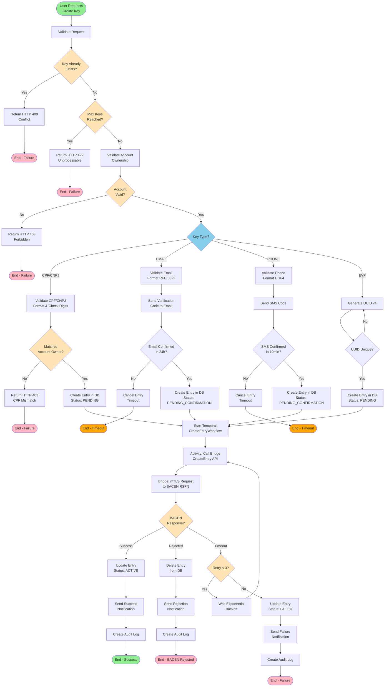

# BP-001: Business Process - Create DICT Key

**Documento**: BP-001_Business_Process_CreateKey.md
**Versão**: 1.0
**Data**: 2025-10-25
**Autor**: Product Owner - DICT Team
**Epic**: EP-007 - Requirements & Business
**Priority**: Must Have
**Status**: Ready for Development

---

## Sumário Executivo

Este documento descreve o processo de negócio completo para criação de uma chave DICT (PIX), incluindo fluxo de validação, verificação de conta, sincronização com BACEN RSFN e notificações ao usuário. O processo utiliza Temporal Workflows para garantir durabilidade e resiliência.

---

## Visão Geral do Processo

### Objetivo
Permitir que usuários registrem chaves DICT (CPF, CNPJ, EMAIL, PHONE, EVP) para receber transferências PIX, garantindo validação completa, verificação de propriedade e sincronização com o sistema BACEN RSFN.

### Duração Esperada
- **Chave CPF/CNPJ**: 5-30 segundos
- **Chave EMAIL**: 5 segundos + até 24 horas (aguardando confirmação)
- **Chave PHONE**: 5 segundos + até 10 minutos (aguardando confirmação)
- **Chave EVP (random)**: 5-30 segundos

### Participantes
- **Usuário PIX**: Solicita criação da chave
- **DICT Core API**: Recebe requisição e valida dados
- **Temporal Workflow**: Orquestra o processo
- **Account Service**: Valida propriedade da conta
- **Notification Service**: Envia códigos de verificação (email/SMS)
- **DICT Bridge**: Intermediário para comunicação com BACEN
- **BACEN RSFN**: Sistema central do Banco Central

### Pré-condições
- Usuário autenticado com token JWT válido
- Usuário possui conta ativa em LBPay (corrente ou poupança)
- Usuário não atingiu limite máximo de chaves (20 para PF, 50 para PJ)

### Pós-condições (Sucesso)
- Chave DICT registrada localmente com status ACTIVE ou PENDING_CONFIRMATION
- Chave sincronizada com BACEN RSFN (status PENDING ou ACTIVE)
- Usuário notificado do sucesso
- Audit log criado

### Pós-condições (Falha)
- Chave não criada ou removida do banco local
- Usuário notificado do erro com mensagem clara
- Audit log criado com detalhes do erro

---

## BPMN Diagram



---

## Detailed Process Steps

### Phase 1: Request Validation (Synchronous)

#### Step 1.1: Receive HTTP Request
- **Actor**: API Gateway / Core DICT REST API
- **Input**: POST /api/v1/entries
  ```json
  {
    "type": "EMAIL",
    "value": "user@example.com",
    "accountNumber": "12345-6",
    "accountType": "CACC"
  }
  ```
- **Actions**:
  - Validate JWT token (authentication)
  - Parse request body
  - Validate schema (required fields, data types)
- **Output**: Parsed and validated request
- **Duration**: < 100ms
- **Error Handling**: Return HTTP 400 Bad Request if validation fails

#### Step 1.2: Validate Request Format
- **Actor**: Core DICT API
- **Validations**:
  - `type`: Must be one of [CPF, CNPJ, EMAIL, PHONE, EVP]
  - `value`: Format validation based on type:
    - CPF: 11 digits, valid check digits (mod-11)
    - CNPJ: 14 digits, valid check digits
    - EMAIL: RFC 5322 regex pattern
    - PHONE: E.164 format (+5511999999999)
    - EVP: Null or empty (will be generated)
  - `accountNumber`: Exists and is active
  - `accountType`: One of [CACC (current), SVGS (savings)]
- **Business Rules**:
  - BR-001: CPF key only for individual accounts
  - BR-002: CNPJ key only for legal entity accounts
  - BR-003: EMAIL/PHONE/EVP allowed for both
- **Error Codes**:
  - `INVALID_KEY_TYPE`: Unknown key type
  - `INVALID_CPF_FORMAT`: CPF validation failed
  - `INVALID_EMAIL_FORMAT`: Email regex mismatch
  - `INVALID_PHONE_FORMAT`: Phone not in E.164

#### Step 1.3: Check for Duplicate Key
- **Actor**: Core DICT API
- **Query**: `SELECT * FROM entries WHERE key_value = ? AND status IN ('ACTIVE', 'PENDING', 'PENDING_CONFIRMATION')`
- **Decision Point**:
  - If key exists → Return HTTP 409 Conflict with message:
    ```json
    {
      "error": "KEY_ALREADY_EXISTS",
      "message": "This key is already registered. If you believe this is an error, you can initiate a portability claim.",
      "claimUrl": "/api/v1/claims"
    }
    ```
  - If key does not exist → Proceed to next step
- **Duration**: < 50ms (indexed query)

#### Step 1.4: Check Key Limit
- **Actor**: Core DICT API
- **Query**: `SELECT COUNT(*) FROM entries WHERE user_id = ? AND status = 'ACTIVE'`
- **Business Rule**:
  - Individual (CPF): max 20 keys
  - Legal Entity (CNPJ): max 50 keys
- **Decision Point**:
  - If limit reached → Return HTTP 422 Unprocessable Entity
  - If under limit → Proceed
- **Error Response**:
  ```json
  {
    "error": "MAX_KEYS_REACHED",
    "message": "You have reached the maximum number of keys (20). Please delete an existing key before creating a new one.",
    "currentCount": 20,
    "maxAllowed": 20
  }
  ```

#### Step 1.5: Validate Account Ownership
- **Actor**: Account Service (gRPC call)
- **gRPC Method**: `account.AccountService/ValidateOwnership`
- **Request**:
  ```protobuf
  {
    user_id: "uuid",
    account_number: "12345-6",
    account_type: "CACC"
  }
  ```
- **Validations**:
  - User is legal owner of account
  - Account status is ACTIVE (not BLOCKED, CLOSED)
  - Account type supports DICT (CACC or SVGS)
- **Decision Point**:
  - If validation fails → Return HTTP 403 Forbidden
  - If validation succeeds → Proceed
- **Duration**: < 200ms (gRPC call)
- **Error Handling**: If Account Service unavailable, return HTTP 503 Service Unavailable

---

### Phase 2: Key-Specific Validation (Asynchronous for EMAIL/PHONE)

#### Step 2.1: CPF/CNPJ Key - Ownership Match
- **Condition**: Key type = CPF or CNPJ
- **Validation**: Key value must match account owner's CPF/CNPJ
- **Query**: `SELECT cpf_cnpj FROM users WHERE user_id = ?`
- **Decision Point**:
  - If mismatch → Return HTTP 403 Forbidden "CPF/CNPJ mismatch"
  - If match → Proceed to Phase 3
- **Business Rule**: One CPF/CNPJ key per person (cannot create multiple CPF keys with same CPF)

#### Step 2.2: EMAIL Key - Verification Flow
- **Condition**: Key type = EMAIL
- **Actions**:
  1. Generate 6-digit verification code
  2. Store code in Redis with TTL 24 hours: `email:verify:{code} = {user_id, email, timestamp}`
  3. Send email with verification code (via Notification Service)
  4. Return HTTP 202 Accepted with message:
     ```json
     {
       "message": "Verification code sent to your email. Please verify within 24 hours.",
       "status": "PENDING_CONFIRMATION",
       "verificationDeadline": "2025-10-26T10:25:00Z"
     }
     ```
  5. Create entry in DB with status `PENDING_CONFIRMATION`
- **User Confirms**: Separate endpoint `POST /api/v1/entries/verify-email`
  - Input: `{code: "123456"}`
  - Validates code from Redis
  - Updates entry status to `PENDING`
  - Proceeds to Phase 3 (BACEN sync)
- **Timeout**: If not confirmed in 24h, entry is deleted (scheduled job)

#### Step 2.3: PHONE Key - SMS Verification Flow
- **Condition**: Key type = PHONE
- **Actions** (similar to email):
  1. Generate 6-digit SMS code
  2. Store in Redis with TTL 10 minutes
  3. Send SMS via Notification Service (Twilio/AWS SNS)
  4. Return HTTP 202 Accepted
  5. Create entry with status `PENDING_CONFIRMATION`
- **User Confirms**: `POST /api/v1/entries/verify-phone`
- **Timeout**: 10 minutes (shorter than email for security)

#### Step 2.4: EVP Key - Generate Random UUID
- **Condition**: Key type = EVP
- **Actions**:
  1. Generate UUID v4: `uuid.New().String()`
  2. Validate uniqueness: Query DB to ensure no collision
  3. If collision (extremely rare), regenerate
  4. Return generated UUID to user
- **Format**: `xxxxxxxx-xxxx-4xxx-yxxx-xxxxxxxxxxxx` (UUID v4 format)
- **Business Rule**: EVP keys are system-generated, user cannot provide custom value

---

### Phase 3: Database Persistence

#### Step 3.1: Create Entry in Local Database
- **Actor**: Core DICT API
- **Table**: `entries`
- **SQL**:
  ```sql
  INSERT INTO entries (
    entry_id,
    user_id,
    account_id,
    key_type,
    key_value,
    status,
    created_at,
    updated_at,
    sync_status
  ) VALUES (
    uuid_generate_v4(),
    $1, $2, $3, $4,
    'PENDING', -- or 'PENDING_CONFIRMATION' for email/phone
    NOW(),
    NOW(),
    'NOT_SYNCED'
  )
  RETURNING entry_id;
  ```
- **Status Values**:
  - `PENDING`: Awaiting BACEN sync (CPF/CNPJ/EVP)
  - `PENDING_CONFIRMATION`: Awaiting user verification (EMAIL/PHONE)
- **Transaction**: Wrapped in DB transaction for atomicity
- **Output**: `entry_id` (UUID)

#### Step 3.2: Return Response to User
- **HTTP Status**: 201 Created (CPF/CNPJ/EVP) or 202 Accepted (EMAIL/PHONE)
- **Response Body**:
  ```json
  {
    "entryId": "uuid",
    "keyType": "EMAIL",
    "keyValue": "user@example.com",
    "status": "PENDING_CONFIRMATION",
    "accountNumber": "12345-6",
    "createdAt": "2025-10-25T10:25:00Z",
    "message": "Key creation initiated. Verification required."
  }
  ```
- **Duration**: Total Phase 1-3 < 500ms

---

### Phase 4: Temporal Workflow Execution (Asynchronous)

#### Step 4.1: Start Temporal Workflow
- **Workflow**: `CreateEntryWorkflow`
- **Trigger**: After DB entry created (for CPF/CNPJ/EVP) or after user verification (for EMAIL/PHONE)
- **Workflow Input**:
  ```go
  type CreateEntryWorkflowInput struct {
      EntryID      string
      UserID       string
      KeyType      string
      KeyValue     string
      AccountID    string
  }
  ```
- **Temporal Configuration**:
  - Namespace: `dict-prod`
  - Task Queue: `dict-entry-tasks`
  - Workflow Timeout: 5 minutes
  - Retry Policy: Exponential backoff, max 3 attempts
- **Duration**: Workflow queued < 100ms

#### Step 4.2: Activity - Validate Entry Exists
- **Activity**: `ValidateEntryActivity`
- **Actions**:
  - Query DB: `SELECT * FROM entries WHERE entry_id = ?`
  - Validate status is PENDING or PENDING_CONFIRMATION
  - If entry deleted or status invalid → Fail workflow
- **Duration**: < 100ms
- **Error Handling**: If fails, workflow terminates

#### Step 4.3: Activity - Call Bridge CreateEntry API
- **Activity**: `CallBridgeCreateEntryActivity`
- **gRPC Method**: `bridge.BridgeService/CreateEntry`
- **Request Payload**:
  ```protobuf
  message CreateEntryRequest {
    string entry_id = 1;
    string key_type = 2;
    string key_value = 3;
    string account_number = 4;
    string account_branch = 5;
    string participant_ispb = 6; // LBPay ISPB
    string owner_name = 7;
    string owner_cpf_cnpj = 8;
  }
  ```
- **Bridge Actions** (see TEC-002):
  1. Prepare XML payload per BACEN RSFN specification
  2. Sign XML with digital certificate (ICP-Brasil A3)
  3. Establish mTLS connection to BACEN RSFN
  4. Send HTTPS POST request
  5. Parse XML response
  6. Return gRPC response to Core
- **Timeout**: 30 seconds
- **Retry Policy**:
  - Attempt 1: Immediate
  - Attempt 2: After 5 seconds (exponential backoff)
  - Attempt 3: After 15 seconds
  - After 3 failures → Mark entry as FAILED

#### Step 4.4: Parse BACEN Response
- **Possible BACEN Responses**:
  1. **Success (HTTP 200)**:
     - Response body contains: `<ResponseCode>00</ResponseCode>` (success)
     - Proceed to Step 4.5
  2. **Rejected by BACEN (HTTP 200 with error code)**:
     - Response codes: `03` (duplicate), `05` (invalid data), `99` (generic error)
     - Proceed to Step 4.6 (rollback)
  3. **BACEN Unavailable (HTTP 503, 504)**:
     - Retry up to 3 times
     - If all retries fail → Step 4.7 (mark failed)
  4. **Timeout (30s)**:
     - Retry (same as unavailable)

#### Step 4.5: Success Path - Update Entry to ACTIVE
- **Activity**: `UpdateEntryStatusActivity`
- **SQL**:
  ```sql
  UPDATE entries
  SET status = 'ACTIVE',
      sync_status = 'SYNCED',
      synced_at = NOW(),
      updated_at = NOW(),
      bacen_response = $1
  WHERE entry_id = $2;
  ```
- **Proceed to**: Step 4.8 (notify user)

#### Step 4.6: Rejection Path - Delete Entry
- **Activity**: `DeleteEntryActivity`
- **SQL**:
  ```sql
  UPDATE entries
  SET status = 'DELETED',
      sync_status = 'REJECTED',
      updated_at = NOW(),
      bacen_response = $1,
      deletion_reason = 'BACEN_REJECTED'
  WHERE entry_id = $2;
  ```
- **Note**: Soft delete (status = DELETED) for audit trail
- **Proceed to**: Step 4.9 (notify rejection)

#### Step 4.7: Failure Path - Mark as FAILED
- **Activity**: `MarkEntryFailedActivity`
- **SQL**:
  ```sql
  UPDATE entries
  SET status = 'FAILED',
      sync_status = 'FAILED',
      updated_at = NOW(),
      bacen_response = $1,
      retry_count = $2
  WHERE entry_id = $3;
  ```
- **Background Job**: Scheduled job retries FAILED entries every 1 hour (up to 24 hours)
- **Proceed to**: Step 4.10 (notify failure)

#### Step 4.8: Activity - Send Success Notification
- **Activity**: `SendNotificationActivity`
- **Notification Channels**:
  - Email: "Your PIX key {keyValue} is now active!"
  - Push notification (mobile app)
  - In-app notification
- **Notification Service**: gRPC call to `notification.NotificationService/Send`
- **Template**:
  ```
  Subject: Your PIX key is active!

  Hello {userName},

  Your PIX key {keyType}: {keyValue} has been successfully registered
  and is now active. You can start receiving PIX transfers using this key.

  Key Details:
  - Type: {keyType}
  - Value: {keyValue}
  - Account: {accountNumber}
  - Activated at: {timestamp}

  Thank you for using LBPay!
  ```

#### Step 4.9: Activity - Send Rejection Notification
- **Template**:
  ```
  Subject: PIX key registration failed

  Hello {userName},

  Unfortunately, your PIX key registration for {keyType}: {keyValue}
  was rejected by BACEN.

  Reason: {bacenErrorMessage}

  Please verify the information and try again, or contact our support.
  ```

#### Step 4.10: Activity - Send Failure Notification
- **Template**:
  ```
  Subject: PIX key registration - temporary issue

  Hello {userName},

  We encountered a temporary issue while registering your PIX key
  {keyType}: {keyValue}.

  We will automatically retry the registration in the next hours.
  You will be notified once the key is active.

  If the issue persists, please contact support.
  ```

---

### Phase 5: Audit Logging

#### Step 5.1: Create Audit Log Entry
- **Activity**: `CreateAuditLogActivity`
- **Table**: `audit_logs`
- **SQL**:
  ```sql
  INSERT INTO audit_logs (
    log_id,
    timestamp,
    operation_type,
    user_id,
    account_id,
    entity_id,
    entity_type,
    before_state,
    after_state,
    result,
    ip_address,
    user_agent,
    request_id,
    workflow_id
  ) VALUES (
    uuid_generate_v4(),
    NOW(),
    'CREATE_KEY',
    $1, $2, $3, 'ENTRY',
    NULL, -- no before state
    $4::jsonb, -- after state
    $5, -- SUCCESS or FAILURE
    $6, $7, $8, $9
  );
  ```
- **After State JSON**:
  ```json
  {
    "entryId": "uuid",
    "keyType": "EMAIL",
    "keyValue": "user@example.com",
    "status": "ACTIVE",
    "syncStatus": "SYNCED"
  }
  ```
- **Retention**: 7 years (compliance requirement)

---

## Decision Points and Business Rules

### Decision Point 1: Key Already Exists?
- **Rule**: Query `entries` table for `key_value` with status IN ('ACTIVE', 'PENDING', 'PENDING_CONFIRMATION')
- **Action if YES**: Return HTTP 409 Conflict, suggest portability claim
- **Action if NO**: Proceed to next validation

### Decision Point 2: Max Keys Reached?
- **Rule**:
  - Individual (CPF account): COUNT(entries WHERE user_id = ?) > 20
  - Legal Entity (CNPJ account): COUNT(entries WHERE user_id = ?) > 50
- **Action if YES**: Return HTTP 422 Unprocessable Entity
- **Action if NO**: Proceed to account validation

### Decision Point 3: Account Valid?
- **Rules**:
  - User is legal owner: `accounts.owner_id = users.user_id`
  - Account status = ACTIVE (not BLOCKED, CLOSED, SUSPENDED)
  - Account type IN ('CACC', 'SVGS')
- **Action if NO**: Return HTTP 403 Forbidden
- **Action if YES**: Proceed to key-specific validation

### Decision Point 4: Key Type?
- **CPF/CNPJ**: Must match account owner → Validate match
- **EMAIL**: Requires verification → Send email code
- **PHONE**: Requires verification → Send SMS code
- **EVP**: System-generated → Generate UUID v4

### Decision Point 5: BACEN Response?
- **Success (00)**: Update entry to ACTIVE, notify user
- **Rejected (03, 05, 99)**: Delete entry, notify rejection
- **Timeout/Unavailable**: Retry up to 3 times, if all fail → Mark FAILED

### Decision Point 6: Retry < 3?
- **YES**: Wait exponential backoff (5s, 15s), retry CallBridge
- **NO**: Mark entry as FAILED, schedule background retry

---

## Error Handling Matrix

| Error Scenario | HTTP Code | Error Code | Action | User Notification |
|----------------|-----------|------------|--------|-------------------|
| Invalid JWT token | 401 | UNAUTHORIZED | Reject request | "Authentication required" |
| Invalid request format | 400 | BAD_REQUEST | Reject request | "Invalid request: {details}" |
| Key already exists | 409 | KEY_ALREADY_EXISTS | Reject request | "Key registered. Try portability claim." |
| Max keys reached | 422 | MAX_KEYS_REACHED | Reject request | "Delete a key before creating new." |
| Account not owned | 403 | FORBIDDEN | Reject request | "Account ownership validation failed" |
| CPF mismatch | 403 | CPF_MISMATCH | Reject request | "CPF does not match account owner" |
| Email timeout (24h) | - | VERIFICATION_TIMEOUT | Delete entry | "Email verification expired" |
| SMS timeout (10min) | - | VERIFICATION_TIMEOUT | Delete entry | "SMS verification expired" |
| BACEN rejected | - | BACEN_REJECTED | Delete entry | "BACEN rejected: {reason}" |
| BACEN unavailable (3 retries) | - | BACEN_UNAVAILABLE | Mark FAILED | "Temporary issue, will retry" |
| Account Service down | 503 | SERVICE_UNAVAILABLE | Reject request | "Service temporarily unavailable" |

---

## Performance Requirements

| Metric | Target | Measurement |
|--------|--------|-------------|
| Request validation (Phase 1-2) | < 500ms (P95) | API Gateway → Database |
| Email/SMS code delivery | < 5s | Notification Service SLA |
| Workflow start latency | < 100ms | Temporal queue time |
| Bridge → BACEN round-trip | < 10s (P95) | mTLS connection + XML processing |
| Total time (CPF/CNPJ/EVP) | < 30s (P95) | End-to-end success path |
| Total time (EMAIL/PHONE) | < 24h (verification) + 30s (sync) | Including user action |
| Database query (duplicate check) | < 50ms | Indexed query on `key_value` |
| Audit log write | < 100ms | Async, non-blocking |

---

## Monitoring and Alerts

### Metrics to Track
- **CreateEntry requests/min** (rate)
- **Success rate** (percentage)
- **Failure rate by reason** (BACEN_REJECTED, TIMEOUT, etc.)
- **Average workflow duration** (seconds)
- **P95/P99 latency** (milliseconds)
- **Email/SMS verification rate** (percentage of users who verify)
- **BACEN API availability** (uptime percentage)

### Alerts
- **Critical**: BACEN API down for > 5 minutes
- **Critical**: Success rate < 90% in last 10 minutes
- **Warning**: Workflow duration P95 > 60s
- **Warning**: Email verification rate < 70% in last 24h
- **Info**: New entry created (for audit)

### Dashboards
- **Grafana Dashboard**: CreateEntry Process
  - Request rate (time series)
  - Success/failure split (pie chart)
  - Latency percentiles (P50, P95, P99)
  - BACEN response codes (bar chart)
  - Active workflows (gauge)

---

## Compliance and Regulatory Notes

### BACEN Regulations
- **Circular 3.985/2020**: PIX regulation, DICT requirements
- **Manual DICT v2.2**: Technical specification for RSFN integration
- **mTLS Requirement**: All BACEN communication must use ICP-Brasil A3 certificates

### LGPD Compliance
- **Data Minimization**: Only collect necessary data (key value, account)
- **Purpose Limitation**: Data used only for PIX transfers
- **User Consent**: Explicit consent during key creation (terms accepted)
- **Right to Erasure**: User can delete keys at any time
- **Audit Trail**: All operations logged for 7 years

### Audit Requirements
- **Log Retention**: 7 years (BACEN requirement)
- **Immutability**: Audit logs append-only, cryptographic hash chain
- **Data Logged**:
  - User action (create key request)
  - Timestamp (ISO8601 with milliseconds)
  - Request/response payloads
  - BACEN communication (request/response XML)
  - Workflow execution events
  - Success/failure result

---

## References

- **US-001**: User Stories - DICT Key Management
- **API-001**: Core DICT REST API Specification
- **TEC-002**: Bridge Technical Specification v3.1
- **TSP-001**: Temporal Workflow Engine TechSpec
- **DAT-001**: Database Schema - Entries Table
- **SEC-001**: mTLS Configuration with ICP-Brasil
- **BACEN Manual DICT**: https://www.bcb.gov.br/estabilidadefinanceira/pix

---

**Last Updated**: 2025-10-25
**Next Review**: Sprint 8 Planning Session
**Status**: Approved by Product Owner
