# BP-002: Business Process - Claim Workflow (30 Days)

**Documento**: BP-002_Business_Process_ClaimWorkflow.md
**Versão**: 1.0
**Data**: 2025-10-25
**Autor**: Product Owner - DICT Team
**Epic**: EP-007 - Requirements & Business
**Priority**: Must Have
**Status**: Ready for Development

---

## Sumário Executivo

Este documento descreve o processo de negócio completo para reivindicações (claims) de chaves DICT, incluindo portabilidade e posse. O processo é regulado pelo BACEN e tem duração fixa de **30 dias corridos**, durante os quais o proprietário atual da chave pode responder (aceitar ou rejeitar). Após 30 dias sem resposta, a reivindicação é **automaticamente confirmada**.

---

## Visão Geral do Processo

### Objetivo
Permitir que usuários reivindiquem a propriedade ou portabilidade de chaves DICT registradas em outras instituições ou em contas de outros usuários, seguindo o processo regulatório de 30 dias estabelecido pelo BACEN.

### Duração Fixa
- **Mínima**: 0 dias (se proprietário aceita imediatamente)
- **Máxima**: 30 dias corridos (prazo regulatório)
- **Resolução Automática**: Day 31, 00:00:00 UTC (se não houver resposta)

### Tipos de Claim
1. **Portability Claim**: Transferir chave de outra instituição para LBPay
2. **Ownership Claim**: Reivindicar chave de outro usuário na mesma instituição (LBPay)

### Participantes
- **Claimant (Reivindicante)**: Usuário que solicita a transferência da chave
- **Current Owner (Proprietário Atual)**: Detentor atual da chave
- **DICT Core API**: Recebe e processa claims
- **Temporal Workflow**: Orquestra o processo de 30 dias com timer
- **DICT Bridge**: Intermediário para comunicação com BACEN
- **BACEN RSFN**: Sistema central que registra e arbitragem claims
- **Notification Service**: Envia notificações aos participantes
- **Other Institution (Para Portability)**: Instituição onde a chave está atualmente registrada

### Pré-condições
- Claimant autenticado com conta ativa em LBPay
- Chave DICT existe e está registrada em BACEN RSFN
- Para CPF/CNPJ keys: CPF/CNPJ do claimant deve corresponder à chave
- Para EMAIL/PHONE keys: Claimant deve verificar propriedade (código)
- Não existe claim ativo para a mesma chave

### Pós-condições (Claim Confirmado)
- Chave transferida para conta do claimant
- Chave removida da conta do proprietário anterior
- Ambas as partes notificadas
- Sincronização completa com BACEN
- Audit logs criados

### Pós-condições (Claim Cancelado)
- Chave permanece com proprietário atual
- Claim marcado como CANCELLED
- Ambas as partes notificadas
- Audit logs criados

---

## BPMN Diagram

```mermaid
graph TB
    Start([Claimant Requests<br/>Portability/Ownership]) --> ValidateClaim[Validate Claim Request]
    ValidateClaim --> CheckActiveClaim{Active Claim<br/>Exists?}

    CheckActiveClaim -->|Yes| ReturnConflict[Return HTTP 409<br/>Claim Already Exists]
    ReturnConflict --> End1([End - Conflict])

    CheckActiveClaim -->|No| ValidateKey[Validate Key Exists<br/>in BACEN RSFN]
    ValidateKey --> KeyExists{Key<br/>Exists?}

    KeyExists -->|No| ReturnNotFound[Return HTTP 404<br/>Key Not Found]
    ReturnNotFound --> End2([End - Not Found])

    KeyExists -->|Yes| CheckOwnership{Claimant<br/>Owns Key?}
    CheckOwnership -->|CPF/CNPJ| MatchCPF{CPF/CNPJ<br/>Match?}
    CheckOwnership -->|EMAIL/PHONE| SendVerifyCode[Send Verification<br/>Code]

    MatchCPF -->|No| ReturnForbidden[Return HTTP 403<br/>Ownership Mismatch]
    ReturnForbidden --> End3([End - Forbidden])
    MatchCPF -->|Yes| CreateClaim[Create Claim in DB<br/>Status: WAITING_RESOLUTION]

    SendVerifyCode --> CodeVerified{Code Verified<br/>in Time?}
    CodeVerified -->|No| ReturnTimeout[Return HTTP 408<br/>Verification Timeout]
    ReturnTimeout --> End4([End - Timeout])
    CodeVerified -->|Yes| CreateClaim

    CreateClaim --> SyncBacen[Sync Claim with<br/>BACEN RSFN]
    SyncBacen --> BacenAck{BACEN<br/>Accepted?}

    BacenAck -->|No| DeleteClaim[Delete Claim<br/>BACEN Rejected]
    DeleteClaim --> NotifyRejected[Notify Claimant<br/>Rejection]
    NotifyRejected --> End5([End - BACEN Rejected])

    BacenAck -->|Yes| StartWorkflow[Start Temporal<br/>ClaimWorkflow]
    StartWorkflow --> NotifyOwner[Activity: Notify<br/>Current Owner]
    NotifyOwner --> StartTimer[Start 30-Day Timer<br/>Countdown]

    StartTimer --> WaitDecision{Owner Response<br/>or 30 Days?}

    WaitDecision -->|Day 1-29:<br/>CONFIRM| OwnerAccepts[Owner Confirms<br/>Transfer]
    OwnerAccepts --> UpdateClaimConfirmed[Update Claim<br/>Status: CONFIRMED]
    UpdateClaimConfirmed --> TransferKey1[Activity: Transfer Key<br/>to Claimant]

    WaitDecision -->|Day 1-29:<br/>CANCEL| OwnerRejects[Owner Cancels<br/>Claim]
    OwnerRejects --> UpdateClaimCancelled[Update Claim<br/>Status: CANCELLED]
    UpdateClaimCancelled --> NotifyClaimant1[Notify Claimant<br/>Claim Rejected]
    NotifyClaimant1 --> AuditCancel[Create Audit Log]
    AuditCancel --> End6([End - Cancelled])

    WaitDecision -->|Day 30 23:59:59:<br/>No Response| TimerExpires[Timer Expires<br/>at Midnight]
    TimerExpires --> AutoConfirm[Auto-Confirm Claim<br/>Status: EXPIRED]
    AutoConfirm --> TransferKey2[Activity: Transfer Key<br/>to Claimant]

    TransferKey1 --> CallBridgeTransfer[Call Bridge<br/>Transfer Entry API]
    TransferKey2 --> CallBridgeTransfer

    CallBridgeTransfer --> BacenTransfer[Bridge: mTLS Request<br/>to BACEN RSFN]
    BacenTransfer --> TransferSuccess{BACEN Transfer<br/>Success?}

    TransferSuccess -->|Yes| UpdateEntryOwner[Update Entry Owner<br/>in Local DB]
    UpdateEntryOwner --> RemoveFromOld[Remove from Old Owner<br/>Account]
    RemoveFromOld --> AddToNew[Add to Claimant<br/>Account]
    AddToNew --> UpdateClaimCompleted[Update Claim<br/>Status: COMPLETED]
    UpdateClaimCompleted --> NotifyBoth[Notify Both Parties<br/>Transfer Complete]
    NotifyBoth --> AuditComplete[Create Audit Log]
    AuditComplete --> End7([End - Transfer Complete])

    TransferSuccess -->|No| RetryTransfer{Retry < 3?}
    RetryTransfer -->|Yes| WaitBackoff[Wait Exponential<br/>Backoff]
    WaitBackoff --> CallBridgeTransfer
    RetryTransfer -->|No| MarkTransferFailed[Mark Claim<br/>Status: TRANSFER_FAILED]
    MarkTransferFailed --> NotifyFailure[Notify Admin<br/>Manual Intervention]
    NotifyFailure --> AuditFailed[Create Audit Log]
    AuditFailed --> End8([End - Transfer Failed])

    style Start fill:#90EE90
    style End7 fill:#90EE90
    style End6 fill:#FFA500
    style End1 fill:#FFB6C1
    style End2 fill:#FFB6C1
    style End3 fill:#FFB6C1
    style End4 fill:#FFB6C1
    style End5 fill:#FFB6C1
    style End8 fill:#FF6B6B
    style CheckActiveClaim fill:#FFE4B5
    style KeyExists fill:#FFE4B5
    style CheckOwnership fill:#87CEEB
    style MatchCPF fill:#FFE4B5
    style CodeVerified fill:#FFE4B5
    style BacenAck fill:#FFE4B5
    style WaitDecision fill:#FFD700
    style TransferSuccess fill:#FFE4B5
    style RetryTransfer fill:#FFE4B5
    style StartTimer fill:#87CEEB
    style TimerExpires fill:#FF8C00
```



---

## Detailed Process Steps

### Phase 1: Claim Creation and Validation (Synchronous)

#### Step 1.1: Receive Claim Request
- **Actor**: API Gateway / Core DICT REST API
- **Endpoint**: POST /api/v1/claims
- **Request Body**:
  ```json
  {
    "claimType": "PORTABILITY" | "OWNERSHIP",
    "keyType": "CPF" | "CNPJ" | "EMAIL" | "PHONE" | "EVP",
    "keyValue": "user@example.com",
    "targetAccountNumber": "12345-6",
    "verificationCode": "123456" (optional, for EMAIL/PHONE)
  }
  ```
- **Authentication**: JWT token required
- **Duration**: < 100ms

#### Step 1.2: Validate Claim Request
- **Validations**:
  - `claimType`: Must be PORTABILITY or OWNERSHIP
  - `keyType` + `keyValue`: Valid format per type
  - `targetAccountNumber`: Exists and belongs to claimant
  - Schema validation (required fields, data types)
- **Error Responses**:
  - HTTP 400 Bad Request: Invalid format
  - HTTP 401 Unauthorized: Invalid/missing token

#### Step 1.3: Check for Active Claims
- **Query**:
  ```sql
  SELECT * FROM claims
  WHERE key_value = ?
    AND status IN ('WAITING_RESOLUTION', 'CONFIRMED', 'EXPIRED')
  LIMIT 1;
  ```
- **Decision Point**:
  - If active claim found → Return HTTP 409 Conflict:
    ```json
    {
      "error": "ACTIVE_CLAIM_EXISTS",
      "message": "An active claim already exists for this key.",
      "claimId": "uuid",
      "claimStatus": "WAITING_RESOLUTION",
      "createdAt": "2025-10-20T10:00:00Z",
      "resolutionDeadline": "2025-11-19T10:00:00Z"
    }
    ```
  - If no active claim → Proceed

#### Step 1.4: Validate Key Exists in BACEN RSFN
- **Activity**: Call Bridge to query BACEN
- **gRPC Method**: `bridge.BridgeService/QueryEntry`
- **Request**:
  ```protobuf
  {
    key_type: "EMAIL",
    key_value: "user@example.com"
  }
  ```
- **BACEN Response**:
  - **Key Exists**: Returns current owner institution ISPB, owner name, owner CPF/CNPJ
  - **Key Not Found**: Returns 404
- **Decision Point**:
  - If key not found → Return HTTP 404 Not Found "Key not registered in DICT"
  - If key found → Proceed to ownership validation
- **Duration**: < 5s (BACEN query via mTLS)

#### Step 1.5: Validate Claimant Ownership (CPF/CNPJ Keys)
- **Condition**: Key type = CPF or CNPJ
- **Validation**: Claimant's CPF/CNPJ (from user profile) must match key value
- **Query**:
  ```sql
  SELECT cpf_cnpj FROM users WHERE user_id = ?
  ```
- **Decision Point**:
  - If mismatch → Return HTTP 403 Forbidden "You are not authorized to claim this key. CPF/CNPJ mismatch."
  - If match → Proceed to Phase 2

#### Step 1.6: Validate Claimant Ownership (EMAIL/PHONE Keys)
- **Condition**: Key type = EMAIL or PHONE
- **Action**: Require verification code
  - If `verificationCode` not provided in request → Return HTTP 400 "Verification code required"
  - Validate code from Redis: `email:verify:{code}` or `phone:verify:{code}`
  - If code invalid/expired → Return HTTP 403 Forbidden "Invalid or expired verification code"
  - If code valid → Proceed to Phase 2
- **Note**: Verification code sent in separate flow (similar to CreateKey)

#### Step 1.7: Check Claim Type Restrictions
- **Portability Claim**:
  - Current owner institution != LBPay (verified via BACEN query)
  - If key already in LBPay → Return HTTP 400 "Key already registered in LBPay. Use ownership claim instead."
- **Ownership Claim**:
  - Current owner institution = LBPay
  - If key in another institution → Return HTTP 400 "Key is in another institution. Use portability claim."

---

### Phase 2: Claim Persistence and BACEN Sync (Synchronous)

#### Step 2.1: Create Claim in Local Database
- **Table**: `claims`
- **SQL**:
  ```sql
  INSERT INTO claims (
    claim_id,
    claim_type,
    key_type,
    key_value,
    claimant_user_id,
    claimant_account_id,
    current_owner_ispb,
    current_owner_name,
    status,
    created_at,
    resolution_deadline,
    sync_status
  ) VALUES (
    uuid_generate_v4(),
    $1, $2, $3, $4, $5, $6, $7,
    'WAITING_RESOLUTION',
    NOW(),
    NOW() + INTERVAL '30 days',
    'NOT_SYNCED'
  )
  RETURNING claim_id, resolution_deadline;
  ```
- **Status**: WAITING_RESOLUTION
- **Resolution Deadline**: Created_at + 30 days (exactly)
- **Transaction**: Atomic operation

#### Step 2.2: Sync Claim with BACEN RSFN
- **Activity**: Call Bridge CreateClaim API
- **gRPC Method**: `bridge.BridgeService/CreateClaim`
- **Request**:
  ```protobuf
  message CreateClaimRequest {
    string claim_id = 1;
    string claim_type = 2; // PORTABILITY or OWNERSHIP
    string key_type = 3;
    string key_value = 4;
    string claimant_ispb = 5; // LBPay ISPB
    string claimant_name = 6;
    string claimant_cpf_cnpj = 7;
    string target_account = 8;
  }
  ```
- **Bridge Actions**:
  1. Prepare XML payload per BACEN claim specification
  2. Sign XML with digital certificate
  3. Establish mTLS connection to BACEN
  4. Send HTTPS POST to BACEN /claims endpoint
  5. Parse response
- **BACEN Response**:
  - **Success**: Claim accepted, BACEN assigns claim tracking number
  - **Rejected**: Error codes (e.g., duplicate claim, invalid key)
- **Duration**: < 10s

#### Step 2.3: Handle BACEN Response
- **Success Path**:
  - Update claim in DB:
    ```sql
    UPDATE claims
    SET sync_status = 'SYNCED',
        bacen_claim_id = $1,
        synced_at = NOW()
    WHERE claim_id = $2;
    ```
  - Proceed to Phase 3
- **Rejection Path**:
  - Delete claim from DB (or mark as REJECTED)
  - Return HTTP 422 Unprocessable Entity to claimant:
    ```json
    {
      "error": "BACEN_REJECTED_CLAIM",
      "message": "BACEN rejected your claim.",
      "bacenErrorCode": "03",
      "bacenErrorMessage": "Duplicate claim"
    }
    ```
  - End process

#### Step 2.4: Return Response to Claimant
- **HTTP Status**: 201 Created
- **Response Body**:
  ```json
  {
    "claimId": "uuid",
    "claimType": "PORTABILITY",
    "keyType": "EMAIL",
    "keyValue": "user@example.com",
    "status": "WAITING_RESOLUTION",
    "createdAt": "2025-10-25T10:00:00Z",
    "resolutionDeadline": "2025-11-24T10:00:00Z",
    "daysRemaining": 30,
    "message": "Claim created successfully. The current owner has 30 days to respond."
  }
  ```
- **Duration**: Total Phase 1-2 < 10s

---

### Phase 3: Temporal Workflow - 30-Day Timer (Asynchronous)

#### Step 3.1: Start ClaimWorkflow
- **Workflow**: `ClaimWorkflow`
- **Trigger**: Immediately after claim synced with BACEN (Step 2.3 success)
- **Workflow Input**:
  ```go
  type ClaimWorkflowInput struct {
      ClaimID              string
      ClaimType            string
      KeyType              string
      KeyValue             string
      ClaimantUserID       string
      ClaimantAccountID    string
      CurrentOwnerISPB     string
      ResolutionDeadline   time.Time
  }
  ```
- **Temporal Configuration**:
  - Namespace: `dict-prod`
  - Task Queue: `dict-claim-tasks`
  - Workflow Timeout: 31 days (30 days + 1 day buffer)
  - Retry Policy: None (workflow is idempotent, single execution)
- **Duration**: Workflow queued < 100ms

#### Step 3.2: Activity - Notify Current Owner
- **Activity**: `NotifyCurrentOwnerActivity`
- **For Portability Claims**:
  - Send notification to other institution via BACEN
  - BACEN forwards notification to institution's registered contact
- **For Ownership Claims** (same institution):
  - Query current owner from local DB:
    ```sql
    SELECT user_id, email, phone FROM entries
    JOIN users ON entries.user_id = users.user_id
    WHERE key_value = ? AND status = 'ACTIVE';
    ```
  - Send notification via Notification Service (email + push + SMS)
- **Notification Template**:
  ```
  Subject: PIX Key Portability/Ownership Claim Received

  Hello {currentOwnerName},

  A portability/ownership claim has been initiated for your PIX key:
  - Key Type: {keyType}
  - Key Value: {keyValue}
  - Claimant: {claimantName} (CPF/CNPJ: ***.****.***-**)
  - Claim Date: {createdAt}
  - Response Deadline: {resolutionDeadline} (30 days)

  You have 30 calendar days to respond to this claim:
  1. CONFIRM: Accept the transfer (key will be moved to claimant)
  2. CANCEL: Reject the transfer (key remains with you)

  If you do not respond within 30 days, the claim will be automatically
  confirmed and the key will be transferred.

  To respond, access: https://lbpay.com/dict/claims/{claimId}

  LBPay Support
  ```
- **Notification Channels**:
  - Email (mandatory)
  - Push notification (if mobile app installed)
  - SMS (for high-value claims)
- **Duration**: < 5s

#### Step 3.3: Start 30-Day Timer
- **Temporal Timer**: `workflow.NewTimer(ctx, 30*24*time.Hour)`
- **Timer Start**: Immediately after notification sent
- **Timer End**: Exactly 30 days (720 hours) from claim creation
- **Timer Resolution**: Second-level precision
- **Example**:
  - Claim created: 2025-10-25 10:00:00 UTC
  - Timer expires: 2025-11-24 10:00:00 UTC (30 days later, same time)

#### Step 3.4: Wait for Response or Timer Expiration
- **Temporal Selector**: Waits for one of two signals:
  1. **External Signal**: Owner responds (CONFIRM or CANCEL)
  2. **Timer Expiration**: 30 days elapsed with no response
- **Code Pattern** (Go):
  ```go
  selector := workflow.NewSelector(ctx)

  // Channel 1: Timer
  timerFuture := workflow.NewTimer(ctx, 30*24*time.Hour)
  selector.AddFuture(timerFuture, func(f workflow.Future) {
      // Timer expired → Auto-confirm claim
      response = "EXPIRED"
  })

  // Channel 2: External signal (owner response)
  var ownerResponse string
  signalChan := workflow.GetSignalChannel(ctx, "claim-response")
  selector.AddReceive(signalChan, func(c workflow.ReceiveChannel, more bool) {
      c.Receive(ctx, &ownerResponse) // CONFIRM or CANCEL
      response = ownerResponse
  })

  selector.Select(ctx) // Blocks until one channel receives
  ```
- **Duration**: 0 seconds to 30 days (waiting state)

---

### Phase 4: Owner Response (Day 0-29)

#### Step 4.1: Owner Responds via API
- **Endpoint**: PUT /api/v1/claims/{claimId}/respond
- **Request Body**:
  ```json
  {
    "response": "CONFIRM" | "CANCEL",
    "reason": "Optional reason text (max 500 chars)"
  }
  ```
- **Validations**:
  - Claim exists and status = WAITING_RESOLUTION
  - Authenticated user is current owner of the key
  - Response within 30-day deadline:
    ```sql
    SELECT * FROM claims
    WHERE claim_id = ?
      AND resolution_deadline > NOW();
    ```
    - If deadline passed → Return HTTP 410 Gone "Resolution deadline has passed"
  - Response is CONFIRM or CANCEL
- **Duration**: < 200ms (validation)

#### Step 4.2: Send Signal to Temporal Workflow
- **Temporal API**: `WorkflowClient.SignalWorkflow()`
- **Signal Name**: `claim-response`
- **Signal Payload**:
  ```go
  type ClaimResponseSignal struct {
      Response    string // CONFIRM or CANCEL
      Reason      string
      RespondedAt time.Time
      RespondedBy string // user_id
  }
  ```
- **Action**: Signal wakes up the workflow from waiting state (Step 3.4 selector)
- **Duration**: < 50ms (signal delivery)

#### Step 4.3: Workflow Receives Signal
- **Workflow**: Selector receives signal on `claim-response` channel
- **Variable Set**: `response = "CONFIRM"` or `response = "CANCEL"`
- **Proceed to Decision Point**: Step 4.4 or 4.5

#### Step 4.4: Owner Confirms (CONFIRM)
- **Activity**: `UpdateClaimStatusActivity`
- **SQL**:
  ```sql
  UPDATE claims
  SET status = 'CONFIRMED',
      responded_at = NOW(),
      responded_by = $1,
      response_reason = $2,
      updated_at = NOW()
  WHERE claim_id = $3;
  ```
- **Proceed to**: Phase 5 (Key Transfer)

#### Step 4.5: Owner Cancels (CANCEL)
- **Activity**: `UpdateClaimStatusActivity`
- **SQL**:
  ```sql
  UPDATE claims
  SET status = 'CANCELLED',
      responded_at = NOW(),
      responded_by = $1,
      response_reason = $2,
      updated_at = NOW()
  WHERE claim_id = $3;
  ```
- **Activity**: `NotifyClaimantCancellationActivity`
  - Email to claimant:
    ```
    Subject: Your PIX key claim was rejected

    Hello {claimantName},

    Unfortunately, the current owner of the PIX key {keyType}: {keyValue}
    has rejected your portability/ownership claim.

    Owner's reason: {responseReason}

    The key will remain with the current owner.

    If you believe this is an error, please contact our support team.
    ```
- **Activity**: `SyncCancellationWithBacenActivity`
  - Call Bridge to inform BACEN that claim was cancelled
- **Audit Log**: Create audit entry
- **Workflow Completes**: End successfully (claim cancelled)

---

### Phase 5: Timer Expiration - Auto-Confirmation (Day 30)

#### Step 5.1: Timer Expires at Midnight
- **Trigger**: 30 days (720 hours) elapsed from claim creation
- **Timestamp**: Exactly at {createdAt} + 30 days
  - Example: Created 2025-10-25 10:00:00 → Expires 2025-11-24 10:00:00
- **Workflow**: Selector receives timer expiration
- **Variable Set**: `response = "EXPIRED"`
- **Grace Period**: None (BACEN regulation: exactly 30 days)

#### Step 5.2: Auto-Confirm Claim
- **Activity**: `AutoConfirmClaimActivity`
- **SQL**:
  ```sql
  UPDATE claims
  SET status = 'EXPIRED',
      auto_confirmed_at = NOW(),
      updated_at = NOW()
  WHERE claim_id = ?;
  ```
- **Business Rule**: Status EXPIRED indicates auto-confirmation (owner did not respond)

#### Step 5.3: Notify Both Parties
- **Activity**: `NotifyAutoConfirmationActivity`
- **Email to Claimant**:
  ```
  Subject: Your PIX key claim was automatically confirmed

  Hello {claimantName},

  Good news! The 30-day deadline has passed and the current owner did not
  respond to your portability/ownership claim for PIX key {keyType}: {keyValue}.

  As per BACEN regulations, your claim has been automatically confirmed.

  The key transfer process is now underway. You will receive another
  notification once the transfer is complete.

  Expected completion: Within 1 hour
  ```
- **Email to Current Owner**:
  ```
  Subject: Your PIX key was automatically transferred

  Hello {currentOwnerName},

  The 30-day response deadline for the portability/ownership claim on your
  PIX key {keyType}: {keyValue} has expired.

  As you did not respond, the claim has been automatically confirmed as per
  BACEN regulations, and the key has been transferred to {claimantName}.

  Claim created: {createdAt}
  Response deadline: {resolutionDeadline}
  Transfer date: {now}

  The key is no longer associated with your account.
  ```
- **Proceed to**: Phase 6 (Key Transfer)

---

### Phase 6: Key Transfer Execution (Final Phase)

#### Step 6.1: Call Bridge Transfer API
- **Activity**: `TransferKeyActivity`
- **gRPC Method**: `bridge.BridgeService/TransferEntry`
- **Request**:
  ```protobuf
  message TransferEntryRequest {
    string claim_id = 1;
    string key_value = 2;
    string from_ispb = 3; // Current owner institution
    string to_ispb = 4;   // LBPay ISPB
    string to_account = 5;
    string to_owner_name = 6;
    string to_owner_cpf_cnpj = 7;
  }
  ```
- **Bridge Actions**:
  1. Prepare XML transfer request per BACEN spec
  2. Sign XML with ICP-Brasil certificate
  3. Establish mTLS connection to BACEN
  4. Send transfer request to BACEN /entries/{entryId}/transfer
  5. Parse response
- **BACEN Processing**:
  - Validates claim exists and is confirmed
  - Updates central DICT registry (atomic operation)
  - Removes key from old institution's records
  - Assigns key to new institution (LBPay)
  - Returns success or error
- **Timeout**: 30 seconds
- **Retry Policy**: Exponential backoff, max 3 attempts
  - Attempt 1: Immediate
  - Attempt 2: After 10 seconds
  - Attempt 3: After 30 seconds

#### Step 6.2: Handle BACEN Transfer Response
- **Success (HTTP 200, ResponseCode 00)**:
  - Proceed to Step 6.3
- **Failure (Error codes or timeout after 3 retries)**:
  - Mark claim as TRANSFER_FAILED:
    ```sql
    UPDATE claims
    SET status = 'TRANSFER_FAILED',
        transfer_error = $1,
        updated_at = NOW()
    WHERE claim_id = $2;
    ```
  - Create high-priority incident for manual intervention
  - Notify admin team via PagerDuty/Slack
  - Send apology emails to both parties
  - Workflow completes with failure status
  - **Manual Resolution Required**: DevOps/Support team investigates

#### Step 6.3: Update Local Database - Remove from Old Owner
- **For Ownership Claims** (same institution):
  - Update entry in local DB:
    ```sql
    UPDATE entries
    SET user_id = $1,           -- new owner (claimant)
        account_id = $2,         -- new account
        updated_at = NOW(),
        transfer_date = NOW(),
        transferred_via_claim = $3 -- claim_id
    WHERE key_value = $4
      AND status = 'ACTIVE';
    ```
- **For Portability Claims** (from other institution):
  - Create new entry in local DB:
    ```sql
    INSERT INTO entries (
      entry_id, user_id, account_id,
      key_type, key_value, status,
      created_at, sync_status,
      transferred_from_ispb, transferred_via_claim
    ) VALUES (
      uuid_generate_v4(), $1, $2, $3, $4, 'ACTIVE',
      NOW(), 'SYNCED', $5, $6
    );
    ```
- **Duration**: < 100ms

#### Step 6.4: Update Claim to COMPLETED
- **SQL**:
  ```sql
  UPDATE claims
  SET status = 'COMPLETED',
      completed_at = NOW(),
      updated_at = NOW()
  WHERE claim_id = ?;
  ```

#### Step 6.5: Notify Both Parties - Transfer Complete
- **Activity**: `NotifyTransferCompleteActivity`
- **Email to Claimant**:
  ```
  Subject: PIX key transfer completed successfully!

  Hello {claimantName},

  Great news! The transfer of PIX key {keyType}: {keyValue} to your account
  has been completed successfully.

  The key is now active and you can start receiving PIX transfers using it.

  Key Details:
  - Type: {keyType}
  - Value: {keyValue}
  - Account: {accountNumber}
  - Transfer completed: {completedAt}

  Thank you for using LBPay!
  ```
- **Email to Former Owner**:
  ```
  Subject: PIX key transfer completed

  Hello {formerOwnerName},

  This is to confirm that the PIX key {keyType}: {keyValue} has been
  successfully transferred to {claimantName} as requested via
  portability/ownership claim.

  The key is no longer associated with your account.

  If you have any questions, please contact our support team.
  ```

#### Step 6.6: Create Audit Logs
- **Activity**: `CreateTransferAuditLogActivity`
- **Audit Entries** (3 separate logs):
  1. **Claim Completed**:
     ```json
     {
       "operation": "CLAIM_COMPLETED",
       "claimId": "uuid",
       "claimType": "PORTABILITY",
       "status": "COMPLETED",
       "keyTransferred": true
     }
     ```
  2. **Key Transferred**:
     ```json
     {
       "operation": "KEY_TRANSFERRED",
       "keyValue": "user@example.com",
       "fromUserId": "uuid",
       "toUserId": "uuid",
       "viaClaim": "claim_uuid"
     }
     ```
  3. **BACEN Sync**:
     ```json
     {
       "operation": "BACEN_TRANSFER_SYNC",
       "bacenResponse": {...},
       "success": true
     }
     ```
- **Retention**: 7 years

#### Step 6.7: Workflow Completes Successfully
- **Final Status**: COMPLETED
- **Duration**: Total workflow: 0 seconds (immediate confirm) to 30 days (auto-confirm) + ~60s (transfer execution)

---

## Timeline Visualization

```
Day 0 (Hour 0): Claim Created
├─ [00:00:00] Claimant submits claim via API
├─ [00:00:01] Claim validated and persisted in DB
├─ [00:00:05] Claim synced with BACEN RSFN
├─ [00:00:06] Temporal ClaimWorkflow started
├─ [00:00:10] Current owner notified (email + push)
└─ [00:00:10] 30-day timer started

Day 0-29: Response Window (Owner can respond anytime)
├─ Option A: Owner clicks "CONFIRM" in email
│   ├─ [Day X, Hour Y] Owner confirms via API
│   ├─ [Day X, Hour Y + 0:00:01] Temporal receives signal
│   ├─ [Day X, Hour Y + 0:00:02] Claim status → CONFIRMED
│   └─ [Day X, Hour Y + 0:01:00] Key transfer executed
│
├─ Option B: Owner clicks "CANCEL" in email
│   ├─ [Day X, Hour Y] Owner cancels via API
│   ├─ [Day X, Hour Y + 0:00:01] Temporal receives signal
│   ├─ [Day X, Hour Y + 0:00:02] Claim status → CANCELLED
│   └─ [Day X, Hour Y + 0:00:05] Both parties notified
│
└─ Option C: No response (auto-confirmation path)
    └─ Continue to Day 30...

Day 30 (Hour 720:00:00): Deadline
├─ [10:00:00] Exactly 30 days from claim creation
├─ [10:00:00] Temporal timer expires
├─ [10:00:01] Claim status → EXPIRED (auto-confirmed)
├─ [10:00:02] Both parties notified (auto-confirmation)
└─ [10:01:00] Key transfer executed

Post-Transfer (Day 30+):
├─ [10:01:00] Bridge calls BACEN transfer API
├─ [10:01:10] BACEN confirms transfer (within 10s)
├─ [10:01:11] Local DB updated (entry ownership changed)
├─ [10:01:12] Claim status → COMPLETED
├─ [10:01:15] Both parties notified (transfer complete)
├─ [10:01:16] Audit logs created
└─ [10:01:16] Workflow completes successfully
```

---

## Decision Points and Business Rules

### Decision Point 1: Active Claim Exists?
- **Rule**: Only one active claim per key at any time
- **Query**: `SELECT * FROM claims WHERE key_value = ? AND status IN ('WAITING_RESOLUTION', 'CONFIRMED', 'EXPIRED')`
- **Action if YES**: Return HTTP 409 Conflict
- **Action if NO**: Proceed to key validation

### Decision Point 2: Key Exists in BACEN?
- **Rule**: Key must be registered in central DICT (BACEN RSFN)
- **API Call**: Bridge queries BACEN /entries/{keyValue}
- **Action if NO**: Return HTTP 404 Not Found "Key not registered"
- **Action if YES**: Proceed to ownership validation

### Decision Point 3: Claimant Owns Key? (CPF/CNPJ)
- **Rule**: For CPF/CNPJ keys, claimant's CPF/CNPJ must match key value
- **Validation**: `user.cpf_cnpj == key_value`
- **Action if NO**: Return HTTP 403 Forbidden "CPF/CNPJ mismatch"
- **Action if YES**: Create claim

### Decision Point 4: Claimant Owns Key? (EMAIL/PHONE)
- **Rule**: For EMAIL/PHONE keys, claimant must verify ownership via code
- **Validation**: Check verification code in Redis
- **Action if INVALID**: Return HTTP 403 Forbidden "Invalid code"
- **Action if VALID**: Create claim

### Decision Point 5: BACEN Accepts Claim?
- **Rule**: BACEN must accept and track the claim
- **API Call**: Bridge sends CreateClaim to BACEN
- **Action if REJECTED**: Delete claim, notify claimant
- **Action if ACCEPTED**: Start Temporal workflow

### Decision Point 6: Owner Response or 30 Days?
- **Rule**: Wait for owner response (CONFIRM/CANCEL) OR 30-day timer expiration
- **Temporal Selector**: Waits on two channels (signal or timer)
- **Action if CONFIRM**: Proceed to key transfer
- **Action if CANCEL**: Mark claim cancelled, end workflow
- **Action if EXPIRED**: Auto-confirm, proceed to key transfer

### Decision Point 7: BACEN Transfer Success?
- **Rule**: BACEN must successfully transfer key ownership
- **API Call**: Bridge sends TransferEntry to BACEN
- **Retry**: Up to 3 attempts with exponential backoff
- **Action if SUCCESS**: Update local DB, notify parties, complete workflow
- **Action if FAILURE (after 3 retries)**: Mark TRANSFER_FAILED, alert admin

---

## Error Handling Matrix

| Error Scenario | HTTP Code | Error Code | Action | Notification |
|----------------|-----------|------------|--------|--------------|
| Active claim exists | 409 | ACTIVE_CLAIM_EXISTS | Reject request | "Claim already exists" |
| Key not found (BACEN) | 404 | KEY_NOT_FOUND | Reject request | "Key not registered" |
| CPF/CNPJ mismatch | 403 | OWNERSHIP_MISMATCH | Reject request | "Not authorized" |
| Invalid verification code | 403 | INVALID_CODE | Reject request | "Code invalid/expired" |
| BACEN rejects claim | 422 | BACEN_REJECTED | Delete claim | "BACEN rejected: {reason}" |
| Response after deadline | 410 | DEADLINE_PASSED | Reject response | "Deadline has passed" |
| Unauthorized responder | 403 | FORBIDDEN | Reject response | "Not authorized" |
| BACEN transfer fails (3x) | - | TRANSFER_FAILED | Alert admin | Both parties + admin team |
| Bridge/BACEN unavailable | 503 | SERVICE_UNAVAILABLE | Retry later | "Service temporarily down" |

---

## Performance Requirements

| Metric | Target | Measurement |
|--------|--------|-------------|
| Claim creation (Phase 1-2) | < 10s (P95) | API → BACEN sync → Workflow start |
| Owner notification delivery | < 5s | Workflow → Email/push sent |
| Timer precision | ±1 second | Temporal timer accuracy |
| Signal delivery (owner response) | < 100ms | API → Temporal signal |
| Transfer execution (Phase 6) | < 60s (P95) | Workflow signal → Transfer complete |
| Total workflow (auto-confirm) | 30 days + 60s | Claim creation → Transfer complete |
| Database query (active claim check) | < 50ms | Indexed query on `key_value` |
| Audit log write | < 100ms | Async, non-blocking |

---

## Monitoring and Alerts

### Metrics to Track
- **Active claims count** (gauge)
- **Claims by status** (WAITING_RESOLUTION, CONFIRMED, CANCELLED, EXPIRED, COMPLETED)
- **Average response time** (days from creation to owner response)
- **Auto-confirmation rate** (percentage of claims auto-confirmed)
- **Transfer success rate** (percentage)
- **Timer drift** (actual expiration time vs expected)

### Alerts
- **Critical**: BACEN transfer failed (3 retries exhausted)
- **Critical**: Timer expired but auto-confirmation failed
- **Warning**: Claim approaching deadline (day 25+) with no response
- **Warning**: Unusual spike in claims (> 100 in 1 hour)
- **Info**: Claim completed successfully

### Dashboards
- **Grafana Dashboard**: Claim Workflow
  - Active claims over time (time series)
  - Claims by status (pie chart)
  - Response time distribution (histogram)
  - Auto-confirmation rate (gauge)
  - Transfer failures (counter)

---

## Compliance and Regulatory Notes

### BACEN Regulations
- **Circular 3.985/2020 - Article 12**: 30-day response period mandatory
- **Manual DICT - Section 7**: Claim workflow specification
- **Auto-Confirmation Rule**: No response = automatic approval (cannot be overridden)

### Business Rules
- **BR-CLAIM-001**: Exactly 30 calendar days (720 hours) for response
- **BR-CLAIM-002**: Owner response (CONFIRM or CANCEL) is final and irreversible
- **BR-CLAIM-003**: Auto-confirmation triggers on day 30 + 1 second (no grace period)
- **BR-CLAIM-004**: Only one active claim per key allowed
- **BR-CLAIM-005**: Claimant cannot cancel claim once created (only owner can reject)

### Audit Requirements
- **Log Retention**: 7 years
- **Immutability**: Append-only audit logs with hash chain
- **Data Logged**:
  - Claim creation request
  - BACEN claim sync (request/response)
  - Owner notification sent
  - Owner response (if any)
  - Timer expiration event
  - Auto-confirmation decision
  - Transfer execution (BACEN request/response)
  - All status transitions

---

## References

- **US-002**: User Stories - Claim Management
- **BP-001**: Business Process - Create DICT Key
- **API-001**: Core DICT REST API Specification
- **TEC-002**: Bridge Technical Specification v3.1
- **TSP-001**: Temporal Workflow Engine TechSpec
- **DAT-002**: Database Schema - Claims Table
- **BACEN Manual DICT**: https://www.bcb.gov.br/estabilidadefinanceira/pix
- **BACEN Circular 3.985/2020**: PIX Regulations

---

**Last Updated**: 2025-10-25
**Next Review**: Sprint 8 Planning Session
**Status**: Approved by Product Owner
