# DIA-002: C4 Container Diagram - Sistema DICT LBPay

**Versão**: 1.0
**Data**: 2025-10-25
**Autor**: Equipe Arquitetura
**Status**: ✅ Completo

---

## Sumário Executivo

Este documento apresenta o **C4 Container Diagram** (nível 2) do Sistema DICT LBPay, detalhando as aplicações executáveis e data stores que compõem cada sistema (Core DICT, RSFN Connect, RSFN Bridge).

**Objetivo**: Mostrar a arquitetura de alto nível das aplicações, suas responsabilidades e como se comunicam entre si e com data stores.

**Pré-requisito**: Ler [DIA-001: C4 Context Diagram](./DIA-001_C4_Context_Diagram.md)

---

## 1. O que é Container no C4?

**Container** no C4 Model NÃO é Docker container. É uma **unidade executável ou data store**:

- **Aplicações**: APIs, Workers, Services (podem rodar em Docker, mas não é requisito)
- **Data Stores**: Databases, Caches, Message Brokers
- **Frontends**: SPAs, Mobile Apps

**Exemplos**:
- ✅ API REST em Go (container)
- ✅ PostgreSQL database (container)
- ✅ React SPA (container)
- ✅ Temporal Worker (container)
- ❌ Módulo interno de uma aplicação (isso é Component, nível 3)

---

## 2. C4 Container Diagram - Sistema DICT LBPay

### 2.1. Diagrama

```mermaid
C4Container
  title Container Diagram - Sistema DICT LBPay

  Person(frontend_user, "Usuário Final", "Cliente que gerencia chaves PIX")
  Person(backoffice_user, "Operador BackOffice", "Administrador")

  System_Boundary(lb_dict_system, "Sistema DICT LBPay") {

    Container_Boundary(core_dict_boundary, "Core DICT") {
      Container(core_api, "Core DICT API", "Go 1.24.5 + Fiber v3", "API REST para gerenciamento de chaves PIX e reivindicações")
      ContainerDb(core_db, "Core Database", "PostgreSQL 16", "Armazena chaves DICT, reivindicações, contas, auditoria")
    }

    Container_Boundary(rsfn_connect_boundary, "RSFN Connect") {
      Container(connect_api, "Connect API", "Go 1.24.5 + Fiber", "API gRPC interna para Connect")
      Container(temporal_worker, "Temporal Worker", "Go 1.24.5 + Temporal SDK", "Executa workflows duráveis (ClaimWorkflow 30 dias)")
      Container(pulsar_consumer, "Pulsar Consumer", "Go 1.24.5", "Consome eventos do Core DICT")
      ContainerDb(connect_db, "Connect Database", "PostgreSQL 16", "Workflow state, history, timers")
      ContainerDb(temporal_server, "Temporal Server", "Temporal v1.36.0", "Orquestrador de workflows")
      ContainerDb(redis_cache, "Redis Cache", "Redis v9.14.1", "Cache de entries, claims, idempotency, rate limiting")
      ContainerQueue(pulsar_broker, "Apache Pulsar", "Pulsar v0.16.0", "Event streaming (dict.entries.*, dict.claims.*)")
    }

    Container_Boundary(rsfn_bridge_boundary, "RSFN Bridge") {
      Container(bridge_api, "Bridge gRPC API", "Go 1.24.5", "API gRPC para Connect chamar Bridge")
      Container(soap_adapter, "SOAP Adapter", "Go 1.24.5", "Adaptador gRPC ↔ SOAP/XML")
      Container(xml_signer, "XML Signer", "Java 17 + JRE", "Assinatura digital XML com ICP-Brasil A3")
      ContainerDb(bridge_cache, "Bridge Cache", "Redis", "Cache de respostas Bacen, circuit breaker state")
    }
  }

  System_Ext(bacen_dict, "Bacen DICT/SPI", "API RSFN do Banco Central")
  System_Ext(lb_auth, "LBPay Auth Service", "OAuth 2.0 + JWT")
  System_Ext(lb_ledger, "LBPay Ledger", "Validação de contas CID")
  System_Ext(lb_notifications, "LBPay Notifications", "Email/SMS/Push")
  System_Ext(monitoring, "Observability Stack", "Prometheus + Grafana + Jaeger")

  Rel(frontend_user, core_api, "CRUD de chaves PIX", "HTTPS REST + JWT")
  Rel(backoffice_user, core_api, "Monitora operações", "HTTPS REST + JWT")

  Rel(core_api, lb_auth, "Valida tokens JWT", "HTTPS REST")
  Rel(core_api, lb_ledger, "Valida contas CID", "gRPC")
  Rel(core_api, core_db, "Lê/Escreve", "SQL")
  Rel(core_api, pulsar_broker, "Publica eventos", "Pulsar Protocol")

  Rel(pulsar_consumer, pulsar_broker, "Consome eventos", "Pulsar Protocol")
  Rel(pulsar_consumer, temporal_worker, "Inicia workflows", "Go function call")

  Rel(temporal_worker, temporal_server, "Executa workflows", "gRPC")
  Rel(temporal_worker, redis_cache, "Cache", "Redis Protocol")
  Rel(temporal_worker, connect_db, "Persiste state", "SQL")
  Rel(temporal_worker, bridge_api, "Chama operações DICT", "gRPC mTLS")

  Rel(temporal_server, connect_db, "Persiste workflows", "SQL")

  Rel(bridge_api, soap_adapter, "Converte gRPC → SOAP", "Go function call")
  Rel(soap_adapter, xml_signer, "Assina XML", "JNI / Process call")
  Rel(soap_adapter, bridge_cache, "Cache respostas", "Redis Protocol")
  Rel(soap_adapter, bacen_dict, "SOAP/XML", "HTTPS mTLS")

  Rel(temporal_worker, lb_notifications, "Envia notificações", "HTTPS REST")

  Rel(core_api, monitoring, "Métricas + Traces", "OTLP")
  Rel(temporal_worker, monitoring, "Métricas + Traces", "OTLP")
  Rel(bridge_api, monitoring, "Métricas + Traces", "OTLP")

  UpdateLayoutConfig($c4ShapeInRow="3", $c4BoundaryInRow="1")
```



---

### 2.2. Versão PlantUML (Alternativa)

```plantuml
@startuml
!include https://raw.githubusercontent.com/plantuml-stdlib/C4-PlantUML/master/C4_Container.puml

LAYOUT_WITH_LEGEND()

title Container Diagram - Sistema DICT LBPay

Person(user, "Usuário Final")
Person(backoffice, "BackOffice")

System_Boundary(lb_dict, "Sistema DICT LBPay") {

  System_Boundary(core, "Core DICT") {
    Container(core_api, "Core DICT API", "Go + Fiber", "API REST")
    ContainerDb(core_db, "Core DB", "PostgreSQL 16", "Chaves DICT")
  }

  System_Boundary(connect, "RSFN Connect") {
    Container(connect_api, "Connect API", "Go + Fiber", "API gRPC")
    Container(temporal_worker, "Temporal Worker", "Go + Temporal SDK", "ClaimWorkflow 30d")
    Container(pulsar_consumer, "Pulsar Consumer", "Go", "Event consumer")
    ContainerDb(connect_db, "Connect DB", "PostgreSQL 16", "Workflow state")
    ContainerDb(temporal, "Temporal Server", "Temporal v1.36.0", "Orchestrator")
    ContainerDb(redis, "Redis Cache", "Redis v9.14.1", "Cache + idempotency")
    ContainerQueue(pulsar, "Apache Pulsar", "Pulsar v0.16.0", "Event streaming")
  }

  System_Boundary(bridge, "RSFN Bridge") {
    Container(bridge_api, "Bridge API", "Go", "gRPC API")
    Container(soap, "SOAP Adapter", "Go", "gRPC ↔ SOAP")
    Container(xml_sign, "XML Signer", "Java 17", "ICP-Brasil signature")
    ContainerDb(bridge_cache, "Bridge Cache", "Redis", "Cache Bacen")
  }
}

System_Ext(bacen, "Bacen DICT", "SOAP/XML")
System_Ext(auth, "LBPay Auth", "OAuth 2.0")
System_Ext(ledger, "LBPay Ledger", "gRPC")
System_Ext(notif, "Notifications", "REST")
System_Ext(obs, "Observability", "OTLP")

Rel(user, core_api, "HTTPS REST")
Rel(backoffice, core_api, "HTTPS REST")

Rel(core_api, auth, "Valida JWT")
Rel(core_api, ledger, "Valida conta")
Rel(core_api, core_db, "SQL")
Rel(core_api, pulsar, "Publica eventos")

Rel(pulsar_consumer, pulsar, "Consome")
Rel(pulsar_consumer, temporal_worker, "Inicia workflow")

Rel(temporal_worker, temporal, "gRPC")
Rel(temporal_worker, redis, "Redis")
Rel(temporal_worker, connect_db, "SQL")
Rel(temporal_worker, bridge_api, "gRPC mTLS")

Rel(temporal, connect_db, "SQL")

Rel(bridge_api, soap, "Go call")
Rel(soap, xml_sign, "JNI")
Rel(soap, bridge_cache, "Redis")
Rel(soap, bacen, "mTLS SOAP")

Rel(temporal_worker, notif, "REST")

Rel(core_api, obs, "OTLP")
Rel(temporal_worker, obs, "OTLP")
Rel(bridge_api, obs, "OTLP")

@enduml
```

---

## 3. Descrição dos Containers

### 3.1. Core DICT Boundary

#### Core DICT API
- **Tipo**: Container (Aplicação Web)
- **Tecnologia**: Go 1.24.5 + Fiber v3 (framework HTTP)
- **Responsabilidade**:
  - Expor API REST para frontend (criar/consultar/deletar chaves PIX)
  - Validar autenticação (JWT) com LBPay Auth
  - Validar contas CID com LBPay Ledger
  - Persistir chaves no Core Database
  - Publicar eventos no Pulsar (dict.entries.created, dict.claims.created)
- **Porta**: 8080
- **Protocolo Entrada**: HTTPS REST + JWT
- **Protocolo Saída**: SQL (Core DB), Pulsar (eventos), gRPC (Ledger), HTTPS (Auth)
- **Escalabilidade**: Horizontal (Kubernetes HPA)
- **Referência**: [TEC-001](../../11_Especificacoes_Tecnicas/TEC-001_IcePanel_Architecture_and_Decisions.md)

#### Core Database
- **Tipo**: ContainerDb (Data Store)
- **Tecnologia**: PostgreSQL 16
- **Schemas**: `dict` (entries, accounts, claims, portabilities), `audit` (entry_events)
- **Tamanho Estimado**: 10 GB (100k chaves PIX)
- **Backup**: WAL replication + daily snapshots (retenção 30 dias)
- **Retention**: Audit logs 5 anos (compliance Bacen)
- **Features Usadas**:
  - Row-Level Security (RLS) para multi-tenancy
  - Particionamento por data (audit.entry_events)
  - Triggers para auditoria automática
  - Indexes compostos (key_type + key_value)
- **Referência**: [DAT-001](../../03_Dados/DAT-001_Schema_Database_Core_DICT.md)

---

### 3.2. RSFN Connect Boundary

#### Connect API
- **Tipo**: Container (Aplicação gRPC interna)
- **Tecnologia**: Go 1.24.5 + gRPC
- **Responsabilidade**:
  - Expor API gRPC para operações administrativas (listar workflows, cancelar claim manual)
  - Health checks
- **Porta**: 9090 (gRPC)
- **Protocolo**: gRPC (interno, não exposto ao frontend)
- **Uso**: Principalmente para BackOffice e troubleshooting

#### Temporal Worker
- **Tipo**: Container (Worker Process)
- **Tecnologia**: Go 1.24.5 + Temporal SDK v1.36.0
- **Responsabilidade**:
  - Executar workflows duráveis (ClaimWorkflow de 30 dias, PortabilityWorkflow)
  - Executar activities (chamar Bridge gRPC, enviar notificações)
  - Gerenciar timers (30 dias para claim expiration)
  - Retry automático de activities com backoff exponencial
- **Workflows Implementados**:
  - `ClaimWorkflow`: Gerencia reivindicação com timer de 30 dias
  - `PortabilityWorkflow`: Gerencia portabilidade de conta
  - `VSyncWorkflow`: Sincronização diária com Bacen
- **Escalabilidade**: Horizontal (múltiplos workers compartilham task queue)
- **Referência**: [TEC-003 v2.1](../../11_Especificacoes_Tecnicas/TEC-003_RSFN_Connect_Specification.md)

#### Pulsar Consumer
- **Tipo**: Container (Event Consumer)
- **Tecnologia**: Go 1.24.5 + Pulsar Go Client
- **Responsabilidade**:
  - Consumir eventos do Core DICT (dict.entries.created, dict.claims.created)
  - Iniciar workflows no Temporal Worker
  - Garantir entrega idempotente (Pulsar acknowledgment)
- **Topics Consumidos**:
  - `dict.entries.created` → Inicia CreateEntryWorkflow
  - `dict.claims.created` → Inicia ClaimWorkflow
  - `dict.portabilities.created` → Inicia PortabilityWorkflow
- **Escalabilidade**: Horizontal (Pulsar partitioning)

#### Connect Database
- **Tipo**: ContainerDb (Data Store)
- **Tecnologia**: PostgreSQL 16
- **Schemas**: `connect` (claim_workflows, portability_workflows)
- **Responsabilidade**: Persistir estado de workflows e histórico
- **Tamanho Estimado**: 5 GB (histórico de workflows)
- **Referência**: [DAT-002](../../03_Dados/DAT-002_Schema_Database_Connect.md)

#### Temporal Server
- **Tipo**: ContainerDb (Orchestrator Server)
- **Tecnologia**: Temporal v1.36.0
- **Responsabilidade**:
  - Orquestrar workflows (scheduling, timers, retry)
  - Persistir workflow state no Connect Database
  - Gerenciar task queues para workers
- **Componentes**:
  - Frontend Service (gRPC API)
  - History Service (event log)
  - Matching Service (task queue)
  - Worker Service (internal tasks)
- **Deployment**: Kubernetes StatefulSet (3 replicas para HA)
- **Referência**: [TSP-001](../TechSpecs/TSP-001_Temporal_Workflow_Engine.md) (a criar)

#### Redis Cache
- **Tipo**: ContainerDb (Cache)
- **Tecnologia**: Redis v9.14.1
- **Responsabilidade**:
  - Cache de entries (TTL 5 min)
  - Cache de claim status (TTL 1 min)
  - Idempotency keys (TTL 24h)
  - Rate limiting (contadores com expiration)
- **Tamanho Estimado**: 2 GB RAM
- **Persistence**: RDB snapshots (backup diário)
- **Referência**: [DAT-005](../../03_Dados/DAT-005_Redis_Cache_Strategy.md)

#### Apache Pulsar
- **Tipo**: ContainerQueue (Message Broker)
- **Tecnologia**: Pulsar v0.16.0
- **Responsabilidade**:
  - Event streaming entre Core DICT e RSFN Connect
  - Garantir entrega de eventos (acknowledgment)
  - Replayability de eventos (retenção 7 dias)
- **Topics**:
  - `dict.entries.created`, `dict.entries.updated`, `dict.entries.deleted`
  - `dict.claims.created`, `dict.claims.confirmed`, `dict.claims.completed`
  - `dict.portabilities.created`, `dict.portabilities.confirmed`
- **Deployment**: Kubernetes StatefulSet (3 brokers + 3 bookies)
- **Referência**: [TSP-002](../TechSpecs/TSP-002_Apache_Pulsar_Messaging.md) (a criar)

---

### 3.3. RSFN Bridge Boundary

#### Bridge gRPC API
- **Tipo**: Container (Aplicação gRPC)
- **Tecnologia**: Go 1.24.5 + gRPC
- **Responsabilidade**:
  - Expor API gRPC para Connect chamar operações DICT
  - Delegar para SOAP Adapter
- **Porta**: 9091 (gRPC mTLS)
- **RPCs Expostos**: CreateEntry, GetEntry, DeleteEntry, CreateClaim, CompleteClaim, CancelClaim, ConfirmPortability, HealthCheck
- **Referência**: [GRPC-001](../../04_APIs/gRPC/GRPC-001_Bridge_gRPC_Service.md)

#### SOAP Adapter
- **Tipo**: Container (Adapter)
- **Tecnologia**: Go 1.24.5
- **Responsabilidade**:
  - Converter gRPC request → SOAP/XML request
  - Chamar XML Signer para assinar digitalmente XML
  - Enviar SOAP request ao Bacen via HTTPS mTLS
  - Converter SOAP/XML response → gRPC response
  - Validar respostas XML do Bacen
  - Implementar retry com circuit breaker
- **Certificados**: ICP-Brasil A3 (mTLS com Bacen)
- **Timeout**: 30s por operação (Bacen)
- **Retry**: 3 tentativas com backoff exponencial
- **Referência**: [TEC-002 v3.1](../../11_Especificacoes_Tecnicas/TEC-002_Bridge_Specification.md)

#### XML Signer
- **Tipo**: Container (Signer Service)
- **Tecnologia**: Java 17 + JRE
- **Responsabilidade**:
  - Assinar digitalmente XML com certificado ICP-Brasil A3
  - Validar assinatura digital em respostas do Bacen
- **Algoritmo**: RSA-SHA256 (XMLDSig)
- **Certificado**: ICP-Brasil A3 (hardware token ou Cloud HSM)
- **Comunicação**: JNI (Java Native Interface) ou process call (STDIN/STDOUT)
- **Referência**: [SEC-006](../../13_Seguranca/SEC-006_XML_Signature_Security.md)

#### Bridge Cache
- **Tipo**: ContainerDb (Cache)
- **Tecnologia**: Redis
- **Responsabilidade**:
  - Cache de respostas do Bacen (TTL 30s)
  - Circuit breaker state (half-open, open, closed)
- **Tamanho Estimado**: 512 MB RAM

---

## 4. Fluxos de Comunicação Detalhados

### 4.1. Fluxo: Criar Chave PIX (CreateEntry)

```
1. Frontend User → Core DICT API (HTTPS REST + JWT)
   POST /api/v1/keys
   Authorization: Bearer <jwt_token>
   Body: {
     "key_type": "CPF",
     "key_value": "12345678900",
     "account": {
       "ispb": "12345678",
       "account_number": "123456",
       "branch": "0001",
       "account_type": "CACC"
     }
   }

2. Core DICT API → LBPay Auth (HTTPS REST)
   GET /auth/validate
   Header: Authorization: Bearer <jwt_token>
   Response: { user_id, roles: ["user"], scopes: ["dict:write"] }

3. Core DICT API → LBPay Ledger (gRPC)
   ValidateAccount(account_id)
   Response: { exists: true, status: "ACTIVE", holder: {...} }

4. Core DICT API → Core Database (SQL)
   INSERT INTO dict.entries (id, key_type, key_value, account_id, status)
   VALUES ('uuid', 'CPF', '12345678900', 'account_uuid', 'PENDING')

5. Core DICT API → Apache Pulsar (Pulsar Protocol)
   Topic: dict.entries.created
   Message: {
     "entry_id": "uuid",
     "key_type": "CPF",
     "key_value": "12345678900",
     "account": {...},
     "timestamp": "2025-10-25T10:00:00Z"
   }

6. Core DICT API → Frontend User (HTTPS Response)
   201 Created
   { "entry_id": "uuid", "status": "PENDING" }

--- ASYNCHRONOUS FROM HERE ---

7. Pulsar Consumer ← Apache Pulsar
   Consome evento dict.entries.created

8. Pulsar Consumer → Temporal Worker (Go function call)
   StartWorkflow("CreateEntryWorkflow", entry_id)

9. Temporal Worker → Temporal Server (gRPC)
   ExecuteWorkflow(workflow_id, CreateEntryWorkflow, params)

10. Temporal Worker → Redis Cache (Redis Protocol)
    GET dict:entry:CPF:12345678900
    (MISS → não existe em cache)

11. Temporal Worker → Bridge gRPC API (gRPC mTLS)
    CreateEntry(key_type, key_value, account)

12. Bridge gRPC API → SOAP Adapter (Go call)
    ConvertToSOAP(CreateEntryRequest)

13. SOAP Adapter → XML Signer (JNI/Process)
    SignXML(xml_payload, certificate_icp_brasil_a3)

14. SOAP Adapter → Bacen DICT (HTTPS mTLS + SOAP/XML)
    POST https://dict.bcb.gov.br/api/v1/dict/entries
    (mTLS com ICP-Brasil A3)
    Body: <CreateEntryRequest>...</CreateEntryRequest>

15. Bacen DICT → SOAP Adapter (SOAP/XML Response)
    <CreateEntryResponse>
      <EntryId>bacen_uuid</EntryId>
      <Status>ACTIVE</Status>
    </CreateEntryResponse>

16. SOAP Adapter → Bridge Cache (Redis)
    SET bridge:response:bacen_uuid <response> EX 30

17. Bridge gRPC API → Temporal Worker (gRPC Response)
    { external_id: "bacen_uuid", status: "ACTIVE" }

18. Temporal Worker → Core Database (SQL via Pulsar event)
    UPDATE dict.entries SET status = 'ACTIVE', external_id = 'bacen_uuid'

19. Temporal Worker → Redis Cache (Redis)
    SET dict:entry:CPF:12345678900 <entry_data> EX 300

20. Temporal Worker → LBPay Notifications (HTTPS REST)
    POST /notifications/send
    { user_id, template: "key_created", ... }

21. Temporal Worker → Observability (OTLP)
    Span: create_entry_workflow (duration: 850ms, status: success)
```

**Duração Total**: 800ms - 1.5s

---

### 4.2. Fluxo: Reivindicação (ClaimWorkflow 30 dias)

```
1. Frontend User → Core DICT API
   POST /api/v1/claims
   Body: {
     "entry_id": "uuid",
     "claimer_account": {...},
     "completion_period_days": 30
   }

2. Core DICT API → Core Database
   INSERT INTO dict.claims (id, entry_id, claimer_ispb, status, completion_period_days, expires_at)
   VALUES ('claim_uuid', 'entry_uuid', '87654321', 'OPEN', 30, NOW() + INTERVAL '30 days')

3. Core DICT API → Apache Pulsar
   Topic: dict.claims.created
   Message: { claim_id, entry_id, claimer, owner, period: 30 }

4. Pulsar Consumer → Temporal Worker
   StartWorkflow("ClaimWorkflow", claim_id, period: 30)

5. Temporal Worker → Temporal Server
   ExecuteWorkflow(ClaimWorkflow)

6. Temporal Worker → Bridge gRPC API
   CreateClaim(claim_id, entry_id, claimer_account)

7. Bridge gRPC API → SOAP Adapter → Bacen DICT
   <CreateClaimRequest>...</CreateClaimRequest>

8. Bacen DICT → Bridge gRPC API
   <CreateClaimResponse><ClaimId>bacen_claim_id</ClaimId></CreateClaimResponse>

9. Temporal Worker → Temporal Server
   SetTimer(30 days)  // Workflow dorme por 30 dias, mas permanece durável

--- 30 DIAS DEPOIS (ou Owner confirma antes) ---

10a. Se Owner confirmar antes:
     Frontend User → Core DICT API
     POST /api/v1/claims/{claim_id}/confirm

     Core DICT API → Apache Pulsar
     Topic: dict.claims.confirmed

     Pulsar Consumer → Temporal Worker
     SignalWorkflow(claim_id, "confirm")

     Temporal Worker → Bridge gRPC API
     CompleteClaim(claim_id, confirmed: true)

10b. Se 30 dias expirarem:
     Temporal Server → Temporal Worker
     TimerFired(claim_id)

     Temporal Worker → Bridge gRPC API
     CompleteClaim(claim_id, confirmed: true)  // Auto-confirm

11. Bridge gRPC API → SOAP Adapter → Bacen DICT
    <CompleteClaimRequest>...</CompleteClaimRequest>

12. Temporal Worker → Core Database
    UPDATE dict.claims SET status = 'COMPLETED'

13. Temporal Worker → LBPay Notifications
    Notificar owner e claimer sobre resolução
```

**Duração**: Até 30 dias (TEC-003 v2.1)

---

## 5. Data Stores - Detalhamento

### 5.1. Core Database (PostgreSQL 16)

**Schemas**:
- `dict`: entries, accounts, claims, portabilities
- `audit`: entry_events (particionado por data)

**Tamanho**:
- `dict.entries`: 10 GB (100k chaves PIX × 100 KB/chave)
- `audit.entry_events`: 50 GB (5 anos de auditoria)

**Backup**:
- WAL replication (streaming replication para standby)
- Daily snapshots (retenção 30 dias)

**Referências**:
- [DAT-001](../../03_Dados/DAT-001_Schema_Database_Core_DICT.md)
- [DAT-004](../../03_Dados/DAT-004_Data_Dictionary.md)

---

### 5.2. Connect Database (PostgreSQL 16)

**Schemas**:
- `connect`: claim_workflows, portability_workflows

**Tamanho**:
- `connect.claim_workflows`: 5 GB (histórico de workflows)

**Uso**:
- Temporal Server persiste workflow state aqui
- Queries para troubleshooting (buscar workflow por claim_id)

**Referência**: [DAT-002](../../03_Dados/DAT-002_Schema_Database_Connect.md)

---

### 5.3. Redis Cache (v9.14.1)

**Uso**:
- Entry cache: `dict:entry:{key_type}:{key_value}` (TTL 5 min)
- Claim cache: `dict:claim:{claim_id}:status` (TTL 1 min)
- Idempotency: `bridge:idempotency:{request_id}` (TTL 24h)
- Rate limiting: `ratelimit:{ispb}:{operation}:{window}` (TTL variável)

**Tamanho**: 2 GB RAM

**Persistência**: RDB snapshots (diário)

**Referência**: [DAT-005](../../03_Dados/DAT-005_Redis_Cache_Strategy.md)

---

### 5.4. Apache Pulsar (v0.16.0)

**Deployment**:
- 3 brokers (Kubernetes StatefulSet)
- 3 bookies (persistent storage)

**Topics**:
- `dict.entries.*` (created, updated, deleted)
- `dict.claims.*` (created, confirmed, completed)
- `dict.portabilities.*`

**Retention**: 7 dias (replayability)

**Partitioning**: Por `entry_id` (garante ordem de eventos por chave)

**Referência**: [TSP-002](../TechSpecs/TSP-002_Apache_Pulsar_Messaging.md) (a criar)

---

### 5.5. Temporal Server (v1.36.0)

**Deployment**: Kubernetes StatefulSet (3 replicas)

**Componentes**:
- Frontend Service (gRPC API para workers)
- History Service (event log)
- Matching Service (task queues)

**Persistence**: PostgreSQL 16 (Connect Database)

**Referência**: [TSP-001](../TechSpecs/TSP-001_Temporal_Workflow_Engine.md) (a criar)

---

## 6. Segurança nos Containers

| Container | Autenticação | Autorização | Comunicação |
|-----------|--------------|-------------|-------------|
| **Core DICT API** | JWT (LBPay Auth) | RBAC (user, admin, support, auditor) | HTTPS (TLS 1.2+) |
| **Connect API** | mTLS (certs internos) | Service-to-service | gRPC mTLS |
| **Temporal Worker** | mTLS (certs internos) | N/A (internal) | gRPC mTLS |
| **Bridge gRPC API** | mTLS (certs internos) | Service-to-service | gRPC mTLS |
| **SOAP Adapter** | ICP-Brasil A3 (Bacen) | N/A | HTTPS mTLS (Bacen) |
| **Core Database** | Username/Password (Vault) | PostgreSQL RLS | PostgreSQL Protocol (TLS) |
| **Redis Cache** | Password (Vault) | N/A | Redis Protocol (TLS optional) |

**Referências**:
- [SEC-001: mTLS Configuration](../../13_Seguranca/SEC-001_mTLS_Configuration.md)
- [SEC-002: ICP-Brasil Certificates](../../13_Seguranca/SEC-002_ICP_Brasil_Certificates.md)
- [SEC-003: Secret Management](../../13_Seguranca/SEC-003_Secret_Management.md)
- [SEC-004: API Authentication](../../13_Seguranca/SEC-004_API_Authentication.md)

---

## 7. Deployment - Kubernetes

### 7.1. Pods por Container

| Container | Deployment Type | Replicas | Resources |
|-----------|----------------|----------|-----------|
| **Core DICT API** | Deployment | 3 (HPA 3-10) | 512 MB RAM, 0.5 CPU |
| **Connect API** | Deployment | 2 | 256 MB RAM, 0.25 CPU |
| **Temporal Worker** | Deployment | 3 (HPA 3-10) | 1 GB RAM, 1 CPU |
| **Pulsar Consumer** | Deployment | 2 | 256 MB RAM, 0.25 CPU |
| **Bridge gRPC API** | Deployment | 2 | 256 MB RAM, 0.25 CPU |
| **SOAP Adapter** | Deployment | 2 | 512 MB RAM, 0.5 CPU |
| **XML Signer** | Deployment | 2 | 512 MB RAM (JRE), 0.5 CPU |
| **Core Database** | StatefulSet | 1 primary + 1 standby | 8 GB RAM, 4 CPU |
| **Connect Database** | StatefulSet | 1 primary + 1 standby | 4 GB RAM, 2 CPU |
| **Redis Cache** | StatefulSet | 1 primary + 1 replica | 2 GB RAM, 1 CPU |
| **Temporal Server** | StatefulSet | 3 replicas | 2 GB RAM, 1 CPU |
| **Pulsar Broker** | StatefulSet | 3 brokers + 3 bookies | 4 GB RAM, 2 CPU |

**Total Estimado**: ~40 GB RAM, ~20 CPUs (sem HPA)

**Referência**: [DEV-004: Kubernetes Manifests](../../15_DevOps/DEV-004_Kubernetes_Manifests.md) (a criar)

---

## 8. Observabilidade

### 8.1. Métricas (Prometheus)

Cada container expõe métricas no endpoint `/metrics`:

**Core DICT API**:
- `http_requests_total{method, path, status}` (counter)
- `http_request_duration_seconds{method, path}` (histogram)
- `dict_entries_total{status}` (gauge)

**Temporal Worker**:
- `temporal_workflow_started_total{workflow_type}` (counter)
- `temporal_workflow_completed_total{workflow_type, status}` (counter)
- `temporal_workflow_duration_seconds{workflow_type}` (histogram)

**Bridge gRPC API**:
- `grpc_requests_total{method, status}` (counter)
- `grpc_request_duration_seconds{method}` (histogram)
- `bacen_requests_total{operation, status}` (counter)

**Referência**: [DEV-005: Monitoring Observability](../../15_DevOps/DEV-005_Monitoring_Observability.md) (a criar)

---

### 8.2. Tracing (Jaeger)

**Context Propagation**: OpenTelemetry (OTLP)

**Trace Span Example**:
```
create_entry_e2e (850ms)
├── core_api.validate_jwt (50ms)
├── core_api.validate_account (100ms)
├── core_api.insert_db (30ms)
├── core_api.publish_pulsar (20ms)
├── temporal.workflow.create_entry (650ms)
│   ├── temporal.activity.call_bridge (500ms)
│   │   ├── bridge.grpc.create_entry (480ms)
│   │   │   ├── soap.convert_to_xml (10ms)
│   │   │   ├── xml_signer.sign (20ms)
│   │   │   ├── bacen.http_call (400ms)
│   │   │   └── soap.parse_response (50ms)
│   ├── temporal.activity.update_db (50ms)
│   └── temporal.activity.send_notification (100ms)
```

---

## 9. Próximos Passos

Após entender o Container Diagram, consultar:

1. **[DIA-003: C4 Component Diagram - Core DICT](./DIA-003_C4_Component_Diagram_Core.md)** (a criar)
   - Componentes internos do Core DICT API (API layer, Domain, Application, Infrastructure)

2. **[DIA-004: C4 Component Diagram - RSFN Connect](./DIA-004_C4_Component_Diagram_Connect.md)** (a criar)
   - Componentes do Temporal Worker e Pulsar Consumer

3. **[DIA-006: Sequence Diagram - ClaimWorkflow](./DIA-006_Sequence_Claim_Workflow.md)** (a criar)
   - Sequência detalhada do ClaimWorkflow de 30 dias

4. **[TSP-001: Temporal Workflow Engine](../TechSpecs/TSP-001_Temporal_Workflow_Engine.md)** (a criar)
   - Especificação técnica detalhada do Temporal

---

## 10. Checklist de Validação

- [ ] Todos os containers (aplicações + data stores) estão representados?
- [ ] Tecnologias e versões estão documentadas?
- [ ] Protocolos de comunicação estão claros?
- [ ] Data stores têm estimativa de tamanho e estratégia de backup?
- [ ] Deployment model (replicas, resources) está documentado?
- [ ] Segurança (autenticação/autorização) está descrita por container?
- [ ] Observabilidade (métricas/traces) está planejada?
- [ ] Há rastreabilidade para documentos de baixo nível (Component Diagrams, Tech Specs)?

---

## 11. Referências

### Documentos Internos
- [DIA-001: C4 Context Diagram](./DIA-001_C4_Context_Diagram.md)
- [TEC-001: IcePanel Architecture](../../11_Especificacoes_Tecnicas/TEC-001_IcePanel_Architecture_and_Decisions.md)
- [TEC-002 v3.1: Bridge Specification](../../11_Especificacoes_Tecnicas/TEC-002_Bridge_Specification.md)
- [TEC-003 v2.1: Connect Specification](../../11_Especificacoes_Tecnicas/TEC-003_RSFN_Connect_Specification.md)
- [DAT-001: Core Database Schema](../../03_Dados/DAT-001_Schema_Database_Core_DICT.md)
- [DAT-002: Connect Database Schema](../../03_Dados/DAT-002_Schema_Database_Connect.md)
- [DAT-005: Redis Cache Strategy](../../03_Dados/DAT-005_Redis_Cache_Strategy.md)
- [Documentos de Segurança](../../13_Seguranca/)

### Documentos Externos
- [C4 Model - Container Diagram](https://c4model.com/#ContainerDiagram)
- [Temporal Architecture](https://docs.temporal.io/architecture)
- [Apache Pulsar Architecture](https://pulsar.apache.org/docs/concepts-architecture-overview/)
- [PostgreSQL 16 Documentation](https://www.postgresql.org/docs/16/)

---

**Última Revisão**: 2025-10-25
**Aprovado por**: Arquitetura LBPay
**Próxima Revisão**: 2026-01-25 (trimestral)
