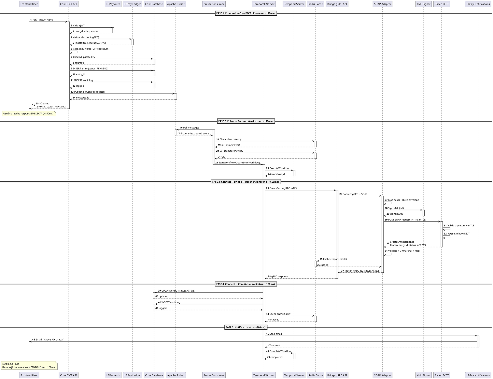

# DIA-007: Sequence Diagram - CreateEntry Flow

**Versão**: 1.0
**Data**: 2025-10-25
**Autor**: Equipe Arquitetura
**Status**: ✅ Completo

---

## Sumário Executivo

Este documento apresenta o **Sequence Diagram** do fluxo **CreateEntry** (criação de chave PIX), o fluxo mais fundamental do sistema DICT LBPay, que vai desde a requisição do frontend até a sincronização com o Bacen via SOAP/XML.

**Objetivo**: Documentar o fluxo completo de criação de uma chave PIX, incluindo todos os sistemas envolvidos, tempos de resposta, e decisões arquiteturais.

**Por que este fluxo é importante**:
- ✅ É o fluxo mais frequente (criar chaves PIX)
- ✅ Demonstra a arquitetura completa (Frontend → Core → Ledger → Pulsar → Connect → Bridge → Bacen)
- ✅ É assíncrono (resposta imediata ao usuário, sincronização com Bacen em background)
- ✅ Usa todos os componentes críticos (gRPC, Pulsar, Temporal, SOAP, mTLS)

**Pré-requisitos**:
- [DIA-002: C4 Container Diagram](./DIA-002_C4_Container_Diagram.md)
- [DIA-003: C4 Component Diagram - Core DICT](./DIA-003_C4_Component_Diagram_Core.md)
- [DIA-004: C4 Component Diagram - Connect](./DIA-004_C4_Component_Diagram_Connect.md)
- [DIA-005: C4 Component Diagram - Bridge](./DIA-005_C4_Component_Diagram_Bridge.md)

---

## 1. Visão Geral do CreateEntry Flow

### 1.1. Definição

**CreateEntry** é o fluxo de criação de uma chave PIX, onde um usuário final registra uma nova chave (CPF, CNPJ, Email, Phone ou EVP) associada a uma conta bancária.

**Exemplo**:
- Usuário: João Silva (CPF 123.456.789-00)
- Banco: Banco LBPay (ISPB 12345678)
- Chave PIX: CPF 123.456.789-00
- Conta: Agência 0001, Conta 123456-7 (Conta Corrente)

### 1.2. Fases do Fluxo

| Fase | Descrição | Duração | Síncrono/Assíncrono |
|------|-----------|---------|---------------------|
| **Fase 1** | Frontend → Core DICT (validação + persistência + evento) | ~150ms | Síncrono |
| **Fase 2** | Pulsar → Connect (inicia workflow) | ~50ms | Assíncrono |
| **Fase 3** | Connect → Bridge → Bacen (CreateEntry SOAP) | ~600ms | Assíncrono |
| **Fase 4** | Connect → Core (atualiza status ACTIVE + cache) | ~100ms | Assíncrono |
| **Fase 5** | Connect → Notifications (notifica usuário) | ~200ms | Assíncrono |

**Duração Total (usuário)**: ~150ms (resposta imediata com status PENDING)
**Duração Total (E2E)**: ~1.1s (até chave ficar ACTIVE no Bacen)

### 1.3. Atores

| Ator | Descrição |
|------|-----------|
| **Frontend User** | Usuário final que cria a chave PIX |
| **Core DICT API** | API REST que recebe a requisição |
| **LBPay Auth** | Serviço de autenticação (JWT) |
| **LBPay Ledger** | Serviço de validação de contas CID |
| **Core Database** | PostgreSQL (armazena entries) |
| **Apache Pulsar** | Event streaming (dict.entries.created) |
| **Pulsar Consumer** | Consome eventos e inicia workflows |
| **Temporal Worker** | Executa CreateEntryWorkflow |
| **Temporal Server** | Orquestrador de workflows |
| **Bridge gRPC API** | Adaptador gRPC → SOAP |
| **Bacen DICT** | Sistema oficial do Banco Central (SOAP/XML) |
| **Redis Cache** | Cache de entries |
| **LBPay Notifications** | Serviço de notificações (email/SMS) |

---

## 2. Sequence Diagram - CreateEntry Completo

### 2.1. Diagrama Mermaid

```mermaid
sequenceDiagram
    autonumber
    participant User as Frontend User
    participant CoreAPI as Core DICT API
    participant Auth as LBPay Auth
    participant Ledger as LBPay Ledger
    participant CoreDB as Core Database<br/>(PostgreSQL)
    participant Pulsar as Apache Pulsar
    participant Consumer as Pulsar Consumer
    participant TemporalWorker as Temporal Worker<br/>(CreateEntryWorkflow)
    participant TemporalServer as Temporal Server
    participant Redis as Redis Cache
    participant BridgeAPI as Bridge gRPC API
    participant SOAPAdapter as SOAP Adapter
    participant XMLSigner as XML Signer<br/>(Java)
    participant BacenDICT as Bacen DICT<br/>(SOAP/XML)
    participant Notifications as LBPay Notifications

    Note over User,Notifications: FASE 1: Frontend → Core DICT (Síncrono - ~150ms)

    User->>CoreAPI: POST /api/v1/keys<br/>{key_type: "CPF", key_value: "12345678900", account: {...}}
    activate CoreAPI

    CoreAPI->>CoreAPI: Extrai JWT do header Authorization

    CoreAPI->>Auth: GET /auth/validate<br/>Authorization: Bearer {jwt_token}
    activate Auth
    Auth-->>CoreAPI: {user_id: "user_123", roles: ["user"], scopes: ["dict:write"]}
    deactivate Auth
    Note right of CoreAPI: Latência: ~20ms

    CoreAPI->>CoreAPI: Valida RBAC (scope: dict:write)

    CoreAPI->>Ledger: ValidateAccount(account_id)<br/>gRPC
    activate Ledger
    Ledger-->>CoreAPI: {exists: true, status: "ACTIVE", holder: {...}}
    deactivate Ledger
    Note right of CoreAPI: Latência: ~50ms

    CoreAPI->>CoreAPI: Valida key_value (CPF checksum)

    CoreAPI->>CoreDB: SELECT COUNT(*) FROM dict.entries<br/>WHERE key_type = 'CPF' AND key_value = '12345678900'
    activate CoreDB
    CoreDB-->>CoreAPI: count: 0 (chave não existe)
    deactivate CoreDB
    Note right of CoreAPI: Latência: ~10ms

    CoreAPI->>CoreDB: INSERT INTO dict.entries<br/>(id, key_type, key_value, account_id, status, created_by)<br/>VALUES ('uuid', 'CPF', '12345678900', 'acc_id', 'PENDING', 'user_123')
    activate CoreDB
    CoreDB-->>CoreAPI: Inserted (entry_id: uuid)
    deactivate CoreDB
    Note right of CoreAPI: Latência: ~20ms

    CoreAPI->>CoreDB: INSERT INTO audit.entry_events<br/>(entity_type: 'entry', action: 'CREATE', user_id: 'user_123')
    activate CoreDB
    CoreDB-->>CoreAPI: Audit logged
    deactivate CoreDB
    Note right of CoreAPI: Latência: ~10ms

    CoreAPI->>Pulsar: Publish dict.entries.created<br/>{entry_id, key_type, key_value, account, timestamp}
    activate Pulsar
    Pulsar-->>CoreAPI: Message ID
    deactivate Pulsar
    Note right of CoreAPI: Latência: ~20ms

    CoreAPI-->>User: 201 Created<br/>{entry_id, status: "PENDING", created_at: "2025-10-25T10:00:00Z"}
    deactivate CoreAPI
    Note right of User: Total Fase 1: ~150ms<br/>(Usuário recebe resposta IMEDIATA)

    Note over Consumer,BacenDICT: FASE 2: Pulsar → Connect (Assíncrono - ~50ms)

    Consumer->>Pulsar: Poll messages (subscription: rsfn-connect)
    activate Consumer
    activate Pulsar
    Pulsar-->>Consumer: Event: dict.entries.created<br/>{entry_id: "uuid", key_type: "CPF", ...}
    deactivate Pulsar

    Consumer->>Consumer: Parse event (JSON → struct)

    Consumer->>Redis: GET idempotency:message:{msg_id}
    activate Redis
    Redis-->>Consumer: nil (não existe, primeira vez)
    deactivate Redis

    Consumer->>Redis: SET idempotency:message:{msg_id} "1" EX 86400
    activate Redis
    Redis-->>Consumer: OK
    deactivate Redis

    Consumer->>TemporalWorker: StartWorkflow("CreateEntryWorkflow", entry_id)
    deactivate Consumer
    activate TemporalWorker

    TemporalWorker->>TemporalServer: ExecuteWorkflow(CreateEntryWorkflow, params)
    activate TemporalServer
    TemporalServer->>TemporalServer: Persiste workflow state (PostgreSQL)
    TemporalServer-->>TemporalWorker: Workflow started (workflow_id)
    deactivate TemporalServer
    Note right of TemporalWorker: Latência: ~30ms

    Note over TemporalWorker,BacenDICT: FASE 3: Connect → Bridge → Bacen (Assíncrono - ~600ms)

    TemporalWorker->>TemporalWorker: Activity Options:<br/>StartToCloseTimeout: 30s<br/>RetryPolicy: 3x com backoff

    TemporalWorker->>BridgeAPI: CreateEntry(key_type, key_value, account)<br/>gRPC mTLS
    activate BridgeAPI

    BridgeAPI->>BridgeAPI: Valida payload gRPC

    BridgeAPI->>SOAPAdapter: Convert gRPC → SOAP
    activate SOAPAdapter

    SOAPAdapter->>SOAPAdapter: Map gRPC fields → SOAP struct

    SOAPAdapter->>SOAPAdapter: Build SOAP Envelope<br/>(Header + Body + Authentication)

    SOAPAdapter->>SOAPAdapter: Marshal Go struct → XML

    SOAPAdapter->>XMLSigner: Sign XML with ICP-Brasil A3<br/>(via JNI)
    activate XMLSigner
    XMLSigner->>XMLSigner: Load private key from keystore<br/>(PKCS12 + ICP-Brasil A3)
    XMLSigner->>XMLSigner: Create XMLDSig signature<br/>(RSA-SHA256)
    XMLSigner-->>SOAPAdapter: Signed XML with <ds:Signature>
    deactivate XMLSigner
    Note right of SOAPAdapter: Latência: ~50ms

    SOAPAdapter->>SOAPAdapter: Valida XML assinado

    SOAPAdapter->>SOAPAdapter: Circuit Breaker check (estado: CLOSED)

    SOAPAdapter->>BacenDICT: POST https://dict.bcb.gov.br/api/v1/dict/entries<br/>Content-Type: text/xml<br/>(HTTPS mTLS + SOAP/XML assinado)
    activate BacenDICT
    Note right of SOAPAdapter: mTLS com certificado ICP-Brasil A3

    BacenDICT->>BacenDICT: Valida assinatura digital XML
    BacenDICT->>BacenDICT: Valida mTLS (certificado cliente)
    BacenDICT->>BacenDICT: Processa CreateEntryRequest
    BacenDICT->>BacenDICT: Registra chave PIX no DICT nacional

    BacenDICT-->>SOAPAdapter: 200 OK<br/><CreateEntryResponse><br/>  <EntryId>bacen_uuid</EntryId><br/>  <Status>ACTIVE</Status><br/></CreateEntryResponse>
    deactivate BacenDICT
    Note right of SOAPAdapter: Latência Bacen: ~400ms

    SOAPAdapter->>SOAPAdapter: Valida assinatura digital do Bacen

    SOAPAdapter->>SOAPAdapter: Unmarshal XML → Go struct

    SOAPAdapter->>SOAPAdapter: Map SOAP → gRPC response

    SOAPAdapter->>SOAPAdapter: Valida response (verifica SOAP faults)

    SOAPAdapter->>Redis: SET bridge:response:bacen:uuid <response> EX 30
    activate Redis
    Redis-->>SOAPAdapter: Cached
    deactivate Redis

    SOAPAdapter-->>BridgeAPI: {bacen_entry_id: "bacen_uuid", status: "ACTIVE"}
    deactivate SOAPAdapter

    BridgeAPI-->>TemporalWorker: gRPC Response<br/>{bacen_entry_id: "bacen_uuid", status: "ACTIVE"}
    deactivate BridgeAPI
    Note right of TemporalWorker: Total Fase 3: ~600ms

    Note over TemporalWorker,CoreDB: FASE 4: Connect → Core (Atualiza Status - ~100ms)

    TemporalWorker->>CoreDB: UPDATE dict.entries<br/>SET status = 'ACTIVE', external_id = 'bacen_uuid', updated_at = NOW()<br/>WHERE id = 'uuid'
    activate CoreDB
    CoreDB-->>TemporalWorker: Updated (1 row)
    deactivate CoreDB
    Note right of TemporalWorker: Latência: ~30ms

    TemporalWorker->>CoreDB: INSERT INTO audit.entry_events<br/>(entity_type: 'entry', action: 'UPDATE', changes: {status: 'ACTIVE'})
    activate CoreDB
    CoreDB-->>TemporalWorker: Audit logged
    deactivate CoreDB
    Note right of TemporalWorker: Latência: ~20ms

    TemporalWorker->>Redis: SET dict:entry:CPF:12345678900<br/>{entry_id, key_type, key_value, status: "ACTIVE", ...}<br/>EX 300 (5 minutos)
    activate Redis
    Redis-->>TemporalWorker: Cached
    deactivate Redis
    Note right of TemporalWorker: Latência: ~10ms

    Note over TemporalWorker,Notifications: FASE 5: Notifica Usuário (~200ms)

    TemporalWorker->>Notifications: POST /notifications/send<br/>{user_id: "user_123", template: "entry_created", data: {key_type, key_value}}
    activate Notifications
    Notifications->>Notifications: Renderiza template email
    Notifications->>Notifications: Envia email via SMTP
    Notifications->>User: Email: "Sua chave PIX CPF 123.456.789-00 foi criada com sucesso!"
    Notifications-->>TemporalWorker: {success: true}
    deactivate Notifications
    Note right of TemporalWorker: Latência: ~200ms<br/>(Não bloqueia workflow se falhar)

    TemporalWorker->>TemporalServer: CompleteWorkflow(success)
    activate TemporalServer
    TemporalServer->>TemporalServer: Persiste workflow completion
    TemporalServer-->>TemporalWorker: Workflow completed
    deactivate TemporalServer
    deactivate TemporalWorker

    Note over User,Notifications: Total E2E: ~1.1s (do evento Pulsar até ACTIVE)<br/>Usuário recebeu resposta em ~150ms (PENDING)
```



---

### 2.2. Versão PlantUML (Alternativa)



---

## 3. Detalhamento por Fase

### Fase 1: Frontend → Core DICT (Síncrono - ~150ms)

**Objetivo**: Validar requisição, persistir entry com status PENDING, publicar evento

**Steps**:

1. **POST /api/v1/keys** (Step 1)
   - User envia requisição HTTP
   - Payload:
     ```json
     {
       "key_type": "CPF",
       "key_value": "12345678900",
       "account": {
         "ispb": "12345678",
         "account_number": "123456",
         "branch": "0001",
         "account_type": "CACC"
       }
     }
     ```

2. **Validar JWT** (Steps 2-4)
   - Core API extrai token do header `Authorization: Bearer {jwt}`
   - Chama LBPay Auth via HTTP: `GET /auth/validate`
   - Auth retorna `{user_id, roles, scopes}`
   - **Latência**: ~20ms

3. **Validar RBAC** (Step 5)
   - Core API verifica se user tem scope `dict:write`
   - Se não tiver, retorna `403 Forbidden`

4. **Validar Conta CID** (Steps 6-7)
   - Core API chama LBPay Ledger via gRPC: `ValidateAccount(account_id)`
   - Ledger retorna `{exists: true, status: "ACTIVE", holder: {...}}`
   - Se conta não existe ou está BLOCKED, retorna `400 Bad Request`
   - **Latência**: ~50ms

5. **Validar key_value** (Step 8)
   - Core API valida CPF checksum (ou CNPJ, Email, Phone, EVP)
   - Se inválido, retorna `400 Bad Request`

6. **Verificar Duplicata** (Steps 9-10)
   - Core API consulta banco: `SELECT COUNT(*) FROM dict.entries WHERE key_type = 'CPF' AND key_value = '12345678900'`
   - Se count > 0, retorna `409 Conflict` (chave já existe)
   - **Latência**: ~10ms

7. **Inserir Entry** (Steps 11-12)
   - Core API insere entry no banco com status `PENDING`
   - SQL:
     ```sql
     INSERT INTO dict.entries (id, key_type, key_value, account_id, status, created_by, created_at)
     VALUES ('uuid', 'CPF', '12345678900', 'acc_id', 'PENDING', 'user_123', NOW())
     ```
   - **Latência**: ~20ms

8. **Auditoria** (Steps 13-14)
   - Core API insere log de auditoria
   - SQL:
     ```sql
     INSERT INTO audit.entry_events (entity_type, entity_id, action, user_id, timestamp)
     VALUES ('entry', 'uuid', 'CREATE', 'user_123', NOW())
     ```
   - **Latência**: ~10ms

9. **Publicar Evento** (Steps 15-16)
   - Core API publica evento no Pulsar
   - Topic: `dict.entries.created`
   - Payload:
     ```json
     {
       "entry_id": "uuid",
       "key_type": "CPF",
       "key_value": "12345678900",
       "account": {...},
       "timestamp": "2025-10-25T10:00:00Z"
     }
     ```
   - **Latência**: ~20ms

10. **Resposta ao Usuário** (Step 17)
    - Core API retorna `201 Created`
    - Response:
      ```json
      {
        "entry_id": "uuid",
        "status": "PENDING",
        "created_at": "2025-10-25T10:00:00Z"
      }
      ```

**Total Fase 1**: ~150ms (Usuário recebe resposta IMEDIATA)

---

### Fase 2: Pulsar → Connect (Assíncrono - ~50ms)

**Objetivo**: Consumir evento, verificar idempotência, iniciar workflow

**Steps**:

1. **Pulsar Consumer Poll** (Steps 18-19)
   - Pulsar Consumer faz poll de mensagens
   - Recebe evento `dict.entries.created`

2. **Parse Event** (Step 20)
   - Consumer deserializa JSON → Go struct

3. **Idempotency Check** (Steps 21-22)
   - Consumer consulta Redis: `GET idempotency:message:{msg_id}`
   - Se EXISTS, skip (já processado)
   - Se nil, continua

4. **Set Idempotency Key** (Steps 23-24)
   - Consumer seta Redis: `SET idempotency:message:{msg_id} "1" EX 86400` (24h)

5. **Start Workflow** (Step 25)
   - Consumer chama Temporal Worker: `StartWorkflow("CreateEntryWorkflow", entry_id)`

6. **Execute Workflow** (Steps 26-29)
   - Temporal Worker chama Temporal Server: `ExecuteWorkflow`
   - Temporal Server persiste workflow state no PostgreSQL
   - Retorna `workflow_id`
   - **Latência**: ~30ms

**Total Fase 2**: ~50ms

---

### Fase 3: Connect → Bridge → Bacen (Assíncrono - ~600ms)

**Objetivo**: Criar chave PIX no Bacen via SOAP/XML com mTLS

**Steps**:

1. **Activity Options** (Step 30)
   - Temporal Worker configura options:
     - `StartToCloseTimeout: 30s`
     - `RetryPolicy: 3x com backoff exponencial`

2. **gRPC Call to Bridge** (Step 31)
   - Temporal Worker chama Bridge gRPC API: `CreateEntry(key_type, key_value, account)`
   - **Protocolo**: gRPC com mTLS (certificados internos)

3. **Validate gRPC Payload** (Step 32)
   - Bridge valida payload gRPC

4. **Convert gRPC → SOAP** (Steps 33-36)
   - SOAP Adapter mapeia campos gRPC → SOAP struct
   - Build SOAP Envelope (Header + Body + Authentication)
   - Marshal Go struct → XML

5. **Sign XML** (Steps 37-40)
   - XML Signer (Java) assina XML com ICP-Brasil A3
   - Algoritmo: RSA-SHA256 (XMLDSig)
   - Certificado: ICP-Brasil A3 (hardware token ou Cloud HSM)
   - Retorna XML assinado com `<ds:Signature>`
   - **Latência**: ~50ms

6. **Validate XML** (Step 41)
   - SOAP Adapter valida XML assinado

7. **Circuit Breaker Check** (Step 42)
   - SOAP Adapter verifica estado do circuit breaker
   - Se OPEN, retorna erro imediatamente (fail fast)
   - Se CLOSED/HALF-OPEN, continua

8. **POST to Bacen** (Step 43)
   - SOAP Adapter envia SOAP request ao Bacen
   - URL: `https://dict.bcb.gov.br/api/v1/dict/entries`
   - **Protocolo**: HTTPS com mTLS (certificado ICP-Brasil A3)
   - **Content-Type**: `text/xml; charset=utf-8`
   - **Body**: XML assinado

9. **Bacen Processing** (Steps 44-47)
   - Bacen valida assinatura digital XML
   - Bacen valida mTLS (certificado cliente)
   - Bacen processa CreateEntryRequest
   - Bacen registra chave PIX no DICT nacional

10. **Bacen Response** (Step 48)
    - Bacen retorna `200 OK` com SOAP response:
      ```xml
      <CreateEntryResponse>
        <EntryId>bacen_uuid</EntryId>
        <Status>ACTIVE</Status>
      </CreateEntryResponse>
      ```
    - **Latência Bacen**: ~400ms

11. **Validate Bacen Signature** (Step 49)
    - SOAP Adapter valida assinatura digital do Bacen

12. **Unmarshal XML** (Step 50)
    - SOAP Adapter deserializa XML → Go struct

13. **Map SOAP → gRPC** (Step 51)
    - SOAP Adapter mapeia campos SOAP → gRPC response

14. **Validate Response** (Step 52)
    - SOAP Adapter valida response (verifica SOAP faults)

15. **Cache Response** (Steps 53-54)
    - SOAP Adapter cacheia resposta no Redis
    - Key: `bridge:response:bacen:uuid`
    - TTL: 30 segundos

16. **Return gRPC Response** (Steps 55-56)
    - Bridge retorna para Temporal Worker: `{bacen_entry_id: "bacen_uuid", status: "ACTIVE"}`

**Total Fase 3**: ~600ms (incluindo Bacen)

---

### Fase 4: Connect → Core (Atualiza Status - ~100ms)

**Objetivo**: Atualizar entry para status ACTIVE, cachear, auditar

**Steps**:

1. **Update Entry Status** (Steps 57-58)
   - Temporal Worker atualiza entry no Core Database
   - SQL:
     ```sql
     UPDATE dict.entries
     SET status = 'ACTIVE', external_id = 'bacen_uuid', updated_at = NOW()
     WHERE id = 'uuid'
     ```
   - **Latência**: ~30ms

2. **Audit Log** (Steps 59-60)
   - Temporal Worker insere log de auditoria
   - SQL:
     ```sql
     INSERT INTO audit.entry_events (entity_type, entity_id, action, changes, timestamp)
     VALUES ('entry', 'uuid', 'UPDATE', '{"status": "ACTIVE"}', NOW())
     ```
   - **Latência**: ~20ms

3. **Cache Entry** (Steps 61-62)
   - Temporal Worker cacheia entry no Redis
   - Key: `dict:entry:CPF:12345678900`
   - Value: `{entry_id, key_type, key_value, status: "ACTIVE", ...}`
   - TTL: 300 segundos (5 minutos)
   - **Latência**: ~10ms

**Total Fase 4**: ~100ms

---

### Fase 5: Notifica Usuário (~200ms)

**Objetivo**: Notificar usuário sobre chave criada

**Steps**:

1. **Send Notification** (Steps 63-66)
   - Temporal Worker chama LBPay Notifications
   - POST `/notifications/send`
   - Payload:
     ```json
     {
       "user_id": "user_123",
       "template": "entry_created",
       "data": {
         "key_type": "CPF",
         "key_value": "123.456.789-00"
       }
     }
     ```
   - Notifications renderiza template email
   - Notifications envia email via SMTP
   - **Latência**: ~200ms

2. **Complete Workflow** (Steps 67-69)
   - Temporal Worker completa workflow: `CompleteWorkflow(success)`
   - Temporal Server persiste workflow completion
   - Workflow finalizado

**Total Fase 5**: ~200ms

**Nota**: Se notificação falhar, workflow NÃO falha (notification é best-effort)

---

## 4. Latências por Componente

| Componente | Latência Média | Percentil 95 | Percentil 99 |
|------------|----------------|--------------|--------------|
| **LBPay Auth** | 20ms | 30ms | 50ms |
| **LBPay Ledger (gRPC)** | 50ms | 80ms | 120ms |
| **Core Database (SELECT)** | 10ms | 15ms | 25ms |
| **Core Database (INSERT)** | 20ms | 30ms | 50ms |
| **Apache Pulsar (Publish)** | 20ms | 30ms | 50ms |
| **Temporal Server (StartWorkflow)** | 30ms | 50ms | 80ms |
| **Redis (GET/SET)** | 2ms | 5ms | 10ms |
| **XML Signer (Java JNI)** | 50ms | 80ms | 120ms |
| **Bacen DICT (SOAP/XML)** | 400ms | 600ms | 1000ms |
| **LBPay Notifications** | 200ms | 300ms | 500ms |

**Total E2E (Usuário → PENDING)**: ~150ms (p95: ~200ms)
**Total E2E (PENDING → ACTIVE)**: ~1100ms (p95: ~1500ms)

---

## 5. Dados Trafegados

### 5.1. Request: POST /api/v1/keys

```json
{
  "key_type": "CPF",
  "key_value": "12345678900",
  "account": {
    "ispb": "12345678",
    "account_number": "123456",
    "branch": "0001",
    "account_type": "CACC"
  }
}
```

### 5.2. Response: 201 Created

```json
{
  "entry_id": "550e8400-e29b-41d4-a716-446655440000",
  "status": "PENDING",
  "created_at": "2025-10-25T10:00:00Z"
}
```

### 5.3. Pulsar Event: dict.entries.created

```json
{
  "entry_id": "550e8400-e29b-41d4-a716-446655440000",
  "key_type": "CPF",
  "key_value": "12345678900",
  "account": {
    "ispb": "12345678",
    "account_number": "123456",
    "branch": "0001",
    "account_type": "CACC",
    "holder_document": "12345678900",
    "holder_name": "João Silva"
  },
  "timestamp": "2025-10-25T10:00:00Z"
}
```

### 5.4. gRPC Request: Bridge.CreateEntry

```protobuf
message CreateEntryRequest {
  string key_type = 1;      // "CPF"
  string key_value = 2;     // "12345678900"
  Account account = 3;      // {...}
}

message Account {
  string ispb = 1;           // "12345678"
  string account_number = 2; // "123456"
  string branch = 3;         // "0001"
  string account_type = 4;   // "CACC"
}
```

### 5.5. SOAP Request: CreateEntryRequest (Bridge → Bacen)

```xml
<soapenv:Envelope xmlns:soapenv="http://schemas.xmlsoap.org/soap/envelope/"
                  xmlns:dict="http://www.bcb.gov.br/dict/v1">
  <soapenv:Header>
    <dict:Authentication>
      <dict:Certificate>ICP-Brasil A3 Certificate</dict:Certificate>
    </dict:Authentication>
  </soapenv:Header>
  <soapenv:Body wsu:Id="Body">
    <dict:CreateEntryRequest>
      <dict:Key>
        <dict:Type>CPF</dict:Type>
        <dict:Value>12345678900</dict:Value>
      </dict:Key>
      <dict:Account>
        <dict:ISPB>12345678</dict:ISPB>
        <dict:AccountNumber>123456</dict:AccountNumber>
        <dict:Branch>0001</dict:Branch>
        <dict:AccountType>CACC</dict:AccountType>
      </dict:Account>
    </dict:CreateEntryRequest>
  </soapenv:Body>
  <ds:Signature xmlns:ds="http://www.w3.org/2000/09/xmldsig#">
    <ds:SignedInfo>
      <ds:CanonicalizationMethod Algorithm="http://www.w3.org/2001/10/xml-exc-c14n#"/>
      <ds:SignatureMethod Algorithm="http://www.w3.org/2001/04/xmldsig-more#rsa-sha256"/>
      <ds:Reference URI="#Body">
        <ds:Transforms>
          <ds:Transform Algorithm="http://www.w3.org/2000/09/xmldsig#enveloped-signature"/>
        </ds:Transforms>
        <ds:DigestMethod Algorithm="http://www.w3.org/2001/04/xmlenc#sha256"/>
        <ds:DigestValue>...</ds:DigestValue>
      </ds:Reference>
    </ds:SignedInfo>
    <ds:SignatureValue>...</ds:SignatureValue>
    <ds:KeyInfo>
      <ds:X509Data>
        <ds:X509Certificate>ICP-Brasil A3 Certificate Base64</ds:X509Certificate>
      </ds:X509Data>
    </ds:KeyInfo>
  </ds:Signature>
</soapenv:Envelope>
```

### 5.6. SOAP Response: CreateEntryResponse (Bacen → Bridge)

```xml
<soapenv:Envelope xmlns:soapenv="http://schemas.xmlsoap.org/soap/envelope/"
                  xmlns:dict="http://www.bcb.gov.br/dict/v1">
  <soapenv:Body>
    <dict:CreateEntryResponse>
      <dict:EntryId>bacen_550e8400-e29b-41d4-a716-446655440000</dict:EntryId>
      <dict:Status>ACTIVE</dict:Status>
      <dict:CreatedAt>2025-10-25T10:00:01Z</dict:CreatedAt>
    </dict:CreateEntryResponse>
  </soapenv:Body>
</soapenv:Envelope>
```

---

## 6. Tratamento de Erros

### 6.1. Erros na Fase 1 (Core DICT)

| Erro | HTTP Status | Descrição | Ação |
|------|-------------|-----------|------|
| **JWT inválido** | 401 Unauthorized | Token expirado ou inválido | Retornar erro ao usuário |
| **Scope insuficiente** | 403 Forbidden | User não tem `dict:write` | Retornar erro ao usuário |
| **Conta inválida** | 400 Bad Request | Conta não existe ou está BLOCKED | Retornar erro ao usuário |
| **CPF inválido** | 400 Bad Request | CPF checksum inválido | Retornar erro ao usuário |
| **Chave duplicada** | 409 Conflict | Chave já existe | Retornar erro ao usuário |
| **Database down** | 500 Internal Server Error | PostgreSQL indisponível | Retornar erro ao usuário + alertar DevOps |

### 6.2. Erros na Fase 3 (Bridge + Bacen)

| Erro | Retry | Ação |
|------|-------|------|
| **Bridge timeout** | 3x com backoff exponencial | Após 3 tentativas, falha activity e workflow fica em retry |
| **XML Signer falha** | 3x com backoff | Após 3 tentativas, falha activity (certificado inválido?) |
| **Bacen timeout** | 3x com backoff | Após 3 tentativas, falha activity e alerta DevOps |
| **Bacen SOAP Fault** | Depende do fault code | Se `ENTRY_ALREADY_EXISTS`, não retry. Se `SERVICE_UNAVAILABLE`, retry 3x |
| **mTLS handshake fail** | 3x com backoff | Certificado ICP-Brasil inválido → alertar DevOps |
| **Circuit Breaker OPEN** | Não retry | Fail fast, retorna erro imediatamente |

**Nota**: Temporal garante que workflow NUNCA será perdido. Se houver erro, workflow fica em estado de retry até que a causa seja resolvida.

---

## 7. Monitoramento e Observabilidade

### 7.1. Métricas (Prometheus)

```prometheus
# Total de entries criadas (por status)
dict_entries_created_total{status="PENDING"}
dict_entries_created_total{status="ACTIVE"}
dict_entries_created_total{status="FAILED"}

# Duração do fluxo CreateEntry
dict_create_entry_duration_seconds{phase="core_api"}      # ~150ms
dict_create_entry_duration_seconds{phase="workflow"}      # ~1000ms
dict_create_entry_duration_seconds{phase="bacen"}         # ~400ms

# Latência por componente
http_request_duration_seconds{endpoint="/api/v1/keys", method="POST"}
grpc_request_duration_seconds{service="Ledger", method="ValidateAccount"}
grpc_request_duration_seconds{service="Bridge", method="CreateEntry"}
soap_request_duration_seconds{service="Bacen", operation="CreateEntry"}

# Taxa de erros
dict_create_entry_errors_total{error="duplicate_key"}
dict_create_entry_errors_total{error="invalid_account"}
dict_create_entry_errors_total{error="bacen_timeout"}
dict_create_entry_errors_total{error="circuit_breaker_open"}
```

### 7.2. Alerts

```yaml
# Alert: Alta latência do Bacen
- alert: BacenHighLatency
  expr: histogram_quantile(0.95, soap_request_duration_seconds{service="Bacen"}) > 1.0
  for: 5m
  annotations:
    summary: "Bacen está com latência alta (p95 > 1s)"

# Alert: Circuit Breaker OPEN
- alert: BacenCircuitBreakerOpen
  expr: circuit_breaker_state{service="Bacen"} == 2  # 2 = OPEN
  for: 1m
  annotations:
    summary: "Circuit Breaker do Bacen está OPEN. Requisições falhando."

# Alert: Taxa de erro alta
- alert: HighCreateEntryErrorRate
  expr: rate(dict_create_entry_errors_total[5m]) > 0.1
  for: 5m
  annotations:
    summary: "Mais de 10% das criações de chaves estão falhando"
```

### 7.3. Tracing (Jaeger)

**Trace Example**:
```
create_entry_e2e (1.1s)
├── core_api.create_entry (150ms)
│   ├── auth.validate_jwt (20ms)
│   ├── ledger.validate_account (50ms)
│   ├── database.insert_entry (20ms)
│   ├── database.audit_log (10ms)
│   └── pulsar.publish_event (20ms)
├── temporal.workflow.create_entry (950ms)
│   ├── temporal.activity.create_entry_in_bacen (600ms)
│   │   ├── bridge.grpc.create_entry (590ms)
│   │   │   ├── soap.convert_to_xml (10ms)
│   │   │   ├── xml_signer.sign (50ms)
│   │   │   ├── bacen.http_call (400ms)
│   │   │   └── soap.parse_response (50ms)
│   ├── temporal.activity.update_entry_status (30ms)
│   ├── temporal.activity.audit_log (20ms)
│   ├── temporal.activity.cache_entry (10ms)
│   └── temporal.activity.notify_user (200ms)
```

---

## 8. Checklist de Implementação

### Core DICT API
- [ ] Endpoint `POST /api/v1/keys` implementado
- [ ] Validação JWT com LBPay Auth
- [ ] Validação RBAC (scope `dict:write`)
- [ ] Validação de conta com LBPay Ledger (gRPC)
- [ ] Validação de key_value (CPF, CNPJ, Email, Phone, EVP)
- [ ] Verificação de chave duplicada
- [ ] Persistência de entry com status PENDING
- [ ] Auditoria de criação
- [ ] Publicação de evento `dict.entries.created` no Pulsar
- [ ] Resposta 201 Created ao usuário

### Temporal Worker (CreateEntryWorkflow)
- [ ] Workflow `CreateEntryWorkflow` implementado
- [ ] Activity `CreateEntryInBacenActivity` implementada
- [ ] Activity `UpdateEntryStatusActivity` implementada
- [ ] Activity `CacheEntryActivity` implementada
- [ ] Activity `NotifyUserActivity` implementada
- [ ] Retry policy configurado (3x, backoff exponencial)
- [ ] Timeout de 30s configurado

### Bridge gRPC API
- [ ] RPC `CreateEntry` implementado
- [ ] Conversão gRPC → SOAP implementada
- [ ] Assinatura digital XML (ICP-Brasil A3) integrada
- [ ] mTLS com Bacen configurado
- [ ] Circuit Breaker implementado
- [ ] Cache Redis (30s TTL) implementado
- [ ] Validação de SOAP Faults implementada

### Observabilidade
- [ ] Métricas Prometheus expostas
- [ ] Alerts configurados (high latency, circuit breaker open, error rate)
- [ ] Tracing OpenTelemetry integrado
- [ ] Dashboard Grafana criado

---

## 9. Próximos Passos

1. **[INT-001: Flow CreateEntry E2E](../../12_Integracao/Fluxos/INT-001_Flow_CreateEntry_E2E.md)** (a criar)
   - Fluxo E2E completo com todos os sistemas integrados

2. **[TST-001: Test Cases CreateEntry](../../14_Testes/Casos/TST-001_Test_Cases_CreateEntry.md)** (a criar)
   - Test cases para todos os cenários (happy path, error cases)

3. **[IMP-001: Manual Implementação Core DICT](../../09_Implementacao/IMP-001_Manual_Implementacao_Core_DICT.md)** (a criar)
   - Guia de implementação do Core DICT

---

## 10. Referências

### Documentos Internos
- [DIA-002: C4 Container Diagram](./DIA-002_C4_Container_Diagram.md)
- [DIA-003: C4 Component Diagram - Core DICT](./DIA-003_C4_Component_Diagram_Core.md)
- [DIA-004: C4 Component Diagram - Connect](./DIA-004_C4_Component_Diagram_Connect.md)
- [DIA-005: C4 Component Diagram - Bridge](./DIA-005_C4_Component_Diagram_Bridge.md)
- [TEC-001: IcePanel Architecture](../../11_Especificacoes_Tecnicas/TEC-001_IcePanel_Architecture_and_Decisions.md)
- [TEC-002 v3.1: Bridge Specification](../../11_Especificacoes_Tecnicas/TEC-002_Bridge_Specification.md)
- [TEC-003 v2.1: Connect Specification](../../11_Especificacoes_Tecnicas/TEC-003_RSFN_Connect_Specification.md)

### Documentos Externos
- [Bacen - Manual DICT](https://www.bcb.gov.br/estabilidadefinanceira/pix)
- [Temporal Workflows](https://docs.temporal.io/workflows)
- [Apache Pulsar](https://pulsar.apache.org/docs/concepts-messaging/)
- [SOAP 1.2 Specification](https://www.w3.org/TR/soap12/)

---

**Última Revisão**: 2025-10-25
**Aprovado por**: Arquitetura LBPay
**Próxima Revisão**: 2026-01-25 (trimestral)
