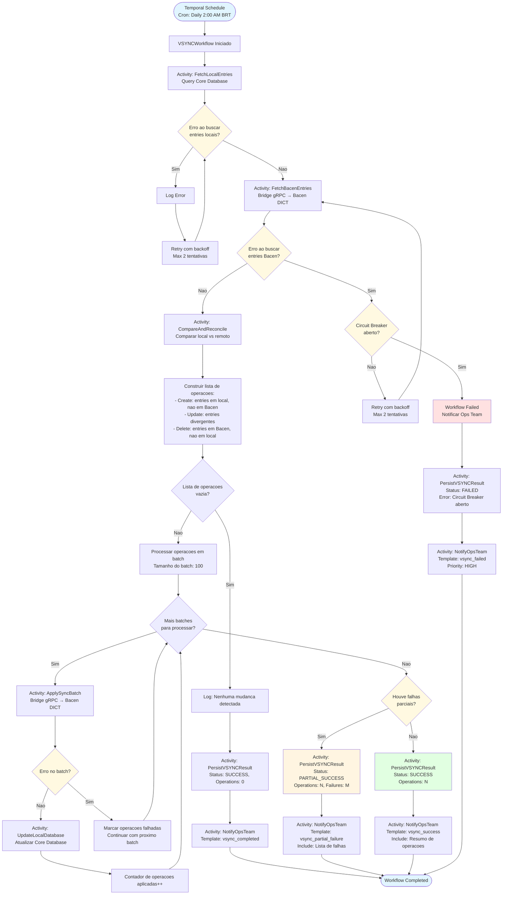

# DIA-008: Flow Diagram - VSYNC Daily Synchronization

**Versao**: 1.0
**Data**: 2025-10-25
**Autor**: ARCHITECT Agent
**Status**: Complete

---

## Sumario Executivo

Este documento apresenta o **fluxo detalhado da sincronizacao diaria VSYNC** (Verification Synchronization) entre o DICT LBPay local e o DICT Bacen. O processo executa diariamente as 2:00 AM BRT via Temporal Workflow, garantindo consistencia entre os dados locais e remotos.

**Objetivo**: Reconciliar diferencas entre entries locais (Core Database) e entries remotas (Bacen DICT), aplicando operacoes Create/Update/Delete conforme necessario.

**Pre-requisito**: Ler [TEC-003: RSFN Connect Specification](../../11_Especificacoes_Tecnicas/TEC-003_RSFN_Connect_Specification.md)

---

## 1. Diagrama de Fluxo VSYNC



---

## 2. Detalhamento das Activities

### 2.1. FetchLocalEntries

**Responsabilidade**: Buscar todas as entries ativas do Core Database local.

**Query SQL**:
```sql
SELECT
    id,
    key_value,
    key_type,
    account_id,
    status,
    external_id,
    updated_at
FROM dict.entries
WHERE status IN ('ACTIVE', 'PENDING')
ORDER BY updated_at DESC;
```

**Timeout**: 2 minutos
**Retry Policy**: 2 tentativas, backoff 10s

**Output**:
```go
type LocalEntry struct {
    ID         string
    KeyValue   string
    KeyType    string
    AccountID  string
    Status     string
    ExternalID string // ID no Bacen
    UpdatedAt  time.Time
}
```

---

### 2.2. FetchBacenEntries

**Responsabilidade**: Buscar todas as entries do participante no DICT Bacen via Bridge.

**Bridge gRPC Call**:
```protobuf
rpc ListEntries(ListEntriesRequest) returns (ListEntriesResponse);

message ListEntriesRequest {
    string participant_ispb = 1; // ISPB do participante LBPay
    int32 page_size = 2;         // 1000 entries por pagina
    string page_token = 3;       // Para paginacao
}

message ListEntriesResponse {
    repeated Entry entries = 1;
    string next_page_token = 2;
}
```

**Timeout**: 5 minutos (pode ter muitas entries)
**Retry Policy**: 2 tentativas, backoff 30s
**Circuit Breaker**: Respeitar estado do Bridge

**Paginacao**: Automatica, consome todas as paginas

**Output**:
```go
type BacenEntry struct {
    ExternalID string // ID no Bacen
    KeyValue   string
    KeyType    string
    Status     string
    UpdatedAt  time.Time
}
```

---

### 2.3. CompareAndReconcile

**Responsabilidade**: Comparar entries locais vs Bacen e gerar lista de operacoes.

**Algoritmo**:
```go
func CompareAndReconcile(local []LocalEntry, bacen []BacenEntry) []SyncOperation {
    operations := []SyncOperation{}

    // Mapear entries por key_value para lookup O(1)
    localMap := make(map[string]LocalEntry)
    bacenMap := make(map[string]BacenEntry)

    for _, entry := range local {
        localMap[entry.KeyValue] = entry
    }

    for _, entry := range bacen {
        bacenMap[entry.KeyValue] = entry
    }

    // 1. CREATE: Entries locais que nao existem no Bacen
    for key, localEntry := range localMap {
        if _, exists := bacenMap[key]; !exists {
            if localEntry.Status == "ACTIVE" {
                operations = append(operations, SyncOperation{
                    Type:       "CREATE",
                    LocalEntry: localEntry,
                })
            }
        }
    }

    // 2. UPDATE: Entries que divergem (status, dados)
    for key, localEntry := range localMap {
        if bacenEntry, exists := bacenMap[key]; exists {
            if localEntry.Status != bacenEntry.Status ||
               localEntry.UpdatedAt.After(bacenEntry.UpdatedAt) {
                operations = append(operations, SyncOperation{
                    Type:        "UPDATE",
                    LocalEntry:  localEntry,
                    BacenEntry:  bacenEntry,
                })
            }
        }
    }

    // 3. DELETE: Entries no Bacen que nao existem localmente
    //    (ou foram marcadas como DELETED localmente)
    for key, bacenEntry := range bacenMap {
        if localEntry, exists := localMap[key]; !exists {
            operations = append(operations, SyncOperation{
                Type:       "DELETE",
                BacenEntry: bacenEntry,
            })
        } else if localEntry.Status == "DELETED" {
            operations = append(operations, SyncOperation{
                Type:        "DELETE",
                LocalEntry:  localEntry,
                BacenEntry:  bacenEntry,
            })
        }
    }

    return operations
}
```

**Timeout**: 1 minuto
**Retry Policy**: 1 tentativa (algoritmo deterministico)

---

### 2.4. ApplySyncBatch

**Responsabilidade**: Aplicar batch de operacoes no Bacen via Bridge.

**Bridge gRPC Call**:
```protobuf
rpc SyncBatch(SyncBatchRequest) returns (SyncBatchResponse);

message SyncBatchRequest {
    repeated SyncOperation operations = 1;
}

message SyncOperation {
    string operation_type = 1; // CREATE, UPDATE, DELETE
    Entry entry = 2;
    string idempotency_key = 3;
}

message SyncBatchResponse {
    repeated OperationResult results = 1;
}

message OperationResult {
    string operation_id = 1;
    bool success = 2;
    string error_code = 3;
    string error_message = 4;
}
```

**Timeout**: 3 minutos por batch
**Retry Policy**: 2 tentativas, backoff 20s
**Batch Size**: 100 operacoes

**Idempotency**: Cada operacao possui `idempotency_key = sha256(vsync_date + key_value + operation_type)`

---

### 2.5. UpdateLocalDatabase

**Responsabilidade**: Atualizar Core Database local com resultados das operacoes.

**SQL**:
```sql
-- Para CREATE operations (sucesso):
UPDATE dict.entries
SET external_id = $1, status = 'ACTIVE', synced_at = NOW()
WHERE key_value = $2;

-- Para UPDATE operations (sucesso):
UPDATE dict.entries
SET status = $1, synced_at = NOW()
WHERE key_value = $2;

-- Para DELETE operations (sucesso):
UPDATE dict.entries
SET status = 'DELETED', synced_at = NOW()
WHERE key_value = $1;
```

**Timeout**: 1 minuto
**Retry Policy**: 3 tentativas, backoff 5s

---

### 2.6. PersistVSYNCResult

**Responsabilidade**: Persistir resultado da execucao VSYNC no banco.

**SQL**:
```sql
INSERT INTO vsync_executions (
    id,
    execution_date,
    operations_count,
    failures_count,
    status,
    started_at,
    completed_at,
    error_message
) VALUES (
    $1, $2, $3, $4, $5, $6, $7, $8
);
```

**Schema Referencia**: [TEC-003 Section 8.1](../../11_Especificacoes_Tecnicas/TEC-003_RSFN_Connect_Specification.md#81-database-schema-postgresql)

---

## 3. Error Handling e Retry

### 3.1. Retry Policy por Activity

| Activity | Max Tentativas | Backoff Inicial | Backoff Maximo |
|----------|----------------|-----------------|----------------|
| FetchLocalEntries | 2 | 10s | 30s |
| FetchBacenEntries | 2 | 30s | 60s |
| CompareAndReconcile | 1 | N/A | N/A |
| ApplySyncBatch | 2 | 20s | 60s |
| UpdateLocalDatabase | 3 | 5s | 15s |
| PersistVSYNCResult | 3 | 5s | 15s |

### 3.2. Circuit Breaker (Bridge)

Se o Bridge reportar **Circuit Breaker aberto**:
- **Nao retentar** imediatamente
- **Falhar Workflow** com status `FAILED`
- **Notificar Ops Team** com prioridade `HIGH`
- **Proximo VSYNC** (dia seguinte) tentara novamente

### 3.3. Falhas Parciais

Se **alguns batches falharem** mas outros tiverem sucesso:
- **Continuar processamento** dos batches restantes
- **Persistir resultado** com status `PARTIAL_SUCCESS`
- **Incluir lista de falhas** na notificacao
- **Proximo VSYNC** tentara novamente as operacoes falhadas

---

## 4. Agendamento Temporal

### 4.1. Cron Schedule

```yaml
Schedule:
  ID: vsync-daily-schedule
  Cron: "0 2 * * *"        # Diariamente as 2:00 AM
  Timezone: "America/Sao_Paulo" # BRT
  Workflow: VSYNCWorkflow
  TaskQueue: dict-task-queue
```

### 4.2. Workflow Input

```go
type VSYNCWorkflowInput struct {
    ExecutionDate time.Time // 2025-10-25 00:00:00 BRT
    ParticipantISPB string  // ISPB do LBPay
}
```

### 4.3. Idempotencia

Cada execucao possui **Workflow ID unico**:
```go
workflowID := "vsync-" + time.Now().Format("2006-01-02") // vsync-2025-10-25
```

Se o Workflow for executado **multiplas vezes no mesmo dia** (retry manual), o Temporal **deduplica** baseado no Workflow ID.

---

## 5. Monitoramento e Alertas

### 5.1. Metricas (Prometheus)

```go
// Metricas customizadas
var (
    vsyncExecutionsTotal = promauto.NewCounter(prometheus.CounterOpts{
        Name: "dict_vsync_executions_total",
        Help: "Total de execucoes VSYNC iniciadas",
    })

    vsyncExecutionsCompleted = promauto.NewCounterVec(prometheus.CounterOpts{
        Name: "dict_vsync_executions_completed_total",
        Help: "Total de execucoes VSYNC completadas",
    }, []string{"status"}) // "success", "partial_success", "failed"

    vsyncOperationsTotal = promauto.NewCounterVec(prometheus.CounterOpts{
        Name: "dict_vsync_operations_total",
        Help: "Total de operacoes VSYNC",
    }, []string{"type"}) // "create", "update", "delete"

    vsyncDurationSeconds = promauto.NewHistogram(prometheus.HistogramOpts{
        Name:    "dict_vsync_duration_seconds",
        Help:    "Duracao da execucao VSYNC",
        Buckets: []float64{60, 300, 600, 1200, 1800}, // 1m, 5m, 10m, 20m, 30m
    })

    vsyncEntriesProcessed = promauto.NewGauge(prometheus.GaugeOpts{
        Name: "dict_vsync_entries_processed_last",
        Help: "Numero de entries processadas no ultimo VSYNC",
    })
)
```

### 5.2. Alertas (Grafana)

```yaml
alerts:
  - name: VSYNCFailed
    condition: dict_vsync_executions_completed_total{status="failed"} > 0
    severity: critical
    notification: ops-team-slack

  - name: VSYNCPartialFailure
    condition: dict_vsync_executions_completed_total{status="partial_success"} > 0
    severity: warning
    notification: ops-team-slack

  - name: VSYNCDurationHigh
    condition: dict_vsync_duration_seconds > 1800 # 30 minutos
    severity: warning
    notification: ops-team-slack

  - name: VSYNCNotExecuted
    condition: time() - dict_vsync_executions_total > 86400 # 24 horas
    severity: critical
    notification: ops-team-slack
```

---

## 6. Exemplo de Execucao

### 6.1. Cenario: 3 Operacoes Detectadas

**Entries Locais**:
```json
[
  { "key_value": "12345678900", "key_type": "CPF", "status": "ACTIVE", "external_id": "bacen-uuid-1" },
  { "key_value": "98765432100", "key_type": "CPF", "status": "ACTIVE", "external_id": null },
  { "key_value": "11122233344", "key_type": "CPF", "status": "DELETED", "external_id": "bacen-uuid-3" }
]
```

**Entries Bacen**:
```json
[
  { "external_id": "bacen-uuid-1", "key_value": "12345678900", "status": "ACTIVE" },
  { "external_id": "bacen-uuid-3", "key_value": "11122233344", "status": "ACTIVE" }
]
```

**Operacoes Geradas**:
1. **CREATE**: `98765432100` (existe local, nao existe Bacen)
2. **DELETE**: `11122233344` (marcada DELETED localmente, ainda ACTIVE no Bacen)

**Resultado**:
- Batch 1 (2 operacoes) enviado para Bacen via Bridge
- Ambas operacoes executadas com sucesso
- Local database atualizado:
  - `98765432100`: `external_id = bacen-uuid-2`, `synced_at = NOW()`
  - `11122233344`: `status = DELETED`, `synced_at = NOW()`
- VSYNC Result: `status = SUCCESS`, `operations_count = 2`

---

## 7. Rastreabilidade

### 7.1. Requisitos Funcionais

| ID | Requisito | Documento de Origem |
|----|-----------|---------------------|
| RF-VSYNC-001 | Executar sincronizacao diaria as 2:00 AM BRT | [TEC-003 Section 2.2](../../11_Especificacoes_Tecnicas/TEC-003_RSFN_Connect_Specification.md#22-vsyncworkflow-sincronizacao-diaria-de-contas--planejado) |
| RF-VSYNC-002 | Comparar entries locais vs Bacen e reconciliar diferencas | [TEC-003 Section 2.2](../../11_Especificacoes_Tecnicas/TEC-003_RSFN_Connect_Specification.md#22-vsyncworkflow-sincronizacao-diaria-de-contas--planejado) |
| RF-VSYNC-003 | Persistir resultado de cada execucao VSYNC | [TEC-003 Section 8.1](../../11_Especificacoes_Tecnicas/TEC-003_RSFN_Connect_Specification.md#81-database-schema-postgresql) |

### 7.2. Requisitos Nao-Funcionais

| ID | Requisito | Target |
|----|-----------|--------|
| RNF-VSYNC-001 | Duracao maxima de execucao | 30 minutos |
| RNF-VSYNC-002 | Idempotencia de operacoes | 100% (via idempotency_key) |
| RNF-VSYNC-003 | Tolerancia a falhas parciais | Continuar processamento de batches |

---

## 8. Proximos Passos

1. **Implementar VSYNCWorkflow** no repositorio `connector-dict/apps/orchestration-worker/workflows/vsync/`
2. **Implementar Activities** correspondentes
3. **Criar Schedule no Temporal** para execucao diaria
4. **Configurar Dashboards Grafana** para monitoramento
5. **Testar cenarios de erro** (Circuit Breaker, falhas parciais, timeout)

---

## 9. Referencias

### Documentos Internos
- [TEC-003: RSFN Connect Specification v2.1](../../11_Especificacoes_Tecnicas/TEC-003_RSFN_Connect_Specification.md)
- [DIA-002: C4 Container Diagram](./DIA-002_C4_Container_Diagram.md)
- [TEC-002: Bridge Specification](../../11_Especificacoes_Tecnicas/TEC-002_Bridge_Specification.md)

### Documentos Externos
- [Temporal Schedules](https://docs.temporal.io/workflows#schedule)
- [Temporal Retry Policies](https://docs.temporal.io/retry-policies)

---

**Ultima Revisao**: 2025-10-25
**Aprovado por**: Arquitetura LBPay
**Proxima Revisao**: 2026-01-25 (apos implementacao)
