# DIA-009: Deployment Architecture - Kubernetes

**Versao**: 1.0
**Data**: 2025-10-25
**Autor**: ARCHITECT Agent
**Status**: Complete

---

## Sumario Executivo

Este documento apresenta a **arquitetura completa de deployment** do Sistema DICT LBPay em Kubernetes, incluindo estrutura de VPC, subnets, pods, networking, storage e observabilidade.

**Objetivo**: Detalhar como todos os componentes do sistema (Core DICT, RSFN Connect, RSFN Bridge, Temporal, Pulsar, PostgreSQL, Redis) sao deployados, configurados e orquestrados em ambiente Kubernetes.

**Pre-requisito**: Ler [DIA-002: C4 Container Diagram](./DIA-002_C4_Container_Diagram.md)

---

## 1. Diagrama de Deployment Kubernetes

```mermaid
graph TB
    subgraph VPC["VPC: lb-dict-vpc (10.0.0.0/16)"]

        subgraph PublicSubnet["Public Subnet (10.0.1.0/24) - DMZ"]
            LB[Load Balancer<br/>AWS ALB/NLB<br/>443:HTTPS]
            Ingress[Ingress Controller<br/>NGINX Ingress<br/>TLS Termination]
            Bastion[Bastion Host<br/>SSH Gateway]
        end

        subgraph AppSubnet["App Subnet (10.0.2.0/24) - Application Layer"]

            subgraph CoreNamespace["Namespace: dict-core"]
                subgraph CorePods["Core DICT API Pods"]
                    CoreAPI1[Core API Pod 1<br/>512MB RAM, 0.5 CPU]
                    CoreAPI2[Core API Pod 2<br/>512MB RAM, 0.5 CPU]
                    CoreAPI3[Core API Pod 3<br/>512MB RAM, 0.5 CPU]
                end
                CoreService[Service: core-api-svc<br/>ClusterIP<br/>Port: 8080]
                CoreHPA[HPA: core-api-hpa<br/>Min: 3, Max: 10<br/>Target CPU: 70%]
            end

            subgraph ConnectNamespace["Namespace: dict-connect"]
                subgraph ConnectPods["Connect API Pods"]
                    ConnectAPI1[Connect API Pod 1<br/>256MB RAM, 0.25 CPU]
                    ConnectAPI2[Connect API Pod 2<br/>256MB RAM, 0.25 CPU]
                end

                subgraph WorkerPods["Temporal Worker Pods"]
                    Worker1[Worker Pod 1<br/>1GB RAM, 1 CPU]
                    Worker2[Worker Pod 2<br/>1GB RAM, 1 CPU]
                    Worker3[Worker Pod 3<br/>1GB RAM, 1 CPU]
                end

                subgraph ConsumerPods["Pulsar Consumer Pods"]
                    Consumer1[Consumer Pod 1<br/>256MB RAM, 0.25 CPU]
                    Consumer2[Consumer Pod 2<br/>256MB RAM, 0.25 CPU]
                end

                ConnectService[Service: connect-api-svc<br/>ClusterIP<br/>Port: 9090]
                WorkerHPA[HPA: worker-hpa<br/>Min: 3, Max: 10<br/>Target CPU: 80%]
            end

            subgraph BridgeNamespace["Namespace: dict-bridge"]
                subgraph BridgePods["Bridge API Pods"]
                    BridgeAPI1[Bridge API Pod 1<br/>256MB RAM, 0.25 CPU]
                    BridgeAPI2[Bridge API Pod 2<br/>256MB RAM, 0.25 CPU]
                end

                subgraph SOAPPods["SOAP Adapter Pods"]
                    SOAP1[SOAP Adapter Pod 1<br/>512MB RAM, 0.5 CPU]
                    SOAP2[SOAP Adapter Pod 2<br/>512MB RAM, 0.5 CPU]
                end

                subgraph SignerPods["XML Signer Pods"]
                    Signer1[XML Signer Pod 1<br/>Java 17 JRE<br/>512MB RAM, 0.5 CPU]
                    Signer2[XML Signer Pod 2<br/>Java 17 JRE<br/>512MB RAM, 0.5 CPU]
                end

                BridgeService[Service: bridge-api-svc<br/>ClusterIP<br/>Port: 9091]
            end

            subgraph TemporalNamespace["Namespace: temporal"]
                subgraph TemporalPods["Temporal Server Pods"]
                    Temporal1[Temporal Pod 1<br/>StatefulSet<br/>2GB RAM, 1 CPU]
                    Temporal2[Temporal Pod 2<br/>StatefulSet<br/>2GB RAM, 1 CPU]
                    Temporal3[Temporal Pod 3<br/>StatefulSet<br/>2GB RAM, 1 CPU]
                end

                TemporalService[Service: temporal-frontend<br/>ClusterIP<br/>Port: 7233]
                TemporalUI[Temporal UI Pod<br/>Port: 8080]
            end

            subgraph PulsarNamespace["Namespace: pulsar"]
                subgraph BrokerPods["Pulsar Broker Pods"]
                    Broker1[Broker Pod 1<br/>StatefulSet<br/>4GB RAM, 2 CPU]
                    Broker2[Broker Pod 2<br/>StatefulSet<br/>4GB RAM, 2 CPU]
                    Broker3[Broker Pod 3<br/>StatefulSet<br/>4GB RAM, 2 CPU]
                end

                subgraph BookiePods["Pulsar Bookie Pods"]
                    Bookie1[Bookie Pod 1<br/>StatefulSet<br/>PVC: 100GB]
                    Bookie2[Bookie Pod 2<br/>StatefulSet<br/>PVC: 100GB]
                    Bookie3[Bookie Pod 3<br/>StatefulSet<br/>PVC: 100GB]
                end

                subgraph ZooKeeperPods["ZooKeeper Pods"]
                    ZK1[ZooKeeper Pod 1<br/>StatefulSet]
                    ZK2[ZooKeeper Pod 2<br/>StatefulSet]
                    ZK3[ZooKeeper Pod 3<br/>StatefulSet]
                end

                PulsarService[Service: pulsar-proxy<br/>ClusterIP<br/>Port: 6650]
            end
        end

        subgraph DataSubnet["Data Subnet (10.0.3.0/24) - Data Layer"]

            subgraph CoreDB["Core PostgreSQL"]
                CoreDBPrimary[Core DB Primary<br/>StatefulSet<br/>PVC: 200GB SSD<br/>8GB RAM, 4 CPU]
                CoreDBStandby[Core DB Standby<br/>StatefulSet<br/>PVC: 200GB SSD<br/>Streaming Replication]
            end
            CoreDBService[Service: core-db-svc<br/>ClusterIP<br/>Port: 5432]

            subgraph ConnectDB["Connect PostgreSQL"]
                ConnectDBPrimary[Connect DB Primary<br/>StatefulSet<br/>PVC: 100GB SSD<br/>4GB RAM, 2 CPU]
                ConnectDBStandby[Connect DB Standby<br/>StatefulSet<br/>PVC: 100GB SSD<br/>Streaming Replication]
            end
            ConnectDBService[Service: connect-db-svc<br/>ClusterIP<br/>Port: 5432]

            subgraph RedisCluster["Redis Cluster"]
                RedisPrimary[Redis Primary<br/>StatefulSet<br/>PVC: 20GB SSD<br/>2GB RAM, 1 CPU]
                RedisReplica[Redis Replica<br/>StatefulSet<br/>PVC: 20GB SSD<br/>Async Replication]
            end
            RedisService[Service: redis-svc<br/>ClusterIP<br/>Port: 6379]

            subgraph BridgeCache["Bridge Redis Cache"]
                BridgeRedis[Bridge Redis<br/>StatefulSet<br/>PVC: 5GB SSD<br/>512MB RAM]
            end
            BridgeRedisService[Service: bridge-redis-svc<br/>ClusterIP<br/>Port: 6379]
        end

        subgraph ObsSubnet["Observability Subnet (10.0.4.0/24)"]

            subgraph MonitoringNamespace["Namespace: monitoring"]
                Prometheus[Prometheus Server<br/>StatefulSet<br/>PVC: 100GB<br/>4GB RAM, 2 CPU]
                Grafana[Grafana<br/>Deployment<br/>1GB RAM]
                AlertManager[AlertManager<br/>StatefulSet<br/>512MB RAM]
            end

            subgraph TracingNamespace["Namespace: tracing"]
                Jaeger[Jaeger All-in-One<br/>Deployment<br/>2GB RAM]
                OTELCollector[OpenTelemetry Collector<br/>Deployment<br/>512MB RAM]
            end

            subgraph LoggingNamespace["Namespace: logging"]
                Loki[Loki<br/>StatefulSet<br/>PVC: 200GB<br/>2GB RAM]
                Promtail[Promtail DaemonSet<br/>256MB RAM per node]
            end
        end
    end

    Internet([Internet]) --> LB
    LB --> Ingress
    Ingress --> CoreService
    Ingress --> TemporalUI
    Ingress --> Grafana

    CoreService --> CoreAPI1
    CoreService --> CoreAPI2
    CoreService --> CoreAPI3

    CoreAPI1 --> CoreDBService
    CoreAPI2 --> CoreDBService
    CoreAPI3 --> CoreDBService

    CoreAPI1 --> PulsarService
    CoreAPI2 --> PulsarService
    CoreAPI3 --> PulsarService

    Consumer1 --> PulsarService
    Consumer2 --> PulsarService

    Consumer1 --> Worker1
    Consumer2 --> Worker2

    Worker1 --> TemporalService
    Worker2 --> TemporalService
    Worker3 --> TemporalService

    Worker1 --> BridgeService
    Worker2 --> BridgeService
    Worker3 --> BridgeService

    Worker1 --> RedisService
    Worker2 --> RedisService
    Worker3 --> RedisService

    BridgeAPI1 --> SOAP1
    BridgeAPI2 --> SOAP2

    SOAP1 --> Signer1
    SOAP2 --> Signer2

    SOAP1 --> BridgeRedisService
    SOAP2 --> BridgeRedisService

    SOAP1 -->|mTLS HTTPS| BacenDICT([Bacen DICT<br/>External API])
    SOAP2 -->|mTLS HTTPS| BacenDICT

    Temporal1 --> ConnectDBService
    Temporal2 --> ConnectDBService
    Temporal3 --> ConnectDBService

    Broker1 --> Bookie1
    Broker2 --> Bookie2
    Broker3 --> Bookie3

    Broker1 --> ZK1
    Broker2 --> ZK2
    Broker3 --> ZK3

    CoreAPI1 --> OTELCollector
    Worker1 --> OTELCollector
    BridgeAPI1 --> OTELCollector

    OTELCollector --> Prometheus
    OTELCollector --> Jaeger
    OTELCollector --> Loki

    Prometheus --> Grafana
    Prometheus --> AlertManager

    style VPC fill:#e8f4f8
    style PublicSubnet fill:#fff4e6
    style AppSubnet fill:#e6f7ff
    style DataSubnet fill:#f0f5ff
    style ObsSubnet fill:#f6ffed
    style BacenDICT fill:#ffe6e6
```



---

## 2. VPC e Subnets

### 2.1. Estrutura de Rede

| Subnet | CIDR | Zona de Disponibilidade | Componentes |
|--------|------|------------------------|-------------|
| **Public Subnet (DMZ)** | 10.0.1.0/24 | us-east-1a | Load Balancer, Ingress, Bastion |
| **App Subnet 1** | 10.0.2.0/24 | us-east-1a | Core API, Connect, Bridge, Temporal, Pulsar |
| **App Subnet 2** | 10.0.10.0/24 | us-east-1b | Replicas (HA) |
| **Data Subnet 1** | 10.0.3.0/24 | us-east-1a | PostgreSQL, Redis |
| **Data Subnet 2** | 10.0.11.0/24 | us-east-1b | PostgreSQL Standby (HA) |
| **Observability Subnet** | 10.0.4.0/24 | us-east-1a | Prometheus, Grafana, Jaeger, Loki |

### 2.2. Security Groups

```yaml
# Security Group: lb-dict-core-api
Inbound Rules:
  - Port: 8080 (HTTP)
    Source: Ingress Controller (10.0.1.0/24)
  - Port: 9090 (Metrics)
    Source: Prometheus (10.0.4.0/24)

Outbound Rules:
  - Port: 5432 (PostgreSQL)
    Destination: Core DB (10.0.3.0/24)
  - Port: 6650 (Pulsar)
    Destination: Pulsar (10.0.2.0/24)

# Security Group: lb-dict-bridge
Inbound Rules:
  - Port: 9091 (gRPC)
    Source: Connect Workers (10.0.2.0/24)

Outbound Rules:
  - Port: 443 (HTTPS mTLS)
    Destination: Bacen DICT (0.0.0.0/0)
  - Port: 6379 (Redis)
    Destination: Bridge Redis (10.0.3.0/24)

# Security Group: lb-dict-data
Inbound Rules:
  - Port: 5432 (PostgreSQL)
    Source: App Subnet (10.0.2.0/24)
  - Port: 6379 (Redis)
    Source: App Subnet (10.0.2.0/24)

Outbound Rules:
  - DENY ALL (Database nao precisa egress publico)
```

### 2.3. Network Policies (Kubernetes)

```yaml
# network-policy-core.yaml
apiVersion: networking.k8s.io/v1
kind: NetworkPolicy
metadata:
  name: core-api-netpol
  namespace: dict-core
spec:
  podSelector:
    matchLabels:
      app: core-api
  policyTypes:
  - Ingress
  - Egress
  ingress:
  - from:
    - namespaceSelector:
        matchLabels:
          name: ingress-nginx
    ports:
    - protocol: TCP
      port: 8080
  egress:
  - to:
    - namespaceSelector:
        matchLabels:
          name: dict-data
    ports:
    - protocol: TCP
      port: 5432  # PostgreSQL
  - to:
    - namespaceSelector:
        matchLabels:
          name: pulsar
    ports:
    - protocol: TCP
      port: 6650  # Pulsar
```

---

## 3. Pods e Deployments

### 3.1. Core DICT API

```yaml
# deployment-core-api.yaml
apiVersion: apps/v1
kind: Deployment
metadata:
  name: core-api
  namespace: dict-core
spec:
  replicas: 3
  selector:
    matchLabels:
      app: core-api
  template:
    metadata:
      labels:
        app: core-api
        version: v1.0.0
      annotations:
        prometheus.io/scrape: "true"
        prometheus.io/port: "9090"
        prometheus.io/path: "/metrics"
    spec:
      serviceAccountName: core-api-sa
      containers:
      - name: core-api
        image: lbpay/core-dict-api:1.0.0
        ports:
        - containerPort: 8080
          name: http
        - containerPort: 9090
          name: metrics
        env:
        - name: PORT
          value: "8080"
        - name: DB_HOST
          value: "core-db-svc.dict-data.svc.cluster.local"
        - name: DB_PORT
          value: "5432"
        - name: DB_NAME
          value: "dict_core"
        - name: DB_USER
          valueFrom:
            secretKeyRef:
              name: core-db-credentials
              key: username
        - name: DB_PASSWORD
          valueFrom:
            secretKeyRef:
              name: core-db-credentials
              key: password
        - name: PULSAR_URL
          value: "pulsar://pulsar-proxy.pulsar.svc.cluster.local:6650"
        - name: OTEL_EXPORTER_OTLP_ENDPOINT
          value: "http://otel-collector.tracing.svc.cluster.local:4318"
        resources:
          requests:
            memory: "512Mi"
            cpu: "500m"
          limits:
            memory: "1Gi"
            cpu: "1000m"
        livenessProbe:
          httpGet:
            path: /health
            port: 8080
          initialDelaySeconds: 30
          periodSeconds: 10
        readinessProbe:
          httpGet:
            path: /ready
            port: 8080
          initialDelaySeconds: 10
          periodSeconds: 5
        securityContext:
          allowPrivilegeEscalation: false
          runAsNonRoot: true
          runAsUser: 1000
          capabilities:
            drop:
            - ALL
---
apiVersion: v1
kind: Service
metadata:
  name: core-api-svc
  namespace: dict-core
spec:
  type: ClusterIP
  selector:
    app: core-api
  ports:
  - name: http
    port: 8080
    targetPort: 8080
  - name: metrics
    port: 9090
    targetPort: 9090
---
apiVersion: autoscaling/v2
kind: HorizontalPodAutoscaler
metadata:
  name: core-api-hpa
  namespace: dict-core
spec:
  scaleTargetRef:
    apiVersion: apps/v1
    kind: Deployment
    name: core-api
  minReplicas: 3
  maxReplicas: 10
  metrics:
  - type: Resource
    resource:
      name: cpu
      target:
        type: Utilization
        averageUtilization: 70
  - type: Resource
    resource:
      name: memory
      target:
        type: Utilization
        averageUtilization: 80
```

### 3.2. Temporal Worker

```yaml
# deployment-temporal-worker.yaml
apiVersion: apps/v1
kind: Deployment
metadata:
  name: temporal-worker
  namespace: dict-connect
spec:
  replicas: 3
  selector:
    matchLabels:
      app: temporal-worker
  template:
    metadata:
      labels:
        app: temporal-worker
        version: v1.0.0
      annotations:
        prometheus.io/scrape: "true"
        prometheus.io/port: "9090"
    spec:
      serviceAccountName: temporal-worker-sa
      containers:
      - name: worker
        image: lbpay/temporal-worker:1.0.0
        env:
        - name: TEMPORAL_HOST
          value: "temporal-frontend.temporal.svc.cluster.local:7233"
        - name: TEMPORAL_NAMESPACE
          value: "dict"
        - name: BRIDGE_GRPC_ADDR
          value: "bridge-api-svc.dict-bridge.svc.cluster.local:9091"
        - name: REDIS_URL
          value: "redis://redis-svc.dict-data.svc.cluster.local:6379"
        - name: OTEL_EXPORTER_OTLP_ENDPOINT
          value: "http://otel-collector.tracing.svc.cluster.local:4318"
        resources:
          requests:
            memory: "1Gi"
            cpu: "1000m"
          limits:
            memory: "2Gi"
            cpu: "2000m"
        securityContext:
          allowPrivilegeEscalation: false
          runAsNonRoot: true
          runAsUser: 1000
---
apiVersion: autoscaling/v2
kind: HorizontalPodAutoscaler
metadata:
  name: temporal-worker-hpa
  namespace: dict-connect
spec:
  scaleTargetRef:
    apiVersion: apps/v1
    kind: Deployment
    name: temporal-worker
  minReplicas: 3
  maxReplicas: 10
  metrics:
  - type: Resource
    resource:
      name: cpu
      target:
        type: Utilization
        averageUtilization: 80
```

### 3.3. PostgreSQL (StatefulSet)

```yaml
# statefulset-core-db.yaml
apiVersion: apps/v1
kind: StatefulSet
metadata:
  name: core-db
  namespace: dict-data
spec:
  serviceName: core-db-svc
  replicas: 2  # 1 primary + 1 standby
  selector:
    matchLabels:
      app: core-db
  template:
    metadata:
      labels:
        app: core-db
    spec:
      containers:
      - name: postgresql
        image: postgres:16-alpine
        ports:
        - containerPort: 5432
          name: postgres
        env:
        - name: POSTGRES_DB
          value: "dict_core"
        - name: POSTGRES_USER
          valueFrom:
            secretKeyRef:
              name: core-db-credentials
              key: username
        - name: POSTGRES_PASSWORD
          valueFrom:
            secretKeyRef:
              name: core-db-credentials
              key: password
        - name: PGDATA
          value: "/var/lib/postgresql/data/pgdata"
        volumeMounts:
        - name: data
          mountPath: /var/lib/postgresql/data
        - name: config
          mountPath: /etc/postgresql/postgresql.conf
          subPath: postgresql.conf
        resources:
          requests:
            memory: "8Gi"
            cpu: "4000m"
          limits:
            memory: "16Gi"
            cpu: "8000m"
        livenessProbe:
          exec:
            command:
            - /bin/sh
            - -c
            - pg_isready -U postgres
          initialDelaySeconds: 30
          periodSeconds: 10
        readinessProbe:
          exec:
            command:
            - /bin/sh
            - -c
            - pg_isready -U postgres
          initialDelaySeconds: 10
          periodSeconds: 5
      volumes:
      - name: config
        configMap:
          name: core-db-config
  volumeClaimTemplates:
  - metadata:
      name: data
    spec:
      accessModes: ["ReadWriteOnce"]
      storageClassName: gp3-ssd
      resources:
        requests:
          storage: 200Gi
---
apiVersion: v1
kind: Service
metadata:
  name: core-db-svc
  namespace: dict-data
spec:
  type: ClusterIP
  clusterIP: None  # Headless service para StatefulSet
  selector:
    app: core-db
  ports:
  - port: 5432
    targetPort: 5432
```

---

## 4. Networking

### 4.1. Ingress (NGINX)

```yaml
# ingress-core-api.yaml
apiVersion: networking.k8s.io/v1
kind: Ingress
metadata:
  name: core-api-ingress
  namespace: dict-core
  annotations:
    nginx.ingress.kubernetes.io/ssl-redirect: "true"
    nginx.ingress.kubernetes.io/force-ssl-redirect: "true"
    nginx.ingress.kubernetes.io/backend-protocol: "HTTP"
    nginx.ingress.kubernetes.io/rate-limit: "100"
    cert-manager.io/cluster-issuer: "letsencrypt-prod"
spec:
  ingressClassName: nginx
  tls:
  - hosts:
    - dict-api.lbpay.com.br
    secretName: dict-api-tls
  rules:
  - host: dict-api.lbpay.com.br
    http:
      paths:
      - path: /
        pathType: Prefix
        backend:
          service:
            name: core-api-svc
            port:
              number: 8080
```

### 4.2. Service Mesh (mTLS entre servicos)

```yaml
# servicemesh-mtls.yaml (Istio ou Linkerd)
apiVersion: networking.istio.io/v1beta1
kind: PeerAuthentication
metadata:
  name: dict-mtls
  namespace: dict-core
spec:
  mtls:
    mode: STRICT  # Obriga mTLS para todo trafego

---
apiVersion: networking.istio.io/v1beta1
kind: DestinationRule
metadata:
  name: bridge-mtls
  namespace: dict-connect
spec:
  host: bridge-api-svc.dict-bridge.svc.cluster.local
  trafficPolicy:
    tls:
      mode: ISTIO_MUTUAL  # mTLS gerenciado pelo Istio
```

### 4.3. Load Balancer (AWS ALB)

```yaml
# load-balancer.yaml
apiVersion: v1
kind: Service
metadata:
  name: dict-external-lb
  namespace: ingress-nginx
  annotations:
    service.beta.kubernetes.io/aws-load-balancer-type: "nlb"
    service.beta.kubernetes.io/aws-load-balancer-scheme: "internet-facing"
    service.beta.kubernetes.io/aws-load-balancer-cross-zone-load-balancing-enabled: "true"
    service.beta.kubernetes.io/aws-load-balancer-ssl-cert: "arn:aws:acm:us-east-1:123456789012:certificate/abc123"
    service.beta.kubernetes.io/aws-load-balancer-ssl-ports: "443"
spec:
  type: LoadBalancer
  selector:
    app.kubernetes.io/name: ingress-nginx
  ports:
  - name: https
    port: 443
    targetPort: 443
    protocol: TCP
  - name: http
    port: 80
    targetPort: 80
    protocol: TCP
```

---

## 5. Storage (Persistent Volumes)

### 5.1. Storage Classes

```yaml
# storageclass-gp3-ssd.yaml
apiVersion: storage.k8s.io/v1
kind: StorageClass
metadata:
  name: gp3-ssd
provisioner: ebs.csi.aws.com
parameters:
  type: gp3
  iops: "3000"
  throughput: "125"
  encrypted: "true"
  kmsKeyId: "arn:aws:kms:us-east-1:123456789012:key/abc123"
volumeBindingMode: WaitForFirstConsumer
allowVolumeExpansion: true

---
# storageclass-io2-nvme.yaml (High Performance - Temporal/Pulsar)
apiVersion: storage.k8s.io/v1
kind: StorageClass
metadata:
  name: io2-nvme
provisioner: ebs.csi.aws.com
parameters:
  type: io2
  iops: "10000"
  throughput: "1000"
  encrypted: "true"
volumeBindingMode: WaitForFirstConsumer
allowVolumeExpansion: true
```

### 5.2. Persistent Volume Claims

```yaml
# pvc-core-db.yaml
apiVersion: v1
kind: PersistentVolumeClaim
metadata:
  name: core-db-pvc-0
  namespace: dict-data
spec:
  accessModes:
  - ReadWriteOnce
  storageClassName: gp3-ssd
  resources:
    requests:
      storage: 200Gi
```

### 5.3. Snapshot e Backup

```yaml
# volumesnapshot-core-db.yaml
apiVersion: snapshot.storage.k8s.io/v1
kind: VolumeSnapshot
metadata:
  name: core-db-snapshot-20251025
  namespace: dict-data
spec:
  volumeSnapshotClassName: csi-aws-vsc
  source:
    persistentVolumeClaimName: core-db-pvc-0
```

**Politica de Backup**:
- Daily snapshots (retencao 30 dias)
- Weekly snapshots (retencao 3 meses)
- Monthly snapshots (retencao 1 ano)

---

## 6. Observabilidade

### 6.1. Prometheus (Metrics)

```yaml
# prometheus-config.yaml
apiVersion: v1
kind: ConfigMap
metadata:
  name: prometheus-config
  namespace: monitoring
data:
  prometheus.yml: |
    global:
      scrape_interval: 15s
      evaluation_interval: 15s

    scrape_configs:
    - job_name: 'kubernetes-pods'
      kubernetes_sd_configs:
      - role: pod
      relabel_configs:
      - source_labels: [__meta_kubernetes_pod_annotation_prometheus_io_scrape]
        action: keep
        regex: true
      - source_labels: [__meta_kubernetes_pod_annotation_prometheus_io_path]
        action: replace
        target_label: __metrics_path__
        regex: (.+)
      - source_labels: [__address__, __meta_kubernetes_pod_annotation_prometheus_io_port]
        action: replace
        regex: ([^:]+)(?::\d+)?;(\d+)
        replacement: $1:$2
        target_label: __address__

    - job_name: 'core-api'
      static_configs:
      - targets: ['core-api-svc.dict-core.svc.cluster.local:9090']

    - job_name: 'temporal-worker'
      static_configs:
      - targets: ['temporal-worker-metrics.dict-connect.svc.cluster.local:9090']

    - job_name: 'bridge-api'
      static_configs:
      - targets: ['bridge-api-svc.dict-bridge.svc.cluster.local:9092']
```

### 6.2. Grafana (Dashboards)

```yaml
# grafana-dashboard-core-api.json
{
  "dashboard": {
    "title": "DICT Core API - Performance",
    "panels": [
      {
        "title": "Request Rate (req/s)",
        "targets": [
          {
            "expr": "rate(http_requests_total{job='core-api'}[5m])"
          }
        ]
      },
      {
        "title": "P95 Latency",
        "targets": [
          {
            "expr": "histogram_quantile(0.95, http_request_duration_seconds{job='core-api'})"
          }
        ]
      },
      {
        "title": "Error Rate (%)",
        "targets": [
          {
            "expr": "rate(http_requests_total{job='core-api',status=~'5..'}[5m]) / rate(http_requests_total{job='core-api'}[5m]) * 100"
          }
        ]
      },
      {
        "title": "Active Entries (Total)",
        "targets": [
          {
            "expr": "dict_entries_total{status='ACTIVE'}"
          }
        ]
      }
    ]
  }
}
```

### 6.3. Jaeger (Tracing)

```yaml
# jaeger-all-in-one.yaml
apiVersion: apps/v1
kind: Deployment
metadata:
  name: jaeger
  namespace: tracing
spec:
  replicas: 1
  selector:
    matchLabels:
      app: jaeger
  template:
    metadata:
      labels:
        app: jaeger
    spec:
      containers:
      - name: jaeger
        image: jaegertracing/all-in-one:1.50
        ports:
        - containerPort: 16686  # UI
        - containerPort: 14268  # Collector HTTP
        - containerPort: 14250  # Collector gRPC
        - containerPort: 6831   # Agent Thrift
        env:
        - name: SPAN_STORAGE_TYPE
          value: "elasticsearch"
        - name: ES_SERVER_URLS
          value: "http://elasticsearch.tracing.svc.cluster.local:9200"
        resources:
          requests:
            memory: "2Gi"
            cpu: "1000m"
---
apiVersion: v1
kind: Service
metadata:
  name: jaeger-ui
  namespace: tracing
spec:
  type: ClusterIP
  selector:
    app: jaeger
  ports:
  - name: ui
    port: 16686
    targetPort: 16686
```

### 6.4. Loki (Logging)

```yaml
# loki-config.yaml
apiVersion: v1
kind: ConfigMap
metadata:
  name: loki-config
  namespace: logging
data:
  loki.yaml: |
    auth_enabled: false

    server:
      http_listen_port: 3100

    ingester:
      lifecycler:
        ring:
          kvstore:
            store: inmemory
          replication_factor: 1
      chunk_idle_period: 5m
      chunk_retain_period: 30s

    schema_config:
      configs:
      - from: 2023-01-01
        store: boltdb-shipper
        object_store: s3
        schema: v11
        index:
          prefix: loki_index_
          period: 24h

    storage_config:
      boltdb_shipper:
        active_index_directory: /loki/index
        cache_location: /loki/cache
        shared_store: s3
      aws:
        s3: s3://us-east-1/lbpay-dict-logs
        region: us-east-1
```

---

## 7. Security

### 7.1. RBAC (Role-Based Access Control)

```yaml
# rbac-core-api.yaml
apiVersion: v1
kind: ServiceAccount
metadata:
  name: core-api-sa
  namespace: dict-core

---
apiVersion: rbac.authorization.k8s.io/v1
kind: Role
metadata:
  name: core-api-role
  namespace: dict-core
rules:
- apiGroups: [""]
  resources: ["secrets", "configmaps"]
  verbs: ["get", "list"]
- apiGroups: [""]
  resources: ["pods"]
  verbs: ["get", "list", "watch"]

---
apiVersion: rbac.authorization.k8s.io/v1
kind: RoleBinding
metadata:
  name: core-api-rolebinding
  namespace: dict-core
subjects:
- kind: ServiceAccount
  name: core-api-sa
  namespace: dict-core
roleRef:
  kind: Role
  name: core-api-role
  apiGroup: rbac.authorization.k8s.io
```

### 7.2. Secrets Management (External Secrets Operator)

```yaml
# externalsecret-core-db.yaml
apiVersion: external-secrets.io/v1beta1
kind: ExternalSecret
metadata:
  name: core-db-credentials
  namespace: dict-data
spec:
  secretStoreRef:
    name: aws-secretsmanager
    kind: ClusterSecretStore
  target:
    name: core-db-credentials
    creationPolicy: Owner
  data:
  - secretKey: username
    remoteRef:
      key: /lbpay/dict/core-db
      property: username
  - secretKey: password
    remoteRef:
      key: /lbpay/dict/core-db
      property: password
```

### 7.3. Pod Security Standards

```yaml
# podsecurity-policy.yaml
apiVersion: policy/v1
kind: PodSecurityPolicy
metadata:
  name: dict-restricted
spec:
  privileged: false
  allowPrivilegeEscalation: false
  requiredDropCapabilities:
  - ALL
  runAsUser:
    rule: MustRunAsNonRoot
  seLinux:
    rule: RunAsAny
  fsGroup:
    rule: RunAsAny
  volumes:
  - configMap
  - emptyDir
  - projected
  - secret
  - downwardAPI
  - persistentVolumeClaim
```

---

## 8. Estimativa de Recursos

### 8.1. Recursos por Namespace

| Namespace | Pods (Total) | RAM (Total) | CPU (Total) | Storage (Total) |
|-----------|--------------|-------------|-------------|-----------------|
| **dict-core** | 3-10 (HPA) | 1.5 GB - 10 GB | 1.5 - 10 cores | 0 GB (stateless) |
| **dict-connect** | 7-16 (HPA) | 5 GB - 15 GB | 5 - 15 cores | 0 GB (stateless) |
| **dict-bridge** | 6 | 2.5 GB | 2.5 cores | 0 GB (stateless) |
| **temporal** | 3 | 6 GB | 3 cores | 0 GB (usa Connect DB) |
| **pulsar** | 9 (3 brokers + 3 bookies + 3 zk) | 18 GB | 9 cores | 300 GB (PVCs) |
| **dict-data** | 6 (2 core db + 2 connect db + 2 redis) | 28 GB | 14 cores | 525 GB (PVCs) |
| **monitoring** | 3 | 7 GB | 5 cores | 300 GB (PVCs) |
| **tracing** | 2 | 2.5 GB | 1.5 cores | 50 GB (PVCs) |
| **logging** | 1 + DaemonSet | 4 GB | 2 cores | 200 GB (PVCs) |
| **TOTAL** | **40-53** | **74.5 GB - 94.5 GB** | **43.5 - 63.5 cores** | **1375 GB** |

### 8.2. Cluster Sizing (AWS EKS)

**Nodes Recomendados**:
- **Node Group 1 (App)**: 5x `m5.2xlarge` (8 vCPU, 32 GB RAM) = 40 vCPU, 160 GB RAM
- **Node Group 2 (Data)**: 3x `r5.xlarge` (4 vCPU, 32 GB RAM) = 12 vCPU, 96 GB RAM
- **Node Group 3 (Observability)**: 2x `m5.xlarge` (4 vCPU, 16 GB RAM) = 8 vCPU, 32 GB RAM

**Total Cluster**: **60 vCPU, 288 GB RAM**

**Custo Estimado (AWS)**: ~$2,000 - $3,000/mes (sem RI/Savings Plan)

---

## 9. High Availability (HA)

### 9.1. Estrategias de HA

| Componente | Estrategia HA | RPO | RTO |
|------------|---------------|-----|-----|
| **Core API** | 3 replicas + HPA (multi-AZ) | N/A (stateless) | < 1 min |
| **Temporal Worker** | 3 replicas + HPA (multi-AZ) | N/A (stateless) | < 1 min |
| **PostgreSQL** | Streaming Replication (Primary + Standby) | < 1 min | < 5 min |
| **Redis** | Async Replication (Primary + Replica) | < 1 min | < 2 min |
| **Temporal Server** | 3 replicas StatefulSet | < 1 min | < 2 min |
| **Pulsar** | 3 brokers + 3 bookies (quorum) | 0 (sync replication) | < 2 min |

### 9.2. Disaster Recovery

```yaml
# Velero Backup Schedule
apiVersion: velero.io/v1
kind: Schedule
metadata:
  name: dict-daily-backup
  namespace: velero
spec:
  schedule: "0 2 * * *"  # Daily 2:00 AM
  template:
    includedNamespaces:
    - dict-core
    - dict-connect
    - dict-bridge
    - dict-data
    - temporal
    - pulsar
    snapshotVolumes: true
    ttl: 720h  # 30 days retention
```

---

## 10. Referencias

### Documentos Internos
- [DIA-002: C4 Container Diagram](./DIA-002_C4_Container_Diagram.md)
- [TEC-003: RSFN Connect Specification](../../11_Especificacoes_Tecnicas/TEC-003_RSFN_Connect_Specification.md)
- [TEC-002: Bridge Specification](../../11_Especificacoes_Tecnicas/TEC-002_Bridge_Specification.md)

### Documentos Externos
- [Kubernetes Best Practices](https://kubernetes.io/docs/concepts/configuration/overview/)
- [AWS EKS Best Practices](https://aws.github.io/aws-eks-best-practices/)
- [Istio Security](https://istio.io/latest/docs/concepts/security/)
- [Temporal Deployment Guide](https://docs.temporal.io/clusters)

---

**Ultima Revisao**: 2025-10-25
**Aprovado por**: Arquitetura LBPay
**Proxima Revisao**: 2026-01-25 (trimestral)
