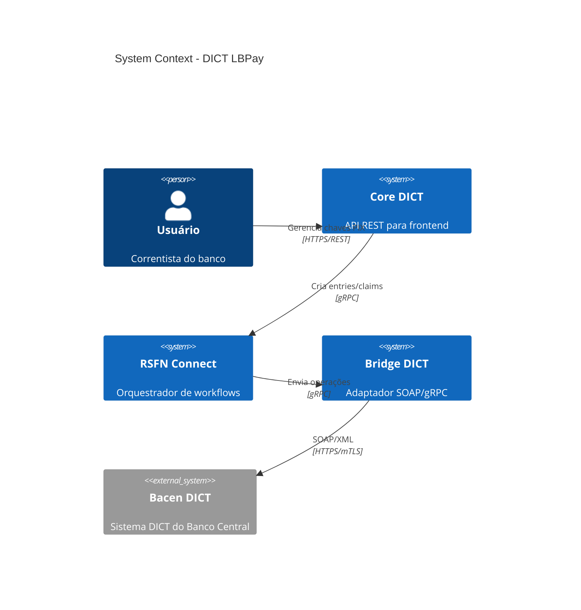
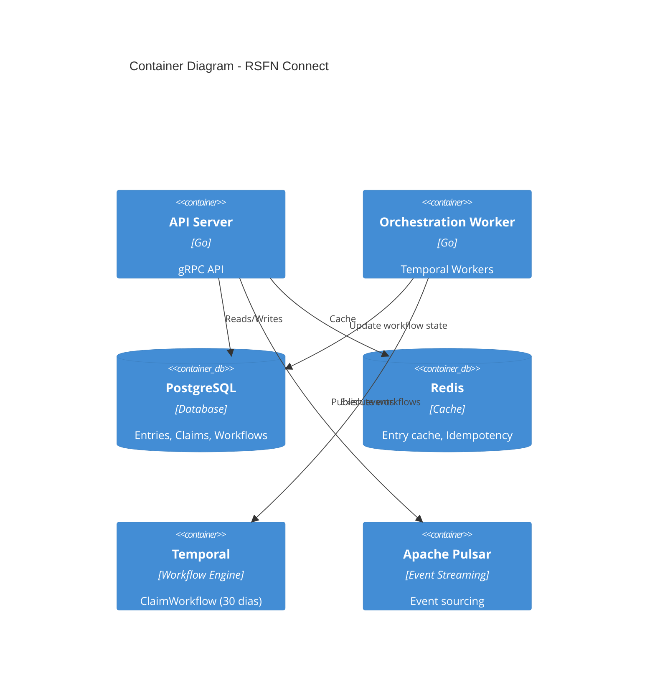

# Diagramas de Arquitetura

**Propósito**: Diagramas visuais da arquitetura do sistema DICT

## 📋 Conteúdo

Esta pasta armazenará:

- **C4 Model Diagrams**: Context, Container, Component, Code
- **Architecture Diagrams**: Visão geral da arquitetura
- **Deployment Diagrams**: Topologia de deployment (Kubernetes, AWS, etc.)
- **Network Diagrams**: Topologia de rede e segurança

## 📁 Estrutura Esperada

```
Diagramas/
├── C4_Model/
│   ├── Level_1_Context.md
│   ├── Level_2_Container.md
│   ├── Level_3_Component_Connect.md
│   ├── Level_3_Component_Bridge.md
│   └── Level_3_Component_Core.md
├── Architecture/
│   ├── High_Level_Architecture.md
│   ├── Clean_Architecture_Layers.md
│   └── Event_Driven_Architecture.md
├── Deployment/
│   ├── Kubernetes_Topology.md
│   ├── AWS_Infrastructure.md
│   └── Network_Security.md
└── IcePanel/
    ├── IcePanel_Export_2025-10-25.json
    └── IcePanel_Diagrams.md
```

## 🎯 C4 Model

### Level 1: System Context



### Level 2: Container Diagram



## 📐 Diagramas Recomendados

### 1. High-Level Architecture
**Ferramenta**: IcePanel, Draw.io, Mermaid
**Objetivo**: Visão geral de todos os componentes

### 2. Clean Architecture (4 Layers)
**Camadas**:
- API Layer (Handlers gRPC/REST)
- Domain Layer (Entities, Use Cases)
- Application Layer (Services, Orchestration)
- Infrastructure Layer (Repository, Bridge clients)

### 3. Event-Driven Architecture
**Componentes**:
- Event Producers (Connect, Bridge)
- Event Bus (Apache Pulsar)
- Event Consumers (Orchestration Worker, Analytics)

### 4. Deployment Topology (Kubernetes)
**Componentes**:
- Namespaces (dict-prod, dict-staging)
- Deployments (Connect, Bridge, Core)
- Services (ClusterIP, LoadBalancer)
- Ingress (NGINX, TLS termination)
- Persistent Volumes (PostgreSQL, Redis)

## 🔐 Network Security Diagram

```
                    Internet
                       |
                   [WAF/CDN]
                       |
                  [Ingress TLS]
                       |
        ┌──────────────┼──────────────┐
        |              |              |
    [Core DICT]   [Connect]      [Bridge]
        |              |              |
        └──────────────┼──────────────┘
                       |
            [Private VPC Subnet]
                       |
        ┌──────────────┼──────────────┐
        |              |              |
    [PostgreSQL]    [Redis]      [Temporal]
                       |
                  [Pulsar]
                       |
            [mTLS to Bacen DICT]
                       |
                  [Bacen DICT]
                  (External)
```

## 📊 IcePanel Integration

**IcePanel** é a fonte única de verdade (source of truth) para arquitetura:

### Nomenclatura Padronizada (IcePanel)

- **Aplicações**: `dict-connect`, `dict-bridge`, `dict-core`
- **Databases**: `postgres-dict`, `redis-dict`
- **Topics Pulsar**: `dict.entries.created`, `dict.claims.created`
- **External Systems**: `bacen-dict-api`

### Export/Sync

1. Manter IcePanel atualizado com mudanças
2. Exportar diagramas para este repo (JSON + PNG)
3. Sincronizar com ADRs (Architecture Decision Records)

## 📚 Referências

- [ArquiteturaDict_LBPAY.md](../ArquiteturaDict_LBPAY.md) - Visão geral da arquitetura
- [ADRs](../ADRs/) - Decisões arquiteturais
- [TEC-001, TEC-002, TEC-003](../../11_Especificacoes_Tecnicas/) - Especificações técnicas
- [IcePanel](https://icepanel.io) - Ferramenta de diagramação

---

**Status**: 🔴 Pasta vazia (será preenchida na Fase 2)
**Fase de Preenchimento**: Fase 2 (detalhamento de arquitetura)
**Responsável**: Head Arquitetura + Tech Lead
**Ferramenta**: IcePanel (source of truth), Mermaid, Draw.io
