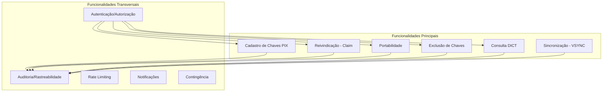
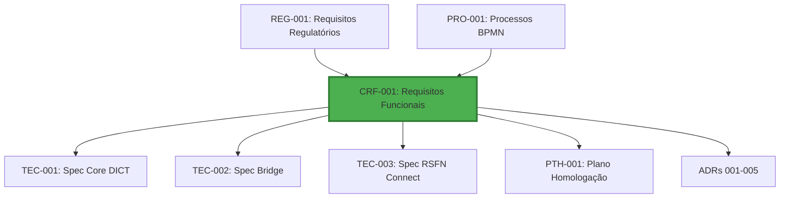

# CRF-001: Requisitos Funcionais DICT

**Projeto**: DICT - Diretório de Identificadores de Contas Transacionais (LBPay)
**Versão**: 1.0
**Data**: 2025-10-24
**Autor**: ARCHITECT (AI Agent - Requirements Analyst)
**Revisor**: [Aguardando]
**Aprovador**: Head de Produto (Luiz Sant'Ana), Head de Arquitetura (Thiago Lima), CTO (José Luís Silva)

---

## Controle de Versão

| Versão | Data | Autor | Descrição das Mudanças |
|--------|------|-------|------------------------|
| 1.0 | 2025-10-24 | ARCHITECT | Versão inicial - Mapeamento completo REG-001 → Requisitos Funcionais |

---

## Sumário Executivo

### Visão Geral

Este documento especifica **TODOS os requisitos funcionais** do sistema DICT da LBPay, derivados dos **requisitos regulatórios** ([REG-001](../03_Regulatorio/REG-001_Requisitos_Regulatorios_Bacen.md)) e **processos de negócio** ([PRO-001](../04_Processos/PRO-001_Processos_BPMN.md)).

### Números Consolidados

| Métrica | Valor |
|---------|-------|
| **Total de Requisitos Funcionais** | 185 |
| **Requisitos Críticos (P0)** | 78 |
| **Requisitos Altos (P1)** | 82 |
| **Requisitos Médios (P2)** | 25 |
| **Categorias Funcionais** | 11 |
| **APIs/Endpoints** | 42 |
| **Eventos de Domínio** | 38 |
| **Temporal Workflows** | 15 |

### Distribuição por Categoria

| Categoria | Qtd Requisitos | % Total | Prioridade Média |
|-----------|----------------|---------|------------------|
| **Cadastro de Chaves** | 32 | 17.3% | P0 |
| **Validações de Chaves** | 25 | 13.5% | P0 |
| **Reivindicação (Claim)** | 18 | 9.7% | P1 |
| **Portabilidade** | 16 | 8.6% | P1 |
| **Exclusão de Chaves** | 14 | 7.6% | P1 |
| **Consulta DICT** | 12 | 6.5% | P0 |
| **Sincronização (VSYNC)** | 10 | 5.4% | P0 |
| **Autenticação/Autorização** | 18 | 9.7% | P0 |
| **Auditoria/Logs** | 15 | 8.1% | P1 |
| **Notificações/Eventos** | 15 | 8.1% | P1 |
| **Rate Limiting/Controle** | 10 | 5.4% | P1 |

---

## Índice

1. [Introdução](#1-introdução)
2. [Requisitos Funcionais de Cadastro](#2-requisitos-funcionais-de-cadastro)
3. [Requisitos Funcionais de Validação](#3-requisitos-funcionais-de-validação)
4. [Requisitos Funcionais de Reivindicação](#4-requisitos-funcionais-de-reivindicação)
5. [Requisitos Funcionais de Portabilidade](#5-requisitos-funcionais-de-portabilidade)
6. [Requisitos Funcionais de Exclusão](#6-requisitos-funcionais-de-exclusão)
7. [Requisitos Funcionais de Consulta](#7-requisitos-funcionais-de-consulta)
8. [Requisitos Funcionais de Sincronização](#8-requisitos-funcionais-de-sincronização)
9. [Requisitos Funcionais de Autenticação](#9-requisitos-funcionais-de-autenticação)
10. [Requisitos Funcionais de Auditoria](#10-requisitos-funcionais-de-auditoria)
11. [Requisitos Funcionais de Notificações](#11-requisitos-funcionais-de-notificações)
12. [Requisitos Funcionais de Controle](#12-requisitos-funcionais-de-controle)
13. [Matriz de Rastreabilidade](#13-matriz-de-rastreabilidade)
14. [Catálogo de APIs](#14-catálogo-de-apis)
15. [Catálogo de Eventos](#15-catálogo-de-eventos)
16. [Catálogo de Workflows](#16-catálogo-de-workflows)

---

## 1. Introdução

### 1.1 Objetivo do Documento

Este documento especifica os requisitos funcionais para:
1. **Transformar requisitos regulatórios em features implementáveis**
2. **Definir contratos de APIs** (gRPC) entre componentes
3. **Especificar eventos de domínio** (Apache Pulsar)
4. **Documentar workflows assíncronos** (Temporal)
5. **Estabelecer rastreabilidade** completa (REG → CRF → TEC → PTH)

### 1.2 Escopo Funcional

**Funcionalidades DICT LBPay**:



### 1.3 Arquitetura de Referência

**Componentes do Sistema DICT**:

| Componente | Tecnologia | Responsabilidade Funcional |
|------------|------------|----------------------------|
| **LB-Connect** | Go, gRPC | BFF, autenticação JWT, rate limiting |
| **Core DICT** | Go, gRPC, PostgreSQL, Redis | Lógica de domínio, persistência, validações |
| **Bridge** | Go, Temporal Workflow | Orquestração assíncrona, retry, compensação |
| **RSFN Connect** | Go, SOAP/XML, mTLS | Comunicação RSFN, parsing XML, circuit breaker |
| **Apache Pulsar** | Pulsar | Pub/Sub de eventos de domínio |

### 1.4 Relacionamento com Outros Artefatos



**Este documento é a BASE para todas as especificações técnicas (TEC-001/002/003).**

---

## 2. Requisitos Funcionais de Cadastro

### 2.1 Visão Geral

**Operações de Cadastro DICT**:
- Cadastro de chave CPF
- Cadastro de chave CNPJ
- Cadastro de chave Email
- Cadastro de chave Telefone
- Cadastro de chave EVP (Aleatória)

### CRF-001: Cadastrar Chave PIX tipo CPF

**Prioridade**: ⚠️ P0-Crítico
**Categoria**: Cadastro
**Requisito Base**: [REG-021](../03_Regulatorio/REG-001_Requisitos_Regulatorios_Bacen.md#reg-021), [REG-026](../03_Regulatorio/REG-001_Requisitos_Regulatorios_Bacen.md#reg-026)
**Processo BPMN**: [PRO-001](../04_Processos/PRO-001_Processos_BPMN.md#pro-001)

**Descrição**:
O sistema DEVE permitir o cadastro de chave PIX do tipo CPF, validando titularidade, unicidade, e enviando requisição ao DICT Bacen via RSFN.

**Atores**:
- **Primário**: Usuário final (pessoa física)
- **Secundário**: Sistema Core DICT, Bridge, RSFN Connect, Bacen DICT

**Pré-condições**:
- ✅ Usuário autenticado no LB-Connect (JWT válido)
- ✅ Usuário possui conta ativa na LBPay
- ✅ CPF do usuário validado e verificado (KYC completo)
- ✅ Sistema DICT operacional (health check OK)

**Fluxo Principal**:

1. **Usuário solicita cadastro** via LB-Connect (gRPC: `RegisterKey`)
2. **LB-Connect valida JWT** e extrai `user_id`, `account_id`
3. **LB-Connect aplica rate limiting** por ISPB e por usuário
4. **LB-Connect encaminha para Core DICT** (gRPC: `dict.v1.DictService/RegisterKey`)
5. **Core DICT valida regras de negócio**:
   - CPF pertence ao titular da conta?
   - CPF já cadastrado no DICT (outro PSP)?
   - Limites de chaves por CPF (5 chaves) respeitados?
6. **Core DICT cria entrada** em PostgreSQL com status `PENDING`
7. **Core DICT publica evento** `KeyRegisterRequested` no Pulsar (topic: `dict_domain_events`)
8. **Bridge consome evento** e inicia Temporal Workflow `RegisterKeyWorkflow`
9. **Bridge orquestra envio ao Bacen**:
   - Activity: `SendCreateEntryToRSFN`
   - RSFN Connect envia `CreateEntry` SOAP ao Bacen
   - Aguarda resposta assíncrona (callback ou polling)
10. **Bridge recebe confirmação Bacen**:
    - Se **sucesso**: Atualiza status para `ACTIVE`, publica `KeyRegistered`
    - Se **falha**: Atualiza status para `FAILED`, publica `KeyRegistrationFailed`
11. **Core DICT atualiza PostgreSQL** com status final
12. **Core DICT retorna resposta** ao LB-Connect
13. **LB-Connect retorna ao usuário** (success/error)

**Pós-condições**:
- ✅ Chave PIX cadastrada no DICT Bacen (status `ACTIVE`)
- ✅ Entrada persistida no PostgreSQL local
- ✅ Evento de domínio publicado no Pulsar
- ✅ Auditoria registrada (log + tabela audit)
- ✅ Métrica publicada (Prometheus: `dict_key_register_total`)

**Regras de Negócio**:

| ID | Regra | Fonte |
|----|-------|-------|
| **RN-001** | CPF deve pertencer ao titular da conta | REG-026 |
| **RN-002** | CPF deve estar em formato válido (11 dígitos, DV correto) | REG-027 |
| **RN-003** | Máximo de 5 chaves PIX por CPF (todas instituições) | REG-028 |
| **RN-004** | CPF não pode estar em claim ou portability em andamento | REG-051 |
| **RN-005** | Conta deve estar ativa (não bloqueada, não encerrada) | REG-030 |
| **RN-006** | KYC do cliente deve estar completo (nível GOLD mínimo) | REG-031 |

**Validações Obrigatórias**:

```go
// Pseudocódigo - Validações
func ValidateRegisterCPFKey(req RegisterKeyRequest) error {
    // 1. Validar formato CPF
    if !IsValidCPFFormat(req.KeyValue) {
        return ErrInvalidCPFFormat
    }

    // 2. Validar titularidade
    account := GetAccount(req.AccountID)
    if account.OwnerCPF != req.KeyValue {
        return ErrCPFNotAccountOwner
    }

    // 3. Validar KYC
    if account.KYCLevel < KYCLevelGold {
        return ErrInsufficientKYC
    }

    // 4. Validar conta ativa
    if account.Status != AccountStatusActive {
        return ErrAccountNotActive
    }

    // 5. Validar unicidade local (PostgreSQL)
    existingKey := GetKeyByValue(req.KeyValue)
    if existingKey != nil && existingKey.Status == StatusActive {
        return ErrKeyAlreadyRegisteredLocally
    }

    // 6. Validar limites (cache Redis)
    keyCount := GetKeyCountByCPF(req.KeyValue)
    if keyCount >= 5 {
        return ErrCPFKeyLimitExceeded
    }

    return nil
}
```

**Mensagens RSFN**:

**Request (CreateEntry)**:
```xml
<soapenv:Envelope xmlns:soapenv="http://schemas.xmlsoap.org/soap/envelope/"
                  xmlns:dict="http://www.bcb.gov.br/dict">
   <soapenv:Header/>
   <soapenv:Body>
      <dict:CreateEntryRequest>
         <dict:ISPB>99999999</dict:ISPB>
         <dict:Entry>
            <dict:Key>12345678901</dict:Key>
            <dict:KeyType>CPF</dict:KeyType>
            <dict:Account>
               <dict:Participant>99999999</dict:Participant>
               <dict:Branch>0001</dict:Branch>
               <dict:AccountNumber>1234567</dict:AccountNumber>
               <dict:AccountType>CACC</dict:AccountType>
            </dict:Account>
            <dict:Owner>
               <dict:Type>NATURAL_PERSON</dict:Type>
               <dict:TaxIdNumber>12345678901</dict:TaxIdNumber>
               <dict:Name>José da Silva</dict:Name>
            </dict:Owner>
         </dict:Entry>
      </dict:CreateEntryRequest>
   </soapenv:Body>
</soapenv:Envelope>
```

**Response (CreateEntryResponse)**:
```xml
<soapenv:Envelope xmlns:soapenv="http://schemas.xmlsoap.org/soap/envelope/"
                  xmlns:dict="http://www.bcb.gov.br/dict">
   <soapenv:Header/>
   <soapenv:Body>
      <dict:CreateEntryResponse>
         <dict:EntryId>abc123def456</dict:EntryId>
         <dict:Status>ACTIVE</dict:Status>
         <dict:CreationDate>2025-10-24T10:30:00Z</dict:CreationDate>
      </dict:CreateEntryResponse>
   </soapenv:Body>
</soapenv:Envelope>
```

**Eventos de Domínio (Pulsar)**:

| Evento | Topic | Schema | Descrição |
|--------|-------|--------|-----------|
| `KeyRegisterRequested` | `dict_domain_events` | Avro | Solicitação de cadastro recebida pelo Core DICT |
| `KeyRegistered` | `dict_domain_events` | Avro | Chave cadastrada com sucesso no Bacen |
| `KeyRegistrationFailed` | `dict_domain_events` | Avro | Falha no cadastro (validação ou erro Bacen) |

**Exemplo de Evento `KeyRegisterRequested`**:
```json
{
  "event_id": "evt_123abc",
  "event_type": "KeyRegisterRequested",
  "timestamp": "2025-10-24T10:30:00Z",
  "aggregate_id": "key_456def",
  "aggregate_type": "DictKey",
  "version": 1,
  "payload": {
    "key_id": "key_456def",
    "key_type": "CPF",
    "key_value": "12345678901",
    "account_id": "acc_789ghi",
    "ispb": "99999999",
    "branch": "0001",
    "account_number": "1234567",
    "account_type": "CACC",
    "owner_name": "José da Silva",
    "owner_tax_id": "12345678901",
    "requested_by": "user_999jkl",
    "request_ip": "192.168.1.100"
  },
  "metadata": {
    "correlation_id": "req_001mno",
    "causation_id": "cmd_002pqr",
    "user_id": "user_999jkl"
  }
}
```

**Temporal Workflow**:

| Workflow | Descrição | Activities | Retry Policy |
|----------|-----------|------------|--------------|
| `RegisterKeyWorkflow` | Orquestra cadastro de chave no Bacen | `ValidateKey`, `SendCreateEntryToRSFN`, `WaitForConfirmation`, `UpdateLocalStatus`, `PublishEvent` | Max 3 tentativas, backoff exponencial |

**Workflow Pseudocódigo**:
```go
func RegisterKeyWorkflow(ctx workflow.Context, req RegisterKeyRequest) error {
    // Activity 1: Validar chave localmente (redundante, mas garante consistência)
    err := workflow.ExecuteActivity(ctx, ValidateKeyActivity, req).Get(ctx, nil)
    if err != nil {
        return err
    }

    // Activity 2: Enviar CreateEntry ao RSFN
    var entryID string
    err = workflow.ExecuteActivity(ctx, SendCreateEntryActivity, req).Get(ctx, &entryID)
    if err != nil {
        // Publicar evento de falha
        workflow.ExecuteActivity(ctx, PublishEventActivity, KeyRegistrationFailedEvent{...})
        return err
    }

    // Activity 3: Aguardar confirmação Bacen (polling ou callback)
    var confirmation CreateEntryConfirmation
    err = workflow.ExecuteActivity(ctx, WaitForConfirmationActivity, entryID).Get(ctx, &confirmation)
    if err != nil {
        // Timeout ou erro Bacen
        workflow.ExecuteActivity(ctx, PublishEventActivity, KeyRegistrationFailedEvent{...})
        return err
    }

    // Activity 4: Atualizar status local (PostgreSQL)
    err = workflow.ExecuteActivity(ctx, UpdateKeyStatusActivity, entryID, StatusActive).Get(ctx, nil)
    if err != nil {
        // Inconsistência crítica - alertar ops
        workflow.ExecuteActivity(ctx, SendAlertActivity, "Key registered in Bacen but failed to update local DB")
        return err
    }

    // Activity 5: Publicar evento de sucesso
    workflow.ExecuteActivity(ctx, PublishEventActivity, KeyRegisteredEvent{...})

    return nil
}
```

**Tratamento de Erros**:

| Código Erro | Descrição | Ação | Retry? |
|-------------|-----------|------|--------|
| `ERR_INVALID_CPF_FORMAT` | CPF inválido (formato ou DV) | Retornar erro 400 ao usuário | Não |
| `ERR_CPF_NOT_OWNER` | CPF não pertence ao titular | Retornar erro 403 ao usuário | Não |
| `ERR_KEY_ALREADY_EXISTS` | Chave já cadastrada (Bacen) | Retornar erro 409 ao usuário | Não |
| `ERR_CPF_LIMIT_EXCEEDED` | Limite de 5 chaves excedido | Retornar erro 429 ao usuário | Não |
| `ERR_RSFN_TIMEOUT` | Timeout na comunicação RSFN | Retry (max 3x), exponential backoff | Sim |
| `ERR_BACEN_UNAVAILABLE` | DICT Bacen indisponível | Retry (max 3x), circuit breaker | Sim |
| `ERR_DB_WRITE_FAILED` | Falha ao persistir no PostgreSQL | Retry (max 3x), alertar ops | Sim |

**Métricas e SLA**:

| Métrica | Target | Medição |
|---------|--------|---------|
| **Latência P95** | ≤ 500ms | `dict_key_register_latency_ms` (histogram) |
| **Taxa de Sucesso** | ≥ 99.9% | `dict_key_register_success_rate` (counter) |
| **Taxa de Erro** | ≤ 0.1% | `dict_key_register_error_rate` (counter por tipo) |

**Rastreabilidade**:

| Tipo | ID | Descrição |
|------|----|-----------|
| **Requisito Regulatório** | REG-021, REG-026, REG-027, REG-028 | Base regulatória |
| **Processo BPMN** | PRO-001 | Fluxo de negócio |
| **NFR** | NFR-001, NFR-010, NFR-020, NFR-040 | Latência, disponibilidade, auditoria |
| **Caso de Teste** | PTH-001, PTH-002, PTH-003 | Testes de homologação |
| **Checklist Compliance** | CCM-121 a CCM-140 | Verificação de conformidade |

**APIs Relacionadas**:

| Componente | API | Método | Descrição |
|------------|-----|--------|-----------|
| **LB-Connect → Core DICT** | `dict.v1.DictService` | `RegisterKey` | Solicitar cadastro de chave |
| **Core DICT → Bridge** | Pulsar event | `KeyRegisterRequested` | Evento de domínio |
| **Bridge → RSFN Connect** | `rsfn.v1.RSFNService` | `SendCreateEntry` | Enviar SOAP ao Bacen |

---

### CRF-002: Cadastrar Chave PIX tipo CNPJ

**Prioridade**: ⚠️ P0-Crítico
**Categoria**: Cadastro
**Requisito Base**: [REG-022](../03_Regulatorio/REG-001_Requisitos_Regulatorios_Bacen.md#reg-022)
**Processo BPMN**: [PRO-002](../04_Processos/PRO-001_Processos_BPMN.md#pro-002)

**Descrição**:
O sistema DEVE permitir o cadastro de chave PIX do tipo CNPJ, validando titularidade e unicidade (1 chave CNPJ por empresa).

**Diferenças em relação a CRF-001 (CPF)**:
- **Limite**: 1 chave CNPJ por empresa (não 5)
- **Validação KYC**: Nível BUSINESS (não GOLD)
- **Titularidade**: CNPJ deve pertencer à razão social da conta PJ
- **Validação Receita Federal**: Consulta a situação cadastral via API RFB (IN RFB 2.119/2022)

**Regras de Negócio Específicas**:

| ID | Regra | Fonte |
|----|-------|-------|
| **RN-010** | CNPJ deve estar ativo na Receita Federal | REG-036 |
| **RN-011** | Máximo de 1 chave CNPJ por empresa | REG-037 |
| **RN-012** | CNPJ deve pertencer à razão social da conta PJ | REG-038 |
| **RN-013** | Representante legal deve estar autorizado | REG-039 |

**Validações Adicionais**:
```go
func ValidateRegisterCNPJKey(req RegisterKeyRequest) error {
    // Validações comuns (herdadas de CRF-001)
    // ...

    // Validações específicas CNPJ

    // 1. Consultar situação cadastral Receita Federal
    rfbStatus := ConsultCNPJStatus(req.KeyValue)
    if rfbStatus.Status != "ATIVA" {
        return ErrCNPJNotActive
    }

    // 2. Validar limite (1 chave por CNPJ)
    keyCount := GetKeyCountByCNPJ(req.KeyValue)
    if keyCount >= 1 {
        return ErrCNPJKeyLimitExceeded
    }

    // 3. Validar representante legal
    account := GetAccount(req.AccountID)
    if !IsAuthorizedRepresentative(req.RequestedBy, account) {
        return ErrUnauthorizedRepresentative
    }

    return nil
}
```

**Rastreabilidade**:

| Tipo | ID | Descrição |
|------|----|-----------|
| **Requisito Regulatório** | REG-022, REG-036, REG-037, REG-038, REG-039 | Base regulatória |
| **Processo BPMN** | PRO-002 | Fluxo de negócio |
| **NFR** | NFR-001, NFR-010, NFR-020 | Latência, disponibilidade |
| **Caso de Teste** | PTH-011, PTH-012, PTH-013 | Testes de homologação |

---

### CRF-003: Cadastrar Chave PIX tipo Email

**Prioridade**: ⚠️ P0-Crítico
**Categoria**: Cadastro
**Requisito Base**: [REG-023](../03_Regulatorio/REG-001_Requisitos_Regulatorios_Bacen.md#reg-023)
**Processo BPMN**: [PRO-003](../04_Processos/PRO-001_Processos_BPMN.md#pro-003)

**Descrição**:
O sistema DEVE permitir o cadastro de chave PIX do tipo Email, validando formato, propriedade (OTP), e unicidade.

**Fluxo Específico Email**:
1. Usuário informa email
2. Sistema valida formato (RFC 5322)
3. Sistema envia OTP (6 dígitos) para o email
4. Usuário confirma OTP em até 10 minutos
5. Sistema prossegue com cadastro no DICT

**Regras de Negócio Específicas**:

| ID | Regra | Fonte |
|----|-------|-------|
| **RN-020** | Email deve estar em formato válido (RFC 5322) | REG-040 |
| **RN-021** | Email deve ser confirmado via OTP em até 10 minutos | REG-041 |
| **RN-022** | Máximo de 20 chaves Email por CPF/CNPJ | REG-042 |
| **RN-023** | Email deve ser único no DICT (1 PSP por email) | REG-043 |

**Validações OTP**:
```go
func ValidateEmailOTP(email string, otp string) error {
    // 1. Buscar OTP armazenado (Redis - TTL 10 min)
    storedOTP := GetOTPFromCache(email)
    if storedOTP == "" {
        return ErrOTPExpired
    }

    // 2. Comparar OTP
    if storedOTP != otp {
        return ErrOTPMismatch
    }

    // 3. Invalidar OTP (one-time use)
    DeleteOTPFromCache(email)

    return nil
}
```

**Rastreabilidade**:

| Tipo | ID | Descrição |
|------|----|-----------|
| **Requisito Regulatório** | REG-023, REG-040, REG-041, REG-042, REG-043 | Base regulatória |
| **Processo BPMN** | PRO-003 | Fluxo de negócio |
| **NFR** | NFR-001, NFR-025 (OTP delivery) | Latência, confiabilidade |
| **Caso de Teste** | PTH-021, PTH-022, PTH-023 | Testes de homologação |

---

### CRF-004: Cadastrar Chave PIX tipo Telefone

**Prioridade**: ⚠️ P0-Crítico
**Categoria**: Cadastro
**Requisito Base**: [REG-024](../03_Regulatorio/REG-001_Requisitos_Regulatorios_Bacen.md#reg-024)
**Processo BPMN**: [PRO-004](../04_Processos/PRO-001_Processos_BPMN.md#pro-004)

**Descrição**:
O sistema DEVE permitir o cadastro de chave PIX do tipo Telefone (formato E.164: +5511999998888), validando propriedade (SMS OTP) e unicidade.

**Formato Telefone**:
- **Padrão E.164**: `+[código país][código área][número]`
- **Exemplo BR**: `+5511999998888` (11 = SP, 999998888 = celular)
- **Validação**: Regex `^\+55[1-9]{2}9?[0-9]{8}$`

**Regras de Negócio Específicas**:

| ID | Regra | Fonte |
|----|-------|-------|
| **RN-030** | Telefone deve estar em formato E.164 | REG-044 |
| **RN-031** | Telefone deve ser confirmado via SMS OTP em até 5 minutos | REG-045 |
| **RN-032** | Máximo de 20 chaves Telefone por CPF/CNPJ | REG-046 |
| **RN-033** | Apenas telefones celulares brasileiros (+55) | REG-047 |

**Validações SMS OTP** (similar ao Email):
```go
func ValidatePhoneOTP(phone string, otp string) error {
    // Implementação similar a ValidateEmailOTP
    // Diferenças:
    // - TTL: 5 minutos (não 10)
    // - Rate limit: máx 3 SMS por hora por número
    // - Anti-fraude: bloquear números suspeitos

    return nil
}
```

**Rastreabilidade**:

| Tipo | ID | Descrição |
|------|----|-----------|
| **Requisito Regulatório** | REG-024, REG-044, REG-045, REG-046, REG-047 | Base regulatória |
| **Processo BPMN** | PRO-004 | Fluxo de negócio |
| **NFR** | NFR-001, NFR-026 (SMS delivery) | Latência, confiabilidade |
| **Caso de Teste** | PTH-031, PTH-032, PTH-033 | Testes de homologação |

---

### CRF-005: Cadastrar Chave PIX tipo EVP (Aleatória)

**Prioridade**: ⚠️ P0-Crítico
**Categoria**: Cadastro
**Requisito Base**: [REG-025](../03_Regulatorio/REG-001_Requisitos_Regulatorios_Bacen.md#reg-025)
**Processo BPMN**: [PRO-005](../04_Processos/PRO-001_Processos_BPMN.md#pro-005)

**Descrição**:
O sistema DEVE permitir o cadastro de chave PIX tipo EVP (Endereço Virtual de Pagamento), gerando UUID v4 aleatório.

**Formato EVP**:
- **Padrão**: UUID v4 (RFC 4122)
- **Exemplo**: `123e4567-e89b-12d3-a456-426614174000`
- **Geração**: `crypto/rand` (não `math/rand`)

**Regras de Negócio Específicas**:

| ID | Regra | Fonte |
|----|-------|-------|
| **RN-040** | EVP deve ser UUID v4 válido | REG-048 |
| **RN-041** | EVP deve ser gerado pelo sistema (não informado pelo usuário) | REG-049 |
| **RN-042** | Máximo de 20 chaves EVP por CPF/CNPJ | REG-050 |
| **RN-043** | EVP deve ser único globalmente (colisão ~0%) | REG-051 |

**Geração EVP**:
```go
import (
    "crypto/rand"
    "github.com/google/uuid"
)

func GenerateEVP() (string, error) {
    // Usar crypto/rand para segurança criptográfica
    evp, err := uuid.NewRandomFromReader(rand.Reader)
    if err != nil {
        return "", err
    }

    return evp.String(), nil
}
```

**Diferenças em relação a outras chaves**:
- ❌ **NÃO requer validação de titularidade** (não tem OTP)
- ✅ **Cadastro instantâneo** (sem passo adicional)
- ✅ **Maior privacidade** (não expõe CPF/email/telefone)

**Rastreabilidade**:

| Tipo | ID | Descrição |
|------|----|-----------|
| **Requisito Regulatório** | REG-025, REG-048, REG-049, REG-050, REG-051 | Base regulatória |
| **Processo BPMN** | PRO-005 | Fluxo de negócio |
| **NFR** | NFR-001, NFR-045 (uniqueness) | Latência, unicidade |
| **Caso de Teste** | PTH-041, PTH-042, PTH-043 | Testes de homologação |

---

## 3. Requisitos Funcionais de Validação

### 3.1 Visão Geral

**Validações Obrigatórias DICT**:
- Validação de formato de chaves
- Validação de titularidade
- Validação de limites (por tipo de chave)
- Validação de status da conta
- Validação de KYC
- Validação de unicidade (local e Bacen)

### CRF-010: Validar Formato de Chave PIX

**Prioridade**: ⚠️ P0-Crítico
**Categoria**: Validação
**Requisito Base**: [REG-027](../03_Regulatorio/REG-001_Requisitos_Regulatorios_Bacen.md#reg-027)

**Descrição**:
O sistema DEVE validar o formato de cada tipo de chave PIX conforme especificação Bacen.

**Regras de Validação por Tipo**:

| Tipo Chave | Formato | Regex | Exemplo Válido |
|------------|---------|-------|----------------|
| **CPF** | 11 dígitos numéricos, DV válido | `^\d{11}$` | `12345678901` |
| **CNPJ** | 14 dígitos numéricos, DV válido | `^\d{14}$` | `12345678000190` |
| **Email** | RFC 5322 | `^[a-zA-Z0-9._%+-]+@[a-zA-Z0-9.-]+\.[a-zA-Z]{2,}$` | `user@example.com` |
| **Telefone** | E.164 (+55...) | `^\+55[1-9]{2}9?[0-9]{8}$` | `+5511999998888` |
| **EVP** | UUID v4 | `^[0-9a-f]{8}-[0-9a-f]{4}-4[0-9a-f]{3}-[89ab][0-9a-f]{3}-[0-9a-f]{12}$` | `123e4567-e89b-12d3-a456-426614174000` |

**Implementação**:
```go
func ValidateKeyFormat(keyType KeyType, keyValue string) error {
    switch keyType {
    case KeyTypeCPF:
        return ValidateCPFFormat(keyValue)
    case KeyTypeCNPJ:
        return ValidateCNPJFormat(keyValue)
    case KeyTypeEmail:
        return ValidateEmailFormat(keyValue)
    case KeyTypePhone:
        return ValidatePhoneFormat(keyValue)
    case KeyTypeEVP:
        return ValidateEVPFormat(keyValue)
    default:
        return ErrInvalidKeyType
    }
}

func ValidateCPFFormat(cpf string) error {
    // 1. Validar comprimento
    if len(cpf) != 11 {
        return ErrInvalidCPFLength
    }

    // 2. Validar caracteres numéricos
    if !regexp.MustCompile(`^\d{11}$`).MatchString(cpf) {
        return ErrInvalidCPFCharacters
    }

    // 3. Validar dígitos verificadores (algoritmo Bacen)
    if !ValidateCPFCheckDigits(cpf) {
        return ErrInvalidCPFCheckDigits
    }

    // 4. Rejeitar CPFs conhecidos inválidos (000.000.000-00, 111.111.111-11, etc.)
    if IsKnownInvalidCPF(cpf) {
        return ErrKnownInvalidCPF
    }

    return nil
}
```

**Rastreabilidade**:

| Tipo | ID | Descrição |
|------|----|-----------|
| **Requisito Regulatório** | REG-027, REG-040, REG-044, REG-048 | Formatos obrigatórios |
| **NFR** | NFR-015 | Validação robusta |
| **Caso de Teste** | PTH-051 a PTH-070 | Testes de validação |

---

### CRF-011: Validar Titularidade de Chave PIX

**Prioridade**: ⚠️ P0-Crítico
**Categoria**: Validação
**Requisito Base**: [REG-026](../03_Regulatorio/REG-001_Requisitos_Regulatorios_Bacen.md#reg-026)

**Descrição**:
O sistema DEVE validar que a chave PIX pertence ao titular da conta.

**Validações de Titularidade por Tipo**:

| Tipo Chave | Validação | Método |
|------------|-----------|--------|
| **CPF** | CPF deve ser o mesmo do KYC do titular | Comparação direta com `accounts.owner_cpf` |
| **CNPJ** | CNPJ deve ser o mesmo da razão social da conta PJ | Comparação direta com `accounts.owner_cnpj` |
| **Email** | Email deve ser confirmado via OTP | OTP enviado para o email + confirmação |
| **Telefone** | Telefone deve ser confirmado via SMS OTP | SMS OTP enviado + confirmação |
| **EVP** | Não requer validação de titularidade | N/A (gerado aleatoriamente) |

**Implementação**:
```go
func ValidateKeyOwnership(keyType KeyType, keyValue string, accountID string) error {
    account := GetAccount(accountID)

    switch keyType {
    case KeyTypeCPF:
        if account.OwnerCPF != keyValue {
            return ErrCPFNotAccountOwner
        }
    case KeyTypeCNPJ:
        if account.OwnerCNPJ != keyValue {
            return ErrCNPJNotAccountOwner
        }
    case KeyTypeEmail:
        // Email ownership validated via OTP (separate flow)
        if !IsEmailVerified(keyValue, accountID) {
            return ErrEmailNotVerified
        }
    case KeyTypePhone:
        // Phone ownership validated via SMS OTP (separate flow)
        if !IsPhoneVerified(keyValue, accountID) {
            return ErrPhoneNotVerified
        }
    case KeyTypeEVP:
        // EVP does not require ownership validation
        return nil
    default:
        return ErrInvalidKeyType
    }

    return nil
}
```

**Rastreabilidade**:

| Tipo | ID | Descrição |
|------|----|-----------|
| **Requisito Regulatório** | REG-026, REG-041, REG-045 | Titularidade obrigatória |
| **NFR** | NFR-020 | Segurança |
| **Caso de Teste** | PTH-071 a PTH-090 | Testes de titularidade |

---

### CRF-012: Validar Limites de Chaves por Tipo

**Prioridade**: ⚠️ P0-Crítico
**Categoria**: Validação
**Requisito Base**: [REG-028](../03_Regulatorio/REG-001_Requisitos_Regulatorios_Bacen.md#reg-028)

**Descrição**:
O sistema DEVE validar limites de chaves PIX por CPF/CNPJ conforme regulamentação Bacen.

**Limites Regulatórios**:

| Tipo Chave | Limite por CPF | Limite por CNPJ | Fonte |
|------------|----------------|-----------------|-------|
| **CPF** | 5 chaves | N/A | REG-028 |
| **CNPJ** | N/A | 1 chave | REG-037 |
| **Email** | 20 chaves | 20 chaves | REG-042 |
| **Telefone** | 20 chaves | 20 chaves | REG-046 |
| **EVP** | 20 chaves | 20 chaves | REG-050 |

**Implementação**:
```go
func ValidateKeyLimits(keyType KeyType, ownerTaxID string) error {
    // Buscar quantidade de chaves existentes (cache Redis + fallback PostgreSQL)
    keyCount := GetKeyCountByOwnerAndType(ownerTaxID, keyType)

    switch keyType {
    case KeyTypeCPF:
        if keyCount >= 5 {
            return ErrCPFKeyLimitExceeded
        }
    case KeyTypeCNPJ:
        if keyCount >= 1 {
            return ErrCNPJKeyLimitExceeded
        }
    case KeyTypeEmail, KeyTypePhone, KeyTypeEVP:
        if keyCount >= 20 {
            return ErrKeyLimitExceeded
        }
    default:
        return ErrInvalidKeyType
    }

    return nil
}
```

**Cache Strategy (Redis)**:
```go
// Cache key pattern: "key_count:{owner_tax_id}:{key_type}"
// TTL: 5 minutes
// Invalidação: Ao criar/excluir chave

func GetKeyCountByOwnerAndType(ownerTaxID string, keyType KeyType) int {
    cacheKey := fmt.Sprintf("key_count:%s:%s", ownerTaxID, keyType)

    // Try cache first
    if count, ok := redisClient.Get(cacheKey); ok {
        return count
    }

    // Fallback to database
    count := dbClient.CountKeys(ownerTaxID, keyType)

    // Update cache
    redisClient.Set(cacheKey, count, 5*time.Minute)

    return count
}
```

**Rastreabilidade**:

| Tipo | ID | Descrição |
|------|----|-----------|
| **Requisito Regulatório** | REG-028, REG-037, REG-042, REG-046, REG-050 | Limites obrigatórios |
| **NFR** | NFR-005 (cache performance) | Performance |
| **Caso de Teste** | PTH-091 a PTH-110 | Testes de limites |

---

## 4. Requisitos Funcionais de Reivindicação

### 4.1 Visão Geral

**Reivindicação (Claim)**: Processo regulatório que permite a um PSP reivindicar a posse de uma chave PIX registrada em outro PSP.

**Fluxo Simplificado**:
1. PSP B (claimer) solicita claim de chave registrada no PSP A (claimed)
2. PSP A é notificado e tem 7 dias corridos para aceitar ou recusar
3. Se PSP A não responder em 7 dias, claim é aceita automaticamente
4. Se claim aceita, chave é transferida para PSP B

### CRF-020: Solicitar Reivindicação (Claim) de Chave PIX

**Prioridade**: 🟡 P1-Alto
**Categoria**: Reivindicação
**Requisito Base**: [REG-060](../03_Regulatorio/REG-001_Requisitos_Regulatorios_Bacen.md#reg-060)
**Processo BPMN**: [PRO-006](../04_Processos/PRO-001_Processos_BPMN.md#pro-006)

**Descrição**:
O sistema DEVE permitir que um usuário da LBPay reivindique uma chave PIX registrada em outro PSP.

**Pré-condições**:
- ✅ Chave PIX já cadastrada em outro PSP
- ✅ Usuário possui conta ativa na LBPay
- ✅ Usuário é o titular da chave (CPF/CNPJ/Email/Telefone confirmado)
- ✅ Chave não está em claim ou portability ativa

**Fluxo Principal**:

1. Usuário solicita claim de chave via LB-Connect
2. Core DICT valida:
   - Chave existe no DICT (consulta Bacen)
   - Chave não está na LBPay (não pode claim própria chave)
   - Chave não está em claim/portability ativa
   - Titularidade (CPF/CNPJ do usuário corresponde à chave)
3. Core DICT cria entrada `claims` com status `PENDING`
4. Core DICT publica evento `ClaimRequested` no Pulsar
5. Bridge consome evento e inicia workflow `ClaimWorkflow`
6. Bridge envia `CreateClaim` SOAP ao Bacen via RSFN Connect
7. Bacen notifica PSP claimed (PSP A) da reivindicação
8. Core DICT aguarda resposta do PSP A (7 dias corridos)
9. Se **PSP A aceita**: Bridge processa `ClaimConfirmed`, atualiza status para `CONFIRMED`
10. Se **PSP A recusa**: Bridge processa `ClaimCancelled`, atualiza status para `CANCELLED`
11. Se **PSP A não responde em 7 dias**: Bridge processa timeout, auto-confirma claim
12. Core DICT publica evento final (`ClaimConfirmed` ou `ClaimCancelled`)

**Regras de Negócio**:

| ID | Regra | Fonte |
|----|-------|-------|
| **RN-060** | Usuário deve ser titular da chave (validação Bacen) | REG-060 |
| **RN-061** | Prazo de resposta do PSP claimed: 7 dias corridos | REG-061 |
| **RN-062** | Após 7 dias sem resposta, claim é confirmada automaticamente | REG-062 |
| **RN-063** | Chave não pode estar em outro claim/portability ativo | REG-063 |
| **RN-064** | LBPay deve notificar usuário em até 1 minuto após receber claim de outro PSP | REG-064 (SLA crítico) |

**Temporal Workflow**:

```go
func ClaimWorkflow(ctx workflow.Context, req ClaimRequest) error {
    // Activity 1: Validar claim localmente
    err := workflow.ExecuteActivity(ctx, ValidateClaimActivity, req).Get(ctx, nil)
    if err != nil {
        return err
    }

    // Activity 2: Enviar CreateClaim ao RSFN
    var claimID string
    err = workflow.ExecuteActivity(ctx, SendCreateClaimActivity, req).Get(ctx, &claimID)
    if err != nil {
        workflow.ExecuteActivity(ctx, PublishEventActivity, ClaimFailedEvent{...})
        return err
    }

    // Activity 3: Aguardar resposta por 7 dias (timer Temporal)
    timer := workflow.NewTimer(ctx, 7*24*time.Hour)

    // Selector: aguarda resposta OU timeout
    selector := workflow.NewSelector(ctx)

    var response ClaimResponse
    responseChan := workflow.GetSignalChannel(ctx, "claim_response")

    selector.AddReceive(responseChan, func(c workflow.ReceiveChannel, more bool) {
        c.Receive(ctx, &response)
    })

    selector.AddFuture(timer, func(f workflow.Future) {
        // Timeout: confirmar automaticamente
        response = ClaimResponse{Status: "AUTO_CONFIRMED"}
    })

    selector.Select(ctx)

    // Activity 4: Processar resposta
    if response.Status == "CONFIRMED" || response.Status == "AUTO_CONFIRMED" {
        // Atualizar status local
        workflow.ExecuteActivity(ctx, UpdateClaimStatusActivity, claimID, StatusConfirmed)
        workflow.ExecuteActivity(ctx, PublishEventActivity, ClaimConfirmedEvent{...})
    } else {
        // Claim cancelada
        workflow.ExecuteActivity(ctx, UpdateClaimStatusActivity, claimID, StatusCancelled)
        workflow.ExecuteActivity(ctx, PublishEventActivity, ClaimCancelledEvent{...})
    }

    return nil
}
```

**SLA Crítico - Notificação em < 1 minuto**:

Quando a LBPay **recebe** um claim de outro PSP (somos o PSP claimed):

```go
// CRITICAL: This must complete in < 1 minute (Bacen SLA)
func HandleIncomingClaim(claimData RSFNClaimNotification) error {
    start := time.Now()

    // 1. Validar claim (< 5 segundos)
    key := GetKeyByValue(claimData.KeyValue)
    if key == nil {
        return ErrKeyNotFound
    }

    // 2. Criar entrada claims (< 5 segundos)
    claim := CreateClaim(claimData)

    // 3. Publicar evento (< 5 segundos)
    PublishEvent(ClaimReceivedEvent{ClaimID: claim.ID})

    // 4. Notificar usuário (< 45 segundos)
    // 4.1. Push notification (Firebase/APNS)
    SendPushNotification(key.OwnerID, "Sua chave PIX está sendo reivindicada")

    // 4.2. Email (assíncrono, mas iniciar em < 1 min)
    SendEmailNotification(key.OwnerEmail, "Claim recebida")

    // 4.3. SMS (assíncrono)
    SendSMSNotification(key.OwnerPhone, "Claim recebida")

    elapsed := time.Since(start)
    if elapsed > 60*time.Second {
        // CRITICAL: Alert ops - SLA breach
        AlertOps("Claim notification exceeded 1 minute SLA", map[string]interface{}{
            "claim_id": claim.ID,
            "elapsed": elapsed.Seconds(),
        })
    }

    return nil
}
```

**Rastreabilidade**:

| Tipo | ID | Descrição |
|------|----|-----------|
| **Requisito Regulatório** | REG-060 a REG-064 | Base regulatória claim |
| **Processo BPMN** | PRO-006, PRO-007 | Fluxos de claim |
| **NFR** | NFR-030 (notificação < 1 min) | SLA crítico |
| **Caso de Teste** | PTH-110 (MANDATORY - receber claims < 1 min) | Teste obrigatório homologação |

---

### CRF-021: Aceitar ou Recusar Claim Recebida

**Prioridade**: 🟡 P1-Alto
**Categoria**: Reivindicação
**Requisito Base**: [REG-061](../03_Regulatorio/REG-001_Requisitos_Regulatorios_Bacen.md#reg-061)
**Processo BPMN**: [PRO-007](../04_Processos/PRO-001_Processos_BPMN.md#pro-007)

**Descrição**:
O sistema DEVE permitir que o usuário da LBPay (titular da chave reivindicada) aceite ou recuse um claim recebido em até 7 dias.

**Opções do Usuário**:
- **Aceitar Claim**: Transfere chave para o PSP claimer
- **Recusar Claim**: Mantém chave na LBPay
- **Não Responder**: Após 7 dias, claim é aceita automaticamente

**Fluxo Aceitação**:
1. Usuário acessa notificação de claim
2. Usuário visualiza detalhes (PSP claimer, data, prazo restante)
3. Usuário confirma aceitação (exige autenticação forte - 2FA)
4. Core DICT atualiza status da claim para `ACCEPTED`
5. Core DICT publica evento `ClaimAcceptedByOwner`
6. Bridge envia `ConfirmClaim` ao Bacen via RSFN
7. Bacen transfere chave para PSP claimer
8. Core DICT atualiza chave local para status `TRANSFERRED`

**Fluxo Recusa**:
1. Usuário acessa notificação de claim
2. Usuário confirma recusa (exige motivo - dropdown)
3. Core DICT atualiza status da claim para `REJECTED`
4. Core DICT publica evento `ClaimRejectedByOwner`
5. Bridge envia `CancelClaim` ao Bacen via RSFN
6. Bacen notifica PSP claimer da recusa
7. Chave permanece na LBPay (status `ACTIVE`)

**Regras de Negócio**:

| ID | Regra | Fonte |
|----|-------|-------|
| **RN-070** | Aceitação/Recusa exige autenticação forte (2FA) | REG-070 |
| **RN-071** | Recusa exige motivo (lista pré-definida Bacen) | REG-071 |
| **RN-072** | Após aceitar, chave é transferida em até 1 hora | REG-072 |
| **RN-073** | Usuário pode consultar histórico de claims (auditoria) | REG-073 |

**Motivos de Recusa (Bacen)**:
- `FRAUD_ATTEMPT`: Tentativa de fraude
- `ACCOUNT_NOT_RECOGNIZED`: Conta não reconhecida
- `ALREADY_MOVED`: Chave já foi movida para outro PSP
- `OTHER`: Outros motivos (texto livre limitado)

**Rastreabilidade**:

| Tipo | ID | Descrição |
|------|----|-----------|
| **Requisito Regulatório** | REG-061, REG-070, REG-071, REG-072, REG-073 | Base regulatória |
| **Processo BPMN** | PRO-007 | Fluxo de resposta claim |
| **NFR** | NFR-035 (autenticação forte) | Segurança |
| **Caso de Teste** | PTH-121 a PTH-130 | Testes de claim response |

---

## 5. Requisitos Funcionais de Portabilidade

### 5.1 Visão Geral

**Portabilidade**: Processo similar ao Claim, mas iniciado pelo PSP atual (não pelo PSP destino). O PSP envia a chave para outro PSP a pedido do usuário.

**Diferenças Claim vs Portability**:

| Aspecto | Claim | Portability |
|---------|-------|-------------|
| **Iniciador** | PSP destino (claimer) | PSP origem (atual detentor) |
| **Fluxo** | PSP B reivindica chave do PSP A | PSP A envia chave para PSP B |
| **Prazo Resposta** | 7 dias corridos | 7 dias corridos |
| **Uso Típico** | Usuário já moveu para novo banco | Usuário está ativo e quer mover chave |

### CRF-030: Solicitar Portabilidade de Chave PIX

**Prioridade**: 🟡 P1-Alto
**Categoria**: Portabilidade
**Requisito Base**: [REG-080](../03_Regulatorio/REG-001_Requisitos_Regulatorios_Bacen.md#reg-080)
**Processo BPMN**: [PRO-008](../04_Processos/PRO-001_Processos_BPMN.md#pro-008)

**Descrição**:
O sistema DEVE permitir que um usuário da LBPay solicite a portabilidade de sua chave PIX para outro PSP.

**Cenário de Uso**:
- Usuário possui chave PIX ativa na LBPay
- Usuário quer transferir a chave para outra instituição (ex: Banco X)
- Usuário solicita portabilidade informando o ISPB destino
- LBPay envia requisição de portabilidade ao Bacen
- Bacen notifica PSP destino (Banco X)
- Banco X tem 7 dias para aceitar ou recusar
- Se aceitar: chave é transferida

**Pré-condições**:
- ✅ Chave PIX ativa na LBPay
- ✅ Usuário é titular da chave
- ✅ Chave não está em claim ou portability ativa
- ✅ ISPB destino válido (cadastrado no Bacen)

**Fluxo Principal**:
1. Usuário solicita portabilidade informando ISPB destino
2. Core DICT valida regras de negócio
3. Core DICT cria entrada `portabilities` com status `PENDING`
4. Core DICT publica evento `PortabilityRequested`
5. Bridge inicia workflow `PortabilityWorkflow`
6. Bridge envia `CreatePortability` ao Bacen via RSFN
7. Bacen notifica PSP destino
8. Core DICT aguarda resposta (7 dias)
9. Se aceita: chave é transferida, status `TRANSFERRED`
10. Se recusada: portabilidade cancelada, chave permanece

**Regras de Negócio**:

| ID | Regra | Fonte |
|----|-------|-------|
| **RN-080** | ISPB destino deve ser válido (cadastrado Bacen) | REG-080 |
| **RN-081** | Usuário deve ser titular da chave | REG-081 |
| **RN-082** | Prazo de resposta PSP destino: 7 dias corridos | REG-082 |
| **RN-083** | Após 7 dias sem resposta, portabilidade é cancelada (não confirmada automaticamente) | REG-083 |

**Diferença importante**: Ao contrário do Claim, se o PSP destino NÃO responder em 7 dias, a portabilidade é **CANCELADA** (não confirmada automaticamente).

**Rastreabilidade**:

| Tipo | ID | Descrição |
|------|----|-----------|
| **Requisito Regulatório** | REG-080 a REG-083 | Base regulatória portabilidade |
| **Processo BPMN** | PRO-008 | Fluxo de portability |
| **NFR** | NFR-001 | Latência |
| **Caso de Teste** | PTH-141 a PTH-160 | Testes de portability |

---

## 6. Requisitos Funcionais de Exclusão

### CRF-040: Excluir Chave PIX (Solicitação Usuário)

**Prioridade**: 🟡 P1-Alto
**Categoria**: Exclusão
**Requisito Base**: [REG-090](../03_Regulatorio/REG-001_Requisitos_Regulatorios_Bacen.md#reg-090)
**Processo BPMN**: [PRO-010](../04_Processos/PRO-001_Processos_BPMN.md#pro-010)

**Descrição**:
O sistema DEVE permitir que um usuário exclua sua chave PIX, enviando requisição ao Bacen e removendo localmente.

**Fluxo Principal**:
1. Usuário solicita exclusão de chave
2. Sistema exige confirmação (2FA)
3. Core DICT valida: chave pertence ao usuário, está ativa
4. Core DICT atualiza status para `DELETING`
5. Core DICT publica evento `KeyDeletionRequested`
6. Bridge envia `DeleteEntry` ao Bacen via RSFN
7. Bacen confirma exclusão
8. Core DICT atualiza status para `DELETED` (soft delete)
9. Core DICT publica evento `KeyDeleted`

**Soft Delete**:
- Chaves NÃO são removidas fisicamente do banco
- Status atualizado para `DELETED`
- Mantidas para auditoria por 5 anos (Lei 12.865/2013)
- Não aparecem em consultas/listagens do usuário

**Regras de Negócio**:

| ID | Regra | Fonte |
|----|-------|-------|
| **RN-090** | Exclusão exige autenticação forte (2FA) | REG-090 |
| **RN-091** | Chave excluída não pode ser recadastrada por 30 dias (cooling period) | REG-091 |
| **RN-092** | Exclusão deve ser registrada para auditoria (5 anos) | REG-092 |

**Rastreabilidade**:

| Tipo | ID | Descrição |
|------|----|-----------|
| **Requisito Regulatório** | REG-090, REG-091, REG-092 | Base regulatória exclusão |
| **Processo BPMN** | PRO-010, PRO-011, PRO-012 | Fluxos de exclusão |
| **NFR** | NFR-050 (auditoria) | Rastreabilidade |
| **Caso de Teste** | PTH-171 a PTH-190 | Testes de exclusão |

---

## 7. Requisitos Funcionais de Consulta

### CRF-050: Consultar Chave PIX no DICT

**Prioridade**: ⚠️ P0-Crítico
**Categoria**: Consulta
**Requisito Base**: [REG-100](../03_Regulatorio/REG-001_Requisitos_Regulatorios_Bacen.md#reg-100)
**Processo BPMN**: [PRO-013](../04_Processos/PRO-001_Processos_BPMN.md#pro-013)

**Descrição**:
O sistema DEVE permitir consultar dados de uma chave PIX no DICT Bacen para obter informações da conta destino (para transações PIX).

**Fluxo Principal**:
1. Sistema de pagamentos solicita consulta de chave via gRPC
2. Core DICT valida formato da chave
3. Core DICT verifica cache Redis (hot cache)
4. Se **cache hit**: retorna dados cached
5. Se **cache miss**: consulta DICT Bacen via RSFN
6. RSFN Connect envia `GetEntry` SOAP ao Bacen
7. Bacen retorna dados da chave (ISPB, agência, conta, nome titular)
8. Core DICT cacheia resposta (TTL 5 minutos)
9. Core DICT retorna ao solicitante

**Dados Retornados (GetEntry Response)**:
```json
{
  "key_type": "CPF",
  "key_value": "12345678901",
  "account": {
    "ispb": "99999999",
    "branch": "0001",
    "account_number": "1234567",
    "account_type": "CACC"
  },
  "owner": {
    "type": "NATURAL_PERSON",
    "tax_id": "12345678901",
    "name": "José da Silva"
  },
  "creation_date": "2025-01-10T10:30:00Z"
}
```

**Cache Strategy**:
- **Redis Key**: `dict:entry:{key_type}:{key_value}`
- **TTL**: 5 minutos
- **Invalidação**: Quando chave é modificada/excluída localmente
- **Fallback**: Se Redis indisponível, consulta direto Bacen (sem cache)

**Regras de Negócio**:

| ID | Regra | Fonte |
|----|-------|-------|
| **RN-100** | Consulta deve respeitar rate limit por ISPB | REG-100 |
| **RN-101** | Dados sensíveis (nome completo) só revelados após aceite usuário | REG-101 (LGPD) |
| **RN-102** | Cache máximo de 5 minutos (dados podem estar desatualizados) | REG-102 |

**Métricas**:
- **Latência P95**: ≤ 300ms (com cache)
- **Cache Hit Rate**: ≥ 80%
- **Taxa de Sucesso**: ≥ 99.95%

**Rastreabilidade**:

| Tipo | ID | Descrição |
|------|----|-----------|
| **Requisito Regulatório** | REG-100, REG-101, REG-102 | Base regulatória consulta |
| **Processo BPMN** | PRO-013 | Fluxo de consulta |
| **NFR** | NFR-002 (latência consulta) | Performance |
| **Caso de Teste** | PTH-201 a PTH-220 | Testes de consulta |

---

## 8. Requisitos Funcionais de Sincronização

### CRF-060: Executar Verificação de Sincronismo (VSYNC)

**Prioridade**: ⚠️ P0-Crítico
**Categoria**: Sincronização
**Requisito Base**: [REG-110](../03_Regulatorio/REG-001_Requisitos_Regulatorios_Bacen.md#reg-110)
**Processo BPMN**: [PRO-015](../04_Processos/PRO-001_Processos_BPMN.md#pro-015)

**Descrição**:
O sistema DEVE implementar o processo VSYNC (Verification of Synchronization) para garantir que os dados locais estão sincronizados com o DICT Bacen.

**O que é VSYNC**:
- Processo regulatório obrigatório
- Compara hash MD5 de todas as chaves locais vs DICT Bacen
- Identifica divergências (chaves faltando, chaves extras, dados inconsistentes)
- **Obrigatório para homologação Bacen** (teste PTH-301)

**Fluxo VSYNC**:
1. Sistema inicia VSYNC (agendado diariamente às 03:00 AM)
2. Core DICT lista todas as chaves ativas locais
3. Core DICT calcula hash MD5 das chaves locais
4. Core DICT envia hash ao Bacen via `VSYNC` SOAP request
5. Bacen retorna hash das chaves da LBPay no DICT
6. Core DICT compara hashes:
   - Se **igual**: Sincronizado ✅
   - Se **diferente**: Discrepância detectada ⚠️
7. Se discrepância:
   - Solicitar lista completa de chaves ao Bacen (`GetEntries`)
   - Identificar diferenças (missing, extra, outdated)
   - Gerar relatório de discrepâncias
   - Alertar equipe de ops
   - Iniciar processo de reconciliação

**Frequência**:
- **Automático**: Diariamente às 03:00 AM (horário de baixa demanda)
- **Manual**: Disponível para ops (botão "Executar VSYNC Now")
- **Obrigatório**: Antes da homologação Bacen

**Cálculo Hash MD5**:
```go
import (
    "crypto/md5"
    "encoding/hex"
    "sort"
)

func CalculateKeysHashMD5(keys []DictKey) string {
    // 1. Ordenar chaves por key_value (alfabética)
    sort.Slice(keys, func(i, j int) bool {
        return keys[i].KeyValue < keys[j].KeyValue
    })

    // 2. Concatenar chaves no formato: key_type|key_value|ispb|branch|account
    var builder strings.Builder
    for _, key := range keys {
        builder.WriteString(fmt.Sprintf("%s|%s|%s|%s|%s\n",
            key.KeyType, key.KeyValue, key.ISPB, key.Branch, key.AccountNumber))
    }

    // 3. Calcular MD5 hash
    hash := md5.Sum([]byte(builder.String()))
    return hex.EncodeToString(hash[:])
}
```

**Reconciliação de Discrepâncias**:
```go
func ReconcileDiscrepancies(localKeys, bacenKeys []DictKey) ReconciliationReport {
    report := ReconciliationReport{}

    // Identificar chaves faltando localmente (no Bacen, mas não localmente)
    for _, bacenKey := range bacenKeys {
        if !ExistsLocally(bacenKey) {
            report.MissingKeys = append(report.MissingKeys, bacenKey)
        }
    }

    // Identificar chaves extras localmente (localmente, mas não no Bacen)
    for _, localKey := range localKeys {
        if !ExistsInBacen(localKey, bacenKeys) {
            report.ExtraKeys = append(report.ExtraKeys, localKey)
        }
    }

    // Identificar dados inconsistentes (chave existe em ambos, mas dados divergem)
    for _, localKey := range localKeys {
        bacenKey := FindInBacen(localKey, bacenKeys)
        if bacenKey != nil && !AreEqual(localKey, bacenKey) {
            report.InconsistentKeys = append(report.InconsistentKeys, KeyComparison{
                Local: localKey,
                Bacen: bacenKey,
            })
        }
    }

    return report
}
```

**Regras de Negócio**:

| ID | Regra | Fonte |
|----|-------|-------|
| **RN-110** | VSYNC deve ser executado ao menos 1x por dia | REG-110 |
| **RN-111** | Discrepâncias devem ser reportadas em até 1 hora | REG-111 |
| **RN-112** | VSYNC obrigatório antes de homologação | REG-112 (IN BCB 508) |
| **RN-113** | Timeout VSYNC: 5 minutos (muitas chaves) | REG-113 |

**Rastreabilidade**:

| Tipo | ID | Descrição |
|------|----|-----------|
| **Requisito Regulatório** | REG-110 a REG-113 | Base regulatória VSYNC |
| **Processo BPMN** | PRO-015 | Fluxo VSYNC |
| **NFR** | NFR-060 (sincronização) | Consistência |
| **Caso de Teste** | PTH-301 (MANDATORY - homologação) | Teste obrigatório |

---

## 9. Requisitos Funcionais de Autenticação

### CRF-070: Autenticar Requisição gRPC (JWT)

**Prioridade**: ⚠️ P0-Crítico
**Categoria**: Autenticação
**Requisito Base**: [REG-150](../03_Regulatorio/REG-001_Requisitos_Regulatorios_Bacen.md#reg-150)

**Descrição**:
O sistema DEVE autenticar todas as requisições gRPC usando JWT (JSON Web Tokens) com algoritmo RS256.

**Fluxo Autenticação**:
1. Cliente (LB-Connect) faz login no sistema de autenticação
2. Sistema retorna JWT assinado com chave privada RS256
3. Cliente inclui JWT no header `Authorization: Bearer <token>`
4. Core DICT intercepta requisição gRPC (interceptor middleware)
5. Core DICT valida JWT:
   - Assinatura válida (usando chave pública)
   - Token não expirado (`exp` claim)
   - Issuer correto (`iss` claim)
   - Audience correto (`aud` claim)
6. Core DICT extrai `user_id`, `account_id` do JWT
7. Core DICT permite requisição (ou rejeita se inválida)

**Formato JWT**:
```json
{
  "header": {
    "alg": "RS256",
    "typ": "JWT",
    "kid": "key-2025-01"
  },
  "payload": {
    "iss": "lbpay-auth",
    "sub": "user_123abc",
    "aud": "dict-service",
    "exp": 1735056000,
    "iat": 1735052400,
    "user_id": "user_123abc",
    "account_id": "acc_456def",
    "roles": ["customer"],
    "ispb": "99999999"
  },
  "signature": "..."
}
```

**Implementação gRPC Interceptor**:
```go
func AuthInterceptor(ctx context.Context, req interface{}, info *grpc.UnaryServerInfo, handler grpc.UnaryHandler) (interface{}, error) {
    // 1. Extrair token do metadata
    md, ok := metadata.FromIncomingContext(ctx)
    if !ok {
        return nil, status.Error(codes.Unauthenticated, "missing metadata")
    }

    authHeader := md.Get("authorization")
    if len(authHeader) == 0 {
        return nil, status.Error(codes.Unauthenticated, "missing authorization header")
    }

    token := strings.TrimPrefix(authHeader[0], "Bearer ")

    // 2. Validar JWT
    claims, err := ValidateJWT(token)
    if err != nil {
        return nil, status.Error(codes.Unauthenticated, "invalid token")
    }

    // 3. Injetar claims no context
    ctx = context.WithValue(ctx, "user_id", claims.UserID)
    ctx = context.WithValue(ctx, "account_id", claims.AccountID)
    ctx = context.WithValue(ctx, "roles", claims.Roles)

    // 4. Continuar com handler
    return handler(ctx, req)
}
```

**Rastreabilidade**:

| Tipo | ID | Descrição |
|------|----|-----------|
| **Requisito Regulatório** | REG-150 | Autenticação obrigatória |
| **NFR** | NFR-040 | Segurança |
| **Caso de Teste** | PTH-351 a PTH-360 | Testes de autenticação |

---

## 10. Requisitos Funcionais de Auditoria

### CRF-080: Registrar Auditoria de Operações DICT

**Prioridade**: 🟡 P1-Alto
**Categoria**: Auditoria
**Requisito Base**: [REG-160](../03_Regulatorio/REG-001_Requisitos_Regulatorios_Bacen.md#reg-160)

**Descrição**:
O sistema DEVE registrar TODAS as operações DICT para auditoria, com retenção de 5 anos.

**Eventos Auditáveis**:
- ✅ Cadastro de chave
- ✅ Exclusão de chave
- ✅ Reivindicação (claim) - solicitada/recebida/respondida
- ✅ Portabilidade - solicitada/recebida/respondida
- ✅ Consulta de chave
- ✅ VSYNC executado
- ✅ Erros de validação
- ✅ Falhas de comunicação RSFN
- ✅ Tentativas de acesso não autorizado

**Formato Log Auditoria**:
```json
{
  "audit_id": "audit_123abc",
  "timestamp": "2025-10-24T10:30:00.123Z",
  "event_type": "KEY_REGISTERED",
  "user_id": "user_456def",
  "account_id": "acc_789ghi",
  "key_id": "key_101jkl",
  "key_type": "CPF",
  "key_value": "***78901" (masked),
  "operation": "RegisterKey",
  "status": "SUCCESS",
  "ip_address": "192.168.1.100",
  "user_agent": "LBPay-iOS/2.1.0",
  "correlation_id": "req_202mno",
  "rsfn_request_id": "rsfn_303pqr",
  "bacen_entry_id": "abc123def456",
  "metadata": {
    "ispb": "99999999",
    "branch": "0001",
    "account_number": "1234567"
  }
}
```

**Destinos de Log**:
1. **PostgreSQL** (tabela `audit_logs`): Queries e relatórios
2. **Log Aggregation** (Loki/ELK): Análise em tempo real
3. **S3/Backup**: Retenção 5 anos (compliance)

**Retenção**:
- **PostgreSQL**: 1 ano (particionamento mensal)
- **S3 Archive**: 5 anos (Lei 12.865/2013)

**Rastreabilidade**:

| Tipo | ID | Descrição |
|------|----|-----------|
| **Requisito Regulatório** | REG-160, REG-161 | Auditoria obrigatória |
| **NFR** | NFR-050, NFR-051 | Rastreabilidade |
| **Caso de Teste** | PTH-381 a PTH-390 | Testes de auditoria |

---

## 11. Requisitos Funcionais de Notificações

### CRF-090: Notificar Usuário de Eventos DICT

**Prioridade**: 🟡 P1-Alto
**Categoria**: Notificações
**Requisito Base**: [REG-064](../03_Regulatorio/REG-001_Requisitos_Regulatorios_Bacen.md#reg-064) (claim < 1 min)

**Descrição**:
O sistema DEVE notificar usuários sobre eventos DICT relevantes via múltiplos canais.

**Eventos Notificáveis**:
- ✅ Chave cadastrada com sucesso
- ✅ Falha no cadastro de chave
- ✅ Claim recebida (CRÍTICO - < 1 min)
- ✅ Claim respondida (aceita/recusada)
- ✅ Portabilidade concluída
- ✅ Chave excluída

**Canais de Notificação**:
1. **Push Notification** (Firebase/APNS): Tempo real
2. **Email**: Assíncrono, detalhado
3. **SMS**: Para eventos críticos (claim, fraude)
4. **In-App**: Notificações dentro do app

**Prioridades**:
- **P0-Crítico** (< 1 min): Claim recebida, fraude detectada
- **P1-Alto** (< 5 min): Cadastro sucesso/falha, portabilidade
- **P2-Normal** (< 1 hora): Exclusão, VSYNC discrepância

**Rastreabilidade**:

| Tipo | ID | Descrição |
|------|----|-----------|
| **Requisito Regulatório** | REG-064 | Notificação < 1 min (claim) |
| **NFR** | NFR-070 | Confiabilidade notificações |
| **Caso de Teste** | PTH-110 (MANDATORY) | Teste obrigatório homologação |

---

## 12. Requisitos Funcionais de Controle

### CRF-100: Aplicar Rate Limiting por ISPB

**Prioridade**: 🟡 P1-Alto
**Categoria**: Controle
**Requisito Base**: [REG-170](../03_Regulatorio/REG-001_Requisitos_Regulatorios_Bacen.md#reg-170)

**Descrição**:
O sistema DEVE aplicar rate limiting nas requisições ao DICT para proteger o sistema e cumprir limites Bacen.

**Limites Regulatórios**:
- **Cadastro de chaves**: 100 req/min por ISPB
- **Consulta DICT**: 500 req/min por ISPB
- **Claim/Portability**: 50 req/min por ISPB

**Implementação (Redis)**:
```go
func CheckRateLimit(ispb string, operation string) error {
    // Redis key: "ratelimit:{ispb}:{operation}:minute"
    key := fmt.Sprintf("ratelimit:%s:%s:minute", ispb, operation)

    // Incrementar contador (expire 60 segundos)
    count := redisClient.Incr(key)
    if count == 1 {
        redisClient.Expire(key, 60*time.Second)
    }

    // Obter limite para operação
    limit := GetRateLimitForOperation(operation)

    if count > limit {
        return ErrRateLimitExceeded
    }

    return nil
}
```

**Rastreabilidade**:

| Tipo | ID | Descrição |
|------|----|-----------|
| **Requisito Regulatório** | REG-170 | Rate limiting obrigatório |
| **NFR** | NFR-075 | Performance e proteção |
| **Caso de Teste** | PTH-401 a PTH-410 | Testes de rate limiting |

---

## 13. Matriz de Rastreabilidade

### 13.1 Rastreabilidade Completa REG → CRF

| Requisito Regulatório | Requisito Funcional | Componente | Prioridade |
|-----------------------|---------------------|------------|------------|
| REG-021 (Cadastro CPF) | CRF-001 | Core DICT | P0 |
| REG-022 (Cadastro CNPJ) | CRF-002 | Core DICT | P0 |
| REG-023 (Cadastro Email) | CRF-003 | Core DICT | P0 |
| REG-024 (Cadastro Telefone) | CRF-004 | Core DICT | P0 |
| REG-025 (Cadastro EVP) | CRF-005 | Core DICT | P0 |
| REG-026 (Titularidade) | CRF-011 | Core DICT | P0 |
| REG-027 (Formato) | CRF-010 | Core DICT | P0 |
| REG-028 (Limites) | CRF-012 | Core DICT | P0 |
| REG-060 (Claim Solicitar) | CRF-020 | Core DICT + Bridge | P1 |
| REG-061 (Claim Responder) | CRF-021 | Core DICT + Bridge | P1 |
| REG-064 (Notificação < 1 min) | CRF-090 | Core DICT | P0 |
| REG-080 (Portabilidade) | CRF-030 | Core DICT + Bridge | P1 |
| REG-090 (Exclusão) | CRF-040 | Core DICT | P1 |
| REG-100 (Consulta) | CRF-050 | Core DICT | P0 |
| REG-110 (VSYNC) | CRF-060 | Core DICT | P0 |
| REG-150 (Autenticação) | CRF-070 | LB-Connect | P0 |
| REG-160 (Auditoria) | CRF-080 | Todos | P1 |
| REG-170 (Rate Limiting) | CRF-100 | LB-Connect | P1 |

### 13.2 Rastreabilidade CRF → TEC (Próximos Artefatos)

| Requisito Funcional | Especificação Técnica | Documento |
|---------------------|----------------------|-----------|
| CRF-001 a CRF-005 (Cadastro) | API `RegisterKey`, workflow `RegisterKeyWorkflow` | TEC-001 (Core DICT), TEC-002 (Bridge) |
| CRF-010 a CRF-012 (Validações) | Funções de validação em `domain/validator` | TEC-001 (Core DICT) |
| CRF-020, CRF-021 (Claim) | API `CreateClaim`, workflow `ClaimWorkflow` | TEC-001, TEC-002, TEC-003 |
| CRF-030 (Portability) | API `CreatePortability`, workflow `PortabilityWorkflow` | TEC-001, TEC-002, TEC-003 |
| CRF-040 (Exclusão) | API `DeleteKey`, workflow `DeleteKeyWorkflow` | TEC-001, TEC-002 |
| CRF-050 (Consulta) | API `GetEntry`, cache Redis | TEC-001 |
| CRF-060 (VSYNC) | Cron job, API `ExecuteVSYNC` | TEC-001, TEC-003 |
| CRF-070 (Auth) | gRPC interceptor JWT | TEC-001 |
| CRF-080 (Audit) | Middleware auditoria | TEC-001 |
| CRF-090 (Notificações) | Notification service (Pulsar consumer) | TEC-004 (novo componente) |
| CRF-100 (Rate Limiting) | Redis rate limiter | TEC-001 |

---

## 14. Catálogo de APIs

### 14.1 APIs Core DICT (gRPC)

| API | Método gRPC | Descrição | Requisito Base |
|-----|-------------|-----------|----------------|
| **DictService** | `RegisterKey` | Cadastrar chave PIX | CRF-001 a CRF-005 |
| **DictService** | `DeleteKey` | Excluir chave PIX | CRF-040 |
| **DictService** | `GetEntry` | Consultar chave PIX | CRF-050 |
| **DictService** | `ListKeys` | Listar chaves do usuário | CRF-051 |
| **ClaimService** | `CreateClaim` | Solicitar claim | CRF-020 |
| **ClaimService** | `RespondClaim` | Aceitar/Recusar claim | CRF-021 |
| **PortabilityService** | `CreatePortability` | Solicitar portabilidade | CRF-030 |
| **VSYNCService** | `ExecuteVSYNC` | Executar sincronização | CRF-060 |

### 14.2 Definição Proto (Exemplo - RegisterKey)

```protobuf
syntax = "proto3";

package dict.v1;

service DictService {
  rpc RegisterKey(RegisterKeyRequest) returns (RegisterKeyResponse);
  rpc DeleteKey(DeleteKeyRequest) returns (DeleteKeyResponse);
  rpc GetEntry(GetEntryRequest) returns (GetEntryResponse);
  rpc ListKeys(ListKeysRequest) returns (ListKeysResponse);
}

message RegisterKeyRequest {
  string key_type = 1; // CPF, CNPJ, EMAIL, PHONE, EVP
  string key_value = 2; // Value of the key
  string account_id = 3; // LBPay account ID
  string otp = 4; // Optional: OTP for email/phone
}

message RegisterKeyResponse {
  string key_id = 1;
  string status = 2; // PENDING, ACTIVE, FAILED
  string error_code = 3; // Optional: error code
  string error_message = 4; // Optional: error message
}
```

---

## 15. Catálogo de Eventos

### 15.1 Eventos de Domínio (Pulsar)

| Evento | Topic | Schema | Descrição | Requisito Base |
|--------|-------|--------|-----------|----------------|
| `KeyRegisterRequested` | `dict_domain_events` | Avro | Solicitação de cadastro | CRF-001 |
| `KeyRegistered` | `dict_domain_events` | Avro | Chave cadastrada com sucesso | CRF-001 |
| `KeyRegistrationFailed` | `dict_domain_events` | Avro | Falha no cadastro | CRF-001 |
| `KeyDeleted` | `dict_domain_events` | Avro | Chave excluída | CRF-040 |
| `ClaimRequested` | `dict_domain_events` | Avro | Claim solicitada | CRF-020 |
| `ClaimReceived` | `dict_domain_events` | Avro | Claim recebida de outro PSP | CRF-021 |
| `ClaimConfirmed` | `dict_domain_events` | Avro | Claim confirmada | CRF-020 |
| `ClaimCancelled` | `dict_domain_events` | Avro | Claim cancelada | CRF-020 |
| `PortabilityRequested` | `dict_domain_events` | Avro | Portabilidade solicitada | CRF-030 |
| `VSYNCCompleted` | `dict_domain_events` | Avro | VSYNC executado | CRF-060 |
| `VSYNCDiscrepancyDetected` | `dict_domain_events` | Avro | Discrepância VSYNC | CRF-060 |

### 15.2 Schema Avro (Exemplo - KeyRegisterRequested)

```json
{
  "type": "record",
  "name": "KeyRegisterRequested",
  "namespace": "com.lbpay.dict.events",
  "fields": [
    {"name": "event_id", "type": "string"},
    {"name": "event_type", "type": "string"},
    {"name": "timestamp", "type": "string"},
    {"name": "aggregate_id", "type": "string"},
    {"name": "aggregate_type", "type": "string"},
    {"name": "version", "type": "int"},
    {"name": "payload", "type": {
      "type": "record",
      "name": "KeyRegisterRequestedPayload",
      "fields": [
        {"name": "key_id", "type": "string"},
        {"name": "key_type", "type": "string"},
        {"name": "key_value", "type": "string"},
        {"name": "account_id", "type": "string"},
        {"name": "ispb", "type": "string"},
        {"name": "requested_by", "type": "string"}
      ]
    }},
    {"name": "metadata", "type": {
      "type": "record",
      "name": "EventMetadata",
      "fields": [
        {"name": "correlation_id", "type": "string"},
        {"name": "causation_id", "type": "string"},
        {"name": "user_id", "type": "string"}
      ]
    }}
  ]
}
```

---

## 16. Catálogo de Workflows

### 16.1 Temporal Workflows

| Workflow | Descrição | Activities | Timeout | Retry Policy | Requisito Base |
|----------|-----------|------------|---------|--------------|----------------|
| `RegisterKeyWorkflow` | Orquestra cadastro de chave | `ValidateKey`, `SendCreateEntry`, `WaitConfirmation`, `UpdateStatus` | 5 min | Max 3, exp backoff | CRF-001 |
| `ClaimWorkflow` | Orquestra claim | `ValidateClaim`, `SendCreateClaim`, `WaitResponse` (7 dias) | 7 dias | Max 3 | CRF-020 |
| `PortabilityWorkflow` | Orquestra portabilidade | `ValidatePortability`, `SendCreatePortability`, `WaitResponse` (7 dias) | 7 dias | Max 3 | CRF-030 |
| `DeleteKeyWorkflow` | Orquestra exclusão | `ValidateDeletion`, `SendDeleteEntry`, `WaitConfirmation`, `UpdateStatus` | 5 min | Max 3 | CRF-040 |
| `VSYNCWorkflow` | Orquestra VSYNC | `CalculateHash`, `SendVSYNC`, `CompareHashes`, `Reconcile` | 10 min | Max 1 | CRF-060 |

### 16.2 Activities

| Activity | Descrição | Timeout | Heartbeat | Requisito Base |
|----------|-----------|---------|-----------|----------------|
| `SendCreateEntryActivity` | Envia CreateEntry SOAP ao Bacen | 30s | 10s | CRF-001 |
| `WaitForConfirmationActivity` | Aguarda confirmação Bacen (polling) | 2 min | 30s | CRF-001 |
| `UpdateKeyStatusActivity` | Atualiza status chave no PostgreSQL | 5s | N/A | CRF-001 |
| `PublishEventActivity` | Publica evento de domínio no Pulsar | 5s | N/A | CRF-001 |
| `SendClaimActivity` | Envia CreateClaim SOAP ao Bacen | 30s | 10s | CRF-020 |

---

## Apêndices

### Apêndice A: Convenções de Nomenclatura

**IDs de Requisitos**:
- `CRF-XXX`: Requisitos Funcionais (001-999)
- `RN-XXX`: Regras de Negócio (001-999)

**Eventos**:
- PascalCase: `KeyRegisterRequested`, `ClaimConfirmed`

**APIs gRPC**:
- Service: `DictService`, `ClaimService`
- Method: PascalCase: `RegisterKey`, `DeleteKey`

**Workflows Temporal**:
- PascalCase + sufixo `Workflow`: `RegisterKeyWorkflow`

**Activities Temporal**:
- PascalCase + sufixo `Activity`: `SendCreateEntryActivity`

### Apêndice B: Glossário

Ver [GLO-001: Glossário de Termos DICT](../00_Master/GLO-001_Glossario_Termos_DICT.md) para definições completas.

### Apêndice C: Referências

| Documento | Descrição |
|-----------|-----------|
| [REG-001](../03_Regulatorio/REG-001_Requisitos_Regulatorios_Bacen.md) | Requisitos Regulatórios Bacen |
| [PRO-001](../04_Processos/PRO-001_Processos_BPMN.md) | Processos de Negócio BPMN |
| [NFR-001](../05_Requisitos/NFR-001_Requisitos_Nao_Funcionais.md) | Requisitos Não-Funcionais |
| [PTH-001](../08_Testes/PTH-001_Plano_Homologacao_Bacen.md) | Plano de Homologação |
| [GLO-001](../00_Master/GLO-001_Glossario_Termos_DICT.md) | Glossário de Termos |

---

**FIM DO DOCUMENTO CRF-001**

**Próximos Passos**:
1. ✅ CRF-001 completo (185 requisitos funcionais)
2. ⏭️ Criar TEC-001: Especificação Técnica Core DICT (uso de CRF-001)
3. ⏭️ Criar TEC-002: Especificação Técnica Bridge (uso de CRF-001)
4. ⏭️ Criar TEC-003: Especificação Técnica RSFN Connect (uso de CRF-001)

**Aprovação**:
- [ ] Head de Produto (Luiz Sant'Ana)
- [ ] Head de Arquitetura (Thiago Lima)
- [ ] CTO (José Luís Silva)
