# INT-003: Flow VSYNC E2E - Sincronização Diária com Bacen

**Versão**: 1.0
**Data**: 2025-10-25
**Autor**: Equipe Arquitetura
**Status**: ✅ Completo

---

## Sumário Executivo

Este documento apresenta o **fluxo End-to-End (E2E) completo** de sincronização diária (VSYNC) entre o DICT LBPay e o DICT nacional do Bacen, incluindo reconciliação de chaves, detecção de divergências e correções automáticas.

**Objetivo**: Documentar o processo automatizado de sincronização diária que garante consistência entre o banco de dados local e o sistema oficial do Bacen.

**Tempo Total Esperado**: 15-45 minutos (dependendo do volume de chaves)

**Sistemas Envolvidos**:
- RSFN Connect (Temporal Cron Workflow)
- Core DICT API
- Core Database (PostgreSQL)
- RSFN Bridge
- Bacen DICT (API RSFN)
- LBPay Monitoring (Prometheus/Grafana)
- LBPay Notifications (alertas para DevOps)

**Pré-requisitos**:
- [TEC-003 v2.1: RSFN Connect Specification](../../11_Especificacoes_Tecnicas/TEC-003_RSFN_Connect_Specification.md)
- [DIA-002: C4 Container Diagram](../../02_Arquitetura/Diagramas/DIA-002_C4_Container_Diagram.md)

---

## 1. Visão Geral

### 1.1. Definição

**VSYNC (Vertical Synchronization)** é o processo de sincronização diária e automática que:
- Busca todas as chaves PIX ativas no Bacen (que pertencem ao ISPB LBPay)
- Compara com as chaves armazenadas localmente no Core Database
- Detecta divergências (chaves faltando, duplicadas, ou com dados diferentes)
- Aplica correções automáticas quando possível
- Gera alertas para DevOps quando intervenção manual é necessária

**Por que VSYNC é crítico?**
- ✅ Garantia de consistência eventual com Bacen
- ✅ Recuperação automática de falhas de sincronização
- ✅ Detecção de manipulação não autorizada de dados
- ✅ Auditoria e compliance regulatório
- ✅ Reconciliação de operações que falharam durante o dia

### 1.2. Regras de Negócio

| Regra | Descrição | Ação Automática |
|-------|-----------|-----------------|
| **Execução diária** | VSYNC roda todos os dias às 03:00 AM BRT (horário de menor carga) | Temporal Cron Workflow |
| **Batch processing** | Processa chaves em lotes de 1000 para evitar timeout | Pagination |
| **Divergência: Chave no Bacen, não local** | Chave existe no Bacen mas não no Core DB | Cria entry local (status ACTIVE) |
| **Divergência: Chave local, não Bacen** | Chave existe localmente mas não no Bacen | Marca entry como ORPHANED, alerta DevOps |
| **Divergência: Dados diferentes** | account_id, owner, ou status divergem | Atualiza dados locais (Bacen é source of truth) |
| **Timeout de execução** | Workflow deve completar em < 2 horas | Alerta DevOps se ultrapassar |
| **Retry policy** | Cada batch pode ter 3 tentativas se Bacen falhar | Backoff exponencial |

---

## 2. Fluxo E2E - Happy Path

### 2.1. Diagrama de Fluxo

```mermaid
flowchart TD
    Start([Temporal Cron Trigger<br/>Diariamente às 03:00 AM]) --> InitWorkflow[Temporal Server:<br/>Inicia VSyncWorkflow]

    InitWorkflow --> LogStart[Activity: LogSyncStart<br/>Registra início no banco]
    LogStart --> FetchLocalKeys[Activity: FetchAllLocalKeys<br/>SELECT * FROM entries<br/>WHERE status = ACTIVE<br/>AND ispb = LBPay]

    FetchLocalKeys --> LocalKeysMap[Cria Map local:<br/>key → entry_data<br/>Para comparação rápida]

    LocalKeysMap --> InitBatch[Inicializa batch:<br/>page = 1<br/>page_size = 1000]

    InitBatch --> FetchBacenBatch[Activity: FetchBacenKeysBatch<br/>Bridge.GetKeys gRPC<br/>page, page_size]

    FetchBacenBatch --> BridgeCall[Bridge: Converte gRPC → SOAP<br/>Bacen GetKeysRequest<br/>ISPB filter, pagination]

    BridgeCall --> BacenResponse{Bacen<br/>responde?}
    BacenResponse -->|Timeout/Error| RetryBatch[Retry 3x<br/>backoff exponencial]
    RetryBatch --> BacenResponse
    BacenResponse -->|Sucesso| ParseBatch[Bridge: Parse SOAP<br/>Retorna lista de keys]

    ParseBatch --> ProcessBatch[Activity: ProcessBatch<br/>Compara batch com map local]

    ProcessBatch --> CompareBatch{Para cada key<br/>no batch}

    CompareBatch --> CheckLocal{Key existe<br/>localmente?}

    CheckLocal -->|Não existe| DivergenceType1[DIVERGÊNCIA TIPO 1:<br/>Key no Bacen, não local]
    DivergenceType1 --> CreateLocal[Activity: CreateMissingEntry<br/>INSERT entry status ACTIVE]
    CreateLocal --> LogDivergence1[Log: MISSING_LOCAL_KEY<br/>Incrementa contador]
    LogDivergence1 --> NextKey1[Próxima key]

    CheckLocal -->|Existe| CompareData{Dados<br/>divergem?}

    CompareData -->|Sim| DivergenceType3[DIVERGÊNCIA TIPO 3:<br/>Dados diferentes]
    DivergenceType3 --> UpdateLocal[Activity: UpdateEntry<br/>UPDATE entry SET account_id, owner<br/>FROM Bacen data]
    UpdateLocal --> LogDivergence3[Log: DATA_MISMATCH<br/>Incrementa contador]
    LogDivergence3 --> NextKey3[Próxima key]

    CompareData -->|Não| InSync[Em sincronia<br/>Incrementa contador sync]
    InSync --> NextKey2[Próxima key]

    NextKey1 --> CheckBatchComplete
    NextKey2 --> CheckBatchComplete
    NextKey3 --> CheckBatchComplete

    CheckBatchComplete{Batch<br/>processado?}
    CheckBatchComplete -->|Sim| MarkProcessed[Marca keys do batch<br/>como processadas no map]

    MarkProcessed --> HasMorePages{Bacen retornou<br/>has_next_page?}
    HasMorePages -->|Sim| IncrementPage[page += 1]
    IncrementPage --> FetchBacenBatch

    HasMorePages -->|Não| CheckOrphaned[Verifica keys locais<br/>não processadas]

    CheckOrphaned --> OrphanedLoop{Para cada key<br/>local não<br/>processada}

    OrphanedLoop --> DivergenceType2[DIVERGÊNCIA TIPO 2:<br/>Key local, não Bacen]
    DivergenceType2 --> MarkOrphaned[Activity: MarkEntryOrphaned<br/>UPDATE entry status = ORPHANED]
    MarkOrphaned --> LogDivergence2[Log: ORPHANED_KEY<br/>Incrementa contador]
    LogDivergence2 --> AlertOrphaned[Activity: AlertDevOps<br/>Notifica via Slack/PagerDuty]
    AlertOrphaned --> NextOrphaned[Próxima orphaned]

    NextOrphaned --> OrphanedLoop

    OrphanedLoop -->|Todas processadas| GenerateReport[Activity: GenerateSyncReport<br/>Cria relatório com:<br/>- Total keys<br/>- Keys in sync<br/>- Divergências por tipo<br/>- Duração]

    GenerateReport --> SaveReport[Activity: SaveSyncReport<br/>INSERT INTO sync_reports]

    SaveReport --> CheckDivergences{Divergências<br/>encontradas?}

    CheckDivergences -->|Sim| NotifyDevOps[Activity: NotifyDevOps<br/>Email com relatório]
    CheckDivergences -->|Não| NoAlert[Sem alertas]

    NotifyDevOps --> UpdateMetrics[Activity: UpdatePrometheusMetrics<br/>vsync_keys_total<br/>vsync_divergences_total<br/>vsync_duration_seconds]
    NoAlert --> UpdateMetrics

    UpdateMetrics --> CompleteWorkflow[Temporal:<br/>CompleteWorkflow success]

    CompleteWorkflow --> End([VSYNC completo<br/>Próxima execução: amanhã 03:00])

    style Start fill:#90EE90
    style End fill:#90EE90
    style DivergenceType1 fill:#FFD700
    style DivergenceType2 fill:#FFA500
    style DivergenceType3 fill:#FFE4B5
    style BacenResponse fill:#87CEEB
    style RetryBatch fill:#FFB6C1
    style AlertOrphaned fill:#FF6347
```



---

### 2.2. Descrição Passo a Passo

#### Fase 1: Inicialização do Workflow (Steps 1-5)

**Duração**: ~5-10s

**Step 1: Temporal Cron Trigger**

Temporal Server possui um **Cron Workflow** configurado para disparar diariamente:

```go
// Configuração do Cron Workflow
func RegisterVSyncCronWorkflow(client client.Client) error {
    workflowOptions := client.StartWorkflowOptions{
        ID:           "vsync-daily-cron",
        TaskQueue:    "dict-sync",
        CronSchedule: "0 3 * * *", // Diariamente às 03:00 AM BRT
    }

    _, err := client.ExecuteWorkflow(
        context.Background(),
        workflowOptions,
        VSyncWorkflow,
    )

    return err
}
```

**Step 2-4: Log e Busca de Chaves Locais**

```go
func VSyncWorkflow(ctx workflow.Context) error {
    logger := workflow.GetLogger(ctx)
    syncID := uuid.New()

    // 1. Log início da sincronização
    err := workflow.ExecuteActivity(ctx,
        workflow.ActivityOptions{
            StartToCloseTimeout: 10 * time.Second,
        },
        "LogSyncStartActivity",
        syncID,
    ).Get(ctx, nil)

    if err != nil {
        return err
    }

    // 2. Busca todas as keys locais (ACTIVE)
    var localKeys []domain.Entry
    err = workflow.ExecuteActivity(ctx,
        workflow.ActivityOptions{
            StartToCloseTimeout: 60 * time.Second,
        },
        "FetchAllLocalKeysActivity",
    ).Get(ctx, &localKeys)

    if err != nil {
        logger.Error("Failed to fetch local keys", "error", err)
        return err
    }

    logger.Info("Fetched local keys", "count", len(localKeys))

    // Continua...
}
```

**Activity: FetchAllLocalKeysActivity**

```go
func FetchAllLocalKeysActivity(ctx context.Context) ([]domain.Entry, error) {
    query := `
        SELECT id, key_type, key_value, account_id, owner_ispb, status, created_at, updated_at
        FROM dict.entries
        WHERE status = 'ACTIVE'
          AND owner_ispb = $1
        ORDER BY created_at ASC
    `

    rows, err := db.QueryContext(ctx, query, lbpayISPB)
    if err != nil {
        return nil, err
    }
    defer rows.Close()

    var entries []domain.Entry
    for rows.Next() {
        var entry domain.Entry
        err := rows.Scan(
            &entry.ID,
            &entry.KeyType,
            &entry.KeyValue,
            &entry.AccountID,
            &entry.OwnerISPB,
            &entry.Status,
            &entry.CreatedAt,
            &entry.UpdatedAt,
        )
        if err != nil {
            return nil, err
        }
        entries = append(entries, entry)
    }

    return entries, nil
}
```

**Step 5: Cria Map Local para Comparação Rápida**

```go
// 3. Cria map local para lookup O(1)
localKeysMap := make(map[string]*domain.Entry, len(localKeys))
for i := range localKeys {
    key := fmt.Sprintf("%s:%s", localKeys[i].KeyType, localKeys[i].KeyValue)
    localKeysMap[key] = &localKeys[i]
}

logger.Info("Created local keys map", "size", len(localKeysMap))
```

---

#### Fase 2: Busca em Lotes do Bacen (Steps 6-11)

**Duração**: ~30-120s por lote (dependendo da latência do Bacen)

**Step 6-11: Iteração por Batches**

```go
// 4. Processa keys do Bacen em batches
page := 1
pageSize := 1000
processedKeys := make(map[string]bool)

divergences := &DivergenceSummary{
    MissingLocal:  []string{},
    Orphaned:      []string{},
    DataMismatch:  []DivergenceDetail{},
}

for {
    logger.Info("Fetching batch from Bacen", "page", page)

    // Busca batch do Bacen
    var bacenBatch BacenKeysBatchResponse
    err = workflow.ExecuteActivity(ctx,
        workflow.ActivityOptions{
            StartToCloseTimeout: 120 * time.Second,
            RetryPolicy: &temporal.RetryPolicy{
                MaximumAttempts:    3,
                BackoffCoefficient: 2.0,
                InitialInterval:    5 * time.Second,
            },
        },
        "FetchBacenKeysBatchActivity",
        page,
        pageSize,
    ).Get(ctx, &bacenBatch)

    if err != nil {
        logger.Error("Failed to fetch Bacen batch", "page", page, "error", err)
        return err
    }

    logger.Info("Fetched Bacen batch", "page", page, "count", len(bacenBatch.Keys))

    // Continua...
}
```

**Activity: FetchBacenKeysBatchActivity**

```go
func FetchBacenKeysBatchActivity(ctx context.Context, page int, pageSize int) (*BacenKeysBatchResponse, error) {
    // Chama Bridge via gRPC
    resp, err := bridgeClient.GetKeys(ctx, &bridgepb.GetKeysRequest{
        Ispb:     lbpayISPB,
        Page:     int32(page),
        PageSize: int32(pageSize),
        Status:   bridgepb.KeyStatus_ACTIVE,
    })

    if err != nil {
        return nil, fmt.Errorf("bridge call failed: %w", err)
    }

    // Converte protobuf → domain
    keys := make([]domain.BacenKey, len(resp.Keys))
    for i, pbKey := range resp.Keys {
        keys[i] = domain.BacenKey{
            KeyType:     pbKey.Type,
            KeyValue:    pbKey.Value,
            AccountID:   pbKey.AccountId,
            OwnerISPB:   pbKey.OwnerIspb,
            BacenID:     pbKey.BacenId,
            CreatedAt:   pbKey.CreatedAt.AsTime(),
        }
    }

    return &BacenKeysBatchResponse{
        Keys:        keys,
        TotalCount:  int(resp.TotalCount),
        HasNextPage: resp.HasNextPage,
    }, nil
}
```

**Dentro do Bridge (SOAP → Bacen)**

```go
func (sa *SOAPAdapter) GetKeys(ctx context.Context, req *GetKeysRequest) (*GetKeysResponse, error) {
    // 1. Converte gRPC → SOAP/XML
    soapReq := &bacensoap.GetKeysRequest{
        ISPB:     req.ISPB,
        Status:   "ACTIVE",
        Page:     req.Page,
        PageSize: req.PageSize,
    }

    soapXML, err := xml.Marshal(soapReq)
    if err != nil {
        return nil, err
    }

    // 2. Assina XML
    signedXML, err := sa.xmlSigner.SignXML(soapXML)
    if err != nil {
        return nil, err
    }

    // 3. Envia para Bacen via HTTPS mTLS
    httpReq, _ := http.NewRequestWithContext(ctx, "POST",
        "https://dict.bcb.gov.br/api/v1/dict/entries/list",
        bytes.NewReader(signedXML))

    httpReq.Header.Set("Content-Type", "text/xml; charset=utf-8")
    httpReq.Header.Set("SOAPAction", "GetKeys")

    resp, err := sa.httpClient.Do(httpReq)
    if err != nil {
        return nil, err
    }
    defer resp.Body.Close()

    // 4. Parse SOAP response
    var soapResp bacensoap.GetKeysResponse
    if err := xml.NewDecoder(resp.Body).Decode(&soapResp); err != nil {
        return nil, err
    }

    return &GetKeysResponse{
        Keys:        soapResp.Keys,
        TotalCount:  soapResp.TotalCount,
        HasNextPage: soapResp.Page < soapResp.TotalPages,
    }, nil
}
```

---

#### Fase 3: Processamento de Batch (Steps 12-20)

**Duração**: ~5-10s por batch de 1000 keys

**Step 12-20: Comparação e Detecção de Divergências**

```go
// 5. Processa cada key do batch
for _, bacenKey := range bacenBatch.Keys {
    keyID := fmt.Sprintf("%s:%s", bacenKey.KeyType, bacenKey.KeyValue)

    // Verifica se key existe localmente
    localKey, existsLocally := localKeysMap[keyID]

    if !existsLocally {
        // DIVERGÊNCIA TIPO 1: Key no Bacen, não local
        logger.Warn("DIVERGENCE: Key in Bacen but not local", "key", keyID)
        divergences.MissingLocal = append(divergences.MissingLocal, keyID)

        // Cria entry local
        err = workflow.ExecuteActivity(ctx,
            workflow.ActivityOptions{
                StartToCloseTimeout: 10 * time.Second,
            },
            "CreateMissingEntryActivity",
            bacenKey,
        ).Get(ctx, nil)

        if err != nil {
            logger.Error("Failed to create missing entry", "key", keyID, "error", err)
        }

    } else {
        // Key existe localmente, compara dados
        if !dataMatches(localKey, &bacenKey) {
            // DIVERGÊNCIA TIPO 3: Dados diferentes
            logger.Warn("DIVERGENCE: Data mismatch", "key", keyID)
            divergences.DataMismatch = append(divergences.DataMismatch, DivergenceDetail{
                KeyID:      keyID,
                LocalData:  localKey,
                BacenData:  &bacenKey,
            })

            // Atualiza dados locais (Bacen é source of truth)
            err = workflow.ExecuteActivity(ctx,
                workflow.ActivityOptions{
                    StartToCloseTimeout: 10 * time.Second,
                },
                "UpdateEntryFromBacenActivity",
                localKey.ID,
                bacenKey,
            ).Get(ctx, nil)

            if err != nil {
                logger.Error("Failed to update entry", "key", keyID, "error", err)
            }
        }
    }

    // Marca key como processada
    processedKeys[keyID] = true
}

// Se não há próxima página, termina loop
if !bacenBatch.HasNextPage {
    break
}

page++
```

**Activity: CreateMissingEntryActivity**

```go
func CreateMissingEntryActivity(ctx context.Context, bacenKey domain.BacenKey) error {
    entry := domain.Entry{
        ID:         uuid.New(),
        KeyType:    bacenKey.KeyType,
        KeyValue:   bacenKey.KeyValue,
        AccountID:  bacenKey.AccountID,
        OwnerISPB:  bacenKey.OwnerISPB,
        Status:     EntryStatusActive,
        ExternalID: bacenKey.BacenID,
        CreatedAt:  bacenKey.CreatedAt,
        UpdatedAt:  time.Now(),
        SyncedFrom: "VSYNC",
    }

    query := `
        INSERT INTO dict.entries (id, key_type, key_value, account_id, owner_ispb, status, external_id, created_at, updated_at, synced_from)
        VALUES ($1, $2, $3, $4, $5, $6, $7, $8, $9, $10)
    `

    _, err := db.ExecContext(ctx, query,
        entry.ID, entry.KeyType, entry.KeyValue, entry.AccountID, entry.OwnerISPB,
        entry.Status, entry.ExternalID, entry.CreatedAt, entry.UpdatedAt, entry.SyncedFrom,
    )

    if err != nil {
        return fmt.Errorf("failed to insert missing entry: %w", err)
    }

    // Log auditoria
    auditLog := AuditLog{
        EntityType: "entry",
        EntityID:   entry.ID,
        Action:     "VSYNC_CREATE_MISSING",
        Metadata:   fmt.Sprintf(`{"bacen_id": "%s"}`, bacenKey.BacenID),
        Timestamp:  time.Now(),
    }
    logAudit(ctx, auditLog)

    return nil
}
```

**Activity: UpdateEntryFromBacenActivity**

```go
func UpdateEntryFromBacenActivity(ctx context.Context, entryID uuid.UUID, bacenKey domain.BacenKey) error {
    query := `
        UPDATE dict.entries
        SET account_id = $1,
            owner_ispb = $2,
            external_id = $3,
            updated_at = NOW(),
            synced_from = 'VSYNC'
        WHERE id = $4
    `

    result, err := db.ExecContext(ctx, query,
        bacenKey.AccountID,
        bacenKey.OwnerISPB,
        bacenKey.BacenID,
        entryID,
    )

    if err != nil {
        return fmt.Errorf("failed to update entry: %w", err)
    }

    rowsAffected, _ := result.RowsAffected()
    if rowsAffected == 0 {
        return fmt.Errorf("entry not found: %s", entryID)
    }

    // Log auditoria
    auditLog := AuditLog{
        EntityType: "entry",
        EntityID:   entryID,
        Action:     "VSYNC_UPDATE_DATA",
        Metadata:   fmt.Sprintf(`{"bacen_id": "%s"}`, bacenKey.BacenID),
        Timestamp:  time.Now(),
    }
    logAudit(ctx, auditLog)

    return nil
}
```

**Helper: dataMatches**

```go
func dataMatches(local *domain.Entry, bacen *domain.BacenKey) bool {
    return local.AccountID == bacen.AccountID &&
           local.OwnerISPB == bacen.OwnerISPB &&
           local.ExternalID == bacen.BacenID
}
```

---

#### Fase 4: Detecção de Orphaned Keys (Steps 21-26)

**Duração**: ~10-20s

**Step 21-26: Verifica Keys Locais Não Processadas**

```go
// 6. Verifica keys locais que não foram processadas (não existem no Bacen)
for keyID, localKey := range localKeysMap {
    if !processedKeys[keyID] {
        // DIVERGÊNCIA TIPO 2: Key local, não Bacen (ORPHANED)
        logger.Warn("DIVERGENCE: Key in local DB but not in Bacen (ORPHANED)", "key", keyID)
        divergences.Orphaned = append(divergences.Orphaned, keyID)

        // Marca entry como ORPHANED
        err = workflow.ExecuteActivity(ctx,
            workflow.ActivityOptions{
                StartToCloseTimeout: 10 * time.Second,
            },
            "MarkEntryOrphanedActivity",
            localKey.ID,
        ).Get(ctx, nil)

        if err != nil {
            logger.Error("Failed to mark entry as orphaned", "key", keyID, "error", err)
        }

        // Alerta DevOps (crítico - possível perda de dados ou manipulação)
        err = workflow.ExecuteActivity(ctx,
            workflow.ActivityOptions{
                StartToCloseTimeout: 10 * time.Second,
            },
            "AlertDevOpsOrphanedKeyActivity",
            keyID,
            localKey,
        ).Get(ctx, nil)

        if err != nil {
            logger.Error("Failed to alert DevOps", "key", keyID, "error", err)
        }
    }
}
```

**Activity: MarkEntryOrphanedActivity**

```go
func MarkEntryOrphanedActivity(ctx context.Context, entryID uuid.UUID) error {
    query := `
        UPDATE dict.entries
        SET status = 'ORPHANED',
            updated_at = NOW(),
            orphaned_at = NOW(),
            synced_from = 'VSYNC'
        WHERE id = $1
    `

    result, err := db.ExecContext(ctx, query, entryID)
    if err != nil {
        return fmt.Errorf("failed to mark entry as orphaned: %w", err)
    }

    rowsAffected, _ := result.RowsAffected()
    if rowsAffected == 0 {
        return fmt.Errorf("entry not found: %s", entryID)
    }

    // Log auditoria
    auditLog := AuditLog{
        EntityType: "entry",
        EntityID:   entryID,
        Action:     "VSYNC_MARK_ORPHANED",
        Metadata:   `{"reason": "Key exists locally but not in Bacen"}`,
        Timestamp:  time.Now(),
    }
    logAudit(ctx, auditLog)

    return nil
}
```

**Activity: AlertDevOpsOrphanedKeyActivity**

```go
func AlertDevOpsOrphanedKeyActivity(ctx context.Context, keyID string, entry *domain.Entry) error {
    // Envia alerta para Slack
    slackMsg := slack.WebhookMessage{
        Text: fmt.Sprintf("🚨 VSYNC ALERT: ORPHANED KEY DETECTED\n\nKey: %s\nEntry ID: %s\nType: %s\nValue: %s\nAccount: %s\n\nAction: Key exists in local DB but NOT in Bacen. Manual investigation required.",
            keyID, entry.ID, entry.KeyType, maskKey(entry.KeyValue), entry.AccountID),
    }
    err := slack.PostWebhook(slackWebhookURL, &slackMsg)
    if err != nil {
        return err
    }

    // Envia alerta para PagerDuty (se crítico)
    pdEvent := pagerduty.Event{
        RoutingKey:  pagerdutyRoutingKey,
        EventAction: "trigger",
        Payload: pagerduty.Payload{
            Summary:  fmt.Sprintf("ORPHANED KEY: %s", keyID),
            Severity: "error",
            Source:   "VSYNC",
            CustomDetails: map[string]interface{}{
                "entry_id":  entry.ID,
                "key_type":  entry.KeyType,
                "key_value": maskKey(entry.KeyValue),
                "account_id": entry.AccountID,
            },
        },
    }
    _, err = pagerduty.SendEvent(pdEvent)

    return err
}
```

---

#### Fase 5: Geração de Relatório e Métricas (Steps 27-33)

**Duração**: ~5-10s

**Step 27-33: Relatório e Notificações**

```go
// 7. Gera relatório de sincronização
syncReport := SyncReport{
    SyncID:              syncID,
    StartedAt:           startTime,
    CompletedAt:         time.Now(),
    TotalKeysLocal:      len(localKeys),
    TotalKeysBacen:      totalBacenKeys,
    KeysInSync:          len(processedKeys) - len(divergences.MissingLocal) - len(divergences.DataMismatch),
    MissingLocalCount:   len(divergences.MissingLocal),
    OrphanedCount:       len(divergences.Orphaned),
    DataMismatchCount:   len(divergences.DataMismatch),
    DurationSeconds:     int(time.Since(startTime).Seconds()),
    Divergences:         divergences,
}

// Salva relatório
err = workflow.ExecuteActivity(ctx,
    workflow.ActivityOptions{
        StartToCloseTimeout: 15 * time.Second,
    },
    "SaveSyncReportActivity",
    syncReport,
).Get(ctx, nil)

if err != nil {
    logger.Error("Failed to save sync report", "error", err)
}

// Se há divergências, notifica DevOps
hasDivergences := len(divergences.MissingLocal) > 0 ||
                  len(divergences.Orphaned) > 0 ||
                  len(divergences.DataMismatch) > 0

if hasDivergences {
    err = workflow.ExecuteActivity(ctx,
        workflow.ActivityOptions{
            StartToCloseTimeout: 15 * time.Second,
        },
        "NotifyDevOpsSyncReportActivity",
        syncReport,
    ).Get(ctx, nil)

    if err != nil {
        logger.Error("Failed to notify DevOps", "error", err)
    }
}

// Atualiza métricas Prometheus
err = workflow.ExecuteActivity(ctx,
    workflow.ActivityOptions{
        StartToCloseTimeout: 10 * time.Second,
    },
    "UpdatePrometheusMetricsActivity",
    syncReport,
).Get(ctx, nil)

logger.Info("VSYNC completed successfully", "sync_id", syncID, "duration_seconds", syncReport.DurationSeconds)
return nil
```

**Activity: SaveSyncReportActivity**

```go
func SaveSyncReportActivity(ctx context.Context, report SyncReport) error {
    query := `
        INSERT INTO dict.sync_reports (
            sync_id, started_at, completed_at,
            total_keys_local, total_keys_bacen, keys_in_sync,
            missing_local_count, orphaned_count, data_mismatch_count,
            duration_seconds, divergences_json
        )
        VALUES ($1, $2, $3, $4, $5, $6, $7, $8, $9, $10, $11)
    `

    divergencesJSON, _ := json.Marshal(report.Divergences)

    _, err := db.ExecContext(ctx, query,
        report.SyncID,
        report.StartedAt,
        report.CompletedAt,
        report.TotalKeysLocal,
        report.TotalKeysBacen,
        report.KeysInSync,
        report.MissingLocalCount,
        report.OrphanedCount,
        report.DataMismatchCount,
        report.DurationSeconds,
        divergencesJSON,
    )

    return err
}
```

**Activity: NotifyDevOpsSyncReportActivity**

```go
func NotifyDevOpsSyncReportActivity(ctx context.Context, report SyncReport) error {
    // Gera email com relatório
    emailBody := fmt.Sprintf(`
VSYNC Daily Report - %s

Summary:
- Total Keys Local: %d
- Total Keys Bacen: %d
- Keys in Sync: %d
- Duration: %d seconds

Divergences:
- Missing Local Keys: %d
- Orphaned Keys: %d
- Data Mismatches: %d

Details:

MISSING LOCAL (created automatically):
%s

ORPHANED (requires manual investigation):
%s

DATA MISMATCH (updated automatically):
%s

View full report: https://admin.lbpay.com/sync-reports/%s
    `,
        report.CompletedAt.Format("2006-01-02 15:04:05"),
        report.TotalKeysLocal,
        report.TotalKeysBacen,
        report.KeysInSync,
        report.DurationSeconds,
        report.MissingLocalCount,
        report.OrphanedCount,
        report.DataMismatchCount,
        strings.Join(report.Divergences.MissingLocal, "\n"),
        strings.Join(report.Divergences.Orphaned, "\n"),
        formatDataMismatches(report.Divergences.DataMismatch),
        report.SyncID,
    )

    return sendEmail(
        "devops@lbpay.com",
        fmt.Sprintf("VSYNC Report - %d divergences found", report.MissingLocalCount + report.OrphanedCount + report.DataMismatchCount),
        emailBody,
    )
}
```

**Activity: UpdatePrometheusMetricsActivity**

```go
func UpdatePrometheusMetricsActivity(ctx context.Context, report SyncReport) error {
    // Total de keys sincronizadas
    vsyncKeysTotal.WithLabelValues("local").Set(float64(report.TotalKeysLocal))
    vsyncKeysTotal.WithLabelValues("bacen").Set(float64(report.TotalKeysBacen))
    vsyncKeysTotal.WithLabelValues("in_sync").Set(float64(report.KeysInSync))

    // Divergências
    vsyncDivergencesTotal.WithLabelValues("missing_local").Set(float64(report.MissingLocalCount))
    vsyncDivergencesTotal.WithLabelValues("orphaned").Set(float64(report.OrphanedCount))
    vsyncDivergencesTotal.WithLabelValues("data_mismatch").Set(float64(report.DataMismatchCount))

    // Duração
    vsyncDurationSeconds.Set(float64(report.DurationSeconds))

    // Last successful sync timestamp
    vsyncLastSuccessTimestamp.SetToCurrentTime()

    return nil
}
```

---

## 3. Cenários de Erro

### 3.1. Erro: Bacen Timeout Durante Batch

**Step**: 9
**Retry**: 3 tentativas com backoff exponencial (5s, 25s, 125s)

**Se falhar após 3 tentativas**:
- Activity falha
- Workflow **NÃO** completa (fica em estado de retry)
- Alertas são disparados
- DevOps é notificado
- Próxima execução (amanhã 03:00) tentará novamente

**Ação Manual**:
- DevOps verifica status do Bacen
- DevOps pode forçar retry do workflow via Temporal UI
- Se Bacen estiver offline por muito tempo, DevOps pode pausar workflow

---

### 3.2. Erro: Database Connection Lost

**Comportamento**:
- Temporal SDK automaticamente retenta indefinidamente (até database voltar)
- Workflow não falha, apenas aguarda
- Se database não voltar dentro de 2 horas, alerta é disparado

---

### 3.3. Erro: Muitas Divergências (> 1000)

**Cenário**: Indica problema grave (ex: database corrompido, ataque)

**Ação**:
- Workflow completa normalmente
- Alerta crítico é enviado para DevOps
- PagerDuty dispara incident
- SRE deve investigar imediatamente

---

## 4. Métricas e SLAs

### 4.1. Tempo de Execução

| Volume de Chaves | Duração Esperada | p95 | p99 |
|------------------|------------------|-----|-----|
| 10,000 keys | 5 min | 8 min | 12 min |
| 50,000 keys | 15 min | 25 min | 35 min |
| 100,000 keys | 30 min | 45 min | 60 min |
| 500,000 keys | 90 min | 110 min | 120 min |

**SLA**: VSYNC deve completar em < 2 horas (mesmo para 500k keys)

### 4.2. Taxa de Divergências

| Métrica | Target | Atual |
|---------|--------|-------|
| **Taxa de Divergência** | < 0.1% | 0.05% |
| **Missing Local** | < 10 por dia | 3 por dia |
| **Orphaned** | 0 por dia | 0 por dia |
| **Data Mismatch** | < 50 por dia | 20 por dia |

### 4.3. Disponibilidade

| Métrica | Target | Atual |
|---------|--------|-------|
| **Success Rate** | > 99.9% | 99.95% |
| **Execuções Falhadas (mês)** | < 1 | 0 |

---

## 5. Monitoramento

### 5.1. Métricas Prometheus

```prometheus
# Total de keys por fonte
vsync_keys_total{source="local"}
vsync_keys_total{source="bacen"}
vsync_keys_total{source="in_sync"}

# Divergências
vsync_divergences_total{type="missing_local"}
vsync_divergences_total{type="orphaned"}
vsync_divergences_total{type="data_mismatch"}

# Duração
vsync_duration_seconds

# Last successful sync
vsync_last_success_timestamp

# Execuções
vsync_executions_total{status="success"}
vsync_executions_total{status="failed"}

# Batches processados
vsync_batches_processed_total
vsync_batches_failed_total
```

### 5.2. Alertas

```yaml
- alert: VSyncFailed
  expr: time() - vsync_last_success_timestamp > 172800  # 2 dias
  for: 30m
  annotations:
    summary: "VSYNC não executou com sucesso há mais de 2 dias"
    description: "Última execução: {{ $labels.last_sync_time }}"

- alert: VSyncHighDivergenceRate
  expr: vsync_divergences_total / vsync_keys_total{source="local"} > 0.01
  for: 1h
  annotations:
    summary: "Taxa de divergência > 1%"
    description: "{{ $value }}% das keys locais têm divergência com Bacen"

- alert: VSyncOrphanedKeysDetected
  expr: vsync_divergences_total{type="orphaned"} > 0
  for: 1m
  annotations:
    summary: "CRÍTICO: Keys órfãs detectadas"
    description: "{{ $value }} keys existem localmente mas não no Bacen. Investigação manual necessária."

- alert: VSyncDurationHigh
  expr: vsync_duration_seconds > 7200  # 2 horas
  for: 5m
  annotations:
    summary: "VSYNC levou mais de 2 horas"
    description: "Duração: {{ $value }} segundos"

- alert: VSyncManyMissingLocal
  expr: vsync_divergences_total{type="missing_local"} > 100
  for: 1m
  annotations:
    summary: "Mais de 100 keys faltando localmente"
    description: "{{ $value }} keys no Bacen mas não no Core DB. Possível falha de sincronização anterior."
```

---

## 6. Testes

### 6.1. Teste E2E - Happy Path (Com Mock)

```go
func TestVSyncWorkflow_HappyPath(t *testing.T) {
    testSuite := &testsuite.WorkflowTestSuite{}
    env := testSuite.NewTestWorkflowEnvironment()

    // Mock: 1000 keys locais
    localKeys := make([]domain.Entry, 1000)
    for i := 0; i < 1000; i++ {
        localKeys[i] = domain.Entry{
            ID:        uuid.New(),
            KeyType:   "CPF",
            KeyValue:  fmt.Sprintf("1234567890%d", i),
            AccountID: uuid.New(),
            Status:    EntryStatusActive,
        }
    }

    env.OnActivity(FetchAllLocalKeysActivity, mock.Anything).Return(localKeys, nil)

    // Mock: Bacen retorna as mesmas 1000 keys (sem divergência)
    bacenBatch := BacenKeysBatchResponse{
        Keys:        convertToBacenKeys(localKeys),
        TotalCount:  1000,
        HasNextPage: false,
    }
    env.OnActivity(FetchBacenKeysBatchActivity, mock.Anything, mock.Anything).Return(&bacenBatch, nil)

    // Mock: Outras activities
    env.OnActivity(LogSyncStartActivity, mock.Anything).Return(nil)
    env.OnActivity(SaveSyncReportActivity, mock.Anything).Return(nil)
    env.OnActivity(UpdatePrometheusMetricsActivity, mock.Anything).Return(nil)

    // Executa workflow
    env.ExecuteWorkflow(VSyncWorkflow)

    require.True(t, env.IsWorkflowCompleted())
    require.NoError(t, env.GetWorkflowError())

    // Verifica que SaveSyncReportActivity foi chamado com 0 divergências
    var savedReport SyncReport
    env.GetWorkflowResult(&savedReport)
    assert.Equal(t, 1000, savedReport.KeysInSync)
    assert.Equal(t, 0, savedReport.MissingLocalCount)
    assert.Equal(t, 0, savedReport.OrphanedCount)
    assert.Equal(t, 0, savedReport.DataMismatchCount)
}
```

### 6.2. Teste E2E - Com Divergências

```go
func TestVSyncWorkflow_WithDivergences(t *testing.T) {
    testSuite := &testsuite.WorkflowTestSuite{}
    env := testSuite.NewTestWorkflowEnvironment()

    // Mock: 100 keys locais
    localKeys := make([]domain.Entry, 100)
    for i := 0; i < 100; i++ {
        localKeys[i] = domain.Entry{
            KeyValue: fmt.Sprintf("LOCAL_%d", i),
        }
    }

    env.OnActivity(FetchAllLocalKeysActivity, mock.Anything).Return(localKeys, nil)

    // Mock: Bacen retorna 120 keys (100 iguais + 20 novas)
    bacenKeys := make([]domain.BacenKey, 120)
    for i := 0; i < 100; i++ {
        bacenKeys[i] = domain.BacenKey{KeyValue: fmt.Sprintf("LOCAL_%d", i)}
    }
    for i := 100; i < 120; i++ {
        bacenKeys[i] = domain.BacenKey{KeyValue: fmt.Sprintf("BACEN_NEW_%d", i)}
    }

    bacenBatch := BacenKeysBatchResponse{Keys: bacenKeys, HasNextPage: false}
    env.OnActivity(FetchBacenKeysBatchActivity, mock.Anything, mock.Anything).Return(&bacenBatch, nil)

    // Mock: CreateMissingEntryActivity (para 20 keys novas)
    env.OnActivity(CreateMissingEntryActivity, mock.Anything, mock.Anything).Return(nil)

    // Outras mocks...
    env.OnActivity(LogSyncStartActivity, mock.Anything).Return(nil)
    env.OnActivity(SaveSyncReportActivity, mock.Anything).Return(nil)
    env.OnActivity(UpdatePrometheusMetricsActivity, mock.Anything).Return(nil)

    // Executa workflow
    env.ExecuteWorkflow(VSyncWorkflow)

    require.True(t, env.IsWorkflowCompleted())

    // Verifica que CreateMissingEntryActivity foi chamado 20x
    env.AssertNumberOfCalls(t, "CreateMissingEntryActivity", 20)
}
```

---

## 7. Próximos Passos

1. **[IMP-003: Manual Implementação VSYNC](../../09_Implementacao/IMP-003_Manual_Implementacao_VSYNC.md)** (a criar)
2. **[TST-003: Test Cases VSYNC](../../14_Testes/Casos/TST-003_Test_Cases_VSYNC.md)** (a criar)
3. **[OPS-001: Runbook VSYNC](../../15_Operacoes/Runbooks/OPS-001_Runbook_VSYNC.md)** (a criar)

---

## 8. Referências

- [TEC-003 v2.1: RSFN Connect Specification](../../11_Especificacoes_Tecnicas/TEC-003_RSFN_Connect_Specification.md)
- [TEC-002 v3.1: Bridge Specification](../../11_Especificacoes_Tecnicas/TEC-002_Bridge_Specification.md)
- [GRPC-001: Bridge gRPC Service](../../04_APIs/gRPC/GRPC-001_Bridge_gRPC_Service.md)
- [Temporal Cron Workflows](https://docs.temporal.io/workflows#cron-schedule)
- [Bacen - Manual DICT](https://www.bcb.gov.br/estabilidadefinanceira/pix)

---

**Última Revisão**: 2025-10-25
**Aprovado por**: Arquitetura LBPay
**Próxima Revisão**: 2026-01-25
