# INT-004: Sequence Diagram - Error Handling

**Projeto**: DICT - Diretório de Identificadores de Contas Transacionais (LBPay)
**Tipo**: Sequence Diagram - Error Handling Across Services
**Versão**: 1.0
**Data**: 2025-10-25
**Autor**: BACKEND (AI Agent - Backend Specialist)

---

## Sumário Executivo

Este documento apresenta **diagramas de sequência** detalhados para **error handling** (tratamento de erros) em todo o sistema DICT, cobrindo:
- Retry policies
- Circuit breaker patterns
- Dead letter queues (DLQ)
- Compensating transactions
- Idempotency handling

**Baseado em**:
- [TEC-001: Core DICT Specification](../../11_Especificacoes_Tecnicas/TEC-001_Core_DICT_Specification.md)
- [TEC-003: RSFN Connect Specification](../../11_Especificacoes_Tecnicas/TEC-003_RSFN_Connect_Specification.md)

---

## Controle de Versão

| Versão | Data | Autor | Descrição |
|--------|------|-------|-----------|
| 1.0 | 2025-10-25 | BACKEND | Versão inicial - Error Handling Sequences |

---

## Índice

1. [Retry Policy Flow](#1-retry-policy-flow)
2. [Circuit Breaker Pattern](#2-circuit-breaker-pattern)
3. [Dead Letter Queue (DLQ)](#3-dead-letter-queue-dlq)
4. [Compensating Transaction](#4-compensating-transaction)
5. [Idempotency Handling](#5-idempotency-handling)
6. [Error Recovery Strategies](#6-error-recovery-strategies)

---

## 1. Retry Policy Flow

### 1.1. Exponential Backoff with Retry

**Scenario**: Entry creation fails due to temporary network error. System retries with exponential backoff.

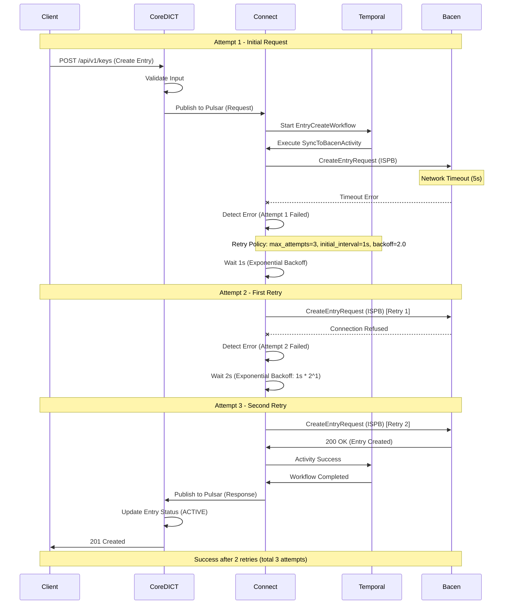

### 1.2. Retry Exhausted - Move to DLQ

**Scenario**: All retry attempts fail. Message moved to Dead Letter Queue.

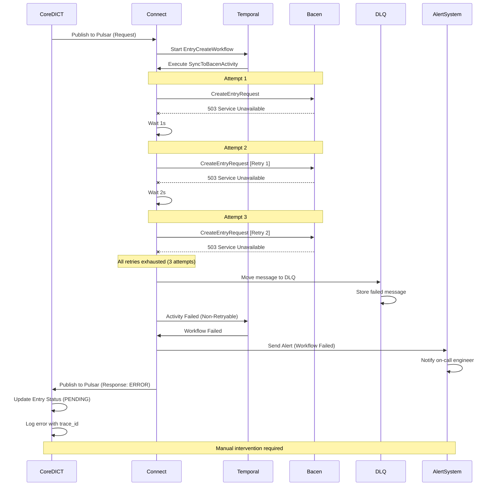

---

## 2. Circuit Breaker Pattern

### 2.1. Circuit Breaker - CLOSED State (Normal)

**Scenario**: Circuit breaker allows requests through. All requests succeed.

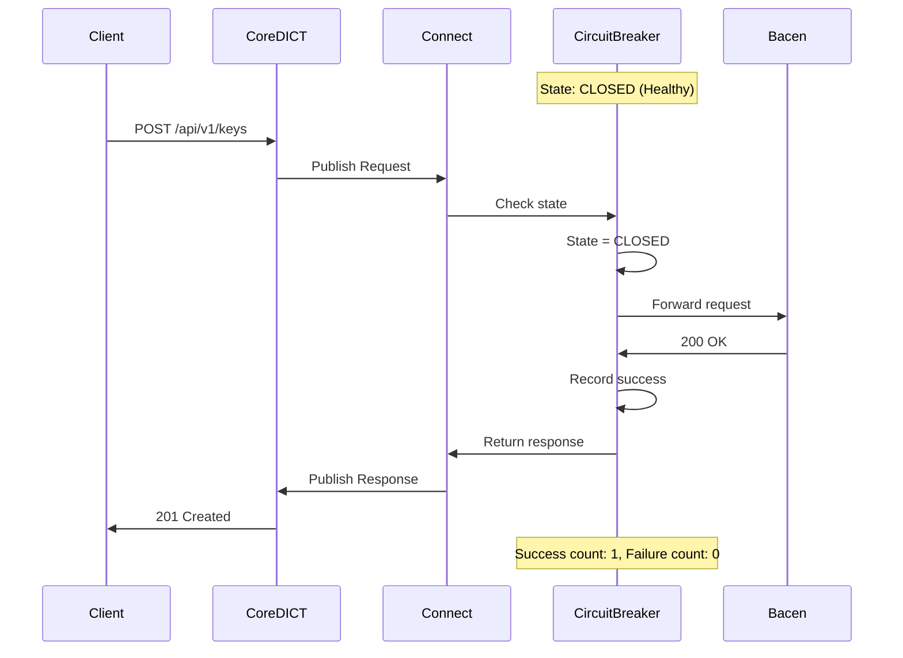

### 2.2. Circuit Breaker - OPEN State (Failed)

**Scenario**: Circuit breaker detects failures and opens. Subsequent requests fail fast.

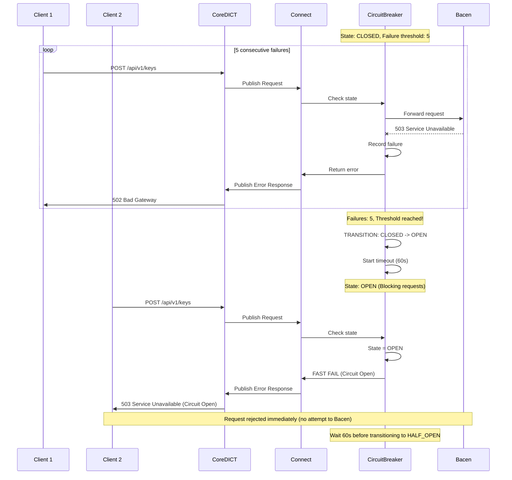

### 2.3. Circuit Breaker - HALF_OPEN State (Testing)

**Scenario**: Circuit breaker allows limited requests to test if service recovered.

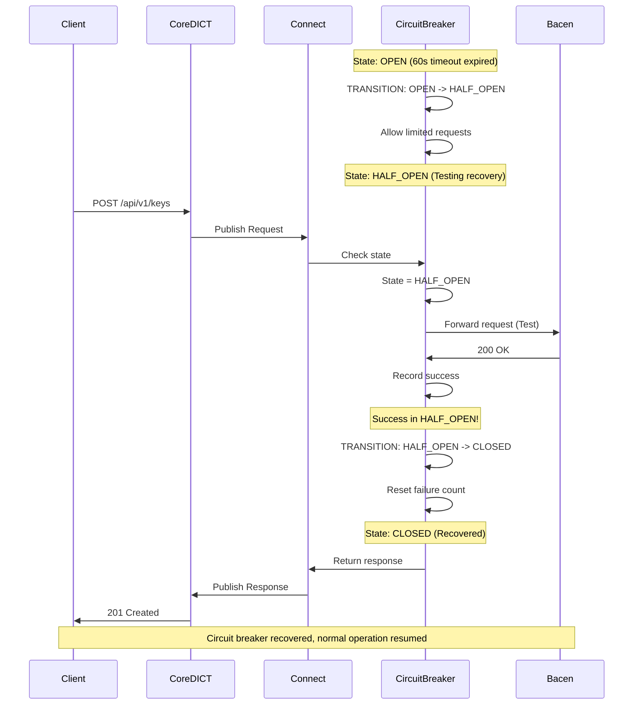

---

## 3. Dead Letter Queue (DLQ)

### 3.1. DLQ Processing and Reprocessing

**Scenario**: Failed messages in DLQ are manually reviewed and reprocessed.

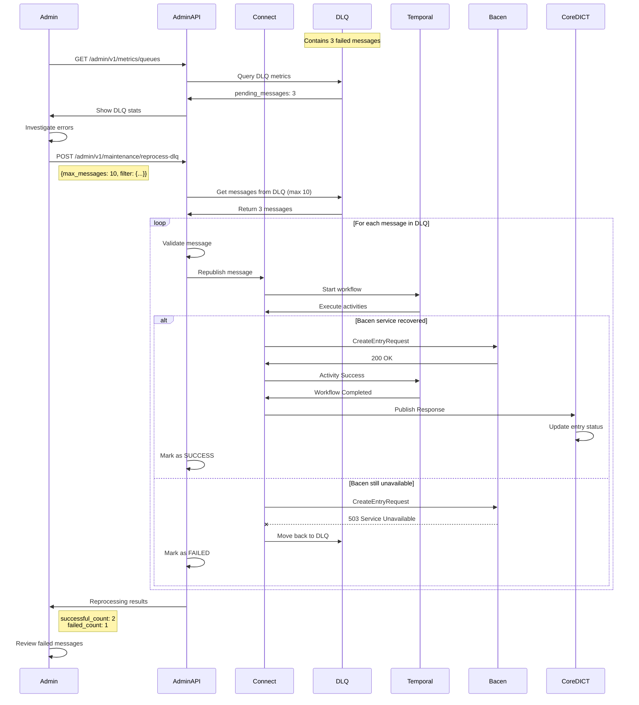

---

## 4. Compensating Transaction

### 4.1. Claim Creation with Rollback

**Scenario**: Claim created successfully in Bacen, but local DB update fails. Compensating transaction cancels claim.

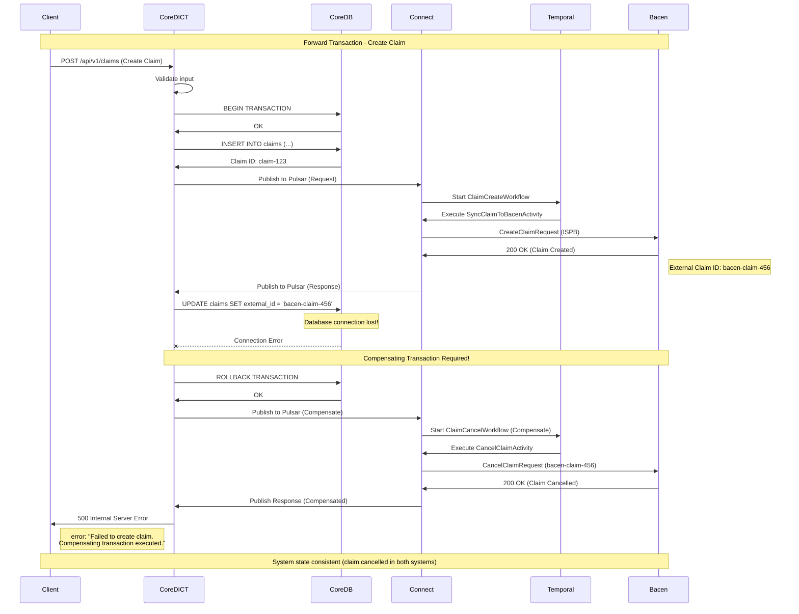

### 4.2. Saga Pattern - Distributed Transaction

**Scenario**: Multi-step distributed transaction with compensation.

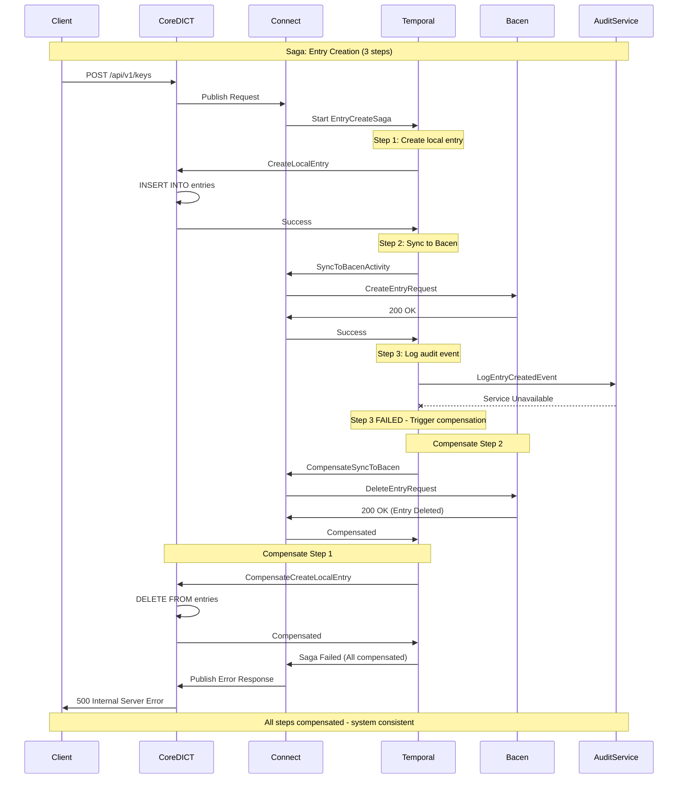

---

## 5. Idempotency Handling

### 5.1. Duplicate Request Detection

**Scenario**: Client sends duplicate request with same idempotency key. System detects and returns cached response.

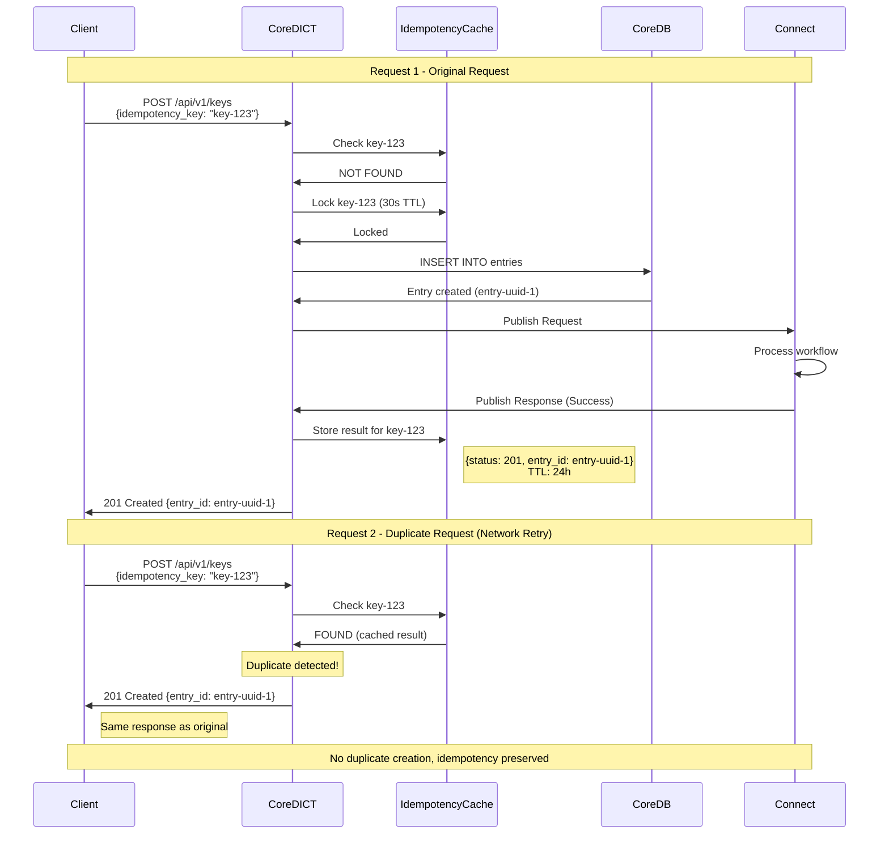

### 5.2. Idempotency with Conflict

**Scenario**: Different request with same idempotency key. System rejects as conflict.

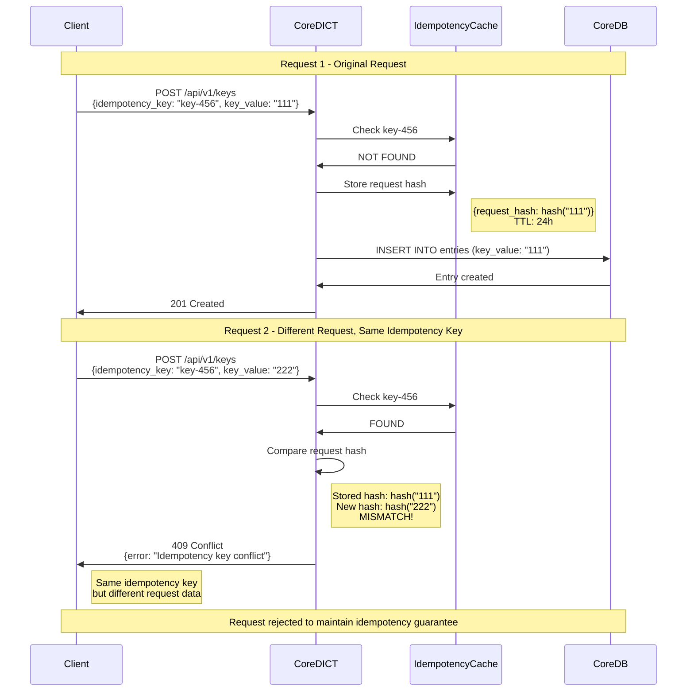

---

## 6. Error Recovery Strategies

### 6.1. Timeout Handling with Graceful Degradation

**Scenario**: Bacen DICT is slow. System times out and returns partial success.

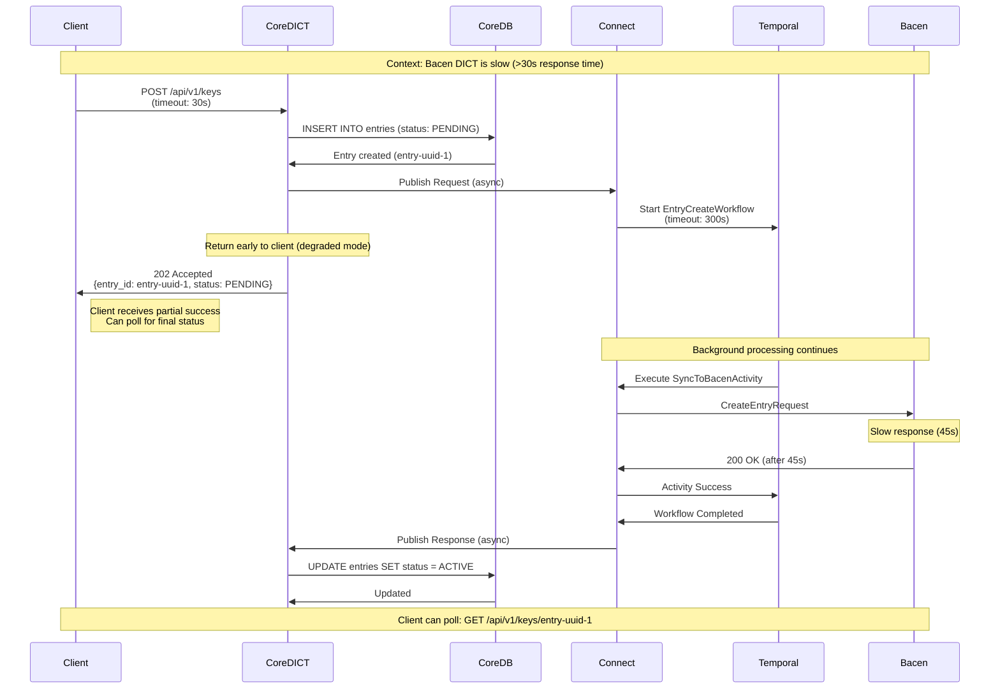

### 6.2. Fallback Strategy

**Scenario**: Primary operation fails. System uses fallback approach.

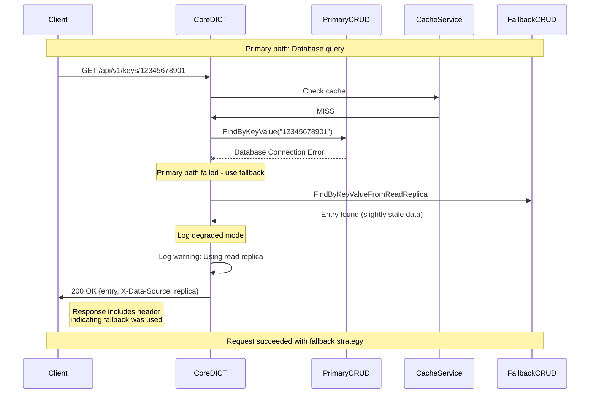

---

## Rastreabilidade

### Requisitos Funcionais

| ID | Requisito | Documento de Origem | Status |
|----|-----------|---------------------|--------|
| RF-ERR-001 | Retry policy com exponential backoff | [TEC-003](../../11_Especificacoes_Tecnicas/TEC-003_RSFN_Connect_Specification.md) | ✅ Especificado |
| RF-ERR-002 | Circuit breaker pattern | [TEC-003](../../11_Especificacoes_Tecnicas/TEC-003_RSFN_Connect_Specification.md) | ✅ Especificado |
| RF-ERR-003 | Dead letter queue processing | [TEC-003](../../11_Especificacoes_Tecnicas/TEC-003_RSFN_Connect_Specification.md) | ✅ Especificado |
| RF-ERR-004 | Compensating transactions | [TEC-001](../../11_Especificacoes_Tecnicas/TEC-001_Core_DICT_Specification.md) | ✅ Especificado |
| RF-ERR-005 | Idempotency handling | [API-002](../../04_APIs/REST/API-002_Core_DICT_REST_API.md) | ✅ Especificado |

---

## Próximas Revisões

**Pendências**:
- [ ] Adicionar sequence para rate limiting
- [ ] Adicionar sequence para chaos engineering tests
- [ ] Adicionar sequence para disaster recovery

---

**Referências**:
- [TEC-001: Core DICT Specification](../../11_Especificacoes_Tecnicas/TEC-001_Core_DICT_Specification.md)
- [TEC-003: RSFN Connect Specification](../../11_Especificacoes_Tecnicas/TEC-003_RSFN_Connect_Specification.md)
- [API-002: Core DICT REST API](../../04_APIs/REST/API-002_Core_DICT_REST_API.md)
- [Temporal Retry Policies](https://docs.temporal.io/retry-policies)
- [Circuit Breaker Pattern](https://martinfowler.com/bliki/CircuitBreaker.html)
- [Saga Pattern](https://microservices.io/patterns/data/saga.html)
