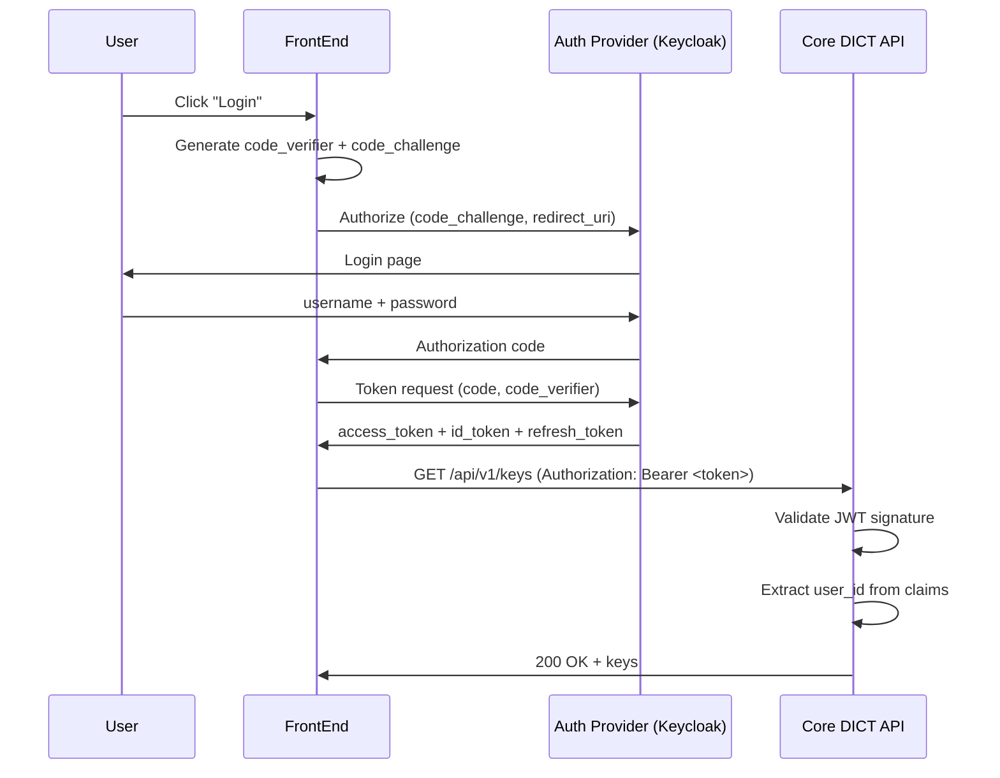

# SEC-004: API Authentication

**Projeto**: DICT - Diretório de Identificadores de Contas Transacionais (LBPay)
**Versão**: 1.0
**Data**: 2025-10-25
**Status**: ✅ Especificação Completa
**Responsável**: Security Lead + ARCHITECT

---

## 📋 Resumo Executivo

Este documento especifica a **estratégia de autenticação e autorização** para todas as APIs do sistema DICT, incluindo REST APIs (FrontEnd → Core DICT) e gRPC APIs (internas), usando JWT, OAuth 2.0, mTLS e API Keys.

**Objetivo**: Garantir que apenas usuários e serviços autorizados possam acessar recursos do sistema, implementando autenticação robusta e autorização granular (RBAC).

---

## 🎯 Estratégias de Autenticação por Camada

### Mapa de Autenticação

| Comunicação | Método | Token/Credential | Protocolo |
|-------------|--------|------------------|-----------|
| **FrontEnd → Core DICT** | JWT Bearer | JWT access token | HTTPS/REST |
| **Core DICT → Connect** | mTLS + API Key | Client certificate + API key | gRPC/TLS |
| **Connect → Bridge** | mTLS | Client certificate | gRPC/TLS |
| **Bridge → Bacen** | mTLS + XML Signature | ICP-Brasil A3 cert | HTTPS/SOAP |
| **CI/CD → APIs** | API Key | Service account key | HTTPS/gRPC |

---

## 🔐 Autenticação: FrontEnd → Core DICT (JWT)

### 1. OAuth 2.0 + OpenID Connect

**Provider**: Auth0, Keycloak, ou LBPay Identity Server

**Fluxo**: Authorization Code Flow with PKCE (mobile/SPA)

```
[User] → [FrontEnd] → [Auth Provider] → [FrontEnd] → [Core DICT]
   1. Login           2. Authorize     3. Get Token  4. API Call
                      (username/pwd)   (access_token) (Bearer token)
```

#### Authorization Code Flow with PKCE



---

### 2. JWT Structure

**Access Token (JWT)**:
```json
{
  "header": {
    "alg": "RS256",
    "typ": "JWT",
    "kid": "key-2025-10-25"
  },
  "payload": {
    "iss": "https://auth.lbpay.com.br",
    "sub": "user-550e8400",
    "aud": "dict-api",
    "exp": 1730000000,
    "iat": 1729996400,
    "nbf": 1729996400,
    "scope": "dict:read dict:write",
    "user_id": "user-550e8400",
    "email": "joao@example.com",
    "roles": ["user"]
  },
  "signature": "..."
}
```

**Claims Importantes**:
- `sub` (subject): User ID único
- `exp` (expiration): Expiração do token (15 minutos)
- `scope`: Permissões do usuário
- `roles`: Roles para RBAC (user, admin, support)

---

### 3. Validação de JWT (Core DICT)

```go
// Pseudocódigo (especificação, NÃO implementar agora)
package auth

import (
    "github.com/golang-jwt/jwt/v5"
)

// JWTValidator valida tokens JWT
type JWTValidator struct {
    publicKey *rsa.PublicKey
    issuer    string
    audience  string
}

// ValidateToken valida JWT e retorna claims
func (v *JWTValidator) ValidateToken(tokenString string) (*Claims, error) {
    // Parse token
    token, err := jwt.ParseWithClaims(tokenString, &Claims{}, func(token *jwt.Token) (interface{}, error) {
        // Verificar algoritmo (prevenir "none" attack)
        if _, ok := token.Method.(*jwt.SigningMethodRSA); !ok {
            return nil, fmt.Errorf("unexpected signing method: %v", token.Header["alg"])
        }
        return v.publicKey, nil
    })

    if err != nil {
        return nil, fmt.Errorf("invalid token: %w", err)
    }

    claims, ok := token.Claims.(*Claims)
    if !ok || !token.Valid {
        return nil, fmt.Errorf("invalid token claims")
    }

    // Validar issuer
    if claims.Issuer != v.issuer {
        return nil, fmt.Errorf("invalid issuer: %s", claims.Issuer)
    }

    // Validar audience
    if !claims.VerifyAudience(v.audience, true) {
        return nil, fmt.Errorf("invalid audience")
    }

    // Validar expiração
    if claims.ExpiresAt.Before(time.Now()) {
        return nil, fmt.Errorf("token expired")
    }

    return claims, nil
}

// Claims customizadas
type Claims struct {
    UserID string   `json:"user_id"`
    Email  string   `json:"email"`
    Roles  []string `json:"roles"`
    Scope  string   `json:"scope"`
    jwt.RegisteredClaims
}

// HasRole verifica se usuário tem role específica
func (c *Claims) HasRole(role string) bool {
    for _, r := range c.Roles {
        if r == role {
            return true
        }
    }
    return false
}

// HasScope verifica se token tem scope específico
func (c *Claims) HasScope(scope string) bool {
    return strings.Contains(c.Scope, scope)
}
```

---

### 4. Middleware de Autenticação (Core DICT REST API)

```go
// Pseudocódigo
func AuthMiddleware(validator *JWTValidator) gin.HandlerFunc {
    return func(c *gin.Context) {
        // Extrair token do header
        authHeader := c.GetHeader("Authorization")
        if authHeader == "" {
            c.JSON(401, gin.H{"error": "missing authorization header"})
            c.Abort()
            return
        }

        // Extrair Bearer token
        parts := strings.Split(authHeader, " ")
        if len(parts) != 2 || parts[0] != "Bearer" {
            c.JSON(401, gin.H{"error": "invalid authorization header"})
            c.Abort()
            return
        }

        tokenString := parts[1]

        // Validar token
        claims, err := validator.ValidateToken(tokenString)
        if err != nil {
            c.JSON(401, gin.H{"error": "invalid token", "details": err.Error()})
            c.Abort()
            return
        }

        // Adicionar claims ao contexto
        c.Set("user_id", claims.UserID)
        c.Set("email", claims.Email)
        c.Set("roles", claims.Roles)

        c.Next()
    }
}

// Uso
router.Use(AuthMiddleware(jwtValidator))
router.GET("/api/v1/keys", listKeysHandler)
```

---

### 5. Refresh Tokens

**Problema**: Access tokens têm TTL curto (15 min) para segurança

**Solução**: Refresh tokens com TTL longo (7 dias)

**Fluxo**:
```
1. Login: Recebe access_token (15min) + refresh_token (7 dias)
2. Access token expira após 15min
3. FrontEnd envia refresh_token para /oauth/token
4. Auth Server valida refresh_token
5. Auth Server emite novo access_token (15min)
6. FrontEnd usa novo access_token
```

**Segurança**:
- ✅ Refresh token armazenado em HttpOnly cookie (não acessível por JS)
- ✅ Refresh token rotation (novo refresh token a cada uso)
- ✅ Revogação imediata ao logout

---

## 🔒 Autenticação: Core DICT ↔ Connect (mTLS + API Key)

### 1. Mutual TLS (mTLS)

**Propósito**: Autenticação bidirecional (cliente e servidor)

```yaml
# Core DICT apresenta certificado client
tls:
  cert: /secrets/core-dict-client.crt
  key: /secrets/core-dict-client.key
  ca: /secrets/connect-ca.crt

# Connect valida certificado do Core DICT
tls:
  client_auth: require_and_verify_client_cert
  ca: /secrets/core-dict-ca.crt
```

**Validação no Connect**:
```go
// Pseudocódigo
func ValidateClientCertificate(ctx context.Context, info *grpc.UnaryServerInfo, handler grpc.UnaryHandler) (interface{}, error) {
    // Extrair certificado do cliente do contexto TLS
    p, ok := peer.FromContext(ctx)
    if !ok {
        return nil, status.Error(codes.Unauthenticated, "no peer info")
    }

    tlsInfo, ok := p.AuthInfo.(credentials.TLSInfo)
    if !ok {
        return nil, status.Error(codes.Unauthenticated, "unexpected peer auth info")
    }

    if len(tlsInfo.State.VerifiedChains) == 0 || len(tlsInfo.State.VerifiedChains[0]) == 0 {
        return nil, status.Error(codes.Unauthenticated, "client certificate not verified")
    }

    cert := tlsInfo.State.VerifiedChains[0][0]

    // Validar CN (Common Name)
    if cert.Subject.CommonName != "core-dict.dict.svc.cluster.local" {
        return nil, status.Error(codes.PermissionDenied, "invalid client certificate CN")
    }

    // Adicionar certificado ao contexto
    ctx = context.WithValue(ctx, "client_cert", cert)

    return handler(ctx, req)
}
```

---

### 2. API Key (Adicional)

**Propósito**: Camada extra de autenticação + rate limiting

```go
// Core DICT envia API key no metadata gRPC
md := metadata.New(map[string]string{
    "x-api-key": "dict-core-api-key-12345",
})
ctx := metadata.NewOutgoingContext(context.Background(), md)

// Connect valida API key
func ValidateAPIKey(ctx context.Context) error {
    md, ok := metadata.FromIncomingContext(ctx)
    if !ok {
        return status.Error(codes.Unauthenticated, "missing metadata")
    }

    apiKeys := md.Get("x-api-key")
    if len(apiKeys) == 0 {
        return status.Error(codes.Unauthenticated, "missing api key")
    }

    // Validar API key (buscar do Vault)
    validKeys := getValidAPIKeys()  // Redis cache + Vault
    if !contains(validKeys, apiKeys[0]) {
        return status.Error(codes.PermissionDenied, "invalid api key")
    }

    return nil
}
```

---

## 👥 Autorização: RBAC (Role-Based Access Control)

### 1. Roles Definidas

```yaml
roles:
  - name: user
    description: Usuário normal do sistema
    permissions:
      - dict:keys:read_own
      - dict:keys:create_own
      - dict:keys:delete_own
      - dict:claims:read_own
      - dict:claims:create_own
      - dict:claims:respond_own

  - name: admin
    description: Administrador do sistema
    permissions:
      - dict:keys:*
      - dict:claims:*
      - dict:users:*
      - audit:logs:read

  - name: support
    description: Suporte técnico
    permissions:
      - dict:keys:read_all
      - dict:claims:read_all
      - audit:logs:read

  - name: auditor
    description: Auditor (apenas leitura)
    permissions:
      - dict:keys:read_all
      - dict:claims:read_all
      - audit:logs:read
      - audit:logs:export
```

---

### 2. Enforcement (Core DICT)

```go
// Pseudocódigo
func RequirePermission(permission string) gin.HandlerFunc {
    return func(c *gin.Context) {
        roles := c.GetStringSlice("roles")

        // Verificar se alguma role tem a permissão
        if !hasPermission(roles, permission) {
            c.JSON(403, gin.H{"error": "insufficient permissions"})
            c.Abort()
            return
        }

        c.Next()
    }
}

// Mapeamento role → permissions
var rolePermissions = map[string][]string{
    "user": {
        "dict:keys:read_own",
        "dict:keys:create_own",
        "dict:keys:delete_own",
    },
    "admin": {
        "dict:*",
    },
    "support": {
        "dict:keys:read_all",
        "dict:claims:read_all",
    },
}

func hasPermission(roles []string, permission string) bool {
    for _, role := range roles {
        permissions := rolePermissions[role]
        for _, p := range permissions {
            if matchPermission(p, permission) {
                return true
            }
        }
    }
    return false
}

// Wildcard matching
func matchPermission(pattern, permission string) bool {
    if pattern == permission {
        return true
    }
    if strings.HasSuffix(pattern, ":*") {
        prefix := strings.TrimSuffix(pattern, "*")
        return strings.HasPrefix(permission, prefix)
    }
    return false
}

// Uso
router.GET("/api/v1/keys",
    AuthMiddleware(jwtValidator),
    RequirePermission("dict:keys:read_own"),
    listKeysHandler,
)

router.GET("/api/v1/admin/users",
    AuthMiddleware(jwtValidator),
    RequirePermission("dict:users:read"),
    listUsersHandler,
)
```

---

### 3. Ownership Check

**Problema**: User pode ter permissão `dict:keys:read_own`, mas precisa validar que a key pertence a ele

```go
// Pseudocódigo
func getKeyHandler(c *gin.Context) {
    keyID := c.Param("id")
    userID := c.GetString("user_id")
    roles := c.GetStringSlice("roles")

    // Buscar key
    key, err := keyRepo.GetByID(keyID)
    if err != nil {
        c.JSON(404, gin.H{"error": "key not found"})
        return
    }

    // Verificar ownership (se não for admin)
    if !contains(roles, "admin") && key.UserID != userID {
        c.JSON(403, gin.H{"error": "access denied: not your key"})
        return
    }

    c.JSON(200, key)
}
```

---

## 🔑 Autenticação: Service Accounts (CI/CD)

### 1. API Keys para GitHub Actions

```bash
# Gerar API key no Vault
vault write dict/data/ci/github-actions api_key="$(openssl rand -hex 32)"

# Armazenar como GitHub Secret
# DICT_API_KEY=abc123...
```

**Uso no GitHub Actions**:
```yaml
- name: Run integration tests
  env:
    DICT_API_KEY: ${{ secrets.DICT_API_KEY }}
  run: |
    curl -H "X-API-Key: $DICT_API_KEY" \
      https://dict-staging.lbpay.com.br/api/v1/health
```

---

### 2. OAuth 2.0 Client Credentials Flow

**Para serviços externos** (não usuários humanos):

```
[Service] → [Auth Server] → [Service] → [Core DICT]
    1. Request token      2. Access token   3. API call
    (client_id + secret)  (expires 1h)      (Bearer token)
```

```bash
# Request token
curl -X POST https://auth.lbpay.com.br/oauth/token \
  -H "Content-Type: application/x-www-form-urlencoded" \
  -d "grant_type=client_credentials" \
  -d "client_id=dict-service-123" \
  -d "client_secret=abc123..." \
  -d "scope=dict:read"

# Response
{
  "access_token": "eyJhbGc...",
  "token_type": "Bearer",
  "expires_in": 3600,
  "scope": "dict:read"
}
```

---

## 📊 Monitoramento e Auditoria

### 1. Logs de Autenticação

```json
{
  "timestamp": "2025-10-25T10:00:00Z",
  "event_type": "authentication",
  "result": "success",
  "user_id": "user-550e8400",
  "email": "joao@example.com",
  "ip_address": "192.168.1.100",
  "user_agent": "Mozilla/5.0...",
  "method": "jwt_bearer",
  "token_id": "jti-abc123"
}
```

### 2. Logs de Autorização

```json
{
  "timestamp": "2025-10-25T10:00:00Z",
  "event_type": "authorization",
  "result": "denied",
  "user_id": "user-550e8400",
  "resource": "/api/v1/admin/users",
  "required_permission": "dict:users:read",
  "user_roles": ["user"],
  "reason": "insufficient permissions"
}
```

### 3. Métricas Prometheus

```prometheus
# Autenticações bem-sucedidas/falhadas
auth_attempts_total{result="success"} 1234
auth_attempts_total{result="failed"} 56

# Latência de validação de JWT
auth_jwt_validation_duration_seconds{quantile="0.95"} 0.005

# Rate de tokens expirados
auth_token_expired_total 42
```

### 4. Alertas

```yaml
groups:
  - name: authentication
    rules:
      - alert: HighAuthFailureRate
        expr: rate(auth_attempts_total{result="failed"}[5m]) > 10
        for: 5m
        labels:
          severity: warning
        annotations:
          summary: "High authentication failure rate"

      - alert: BruteForceAttack
        expr: |
          sum(rate(auth_attempts_total{result="failed"}[1m])) by (ip_address) > 20
        for: 1m
        labels:
          severity: critical
        annotations:
          summary: "Possible brute force attack from {{ $labels.ip_address }}"
```

---

## 🚨 Segurança

### 1. Proteção contra Ataques

#### JWT "none" Algorithm Attack
```go
// SEMPRE validar algoritmo
if _, ok := token.Method.(*jwt.SigningMethodRSA); !ok {
    return nil, fmt.Errorf("unexpected signing method: %v", token.Header["alg"])
}
```

#### Token Replay Attack
```go
// Usar JTI (JWT ID) e blacklist de tokens revogados
if isTokenRevoked(claims.ID) {
    return nil, fmt.Errorf("token revoked")
}
```

#### Brute Force Attack
```go
// Rate limiting por IP
if rateLimiter.IsBlocked(clientIP) {
    return status.Error(codes.ResourceExhausted, "too many failed attempts")
}
```

---

### 2. Rotação de Chaves

**JWT Signing Key**:
- Rotação a cada 90 dias
- Suportar múltiplas keys ativas (key rotation sem downtime)
- Key ID (kid) no header JWT

```go
// Múltiplas public keys ativas
var publicKeys = map[string]*rsa.PublicKey{
    "key-2025-10-25": pubKey1,
    "key-2025-07-25": pubKey2,  // Key antiga (ainda válida por 30 dias)
}

// Selecionar key baseada no kid
func getPublicKey(token *jwt.Token) (interface{}, error) {
    kid, ok := token.Header["kid"].(string)
    if !ok {
        return nil, fmt.Errorf("missing kid in token header")
    }

    pubKey, ok := publicKeys[kid]
    if !ok {
        return nil, fmt.Errorf("unknown key id: %s", kid)
    }

    return pubKey, nil
}
```

---

## 📋 Checklist de Implementação

- [ ] Configurar Auth Provider (Keycloak, Auth0)
- [ ] Implementar OAuth 2.0 Authorization Code Flow with PKCE
- [ ] Implementar validação de JWT no Core DICT
- [ ] Criar middleware de autenticação (REST)
- [ ] Implementar RBAC (roles + permissions)
- [ ] Configurar mTLS entre Core DICT ↔ Connect
- [ ] Implementar validação de API keys
- [ ] Configurar ownership checks
- [ ] Implementar OAuth 2.0 Client Credentials para service accounts
- [ ] Adicionar logging de autenticação/autorização
- [ ] Configurar métricas Prometheus
- [ ] Configurar alertas (high failure rate, brute force)
- [ ] Implementar rate limiting por IP
- [ ] Criar processo de rotação de JWT signing keys
- [ ] Documentar roles e permissions (wiki interna)

---

## 📚 Referências

### Documentos Internos
- [SEC-001: mTLS Configuration](SEC-001_mTLS_Configuration.md)
- [SEC-003: Secret Management](SEC-003_Secret_Management.md) - Vault para API keys
- [GRPC-002: Core DICT gRPC Service](../../04_APIs/gRPC/GRPC-002_Core_DICT_gRPC_Service.md)

### Documentação Externa
- [OAuth 2.0 RFC 6749](https://datatracker.ietf.org/doc/html/rfc6749)
- [OpenID Connect](https://openid.net/connect/)
- [JWT RFC 7519](https://datatracker.ietf.org/doc/html/rfc7519)
- [PKCE RFC 7636](https://datatracker.ietf.org/doc/html/rfc7636)
- [OWASP Authentication Cheat Sheet](https://cheatsheetseries.owasp.org/cheatsheets/Authentication_Cheat_Sheet.html)

---

**Versão**: 1.0
**Status**: ✅ Especificação Completa (Aguardando implementação)
**Próxima Revisão**: Após implementação de autenticação

---

**IMPORTANTE**: Este é um documento de **especificação técnica**. A implementação será feita pelos desenvolvedores em fase posterior, baseando-se neste documento.
