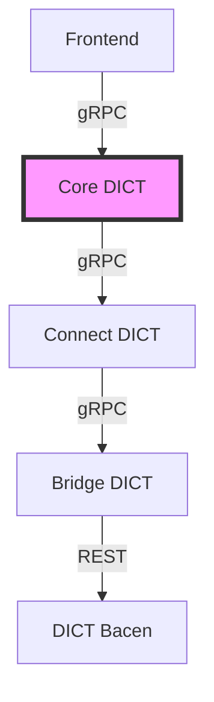
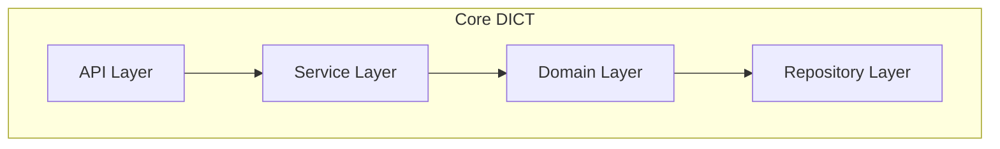
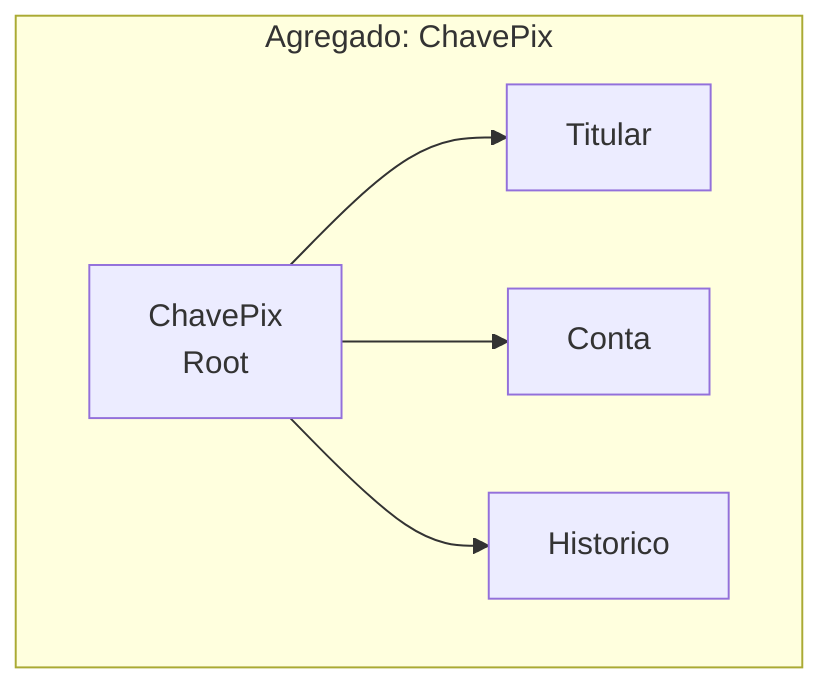
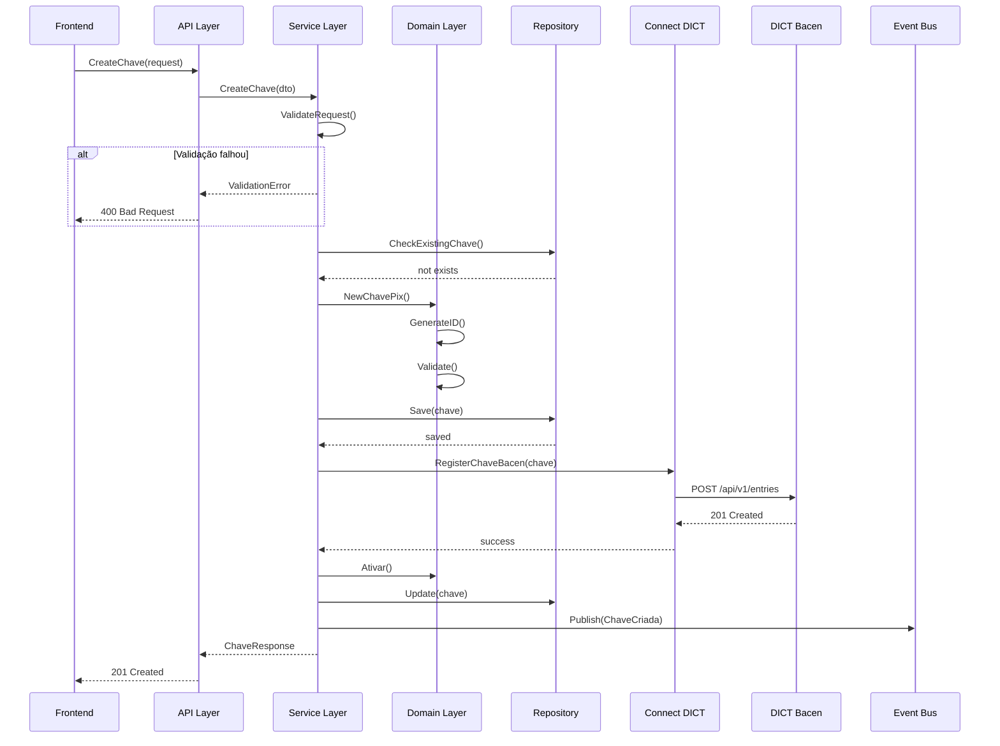

# Especificação Técnica: [Nome do Componente/Funcionalidade]

**ID**: ETS-XXX
**Versão**: 1.0
**Data**: [YYYY-MM-DD]
**Status**: [Draft | Review | Approved | Implemented]
**Autor**: [Agente responsável]

---

## 1. Visão Geral

### 1.1 Propósito
[Descrição clara e concisa do propósito deste componente/funcionalidade]

### 1.2 Escopo
**Incluído**:
- [Item 1]
- [Item 2]
- [Item 3]

**Excluído** (fora do escopo):
- [Item 1]
- [Item 2]

### 1.3 Requisitos Relacionados
- **RF-XXX**: [Nome do requisito funcional]
- **UST-YYY**: [Nome da user story]
- **Manual Bacen**: Seção [X.Y.Z]

### 1.4 Objetivos
1. [Objetivo 1]
2. [Objetivo 2]
3. [Objetivo 3]

---

## 2. Contexto Arquitetural

### 2.1 Posição na Arquitetura

[Destacar onde este componente se encaixa]

### 2.2 Diagrama C4 - Nível Componente


### 2.3 Dependências

**Upstream** (componentes que chamam este):
- [Componente 1]: [como interage]
- [Componente 2]: [como interage]

**Downstream** (componentes chamados por este):
- [Componente A]: [como interage]
- [Componente B]: [como interage]

**Dependências Externas**:
- [Biblioteca/Serviço 1]: [para que é usado]
- [Biblioteca/Serviço 2]: [para que é usado]

---

## 3. Modelo de Dados

### 3.1 Entidades de Domínio

#### Entity: ChavePix
```go
package domain

import (
    "time"
    "github.com/google/uuid"
)

// ChavePix representa uma chave PIX no domínio
type ChavePix struct {
    ID                uuid.UUID
    TipoChave         TipoChave
    ValorChave        string
    TitularConta      Titular
    ContaVinculada    Conta
    Status            StatusChave
    DataCriacao       time.Time
    DataAtualizacao   time.Time
    Metadata          map[string]interface{}
}

// Métodos de negócio
func (c *ChavePix) Validar() error { }
func (c *ChavePix) Ativar() error { }
func (c *ChavePix) Desativar() error { }
```

#### Value Objects
```go
// TipoChave enumera os tipos de chave permitidos
type TipoChave string

const (
    TipoChaveCPF        TipoChave = "CPF"
    TipoChaveCNPJ       TipoChave = "CNPJ"
    TipoChaveEmail      TipoChave = "EMAIL"
    TipoChaveTelefone   TipoChave = "TELEFONE"
    TipoChaveAleatoria  TipoChave = "ALEATORIA"
)

// StatusChave representa o estado de uma chave
type StatusChave string

const (
    StatusAtiva         StatusChave = "ATIVA"
    StatusBloqueada     StatusChave = "BLOQUEADA"
    StatusPendente      StatusChave = "PENDENTE"
    StatusExcluida      StatusChave = "EXCLUIDA"
)
```

### 3.2 Agregados



**Invariantes do Agregado**:
- [Invariante 1: ex: Uma chave só pode estar vinculada a uma conta]
- [Invariante 2: ex: CPF/CNPJ devem ser válidos]
- [Invariante 3]

### 3.3 Eventos de Domínio

```go
// ChaveCriada é emitido quando uma nova chave é criada
type ChaveCriada struct {
    EventID         uuid.UUID
    AggregateID     uuid.UUID
    Timestamp       time.Time
    TipoChave       TipoChave
    ValorChave      string
    TitularID       uuid.UUID
    ContaID         uuid.UUID
}

// ChaveAtivada é emitido quando uma chave é ativada
type ChaveAtivada struct {
    EventID         uuid.UUID
    AggregateID     uuid.UUID
    Timestamp       time.Time
}

// Outros eventos...
```

### 3.4 Schema de Banco de Dados

#### PostgreSQL
```sql
-- Tabela principal de chaves
CREATE TABLE chaves_pix (
    id                  UUID PRIMARY KEY DEFAULT gen_random_uuid(),
    tipo_chave          VARCHAR(20) NOT NULL,
    valor_chave         VARCHAR(255) NOT NULL,
    titular_cpf_cnpj    VARCHAR(14) NOT NULL,
    titular_nome        VARCHAR(255) NOT NULL,
    conta_id            UUID NOT NULL,
    status              VARCHAR(20) NOT NULL,
    data_criacao        TIMESTAMP NOT NULL DEFAULT NOW(),
    data_atualizacao    TIMESTAMP NOT NULL DEFAULT NOW(),
    metadata            JSONB,

    CONSTRAINT uk_valor_chave UNIQUE (valor_chave),
    CONSTRAINT chk_tipo_chave CHECK (tipo_chave IN ('CPF', 'CNPJ', 'EMAIL', 'TELEFONE', 'ALEATORIA')),
    CONSTRAINT chk_status CHECK (status IN ('ATIVA', 'BLOQUEADA', 'PENDENTE', 'EXCLUIDA'))
);

CREATE INDEX idx_chaves_titular ON chaves_pix(titular_cpf_cnpj);
CREATE INDEX idx_chaves_conta ON chaves_pix(conta_id);
CREATE INDEX idx_chaves_status ON chaves_pix(status);

-- Tabela de histórico/eventos
CREATE TABLE chaves_pix_eventos (
    id                  UUID PRIMARY KEY DEFAULT gen_random_uuid(),
    chave_id            UUID NOT NULL REFERENCES chaves_pix(id),
    tipo_evento         VARCHAR(50) NOT NULL,
    payload             JSONB NOT NULL,
    data_evento         TIMESTAMP NOT NULL DEFAULT NOW(),
    usuario_id          UUID,

    INDEX idx_eventos_chave (chave_id),
    INDEX idx_eventos_tipo (tipo_evento),
    INDEX idx_eventos_data (data_evento DESC)
);
```

---

## 4. Interfaces e Contratos

### 4.1 Interface gRPC

#### Definição Proto
```protobuf
syntax = "proto3";

package lbpay.dict.v1;

import "google/protobuf/timestamp.proto";
import "google/protobuf/empty.proto";

// ChaveService gerencia operações de chaves PIX
service ChaveService {
    // Criar uma nova chave PIX
    rpc CreateChave(CreateChaveRequest) returns (CreateChaveResponse);

    // Consultar uma chave PIX
    rpc GetChave(GetChaveRequest) returns (ChaveResponse);

    // Atualizar dados de uma chave
    rpc UpdateChave(UpdateChaveRequest) returns (ChaveResponse);

    // Excluir uma chave PIX
    rpc DeleteChave(DeleteChaveRequest) returns (google.protobuf.Empty);

    // Listar chaves de um titular
    rpc ListChaves(ListChavesRequest) returns (ListChavesResponse);
}

// Mensagens
message CreateChaveRequest {
    string tipo_chave = 1;           // CPF, CNPJ, EMAIL, TELEFONE, ALEATORIA
    string valor_chave = 2;          // Valor da chave (pode ser vazio para ALEATORIA)
    string titular_cpf_cnpj = 3;
    string titular_nome = 4;
    string conta_id = 5;
}

message CreateChaveResponse {
    string chave_id = 1;
    string valor_chave = 2;          // Retorna a chave gerada (caso ALEATORIA)
    string status = 3;
    google.protobuf.Timestamp created_at = 4;
}

message GetChaveRequest {
    string chave_id = 1;             // Buscar por ID
    string valor_chave = 2;          // OU buscar por valor da chave
}

message ChaveResponse {
    string id = 1;
    string tipo_chave = 2;
    string valor_chave = 3;
    Titular titular = 4;
    Conta conta = 5;
    string status = 6;
    google.protobuf.Timestamp created_at = 7;
    google.protobuf.Timestamp updated_at = 8;
}

message Titular {
    string cpf_cnpj = 1;
    string nome = 2;
}

message Conta {
    string conta_id = 1;
    string ispb = 2;
    string agencia = 3;
    string numero = 4;
    string tipo = 5;
}

// Outras mensagens...
```

### 4.2 Interface REST (se aplicável)

#### OpenAPI Spec
```yaml
openapi: 3.0.0
info:
  title: Core DICT API
  version: 1.0.0

paths:
  /api/v1/chaves:
    post:
      summary: Criar nova chave PIX
      requestBody:
        required: true
        content:
          application/json:
            schema:
              $ref: '#/components/schemas/CreateChaveRequest'
      responses:
        '201':
          description: Chave criada com sucesso
          content:
            application/json:
              schema:
                $ref: '#/components/schemas/ChaveResponse'
        '400':
          description: Requisição inválida
        '409':
          description: Chave já existe

  /api/v1/chaves/{chaveId}:
    get:
      summary: Consultar chave por ID
      parameters:
        - name: chaveId
          in: path
          required: true
          schema:
            type: string
            format: uuid
      responses:
        '200':
          description: Chave encontrada
        '404':
          description: Chave não encontrada

components:
  schemas:
    CreateChaveRequest:
      type: object
      required:
        - tipoChave
        - titularCpfCnpj
        - contaId
      properties:
        tipoChave:
          type: string
          enum: [CPF, CNPJ, EMAIL, TELEFONE, ALEATORIA]
        valorChave:
          type: string
        titularCpfCnpj:
          type: string
        # ...continuar
```

### 4.3 Events Published/Consumed

**Events Published**:
```go
// Publicados para Message Broker (RabbitMQ/Kafka)
const (
    EventChaveCriada     = "dict.chave.criada"
    EventChaveAtivada    = "dict.chave.ativada"
    EventChaveExcluida   = "dict.chave.excluida"
    EventChaveAtualizada = "dict.chave.atualizada"
)
```

**Events Consumed**:
```go
// Consumidos de outros serviços
const (
    EventContaCriada     = "banking.conta.criada"
    EventContaEncerrada  = "banking.conta.encerrada"
)
```

---

## 5. Lógica de Negócio

### 5.1 Regras de Negócio

**RN-001**: Validação de Tipo de Chave
- CPF: deve ter 11 dígitos numéricos válidos
- CNPJ: deve ter 14 dígitos numéricos válidos
- Email: deve ser email válido (RFC 5322)
- Telefone: formato +5511999999999
- Aleatória: gerada pelo sistema (UUID v4)

**RN-002**: Unicidade de Chave
- Uma chave PIX deve ser única no sistema
- Não pode existir duplicatas de valor_chave

**RN-003**: Limite de Chaves por Titular
- PF (CPF): até 20 chaves
- PJ (CNPJ): até 20 chaves

**RN-004**: Validação de Titularidade
- CPF/CNPJ do titular deve ser válido
- Titular deve ter conta ativa no LBPay
- Dados do titular devem estar conformes com Receita Federal

### 5.2 Validações

```go
func (s *ChaveService) ValidateCreateChave(req *CreateChaveRequest) error {
    // Validação de tipo
    if !IsValidTipoChave(req.TipoChave) {
        return ErrTipoChaveInvalido
    }

    // Validação de valor conforme tipo
    switch req.TipoChave {
    case TipoChaveCPF:
        if !cpf.IsValid(req.ValorChave) {
            return ErrCPFInvalido
        }
    case TipoChaveCNPJ:
        if !cnpj.IsValid(req.ValorChave) {
            return ErrCNPJInvalido
        }
    case TipoChaveEmail:
        if !email.IsValid(req.ValorChave) {
            return ErrEmailInvalido
        }
    case TipoChaveTelefone:
        if !phone.IsValid(req.ValorChave) {
            return ErrTelefoneInvalido
        }
    }

    // Validação de unicidade
    exists, err := s.repo.ExistsByValor(req.ValorChave)
    if err != nil {
        return err
    }
    if exists {
        return ErrChaveJaExiste
    }

    // Validação de limite
    count, err := s.repo.CountByTitular(req.TitularCpfCnpj)
    if err != nil {
        return err
    }
    if count >= MaxChavesPorTitular {
        return ErrLimiteChavesExcedido
    }

    return nil
}
```

### 5.3 Fluxos de Processamento

#### Fluxo: Criar Chave PIX


---

## 6. Implementação

### 6.1 Estrutura de Pacotes

```
internal/
├── domain/
│   ├── chave/
│   │   ├── entity.go          # Entidades de domínio
│   │   ├── value_objects.go   # Value objects
│   │   ├── events.go          # Eventos de domínio
│   │   └── repository.go      # Interface do repositório
│   └── shared/
│       └── errors.go
├── application/
│   ├── chave/
│   │   ├── service.go         # Serviço de aplicação
│   │   ├── dto.go             # DTOs
│   │   └── validators.go      # Validadores
│   └── events/
│       └── handlers.go        # Event handlers
├── infrastructure/
│   ├── persistence/
│   │   ├── postgres/
│   │   │   ├── chave_repository.go
│   │   │   └── migrations/
│   │   └── cache/
│   │       └── redis_cache.go
│   ├── grpc/
│   │   ├── server.go
│   │   └── handlers/
│   │       └── chave_handler.go
│   ├── messaging/
│   │   ├── publisher.go
│   │   └── consumer.go
│   └── clients/
│       └── connect_client.go
└── api/
    └── proto/
        └── chave.proto
```

### 6.2 Interfaces Principais

```go
// Repository interface
type ChaveRepository interface {
    Save(ctx context.Context, chave *Chave) error
    FindByID(ctx context.Context, id uuid.UUID) (*Chave, error)
    FindByValor(ctx context.Context, valor string) (*Chave, error)
    ExistsByValor(ctx context.Context, valor string) (bool, error)
    CountByTitular(ctx context.Context, cpfCnpj string) (int, error)
    Update(ctx context.Context, chave *Chave) error
    Delete(ctx context.Context, id uuid.UUID) error
}

// Service interface
type ChaveService interface {
    CreateChave(ctx context.Context, req CreateChaveRequest) (*ChaveResponse, error)
    GetChave(ctx context.Context, req GetChaveRequest) (*ChaveResponse, error)
    UpdateChave(ctx context.Context, req UpdateChaveRequest) (*ChaveResponse, error)
    DeleteChave(ctx context.Context, req DeleteChaveRequest) error
    ListChaves(ctx context.Context, req ListChavesRequest) (*ListChavesResponse, error)
}

// EventPublisher interface
type EventPublisher interface {
    Publish(ctx context.Context, event DomainEvent) error
}
```

### 6.3 Dependências Externas

```go
// go.mod
module github.com/lbpay/dict-core

go 1.21

require (
    github.com/google/uuid v1.3.0
    github.com/lib/pq v1.10.9
    google.golang.org/grpc v1.58.0
    google.golang.org/protobuf v1.31.0
    github.com/go-redis/redis/v8 v8.11.5
    github.com/rabbitmq/amqp091-go v1.8.1
    github.com/stretchr/testify v1.8.4
    // ...outras dependências
)
```

### 6.4 Configurações

```yaml
# config/config.yaml
server:
  grpc:
    port: 50051
    maxConnections: 1000
  http:
    port: 8080

database:
  postgres:
    host: localhost
    port: 5432
    database: dict_core
    user: dict_user
    password: ${DB_PASSWORD}
    maxConnections: 100
    maxIdleConnections: 10
    connectionMaxLifetime: 1h

cache:
  redis:
    host: localhost
    port: 6379
    database: 0
    password: ${REDIS_PASSWORD}
    ttl: 300s

messaging:
  rabbitmq:
    url: amqp://localhost:5672
    exchange: dict.events
    queue: dict.chave.events

connect:
  grpc:
    address: localhost:50052
    timeout: 30s
    retryAttempts: 3

logging:
  level: info
  format: json
  output: stdout

observability:
  metrics:
    enabled: true
    port: 9090
  tracing:
    enabled: true
    jaegerEndpoint: localhost:14268
```

---

## 7. Segurança

### 7.1 Autenticação
- **Método**: mTLS + JWT
- **Certificados**: Gerenciados por [sistema de certificados]
- **Token Validation**: [como validar]

### 7.2 Autorização
**Roles e Permissões**:
- `dict:chave:create` - Criar chaves
- `dict:chave:read` - Consultar chaves
- `dict:chave:update` - Atualizar chaves
- `dict:chave:delete` - Excluir chaves
- `dict:admin` - Acesso total

### 7.3 Dados Sensíveis (PII)
**Campos Sensíveis**:
- CPF/CNPJ: Ofuscar em logs (XXX.XXX.XXX-XX)
- Nome: Ofuscar parcialmente
- Email: Ofuscar parcialmente (u***@domain.com)
- Telefone: Ofuscar parcialmente

```go
func (c *Chave) MaskForLog() *ChaveMasked {
    return &ChaveMasked{
        ID: c.ID,
        TipoChave: c.TipoChave,
        ValorChave: maskValue(c.ValorChave, c.TipoChave),
        // ...
    }
}
```

### 7.4 Auditoria
Todos os eventos devem ser auditados:
- Quem (user_id)
- O quê (ação)
- Quando (timestamp)
- Onde (IP, serviço)
- Contexto (request_id, session_id)

### 7.5 Rate Limiting
- **Por IP**: 100 req/min
- **Por Usuário**: 1000 req/min
- **Por Titular**: 50 chaves/dia (criação)

---

## 8. Resiliência

### 8.1 Error Handling

```go
var (
    ErrChaveNaoEncontrada    = errors.New("chave não encontrada")
    ErrChaveJaExiste        = errors.New("chave já existe")
    ErrTipoChaveInvalido    = errors.New("tipo de chave inválido")
    ErrLimiteChavesExcedido = errors.New("limite de chaves excedido")
    ErrBacenIndisponivel    = errors.New("DICT Bacen indisponível")
)

// Error codes para API
const (
    CodeNotFound         = "DICT_001"
    CodeAlreadyExists    = "DICT_002"
    CodeInvalidInput     = "DICT_003"
    CodeExternalError    = "DICT_004"
)
```

### 8.2 Retry Policy

```yaml
retry:
  maxAttempts: 3
  initialBackoff: 100ms
  maxBackoff: 5s
  multiplier: 2
  retryableErrors:
    - UNAVAILABLE
    - DEADLINE_EXCEEDED
```

### 8.3 Circuit Breaker

```go
circuitBreaker:
  maxRequests: 3
  interval: 60s
  timeout: 30s
  failureThreshold: 5
  successThreshold: 2
```

### 8.4 Timeouts

- **gRPC CreateChave**: 30s
- **Database Query**: 5s
- **Bacen API Call**: 15s
- **Cache Operation**: 1s

---

## 9. Observabilidade

### 9.1 Logs Estruturados

```go
log.Info("chave criada",
    zap.String("chave_id", chave.ID.String()),
    zap.String("tipo_chave", string(chave.TipoChave)),
    zap.String("titular_id", chave.TitularID.String()),
    zap.String("request_id", requestID),
)
```

**Níveis de Log**:
- DEBUG: Detalhes técnicos
- INFO: Operações normais
- WARN: Avisos (retry, degradação)
- ERROR: Erros recuperáveis
- FATAL: Erros não recuperáveis

### 9.2 Métricas

**Counters**:
- `dict_chaves_created_total`
- `dict_chaves_deleted_total`
- `dict_chaves_errors_total{type="validation|bacen|database"}`

**Gauges**:
- `dict_chaves_active`
- `dict_chaves_blocked`

**Histograms**:
- `dict_chave_create_duration_seconds`
- `dict_bacen_api_duration_seconds`

### 9.3 Distributed Tracing

```go
span := opentracing.StartSpan("ChaveService.CreateChave")
defer span.Finish()

span.SetTag("chave.tipo", req.TipoChave)
span.SetTag("titular.id", req.TitularID)
```

### 9.4 Health Checks

```go
func (s *Server) HealthCheck(ctx context.Context) *HealthStatus {
    status := &HealthStatus{
        Status: "healthy",
        Checks: make(map[string]CheckStatus),
    }

    // Database health
    if err := s.db.Ping(ctx); err != nil {
        status.Checks["database"] = CheckStatus{
            Status: "unhealthy",
            Error: err.Error(),
        }
        status.Status = "unhealthy"
    }

    // Cache health
    // Connect health
    // ...

    return status
}
```

---

## 10. Performance

### 10.1 Requisitos de Performance

| Operação | Latência (p95) | Throughput |
|----------|----------------|------------|
| CreateChave | < 500ms | 100 req/s |
| GetChave | < 100ms | 500 req/s |
| UpdateChave | < 300ms | 100 req/s |
| DeleteChave | < 200ms | 50 req/s |

### 10.2 Otimizações

**Caching**:
- Cache de chaves consultadas (Redis, TTL 5min)
- Cache de validações de CPF/CNPJ (TTL 1h)

**Database**:
- Índices em campos de busca frequente
- Connection pooling
- Prepared statements

**gRPC**:
- HTTP/2 multiplexing
- Protobuf serialização

---

## 11. Testes

### 11.1 Cobertura de Testes
- **Unitários**: > 80%
- **Integração**: Cenários críticos
- **E2E**: Happy path + principais erros

### 11.2 Casos de Teste

Ver documento: [CTS-XXX](../../08_Testes/Casos/CTS-XXX_Criar_Chave.md)

---

## 12. Deployment

### 12.1 Ambientes
- **Dev**: Desenvolvimento
- **Staging**: Homologação interna
- **Sandbox**: Homologação Bacen
- **Prod**: Produção

### 12.2 Migrations

```sql
-- V001__create_chaves_table.sql
-- V002__add_metadata_column.sql
```

### 12.3 Rollback Strategy
- Blue/Green deployment
- Canary release (10% → 50% → 100%)
- Database migrations reversíveis

---

## 13. Referências
- [DAS-001](../DAS-001_Arquitetura_Solucao.md)
- [ADR-XXX](../ADRs/ADR-XXX.md)
- [Manual DICT Bacen](../../../Docs_iniciais/manual_Operacional_DICT_Bacen.md)

---

## Histórico
| Data | Versão | Autor | Mudanças |
|------|--------|-------|----------|
| 2025-10-24 | 1.0 | [Agente] | Criação inicial |
