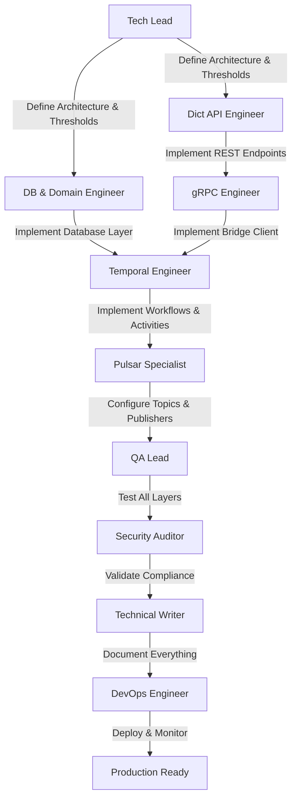

# Projeto: DICT Rate Limit (Token Bucket) - Sistema de Gestão de Baldes de Fichas

## 🎯 Visão Geral Executiva

Implementação profissional do sistema de **Gestão e Monitoramento de Rate Limits (Token Bucket)** do DICT BACEN conforme Manual Operacional Capítulo 19, seguindo os **padrões arquiteturais do Connector-Dict** (Clean Architecture, Event-Driven com Pulsar, Temporal Workflows para monitoramento contínuo).

**Objetivo**: Desenvolver feature production-ready que permite ao PSP LBPay:
1. **Consultar** políticas de limitação (baldes) em tempo real via API DICT
2. **Monitorar** continuamente o estado dos baldes através de workflows Temporal
3. **Alertar** quando baldes estiverem próximos do esgotamento
4. **Armazenar** histórico de consultas para análise e compliance
5. **Integrar** com sistema de observabilidade para dashboards operacionais

## 🪣 Algoritmo Token Bucket - Fundamentos do Rate Limiting

### Conceito Base

O DICT BACEN utiliza o **algoritmo Token Bucket** para controlar o fluxo de requisições. Este é um algoritmo clássico de controle de tráfego baseado na analogia de um "balde de fichas" (tokens).

### Como Funciona o Token Bucket

#### 1. **Estrutura do Balde**

Cada política de limitação (policy) possui um balde com:

```
┌─────────────────────────────────────────────────┐
│              BALDE DE FICHAS                    │
│  Policy: ENTRIES_WRITE                          │
│                                                 │
│  ┌───────────────────────────────────────────┐  │
│  │                                           │  │
│  │   Fichas Disponíveis (AvailableTokens)    │  │
│  │                                           │  │
│  │             35,000                        │  │
│  │                                           │  │
│  │         ████████████████░░░░░░            │  │
│  │                                           │  │
│  └───────────────────────────────────────────┘  │
│                                                 │
│  Capacidade Máxima (Capacity): 36,000           │
│  Utilização: 97.2%                              │
│  Disponível: 2.8% - CRÍTICO!                    │
└─────────────────────────────────────────────────┘

        ▲                          │
        │ Reposição                │ Consumo
        │ (Refill)                 ▼
        │
  +1,200 fichas/min         -1 ficha por requisição
```

#### 2. **Parâmetros Fundamentais**

Para cada política, o DICT retorna 4 parâmetros críticos:

| Parâmetro | Descrição | Exemplo (ENTRIES_WRITE) | Unidade |
|-----------|-----------|-------------------------|---------|
| **AvailableTokens** | Fichas disponíveis no momento da consulta | 35,000 | fichas |
| **Capacity** | Capacidade máxima do balde | 36,000 | fichas |
| **RefillTokens** | Quantidade de fichas adicionadas por período | 1,200 | fichas |
| **RefillPeriodSec** | Período de reposição | 60 | segundos |

#### 3. **Evolução das Fichas ao Longo do Tempo**

##### **Reposição Automática (Refill)**

O DICT BACEN adiciona fichas ao balde periodicamente:

```
Taxa de reposição = RefillTokens / RefillPeriodSec
Exemplo ENTRIES_WRITE: 1,200 fichas / 60 segundos = 20 fichas/segundo
```

**Fórmula de reposição**:
```go
// A cada RefillPeriodSec segundos
tokensToAdd := RefillTokens
if (currentTokens + tokensToAdd) > Capacity {
    currentTokens = Capacity  // Teto máximo
} else {
    currentTokens += tokensToAdd
}
```

**Timeline de reposição**:
```
t=0s:    35,000 fichas
t=60s:   35,000 + 1,200 = 36,000 (atingiu Capacity, descarta excesso)
t=120s:  36,000 (já estava no máximo)
t=180s:  36,000 (sem mudanças)
```

##### **Consumo por Requisição**

Cada vez que o PSP faz uma requisição à API DICT:

```
// Antes da requisição
AvailableTokens = 35,000

// PSP faz POST /entries (criar chave)
AvailableTokens -= 1  // Consome 1 ficha

// Depois da requisição
AvailableTokens = 34,999
```

**Regras de consumo por política**:

| Política | Consumo por Request | Observação |
|----------|---------------------|------------|
| ENTRIES_WRITE | -1 ficha | Status diferente de 500 |
| ENTRIES_READ (status 200) | -1 ficha | Consulta com sucesso |
| ENTRIES_READ (status 404) | -3 fichas | Penalidade por chave inexistente (anti-scan) |
| CLAIMS_WRITE | -1 ficha | Status diferente de 500 |

A política de limitação de requisições do DICT estabelece penalidades elevadas (consumo de mais de 1 ficha) exclusivamente para as operações de consulta de chaves (getEntry e getEntryStatistics) que são consideradas "consultas inválidas" (como consultas a chaves não registradas) e que acionam os mecanismos anti-scan.

##### **Cenário de Esgotamento**

```
Timeline de consumo intenso:

t=0s:     AvailableTokens = 1,000
          PSP faz 500 requisições (1 req/s)
t=500s:   AvailableTokens = 1,000 - 500 = 500
          + Reposição: 8 períodos de 60s = 8 * 1,200 = 9,600 fichas
          AvailableTokens = 500 + 9,600 = 10,100

t=600s:   PSP faz 15,000 requisições em burst (limite de capacidade)
          AvailableTokens = 10,100 - 15,000 = -4,900 ❌

          ⚠️ BALDE ESGOTADO!
          AvailableTokens = 0
          Próximas requisições retornam HTTP 429 (Too Many Requests)

t=660s:   Reposição: +1,200 fichas
          AvailableTokens = 1,200
          PSP pode fazer 1,200 requisições novamente
```

#### 4. **Cálculo de Utilização**

```go
// Fórmula utilizada pelo sistema
utilization_pct := ((Capacity - AvailableTokens) / Capacity) * 100

// Exemplo
Capacity = 36,000
AvailableTokens = 3,000
utilization_pct = ((36,000 - 3,000) / 36,000) * 100 = 91.67%
```

**Interpretação dos níveis**:

| Utilização | AvailableTokens | Severidade | Ação |
|------------|-----------------|------------|------|
| 0-75% | 9,000+ fichas | ✅ Normal | Nenhuma |
| 75-90% | 3,600-9,000 | ⚠️ Warning | Alerta + Log |
| 90-100% | 0-3,600 | 🔴 Critical | Alerta + Notificação PagerDuty |
| 100% | 0 fichas | 💥 Esgotado | HTTP 429 em todas requisições |

#### 5. **Categorias de Participantes (Políticas Variáveis)**

Algumas políticas têm parâmetros diferentes baseados na **categoria do participante**:

**Exemplo: ENTRIES_READ_PARTICIPANT_ANTISCAN**

| Categoria | RefillTokens | Capacity | Taxa (fichas/min) | Volume Diário Máximo |
|-----------|--------------|----------|-------------------|----------------------|
| A | 25,000 | 50,000 | 25,000/min | 36M fichas/dia |
| B | 20,000 | 40,000 | 20,000/min | 28.8M fichas/dia |
| C | 15,000 | 30,000 | 15,000/min | 21.6M fichas/dia |
| D | 8,000 | 16,000 | 8,000/min | 11.5M fichas/dia |
| E | 2,500 | 5,000 | 2,500/min | 3.6M fichas/dia |
| F | 250 | 500 | 250/min | 360K fichas/dia |
| G | 25 | 250 | 25/min | 36K fichas/dia |
| H | 2 | 50 | 2/min | 2.9K fichas/dia |

**Cálculo do volume diário**:
```
Volume diário = (RefillTokens * 60 min/h * 24h/dia) + Capacity inicial
Categoria A = (25,000 * 1,440) + 50,000 = 36,050,000 fichas/dia
```

#### 6. **24 Políticas do DICT BACEN**

O sistema monitora **24 políticas diferentes**:

| Política | RefillTokens | Capacity | RefillPeriodSec | Escopo |
|----------|--------------|----------|-----------------|--------|
| ENTRIES_WRITE | 1,200 | 36,000 | 60 | PSP |
| ENTRIES_UPDATE | 600 | 600 | 60 | PSP |
| ENTRIES_READ_PARTICIPANT_ANTISCAN | Variável | Variável | 60 | PSP (por categoria) |
| ENTRIES_STATISTICS_READ | Variável | Variável | 60 | PSP |
| CLAIMS_READ | 600 | 18,000 | 60 | PSP |
| CLAIMS_WRITE | 1,200 | 36,000 | 60 | PSP |
| CLAIMS_LIST_WITH_ROLE | 40 | 200 | 60 | PSP |
| CLAIMS_LIST_WITHOUT_ROLE | 10 | 50 | 60 | PSP |
| SYNC_VERIFICATIONS_WRITE | 10 | 50 | 60 | PSP |
| CIDS_FILES_WRITE | 40 | 200 | 86,400 (1 dia) | PSP |
| CIDS_FILES_READ | 10 | 50 | 60 | PSP |
| CIDS_EVENTS_LIST | 20 | 100 | 60 | PSP |
| CIDS_ENTRIES_READ | 1,200 | 36,000 | 60 | PSP |
| INFRACTION_REPORTS_READ | 600 | 18,000 | 60 | PSP |
| INFRACTION_REPORTS_WRITE | 1,200 | 36,000 | 60 | PSP |
| INFRACTION_REPORTS_LIST_WITH_ROLE | 40 | 200 | 60 | PSP |
| INFRACTION_REPORTS_LIST_WITHOUT_ROLE | 10 | 50 | 60 | PSP |
| KEYS_CHECK | 70 | 70 | 60 | PSP |
| REFUNDS_READ | 1,200 | 36,000 | 60 | PSP |
| REFUNDS_WRITE | 2,400 | 72,000 | 60 | PSP |
| REFUND_LIST_WITH_ROLE | 40 | 200 | 60 | PSP |
| REFUND_LIST_WITHOUT_ROLE | 10 | 50 | 60 | PSP |
| FRAUD_MARKERS_READ | 600 | 18,000 | 60 | PSP |
| FRAUD_MARKERS_WRITE | 1,200 | 36,000 | 60 | PSP |

#### 7. **Implicações para Monitoramento**

##### **Por que monitorar a cada 5 minutos?**

```
Cenário crítico:
- Policy: CLAIMS_LIST_WITHOUT_ROLE
- Capacity: 50 fichas
- RefillTokens: 10 fichas/min
- Consumo médio: 8 fichas/min (uso normal)

Se houver pico de consumo:
- t=0min: AvailableTokens = 50
- t=1min: 50 - 8 + 10 = 52 (ok)
- t=2min: 52 - 8 + 10 = 54 (ok)
- t=3min: PICO! 54 - 60 = -6 → AvailableTokens = 0 ❌

Monitoramento a cada 5min:
- Pode detectar balde em 0 muito tarde
- Solução: Cron a cada 5min + alertas em WARNING (20%) e CRITICAL (10%)
- ⚠️ SEM CACHE - Sempre consultar DICT para dados frescos
```

##### **Thresholds definidos (baseado em DUVIDAS.md)**

```go
// WARNING: 20% de capacidade restante (80% utilizado)
WARNING_THRESHOLD := Capacity * 0.20

// CRITICAL: 10% de capacidade restante (90% utilizado)
CRITICAL_THRESHOLD := Capacity * 0.10

// Exemplo ENTRIES_WRITE (Capacity = 36,000)
WARNING := 7,200 fichas (80% utilizado)
CRITICAL := 3,600 fichas (90% utilizado)
```

**Estratégia de alerta**:

| AvailableTokens | Utilização | Threshold | Ação |
|-----------------|------------|-----------|------|
| > 7,200 | < 80% | Normal | Nenhuma |
| 3,600 - 7,200 | 80-90% | WARNING | Log + Metrics + Pulsar Event |
| 0 - 3,600 | 90-100% | CRITICAL | Log + Metrics + Pulsar + Prometheus AlertManager |

#### 8. **Resposta do DICT quando Balde Esgota**

Quando `AvailableTokens = 0`:

```xml
HTTP/1.1 429 Too Many Requests
Content-Type: application/xml

<?xml version="1.0" encoding="UTF-8" ?>
<Problem>
    <Type>https://dict.pi.rsfn.net.br/api/v2/error/TooManyRequests</Type>
    <Title>Too Many Requests</Title>
    <Status>429</Status>
    <Detail>Policy ENTRIES_WRITE exceeded rate limit. Please retry after 60 seconds.</Detail>
</Problem>
```

**Impacto no negócio**:
- ❌ Chaves PIX não podem ser criadas
- ❌ Claims não podem ser processados
- ❌ Operações críticas bloqueadas
- 💰 Perda de receita potencial
- 📉 SLA degradado

**Por isso o monitoramento preventivo é CRÍTICO!**

---

## 📋 Escopo do Projeto

### ✅ In Scope

#### 1. **Dict API - Endpoints REST** (`apps/dict`)
- **GET /api/v1/policies** - Listar todas as políticas de limitação do participante
- **GET /api/v1/policies/{policy}** - Consultar política específica
- Validação de schemas (request/response)
- Integração com Bridge gRPC (chamadas síncronas ao DICT BACEN)
- Cache Redis para reduzir latência (TTL configurável)
- Error handling conforme RFC 9457

#### 2. **Orchestration Worker - Workflows Temporal** (`apps/orchestration-worker`)
- **MonitorPoliciesWorkflow** - Workflow cron (a cada 5 minutos) para monitoramento contínuo
- **AlertLowBalanceWorkflow** - Child workflow para disparar alertas quando balde < threshold
- **Activities**:
  - `GetPoliciesActivity` - Consultar API DICT via Bridge
  - `StorePolicyStateActivity` - Persistir estado em PostgreSQL
  - `AnalyzeBalanceActivity` - Analisar níveis e identificar riscos
  - `PublishAlertActivity` - Publicar eventos Pulsar para sistemas de alerta
  - `PublishMetricsActivity` - Publicar métricas para observability

#### 3. **Database Layer - PostgreSQL**
- Tabela `dict_rate_limit_policies` - Configuração de políticas
- Tabela `dict_rate_limit_states` - Histórico de estados dos baldes
- Tabela `dict_rate_limit_alerts` - Log de alertas disparados
- Indexes otimizados para queries de análise temporal

#### 4. **Pulsar Event Integration**
- Topic `persistent://lb-conn/dict/rate-limit-alerts` - Alertas de baldes baixos
- Topic `persistent://lb-conn/dict/core-events` - Notificações para Core-Dict
- Consumers externos podem integrar para tomar ações automáticas

#### 5. **Observability & Monitoring**
- Métricas Prometheus:
  - `dict_rate_limit_available_tokens{policy="ENTRIES_WRITE"}` - Gauge
  - `dict_rate_limit_capacity{policy="ENTRIES_WRITE"}` - Gauge
  - `dict_rate_limit_utilization{policy="ENTRIES_WRITE"}` - Gauge (%)
  - `dict_rate_limit_alerts_total` - Counter
  - `dict_rate_limit_404_rate{policy="ENTRIES_READ"}` - Gauge (anti-scan detection)
  - `dict_rate_limit_recovery_eta_seconds{policy="ENTRIES_WRITE"}` - Gauge
  - `dict_rate_limit_exhaustion_projection_seconds{policy="ENTRIES_WRITE"}` - Gauge
- Prometheus AlertManager (local) - Alertas configurados via rules
- Traces OpenTelemetry para debugging
- **Grafana dashboards**: Pós-lançamento (time de infra cria depois)
- **PagerDuty/Slack**: Pós-lançamento (se necessário, configurado por SRE)

#### 6. **Testing & Quality**
- Unit tests (>85% coverage)
- Integration tests com Testcontainers (PostgreSQL + Pulsar + Redis)
- Temporal workflow replay tests
- Load tests (simular DICT response delays)

### ❌ Out of Scope
- **NÃO** implementar lógica de controle de rate limit (isso é responsabilidade do DICT BACEN)
- **NÃO** implementar rate limiting local (apenas monitoramento do que o DICT informa)
- **NÃO** modificar Bridge gRPC (verificar se endpoints existem; coordenar se necessário)
- **NÃO** modificar Core-Dict (apenas consumir eventos Pulsar)
- **NÃO** implementar UI/frontend (apenas backend APIs e workflows)

## 🏗️ Arquitetura Detalhada

### Stack Tecnológica (Conforme Connector-Dict)
- **Language**: Go 1.24.5
- **HTTP Framework**: Huma v2 (Dict API)
- **Database**: PostgreSQL (compartilhado com connector-dict)
- **Message Broker**: Apache Pulsar (tópicos novos + reuso de tópico core-events)
- **Workflow Engine**: Temporal (workflows cron + child workflows)
- **RPC Protocol**: gRPC (Bridge para comunicação com DICT BACEN)
- **Cache**: ❌ **REMOVIDO** - Sempre consultar DICT para dados frescos (sem Redis para rate limit)
- **Observability**: OpenTelemetry + Prometheus + Prometheus AlertManager
- **Testing**: Testify, MockGen, Testcontainers
- **Timezone**: UTC forçado em todos os componentes (`TZ=UTC`)
- **Timestamp Authority**: DICT `<ResponseTime>` (não `time.Now()`)

### Arquitetura de Integração

```
┌────────────────────────────────────────────────────────────────────────┐
│                      CONNECTOR-DICT (Existente)                         │
│                                                                         │
│  ┌──────────────────────────────────────────────────────────────────┐  │
│  │   Dict API (apps/dict) - NOVOS ENDPOINTS                         │  │
│  │                                                                  │  │
│  │   GET /api/v1/policies          → ListPolicies                  │  │
│  │   GET /api/v1/policies/{policy} → GetPolicy                     │  │
│  │                                                                  │  │
│  │   - Validação de schema (Huma)                                  │  │
│  │   - ❌ SEM CACHE - Sempre consultar DICT via Bridge            │  │
│  │   - gRPC Bridge Client (síncrono)                               │  │
│  │   - Error handling (RFC 9457)                                   │  │
│  │   - Timestamp do DICT (<ResponseTime>) para auditoria          │  │
│  └──────────────────────────────────────────────────────────────────┘  │
│           │                                                             │
│           │ gRPC call (sync)                                            │
│           ▼                                                             │
│  ┌──────────────────────────────────────────────────────────────────┐  │
│  │   Bridge gRPC Client                                             │  │
│  │   (infrastructure/grpc/ratelimit/)                               │  │
│  │                                                                  │  │
│  │   - BridgeRateLimitClient.ListPolicies()                        │  │
│  │   - BridgeRateLimitClient.GetPolicy(policyName)                 │  │
│  │   - Mappers: Bacen ↔ gRPC (reutilizar do SDK)                  │  │
│  └──────────────────────────────────────────────────────────────────┘  │
└────────────────────────────────────────────────────────────────────────┘

                              │
                              │ HTTPS REST API (via Bridge)
                              ▼

┌────────────────────────────────────────────────────────────────────────┐
│                      DICT BACEN API                                     │
│                    Capítulo 19: Consulta de Baldes                      │
│                                                                         │
│  GET /policies/                                                        │
│    Response: ListPoliciesResponse (XML)                                │
│      - Category: A/B/C/D/E/F/G/H                                       │
│      - Policies[]:                                                     │
│          - Name: "ENTRIES_WRITE"                                       │
│          - AvailableTokens: 35000                                      │
│          - Capacity: 36000                                             │
│          - RefillTokens: 1200                                          │
│          - RefillPeriodSec: 60                                         │
│                                                                         │
│  GET /policies/{policy}                                                │
│    Response: GetPolicyResponse (XML)                                   │
│      - Category: A                                                     │
│      - Policy: {...}                                                   │
└────────────────────────────────────────────────────────────────────────┘

                              ▲
                              │ Consultas via Bridge
                              │

┌────────────────────────────────────────────────────────────────────────┐
│           ORCHESTRATION WORKER - NOVOS WORKFLOWS                        │
│                    (apps/orchestration-worker)                          │
│                                                                         │
│  ┌──────────────────────────────────────────────────────────────────┐  │
│  │  Temporal Cron Workflow: MonitorPoliciesWorkflow                │  │
│  │  Schedule: "*/5 * * * *" (a cada 5 minutos)                     │  │
│  │  Location: infrastructure/temporal/workflows/ratelimit/          │  │
│  │                                                                  │  │
│  │  Loop de Monitoramento:                                          │  │
│  │    1. GetPoliciesActivity()                                      │  │
│  │       - gRPC call to Bridge → DICT BACEN                        │  │
│  │       - Retorna lista de todas as policies do PSP                │  │
│  │                                                                  │  │
│  │    2. StorePolicyStateActivity(policies)                         │  │
│  │       - Persiste em PostgreSQL (dict_rate_limit_states)         │  │
│  │       - Timestamp + snapshot completo                           │  │
│  │                                                                  │  │
│  │    3. AnalyzeBalanceActivity(policies)                           │  │
│  │       - Calcula % de utilização (used/capacity)                 │  │
│  │       - Identifica políticas em risco:                          │  │
│  │         * CRITICAL: <10% disponível                             │  │
│  │         * WARNING: <25% disponível                              │  │
│  │       - Retorna lista de alerts                                 │  │
│  │                                                                  │  │
│  │    4. Se alerts.length > 0:                                      │  │
│  │       - PublishAlertActivity(alerts)                            │  │
│  │         * Pulsar topic: rate-limit-alerts                       │  │
│  │         * CoreEvents para Core-Dict                             │  │
│  │       - StoreAlertsActivity(alerts)                             │  │
│  │         * PostgreSQL: dict_rate_limit_alerts                    │  │
│  │                                                                  │  │
│  │    5. PublishMetricsActivity(policies)                           │  │
│  │       - Prometheus Pushgateway (ou metrics endpoint)            │  │
│  │       - Gauges para cada policy                                 │  │
│  │                                                                  │  │
│  │    6. Sleep até próximo cron trigger                             │  │
│  └──────────────────────────────────────────────────────────────────┘  │
│                                                                         │
│  ┌──────────────────────────────────────────────────────────────────┐  │
│  │  Child Workflow: AlertLowBalanceWorkflow (opcional)              │  │
│  │  Trigger: On-demand quando threshold atingido                   │  │
│  │                                                                  │  │
│  │  Fluxo:                                                          │  │
│  │    1. RecordAlertActivity(policy, severity)                      │  │
│  │    2. NotifyOpsTeamActivity(alert) - PagerDuty/Slack            │  │
│  │    3. PublishCoreEventsActivity(alert)                          │  │
│  │    4. Se CRITICAL:                                               │  │
│  │       - ThrottleRequestsActivity (integrar com rate limiter?)   │  │
│  │       - NOTA: Fora de escopo inicial - apenas alerta            │  │
│  └──────────────────────────────────────────────────────────────────┘  │
└────────────────────────────────────────────────────────────────────────┘

                              │
                              │ Persist
                              ▼

┌────────────────────────────────────────────────────────────────────────┐
│                    PostgreSQL (Compartilhado)                           │
│                                                                         │
│  Tables (NOVAS):                                                       │
│                                                                         │
│  dict_rate_limit_policies                                              │
│    - id (PK)                                                           │
│    - policy_name (unique)                                              │
│    - capacity_max (int)                                                │
│    - refill_tokens (int)                                               │
│    - refill_period_sec (int)                                           │
│    - warning_threshold_pct (default 25)                                │
│    - critical_threshold_pct (default 10)                               │
│    - enabled (bool)                                                    │
│    - created_at, updated_at                                            │
│                                                                         │
│  dict_rate_limit_states                                                │
│    - id (PK)                                                           │
│    - policy_name (FK)                                                  │
│    - available_tokens (int)                                            │
│    - capacity (int)                                                    │
│    - utilization_pct (decimal)                                         │
│    - psp_category (varchar) - A/B/C/D/E/F/G/H (NOVO)                  │
│    - consumption_rate_per_minute (int) - Para projeções (NOVO)        │
│    - recovery_eta_seconds (int) - Tempo até 100% (NOVO)               │
│    - exhaustion_projection_seconds (int) - Projeção esgotamento (NOVO)│
│    - error_404_rate (decimal) - Taxa de erros 404 (NOVO)              │
│    - checked_at (timestamp) - Timestamp do DICT (<ResponseTime>)      │
│    - created_at                                                        │
│    - INDEX (policy_name, checked_at)                                   │
│    - Partition by RANGE (checked_at) - mensais (13 meses)             │
│                                                                         │
│  dict_rate_limit_alerts                                                │
│    - id (PK)                                                           │
│    - policy_name (FK)                                                  │
│    - severity (enum: WARNING, CRITICAL)                                │
│    - available_tokens (int)                                            │
│    - capacity (int)                                                    │
│    - utilization_pct (decimal)                                         │
│    - message (text)                                                    │
│    - resolved (bool)                                                   │
│    - resolved_at (timestamp)                                           │
│    - created_at                                                        │
│    - INDEX (policy_name, severity, created_at)                         │
└────────────────────────────────────────────────────────────────────────┘

                              │
                              │ Publish Events
                              ▼

┌────────────────────────────────────────────────────────────────────────┐
│                         Apache Pulsar                                   │
│                                                                         │
│  Topic: persistent://lb-conn/dict/rate-limit-alerts                   │
│    Schema: Avro/JSON                                                   │
│    {                                                                   │
│      "timestamp": "2025-10-31T10:30:00Z",                             │
│      "policy": "ENTRIES_WRITE",                                        │
│      "severity": "CRITICAL",                                           │
│      "available": 3000,                                                │
│      "capacity": 36000,                                                │
│      "utilization": 91.7,                                              │
│      "message": "ENTRIES_WRITE balde em nível crítico (8.3%)"         │
│    }                                                                   │
│                                                                         │
│  Topic: persistent://lb-conn/dict/core-events (existente)             │
│    Action: ActionRateLimitAlert                                        │
└────────────────────────────────────────────────────────────────────────┘

                              │
                              │ Subscribe
                              ▼

┌────────────────────────────────────────────────────────────────────────┐
│                            CORE-DICT                                    │
│                     (Consumer Pulsar - Opcional)                        │
│                                                                         │
│  Pode consumir alertas e tomar ações:                                  │
│  - Dashboard de visualização                                           │
│  - Integração com sistemas de alerta (PagerDuty/Slack)                │
│  - Logs de auditoria                                                   │
└────────────────────────────────────────────────────────────────────────┘
```

## 👥 Squad Especializada

### 🎯 Core Implementation Team

#### 1. Tech Lead & Solution Architect (Opus) ⭐
**Modelo**: Claude Opus 4
**Responsabilidades**:
- Arquitetura de integração com Dict API + Orchestration Worker
- Design do schema PostgreSQL (policies + states + alerts)
- Definição de Temporal Workflows (Cron + Child)
- Padrões de integração Pulsar (topics, schemas)
- Estratégia de integração com Bridge gRPC (verificar endpoints existentes)
- Thresholds de alerta (WARNING: 20%, CRITICAL: 10%) - VALIDADO
- Code review de todas implementações
- Decisões técnicas (sem cache, frequência monitoramento 5min)

**Arquivos**: `.claude/agents/ratelimit/tech-lead.md`

---

#### 2. Dict API Engineer (Sonnet)
**Modelo**: Claude Sonnet 4
**Responsabilidades**:
- Implementar endpoints GET /policies e GET /policies/{policy}
- Schemas (request/response) seguindo padrão Huma
- Controllers e handlers HTTP
- Application layer (use cases)
- Integração com Bridge gRPC Client
- ❌ **SEM CACHE** - Sempre consultar DICT via Bridge
- Error handling (RFC 9457)
- Parsear `<ResponseTime>` do DICT para auditoria
- Testes unitários e de integração

**Arquivos**: `.claude/agents/ratelimit/dict-api-engineer.md`

**Estrutura de arquivos**:
```
apps/dict/
├── handlers/http/
│   ├── schemas/ratelimit/
│   │   ├── list_policies.go
│   │   └── get_policy.go
│   └── ratelimit/
│       ├── controller.go
│       ├── list_policies_handler.go
│       └── get_policy_handler.go
├── application/ratelimit/
│   ├── application.go
│   ├── interface.go
│   ├── list_policies.go
│   └── get_policy.go
└── infrastructure/grpc/ratelimit/
    └── client.go
```

---

#### 3. Database & Domain Engineer (Sonnet)
**Modelo**: Claude Sonnet 4
**Responsabilidades**:
- Schema PostgreSQL (migrations + indexes + partitioning 13 meses)
- Repository layer (`infrastructure/database/repositories/ratelimit/`)
- Domain entities (`domain/ratelimit/`: Policy, PolicyState, Alert)
- Business logic (cálculo de utilização, análise de thresholds)
- **Novos cálculos**: ETA recovery, projeção de esgotamento, 404 rate
- **Category monitoring**: Detectar mudanças de categoria PSP
- Performance optimization (partition by range, batch inserts)

**Arquivos**: `.claude/agents/ratelimit/db-domain-engineer.md`

**Migrations**:
```
infrastructure/database/migrations/
├── 001_create_dict_rate_limit_policies.sql
├── 002_create_dict_rate_limit_states.sql
├── 003_create_dict_rate_limit_alerts.sql
└── 004_create_indexes_and_partitions.sql
```

---

#### 4. Temporal Workflow Engineer (Sonnet)
**Modelo**: Claude Sonnet 4
**Responsabilidades**:
- Cron Workflow: MonitorPoliciesWorkflow (*/5 * * * *)
- Child Workflow: AlertLowBalanceWorkflow (opcional)
- Temporal Activities:
  - GetPoliciesActivity (gRPC call → usa timestamp DICT)
  - StorePolicyStateActivity (PostgreSQL → salva category, ETA, projection)
  - AnalyzeBalanceActivity (business logic → thresholds 20%/10%)
  - CalculateETAActivity (recovery time calculation)
  - CalculateProjectionActivity (exhaustion projection)
  - DetectCategoryChangeActivity (PSP category monitoring)
  - PublishAlertActivity (Pulsar)
  - StoreAlertsActivity (PostgreSQL)
  - PublishMetricsActivity (Prometheus → inclui 404 rate)
- Retry policies e error handling
- Workflow testing (replay, mocking)

**Arquivos**: `.claude/agents/ratelimit/temporal-engineer.md`

**Estrutura de arquivos**:
```
apps/orchestration-worker/
├── infrastructure/temporal/
│   ├── workflows/ratelimit/
│   │   ├── monitor_policies_workflow.go
│   │   ├── alert_low_balance_workflow.go
│   │   └── shared.go
│   └── activities/ratelimit/
│       ├── ratelimit_activity.go
│       ├── get_policies_activity.go
│       ├── store_state_activity.go
│       ├── analyze_balance_activity.go
│       ├── publish_alert_activity.go
│       ├── store_alerts_activity.go
│       └── publish_metrics_activity.go
```

---

#### 5. Pulsar & Event Integration Specialist (Sonnet)
**Modelo**: Claude Sonnet 4
**Responsabilidades**:
- Pulsar Topic configuration (rate-limit-alerts)
- Event schema validation (Avro/JSON)
- Publishers (AlertPublisher, MetricsPublisher)
- Integration com CoreEvents topic existente
- Schema evolution strategy
- Dead-letter queue setup (optional)

**Arquivos**: `.claude/agents/ratelimit/pulsar-specialist.md`

---

#### 6. gRPC & Bridge Integration Engineer (Sonnet)
**Modelo**: Claude Sonnet 4
**Responsabilidades**:
- gRPC client para Bridge (`infrastructure/grpc/ratelimit/`)
- **AÇÃO CRÍTICA**: Verificar se Bridge JÁ tem endpoints de Policies
  - Se SIM: Reutilizar proto definitions existentes
  - Se NÃO: Coordenar com time Bridge para implementação
- Proto definitions (se necessário):
  - `ListPoliciesRequest/Response`
  - `GetPolicyRequest/Response`
- Mappers (Bacen ↔ gRPC) - reutilizar do SDK se possível
- mTLS configuration (reutilizar do grpcGateway)
- Error handling (convert gRPC errors to bacen.Problem)
- Integration testing com mock Bridge

**Arquivos**: `.claude/agents/ratelimit/grpc-engineer.md`

---

### 🧪 Quality Assurance Team

#### 7. QA Lead & Test Architect (Opus) ⭐
**Modelo**: Claude Opus 4
**Responsabilidades**:
- Estratégia de testes (unit, integration, workflow replay)
- Test coverage >85% enforcement
- Mock design (Bridge, DICT API, PostgreSQL, Pulsar)
- Temporal workflow testing (deterministic replay)
- Test data generation (políticas sintéticas)
- Load tests (simular latência DICT)

**Arquivos**: `.claude/agents/ratelimit/qa-lead.md`

---

#### 8. Security & BACEN Compliance Auditor (Opus) ⭐
**Modelo**: Claude Opus 4
**Responsabilidades**:
- BACEN Manual Cap. 19 compliance (100% validation)
- Security audit (SQL injection, secrets management)
- Validação de schemas XML ↔ Go structs
- LGPD compliance (dados sensíveis em logs/métricas)
- Audit trail completeness (todas consultas logadas)

**Arquivos**: `.claude/agents/ratelimit/security-auditor.md`

---

### 📚 Documentation & Operations Team

#### 9. Technical Writer (Sonnet)
**Modelo**: Claude Sonnet 4
**Responsabilidades**:
- Architecture diagrams (Mermaid)
- Database schema documentation
- Workflow documentation (MonitorPolicies, Alerts)
- Operational runbooks (troubleshooting)
- Environment setup guide
- Migration guide (deploy to production)

**Arquivos**: `.claude/agents/ratelimit/technical-writer.md`

---

#### 10. DevOps & SRE Engineer (Sonnet)
**Modelo**: Claude Sonnet 4
**Responsabilidades**:
- Database migrations (Goose - VALIDADO)
- Temporal cron configuration (*/5 * * * *)
- Pulsar topic creation/configuration
- Kubernetes manifests (diretos, sem Helm - VALIDADO)
- Environment variables (TZ=UTC forçado)
- **Grafana dashboards**: Pós-lançamento (time de infra cria)
- Alerts (Prometheus AlertManager: rate limit critical/warning)
- **PagerDuty/Slack**: Pós-lançamento (se necessário)
- ✅ **Secrets Management**: AWS Secrets Manager (VALIDADO)
  - mTLS certificates (Bridge ↔ DICT)
  - Bridge endpoint configuration
  - Database credentials
- Disaster recovery procedures

**Arquivos**: `.claude/agents/ratelimit/devops-engineer.md`

---

## 📂 Estrutura de Arquivos

```
connector-dict/  (branch: balde_dict)
├── apps/
│   ├── dict/
│   │   ├── handlers/http/
│   │   │   ├── schemas/ratelimit/                      # NEW
│   │   │   │   ├── list_policies.go
│   │   │   │   └── get_policy.go
│   │   │   └── ratelimit/                              # NEW
│   │   │       ├── controller.go
│   │   │       ├── list_policies_handler.go
│   │   │       └── get_policy_handler.go
│   │   ├── application/ratelimit/                       # NEW
│   │   │   ├── application.go
│   │   │   ├── interface.go
│   │   │   ├── list_policies.go
│   │   │   └── get_policy.go
│   │   └── infrastructure/grpc/ratelimit/               # NEW
│   │       └── client.go
│   │
│   └── orchestration-worker/
│       ├── application/
│       │   ├── usecases/ratelimit/                      # NEW
│       │   │   ├── application.go
│       │   │   └── monitor_policies.go
│       │   └── ports/
│       │       └── ratelimit_service.go                 # NEW interface
│       │
│       ├── infrastructure/
│       │   ├── database/
│       │   │   ├── migrations/                          # NEW
│       │   │   │   ├── 001_create_dict_rate_limit_policies.sql
│       │   │   │   ├── 002_create_dict_rate_limit_states.sql
│       │   │   │   ├── 003_create_dict_rate_limit_alerts.sql
│       │   │   │   └── 004_create_indexes_and_partitions.sql
│       │   │   └── repositories/
│       │   │       └── ratelimit/                       # NEW
│       │   │           ├── policy_repository.go
│       │   │           ├── state_repository.go
│       │   │           └── alert_repository.go
│       │   │
│       │   ├── grpc/
│       │   │   └── ratelimit/                           # NEW
│       │   │       └── bridge_ratelimit_client.go
│       │   │
│       │   └── temporal/
│       │       ├── workflows/
│       │       │   └── ratelimit/                       # NEW
│       │       │       ├── monitor_policies_workflow.go
│       │       │       ├── alert_low_balance_workflow.go
│       │       │       └── shared.go
│       │       │
│       │       ├── activities/
│       │       │   └── ratelimit/                       # NEW
│       │       │       ├── ratelimit_activity.go
│       │       │       ├── get_policies_activity.go
│       │       │       ├── store_state_activity.go
│       │       │       ├── analyze_balance_activity.go
│       │       │       ├── publish_alert_activity.go
│       │       │       ├── store_alerts_activity.go
│       │       │       └── publish_metrics_activity.go
│       │       │
│       │       └── services/
│       │           └── ratelimit_service.go             # NEW
│       │
│       └── setup/
│           ├── config.go         # ADD: Pulsar topics, cron schedule
│           ├── temporal.go       # ADD: Register workflows/activities + START CRON
│           └── setup.go          # ADD: Wire ratelimit dependencies
│
├── domain/ratelimit/                                    # NEW
│   ├── policy.go
│   ├── policy_state.go
│   ├── alert.go
│   └── threshold.go
│
└── shared/
    └── proto/
        └── ratelimit/                                   # NEW (se Bridge não tiver)
            └── dict_ratelimit_service.proto
```

## 📖 Metodologia de Trabalho

### Workflow de Desenvolvimento



### Princípios (Seguindo Connector-Dict)
1. **Clean Architecture**: Domain → Application → Infrastructure → Handlers
2. **Event-Driven**: Pulsar events para alertas assíncronos
3. **Temporal Workflows**: Para monitoramento contínuo com cron
4. **Repository Pattern**: Acesso a dados via interfaces
5. **gRPC via Bridge**: Toda comunicação com DICT via Bridge
6. **Observability First**: OpenTelemetry em todas as camadas
7. **Test-Driven**: Tests antes de implementação
8. **BACEN Compliance**: 100% conformidade com Manual Cap. 19

### Padrões de Qualidade
- **Test Coverage**: >85%
- **Go Idiomaticity**: golangci-lint score A
- **Security**: Validação de inputs, secrets management
- **Performance**: Queries otimizados (indexes, partitions)
- **Observability**: Full OpenTelemetry instrumentation

## 🚀 Fases de Execução

### Fase 0: Coordenação & Análise (2 dias)
**Objetivo**: Verificar dependências externas

**Deliverables**:
- [x] **CRÍTICO**: Coordenar com time Bridge ✅ CONCLUÍDO
  - ✅ Endpoints `/policies` e `/policies/{policy}` EXISTEM
  - ✅ Mappers XML ↔ gRPC disponíveis
  - ✅ Sem bloqueadores de integração
- [ ] Analisar estrutura de Entry/Key do connector-dict (domain layer)
- [ ] Verificar conexão PostgreSQL existente (reutilizar configuração)
- [ ] Verificar Pulsar setup atual (topics, publishers)
- [ ] Documentar descobertas em `ANALISE_DEPENDENCIAS.md`
- [ ] ⚠️ **Pendente**: Consultar categoria PSP real do LBPay (A-H)
- [x] ✅ **RESOLVIDO**: Secrets management = AWS Secrets Manager

---

### Fase 1: Dict API Implementation (Semana 1)
**Objetivo**: Endpoints REST funcionais

**Deliverables**:
- [ ] Schemas (ListPoliciesRequest/Response, GetPolicyRequest/Response)
- [ ] Controllers e handlers HTTP
- [ ] Application layer (use cases)
- [ ] Bridge gRPC Client
- [ ] ❌ **REMOVIDO**: Cache Redis (sempre consultar DICT)
- [ ] Parsear `<ResponseTime>` do DICT para timestamp de auditoria
- [ ] Unit tests (>90% coverage)
- [ ] Integration tests com mock Bridge

---

### Fase 2: Database Layer (Semana 1)
**Objetivo**: Schema e repositories

**Deliverables**:
- [ ] Migrations SQL (3 tabelas + indexes + partitions 13 meses)
- [ ] Adicionar colunas: `psp_category`, `consumption_rate_per_minute`, `recovery_eta_seconds`, `exhaustion_projection_seconds`, `error_404_rate`
- [ ] Repository interfaces (domain/ratelimit/)
- [ ] Repository implementations (infrastructure/database/repositories/ratelimit/)
- [ ] Unit tests (>90% coverage)
- [ ] Performance test (queries otimizados)

---

### Fase 3: Domain & Business Logic (Semana 2)
**Objetivo**: Lógica de análise de thresholds

**Deliverables**:
- [ ] Domain entities (Policy, PolicyState, Alert)
- [ ] Threshold analyzer (WARNING: 20%, CRITICAL: 10%) - CORRIGIDO
- [ ] Utilization calculator (available/capacity * 100)
- [ ] **NOVO**: ETA recovery calculator (tempo até 100% de fichas)
- [ ] **NOVO**: Exhaustion projection calculator (projeção de esgotamento)
- [ ] **NOVO**: Error 404 rate calculator (anti-scan detection)
- [ ] **NOVO**: Category change detector (PSP category monitoring)
- [ ] Unit tests com casos de teste variados

---

### Fase 4: Temporal Workflows (Semana 2-3)
**Objetivo**: Orquestração de monitoramento

**Deliverables**:
- [ ] MonitorPoliciesWorkflow (cron: */5 * * * *)
- [ ] AlertLowBalanceWorkflow (child workflow opcional)
- [ ] Todas as activities (6+ activities)
- [ ] Temporal Service implementation
- [ ] Setup cron em temporal.go
- [ ] Workflow replay tests

---

### Fase 5: Pulsar Integration (Semana 3)
**Objetivo**: Event publishing

**Deliverables**:
- [ ] Topic configuration (rate-limit-alerts)
- [ ] AlertPublisher implementation
- [ ] MetricsPublisher implementation
- [ ] Schema definitions (Avro/JSON)
- [ ] Integration tests com Testcontainers

---

### Fase 6: Observability (Semana 3)
**Objetivo**: Métricas e alertas

**Deliverables**:
- [ ] Prometheus metrics (gauges para cada policy)
- [ ] **NOVO**: Métrica `dict_rate_limit_404_rate` (anti-scan)
- [ ] **NOVO**: Métrica `dict_rate_limit_recovery_eta_seconds`
- [ ] **NOVO**: Métrica `dict_rate_limit_exhaustion_projection_seconds`
- [ ] ❌ **REMOVIDO**: Grafana dashboard template (pós-lançamento)
- [ ] OpenTelemetry traces
- [ ] Alert rules (Prometheus AlertManager)
- [ ] ❌ **REMOVIDO**: PagerDuty/Slack integration (pós-lançamento)

---

### Fase 7: Quality & Compliance (Semana 4)
**Objetivo**: Testing e validation

**Deliverables**:
- [ ] E2E tests (full flow)
- [ ] Load tests (simular latência DICT)
- [ ] Security audit
- [ ] BACEN compliance checklist (100%)
- [ ] Code review completo

---

### Fase 8: Documentation & Deployment (Semana 4)
**Objetivo**: Production readiness

**Deliverables**:
- [ ] Architecture docs + diagrams
- [ ] Operational runbooks
- [ ] Monitoring dashboards
- [ ] Alerts configuration
- [ ] Migration scripts
- [ ] Rollback procedures

## 📊 Métricas de Sucesso

| Métrica | Target | Medição |
|---------|--------|---------|
| Test Coverage | >85% | go test -cover |
| API Response Time (p99) | <200ms | Prometheus histogram |
| ❌ Cache Hit Rate | N/A | Removido (sem cache) |
| Workflow Success Rate | >99% | Temporal dashboard |
| Alert Accuracy | 100% | Manual validation |
| Database Query Time (p99) | <50ms | pgx metrics |
| BACEN Compliance | 100% | Security audit |
| Cron Execution Success | >99.9% | Temporal metrics |
| Error 404 Rate | <20% | Prometheus gauge |
| Recovery ETA Accuracy | ±5% | Domain logic validation |
| Exhaustion Projection Accuracy | ±10% | Domain logic validation |
| Category Change Detection | 100% | Event log validation |

## 🔗 Referências

- **BACEN Manual**: Capítulo 19 - Consulta de Baldes (RF_Dict_Bacen.md)
- **Connector-Dict**: [github.com/lb-conn/connector-dict](https://github.com/lb-conn/connector-dict)
- **Bridge**: [github.com/lb-conn/rsfn-connect-bacen-bridge](https://github.com/lb-conn/rsfn-connect-bacen-bridge)
- **Instruções Dict API**: `.claude/Specs_do_Stackholder/instrucoes-app-dict.md`
- **Instruções Orchestration Worker**: `.claude/Specs_do_Stackholder/instrucoes-orchestration-worker.md`
- **Instruções Gerais**: `.claude/Specs_do_Stackholder/instrucoes-gerais.md`
- **Arquitetura Token Bucket**: `.claude/Specs_do_Stackholder/arquiteto_Stacholder.md`

---

## 🎯 Próximos Passos Imediatos

1. ✅ **Coordenar com Time Bridge** - CONCLUÍDO
   - ✅ Endpoints `/policies` e `/policies/{policy}` EXISTEM
   - ✅ Mappers XML ↔ gRPC disponíveis
   - ✅ Sem bloqueadores de integração

2. ✅ **Definir Thresholds Definitivos** - VALIDADO
   - ✅ WARNING: 20% restante (80% utilizado)
   - ✅ CRITICAL: 10% restante (90% utilizado)

3. ⚠️ **Pendências Críticas**
   - ⚠️ Consultar categoria PSP real do LBPay (A-H) via DICT
   - ✅ Secrets management = AWS Secrets Manager (RESOLVIDO)

4. **Iniciar Fase 1** (Dict API Engineer)
   - Criar schemas seguindo padrão Huma
   - Implementar controllers (SEM cache)
   - Parsear `<ResponseTime>` do DICT

5. **Paralelizar Fase 2** (DB & Domain Engineer)
   - Criar migrations com novas colunas (category, ETA, projection, 404_rate)
   - Implementar repositories

---

## 📝 Histórico de Mudanças

### 2025-11-01 - Atualização baseada em DUVIDAS.md
- 🔴 Threshold WARNING corrigido: 25% → 20%
- 🔴 Cache Redis removido (sempre consultar DICT)
- 🔴 Grafana/PagerDuty movidos para pós-lançamento
- ➕ Adicionadas métricas de 404 rate (anti-scan)
- ➕ Adicionado cálculo de ETA recovery
- ➕ Adicionada projeção de esgotamento
- ➕ Adicionado monitoramento de mudança de categoria PSP
- ➕ Timestamp do DICT (`<ResponseTime>`) como autoridade
- ➕ Timezone UTC forçado (`TZ=UTC`)
- ✅ Bridge endpoints confirmados (sem bloqueadores)
- ✅ AWS Secrets Manager definido (mTLS, DB credentials)
- ⚠️ Categoria PSP pendente (necessita consulta real ao DICT)

Veja [CHANGES_REPORT.md](../../CHANGES_REPORT.md) para detalhes completos.
Veja [BRIDGE_ENDPOINTS_RATE_LIMIT.md](./.claude/BRIDGE_ENDPOINTS_RATE_LIMIT.md) para integração com Bridge.

---

**Última Atualização**: 2025-11-01
**Responsável**: Tech Lead
**Status**: ✅ ESPECIFICAÇÃO ATUALIZADA - PRONTO PARA FASE 1 (Implementação)

**Próximo Passo**: Iniciar Fase 1 (Dict API) e Fase 2 (Database) em paralelo
