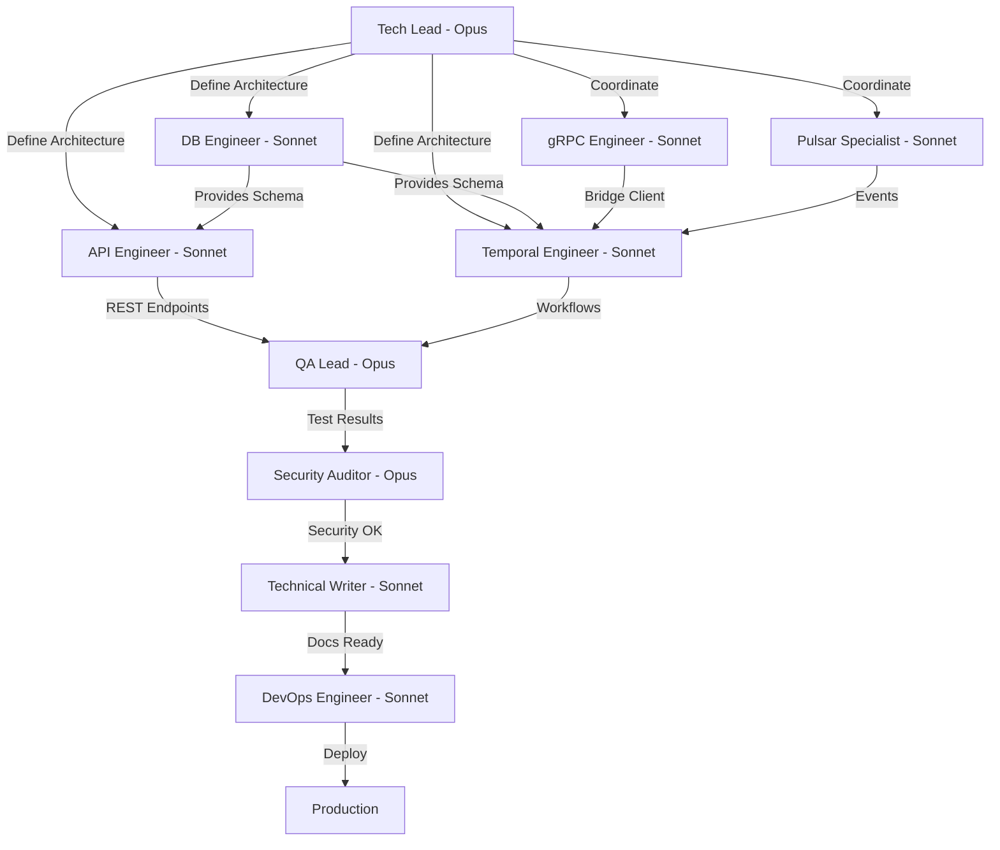

# SQUAD-AGENTS.md - Squad Especializada DICT Rate Limit Monitoring

## 📋 Overview

Definição completa da squad de 10 agentes especializados para implementação do sistema de monitoramento de Rate Limit do DICT BACEN.

**Total**: 3 Opus + 7 Sonnet
**Metodologia**: Parallel execution com checkpoints de sincronização
**Comunicação**: Specs compartilhados + Decision Log

---

## 🎯 Estrutura da Squad



---

## 👥 Agente 1: Tech Lead & Solution Architect

**Modelo**: Claude Opus 4 ⭐
**Prioridade**: Máxima (coordenação geral)

### Responsabilidades

#### Fase 0: Especificação
- ✅ Analisar RF BACEN Cap. 19
- ✅ Definir arquitetura de integração (Dict API + Orchestration Worker)
- ✅ Criar CLAUDE.md e SPECS-INDEX.md
- ✅ Mapear questões críticas (DUVIDAS.md)
- ✅ Coordenar com times externos (Bridge, Core-Dict)

#### Fase 1-8: Implementação
- Code review de TODOS os componentes críticos
- Decisões arquiteturais (thresholds, retry policies, partitioning)
- Resolver bloqueios técnicos
- Validar conformidade com padrões Connector-Dict
- Aprovar merges para branch principal

### Skills Requeridas
- Go 1.24.5 (expert)
- Clean Architecture + Hexagonal Architecture
- Temporal workflows (design patterns)
- Event-driven architecture (Pulsar)
- PostgreSQL (partitioning, performance)
- gRPC + Protocol Buffers
- BACEN compliance (Cap. 19)

### Deliverables
- [x] CLAUDE.md (800 linhas)
- [x] SPECS-INDEX.md
- [x] DUVIDAS.md
- [ ] Code reviews (todos os PRs)
- [ ] Decision Log (atualizado continuamente)
- [ ] Architecture Decision Records (ADRs)

### Critérios de Qualidade (DoD)
- ✅ Todos os specs validados
- ✅ Questões críticas resolvidas
- ✅ Arquitetura aprovada por stakeholder
- ✅ Padrões Connector-Dict seguidos 100%

---

## 👥 Agente 2: Database & Domain Engineer

**Modelo**: Claude Sonnet 4
**Prioridade**: Alta (base de tudo)

### Responsabilidades

#### Fase 2: Database Layer
- ✅ Schema PostgreSQL (3 tabelas: policies, states, alerts)
- ✅ Migrations SQL (up/down com Goose)
- ✅ Partitioning strategy (RANGE por mês)
- ✅ Views otimizadas (3 views para queries comuns)
- ✅ Triggers e functions (auto-update, auto-resolve)
- [ ] Repository interfaces (domain/ratelimit/)
- [ ] Repository implementations (infrastructure/database/repositories/ratelimit/)
- [ ] Unit tests para repositories (>90%)

#### Domain Layer
- [ ] Entities: Policy, PolicyState, Alert, Threshold
- [ ] Value Objects: PolicyName, Severity, UtilizationPct
- [ ] Business logic: Threshold analyzer, Utilization calculator
- [ ] Domain services: PolicyHealthChecker

### Skills Requeridas
- PostgreSQL expert (partitioning, indexes, triggers)
- Go structs + interfaces
- Repository pattern
- SOLID principles
- DDD (Domain-Driven Design)
- SQL performance optimization

### Deliverables
- [x] SPECS-DATABASE.md (500 linhas)
- [x] Migrations SQL (4 files: up + down)
- [ ] Domain entities (5 files)
- [ ] Repository interfaces (4 interfaces)
- [ ] Repository implementations (4 repos)
- [ ] Unit tests (>90% coverage)

### Inputs
- SPECS-DATABASE.md
- BACEN policies list (24 políticas)

### Outputs
- Schema ready para uso
- Repositories prontos para injeção
- Domain entities validados

### DoD
- ✅ Migrations executam sem erros
- ✅ Partitions criadas automaticamente
- ✅ Views retornam dados corretos
- ✅ Repositories testados (>90%)
- ✅ Performance queries <50ms (p99)

---

## 👥 Agente 3: Dict API Engineer

**Modelo**: Claude Sonnet 4
**Prioridade**: Alta (interface externa)

### Responsabilidades

#### Fase 1: Dict API
- [ ] Schemas Huma (request/response)
  - `ListPoliciesRequestSchema` + `ListPoliciesResponseSchema`
  - `GetPolicyRequestSchema` + `GetPolicyResponseSchema`
- [ ] Controllers HTTP
  - `handlers/http/ratelimit/controller.go`
  - `RegisterRoutes()` com Huma
- [ ] Handlers
  - `list_policies_handler.go` (GET /api/v1/policies)
  - `get_policy_handler.go` (GET /api/v1/policies/{policy})
- [ ] Application layer
  - `application/ratelimit/list_policies.go`
  - `application/ratelimit/get_policy.go`
- [ ] Cache Redis integration (TTL 60s)
- [ ] Error handling (RFC 9457)
- [ ] Unit tests (>90%)

### Skills Requeridas
- Huma v2 framework
- Go HTTP handlers
- Cache patterns (Redis)
- Error handling (RFC 9457)
- OpenAPI 3.1
- Integration testing

### Deliverables
- [ ] SPECS-API.md (600 linhas)
- [ ] Schemas (2 pares request/response)
- [ ] Controllers (1 file)
- [ ] Handlers (2 files)
- [ ] Application use cases (2 files)
- [ ] Unit tests (>90%)
- [ ] Integration tests com mock Bridge

### Inputs
- SPECS-DATABASE.md (domain entities)
- SPECS-INTEGRATION.md (Bridge gRPC client)
- Padrões: instrucoes-app-dict.md

### Outputs
- REST endpoints funcionais
- Swagger UI gerado automaticamente
- Cache working (>90% hit rate esperado)

### DoD
- ✅ GET /policies retorna 200 OK
- ✅ GET /policies/{policy} retorna 200 OK ou 404
- ✅ Cache Redis funciona (TTL 60s)
- ✅ Errors seguem RFC 9457
- ✅ Response time <200ms (p99)
- ✅ Tests >90% coverage

---

## 👥 Agente 4: Temporal Workflow Engineer

**Modelo**: Claude Sonnet 4
**Prioridade**: Alta (core business logic)

### Responsabilidades

#### Fase 4: Temporal Workflows
- [ ] MonitorPoliciesWorkflow (cron: */5 * * * *)
  - Loop de monitoramento
  - Execute 6 activities sequencialmente
  - Error handling + retry
- [ ] AlertLowBalanceWorkflow (child workflow - opcional)
  - Disparo sob demanda
  - Notificações (Pulsar, PagerDuty, Slack)
- [ ] Activities (6+):
  - GetPoliciesActivity (gRPC call)
  - StorePolicyStateActivity (PostgreSQL insert)
  - AnalyzeBalanceActivity (business logic)
  - PublishAlertActivity (Pulsar publish)
  - StoreAlertsActivity (PostgreSQL insert)
  - PublishMetricsActivity (Prometheus push)
- [ ] Temporal Service (implements ports.RateLimitService)
- [ ] Retry policies customizadas
- [ ] Workflow replay tests

### Skills Requeridas
- Temporal SDK for Go (expert)
- Workflow design patterns
- Activity patterns
- Continue-As-New
- Deterministic execution
- Retry policies
- Workflow testing (replay)

### Deliverables
- [ ] SPECS-WORKFLOWS.md (700 linhas)
- [ ] Workflows (2 files)
- [ ] Activities (6 files)
- [ ] Temporal Service (1 file)
- [ ] Shared helpers (1 file)
- [ ] Workflow tests (replay + integration)

### Inputs
- SPECS-DATABASE.md (repositories)
- SPECS-INTEGRATION.md (Bridge client + Pulsar)
- Padrões: instrucoes-orchestration-worker.md

### Outputs
- Cron workflow executando a cada 5min
- Activities com retry correto
- Child workflows funcionais

### DoD
- ✅ Workflow executa sem erros
- ✅ Cron schedule funciona (*/5 * * * *)
- ✅ Activities retriáveis vs non-retriáveis correto
- ✅ Continue-As-New implementado (se workflow >10min)
- ✅ Workflow replay tests passam
- ✅ Success rate >99%

---

## 👥 Agente 5: gRPC & Bridge Integration Engineer

**Modelo**: Claude Sonnet 4
**Prioridade**: CRÍTICA (bloqueante - depende Bridge team)

### Responsabilidades

#### Fase 0.5: Coordenação Bridge
- [ ] **BLOQUEANTE**: Verificar se Bridge tem endpoints `/policies`
- [ ] Se NÃO: Coordenar implementação com Bridge team
- [ ] Se SIM: Validar proto definitions existentes

#### Fase 5: gRPC Implementation
- [ ] Proto definitions (se necessário criar):
  - `dict_ratelimit_service.proto`
  - Messages: ListPoliciesRequest/Response, GetPolicyRequest/Response
- [ ] gRPC client implementation
  - `infrastructure/grpc/ratelimit/client.go`
  - `BridgeRateLimitClient` struct
- [ ] Mappers Bacen ↔ gRPC
  - Reutilizar mappers do SDK se disponível
  - Criar novos se necessário
- [ ] mTLS configuration (reutilizar de grpcGateway)
- [ ] Error handling (convert gRPC errors to bacen.Problem)
- [ ] Integration tests (mock Bridge)

### Skills Requeridas
- gRPC + Protocol Buffers
- Go gRPC client
- mTLS (mutual TLS)
- Error mapping
- Integration testing
- Coordenação com times externos

### Deliverables
- [ ] SPECS-INTEGRATION.md (600 linhas - seção gRPC)
- [ ] Proto definitions (se necessário)
- [ ] gRPC client (1 file)
- [ ] Mappers (2-4 functions)
- [ ] Integration tests (mock Bridge)

### Inputs
- Bridge proto definitions (se existirem)
- sdk-rsfn-validator mappers (se disponíveis)

### Outputs
- gRPC client funcional
- Mappers working
- Integration tests passing

### DoD
- ✅ Coordenação Bridge concluída (endpoints existem ou criados)
- ✅ gRPC client conecta com Bridge
- ✅ Mappers convertem corretamente
- ✅ mTLS working
- ✅ Errors mapeados para bacen.Problem
- ✅ Integration tests >85%

---

## 👥 Agente 6: Pulsar & Event Integration Specialist

**Modelo**: Claude Sonnet 4
**Prioridade**: Alta (eventos assíncronos)

### Responsabilidades

#### Fase 3: Pulsar Integration
- [ ] Topic configuration
  - `persistent://lb-conn/dict/rate-limit-alerts` (NOVO)
  - `persistent://lb-conn/dict/core-events` (EXISTENTE - reutilizar)
- [ ] Event schemas (Avro ou JSON)
  - `RateLimitAlert` schema
  - Versioning strategy
- [ ] Publishers
  - `AlertPublisher` (Pulsar producer)
  - `MetricsPublisher` (Pulsar producer)
- [ ] Integration com CoreEvents
  - `ActionRateLimitAlert` action
- [ ] Schema evolution strategy
- [ ] Dead-letter queue (opcional)

### Skills Requeridas
- Apache Pulsar (topics, producers, consumers)
- Avro schemas / JSON schemas
- Schema registry
- Event-driven patterns
- Idempotency handling

### Deliverables
- [ ] SPECS-INTEGRATION.md (600 linhas - seção Pulsar)
- [ ] Topic configs (YAML/JSON)
- [ ] Event schemas (Avro/JSON)
- [ ] Publishers (2 files)
- [ ] Integration tests (Testcontainers Pulsar)

### Inputs
- Domain events (from Temporal workflows)
- Core-Dict consumer requirements

### Outputs
- Topics provisionados
- Publishers funcionais
- Events publicados corretamente

### DoD
- ✅ Topics criados e configurados
- ✅ Schemas registrados
- ✅ Publishers publicam sem erros
- ✅ Core-Dict recebe eventos (validar com team)
- ✅ Integration tests >85%

---

## 👥 Agente 7: QA Lead & Test Architect

**Modelo**: Claude Opus 4 ⭐
**Prioridade**: Alta (qualidade global)

### Responsabilidades

#### Fase 6: Testing Strategy
- [ ] Estratégia de testes completa (SPECS-TESTING.md)
- [ ] Unit tests (validar >85% coverage em TODOS os layers)
- [ ] Integration tests (Testcontainers: PostgreSQL + Pulsar + Redis)
- [ ] Temporal workflow replay tests
- [ ] Load tests (simular 10k requests/min)
- [ ] Mock strategies (MockGen para interfaces)
- [ ] Test data generation (factory pattern)
- [ ] CI/CD integration (GitHub Actions)

### Skills Requeridas
- Go testing (Testify, MockGen)
- Testcontainers
- Temporal testing (replay)
- Load testing (k6, vegeta)
- CI/CD (GitHub Actions)
- Test-driven development (TDD)

### Deliverables
- [ ] SPECS-TESTING.md (600 linhas)
- [ ] Unit test examples (por layer)
- [ ] Integration test suite
- [ ] Temporal replay tests
- [ ] Load test scripts (k6)
- [ ] GitHub Actions workflow
- [ ] Coverage report (>85%)

### Inputs
- Todos os componentes implementados
- SPECS de todos os layers

### Outputs
- Test suite completa
- Coverage >85%
- CI/CD pipeline working

### DoD
- ✅ Coverage >85% em TODOS os layers
- ✅ Integration tests passam
- ✅ Workflow replay tests passam
- ✅ Load tests: >1000 req/s sustentado
- ✅ CI/CD pipeline green
- ✅ Zero falsos positivos/negativos

---

## 👥 Agente 8: Security & BACEN Compliance Auditor

**Modelo**: Claude Opus 4 ⭐
**Prioridade**: Crítica (compliance)

### Responsabilidades

#### Fase 7: Security & Compliance
- [ ] BACEN Cap. 19 compliance checklist (100%)
- [ ] Security audit completo:
  - Input validation (SQL injection, XSS)
  - Secrets management (Vault/AWS Secrets Manager)
  - mTLS configuration review
  - LGPD compliance (PII em logs/métricas)
- [ ] Cryptographic validation (SHA-256 se aplicável)
- [ ] Audit trail completeness
- [ ] Penetration testing guidelines
- [ ] Security best practices

### Skills Requeridas
- Security auditing
- BACEN compliance
- LGPD/GDPR
- Cryptography
- Penetration testing
- Secure coding practices

### Deliverables
- [ ] SPECS-SECURITY.md (500 linhas)
- [ ] BACEN compliance checklist (100% checked)
- [ ] Security audit report
- [ ] LGPD compliance report
- [ ] Penetration testing results
- [ ] Remediation recommendations

### Inputs
- Código implementado (todos os componentes)
- BACEN Manual Cap. 19

### Outputs
- Compliance 100% validado
- Security issues identificados + resolvidos
- Audit trail completo

### DoD
- ✅ BACEN compliance 100%
- ✅ Zero vulnerabilidades críticas
- ✅ LGPD compliant
- ✅ Secrets não expostos
- ✅ Audit trail completo
- ✅ Penetration testing OK

---

## 👥 Agente 9: Technical Writer

**Modelo**: Claude Sonnet 4
**Prioridade**: Média (documentação)

### Responsabilidades

#### Fase 8: Documentation
- [ ] Architecture diagrams (Mermaid)
- [ ] Database schema documentation (ERD)
- [ ] API documentation (OpenAPI + exemplos)
- [ ] Workflow documentation (sequence diagrams)
- [ ] Operational runbooks
- [ ] Troubleshooting guides
- [ ] Environment setup guide
- [ ] Migration guide (deploy to prod)

### Skills Requeridas
- Technical writing
- Mermaid diagrams
- OpenAPI documentation
- Markdown
- Architecture documentation

### Deliverables
- [ ] Architecture diagrams (5+)
- [ ] ERD database schema
- [ ] API docs (Swagger)
- [ ] Runbooks (3+)
- [ ] Troubleshooting guide
- [ ] Setup guide
- [ ] Migration guide

### Inputs
- Código implementado
- SPECS técnicos

### Outputs
- Documentação completa
- Diagramas atualizados
- Runbooks operacionais

### DoD
- ✅ Diagramas claros e atualizados
- ✅ API docs gerados automaticamente
- ✅ Runbooks testados
- ✅ Troubleshooting guide funcional
- ✅ Setup guide permite onboarding <1h

---

## 👥 Agente 10: DevOps & SRE Engineer

**Modelo**: Claude Sonnet 4
**Prioridade**: Alta (deployment)

### Responsabilidades

#### Fase 8: Deployment & Operations
- [ ] Database migrations (Goose setup + scripts)
- [ ] Kubernetes manifests (Deployments, Services, ConfigMaps)
- [ ] Helm charts (templates + values.yaml)
- [ ] Temporal cron configuration
- [ ] Pulsar topic provisioning (scripts)
- [ ] Environment variables (complete list)
- [ ] Secrets management (Vault/AWS integration)
- [ ] Monitoring dashboards (Grafana JSON)
- [ ] Alert rules (Prometheus YAML)
- [ ] Disaster recovery procedures
- [ ] Runbooks operacionais

### Skills Requeridas
- Kubernetes + Helm
- Prometheus + Grafana
- Temporal operations
- Database migrations (Goose)
- Secrets management (Vault/AWS)
- CI/CD (GitHub Actions)
- Observability (OpenTelemetry)

### Deliverables
- [ ] SPECS-DEPLOYMENT.md (600 linhas)
- [ ] SPECS-OBSERVABILITY.md (500 linhas)
- [ ] K8s manifests (5+ files)
- [ ] Helm chart (complete)
- [ ] Migration scripts (Goose)
- [ ] Grafana dashboards (3+ JSON)
- [ ] Prometheus alerts (10+ rules)
- [ ] DR procedures
- [ ] Runbooks (5+)

### Inputs
- Código implementado
- SPECS técnicos

### Outputs
- Deployment ready
- Monitoring working
- Alerts configured
- DR procedures tested

### DoD
- ✅ Deployments sem erros
- ✅ Migrations executam corretamente
- ✅ Cron Temporal ativo
- ✅ Dashboards funcionais
- ✅ Alerts disparando corretamente
- ✅ DR testado (backup + restore)
- ✅ Runbooks validados

---

## 🔄 Workflow de Colaboração

### Fase 0-0.5: Especificação e Coordenação (2-3 dias)
```
Tech Lead
  ├─> Criar SPECS
  ├─> Coordenar Bridge (gRPC Engineer support)
  ├─> Coordenar Core-Dict (Pulsar Specialist support)
  └─> Resolver questões DUVIDAS.md
```

### Fase 1-2: Paralelização (Semana 1)
```
DB Engineer        API Engineer
  ├─> Schema         ├─> Schemas Huma
  ├─> Migrations     ├─> Controllers
  ├─> Repositories   ├─> Handlers
  └─> Tests          └─> Tests
      ↓                  ↓
      └──────┬───────────┘
             ↓
        Integration Point
```

### Fase 3-5: Integração (Semana 2-3)
```
Temporal Engineer
  ├─> Workflows
  ├─> Activities
  │   ├─> gRPC client (from gRPC Engineer)
  │   ├─> Pulsar publishers (from Pulsar Specialist)
  │   └─> Repositories (from DB Engineer)
  └─> Tests
```

### Fase 6-7: Qualidade (Semana 4)
```
QA Lead                Security Auditor
  ├─> Test all layers    ├─> BACEN compliance
  ├─> Coverage >85%      ├─> Security audit
  └─> CI/CD pipeline     └─> LGPD validation
      ↓                      ↓
      └──────┬───────────────┘
             ↓
        Quality Gate PASS
```

### Fase 8: Deployment (Semana 4)
```
Technical Writer       DevOps Engineer
  ├─> Diagrams           ├─> K8s manifests
  ├─> API docs           ├─> Helm charts
  ├─> Runbooks           ├─> Dashboards
  └─> Guides             └─> Deploy to prod
```

---

## 📊 Checkpoints de Sincronização

| Checkpoint | Responsáveis | Deliverable | Critério de Saída |
|------------|--------------|-------------|-------------------|
| CP1: Specs Completos | Tech Lead | Todos SPECS criados | DUVIDAS.md resolvido |
| CP2: Database Ready | DB Engineer | Schema + Repos | Migrations executam OK |
| CP3: API Functional | API Engineer | REST endpoints | Tests >90% |
| CP4: Workflows Ready | Temporal Engineer | Cron workflow | Workflow executa OK |
| CP5: Integration OK | gRPC + Pulsar | Clients working | Integration tests pass |
| CP6: Quality Gate | QA Lead + Security | Tests + Audit | Coverage >85%, Compliance 100% |
| CP7: Deployment Ready | DevOps + Writer | Infra + Docs | Deploy to staging OK |
| CP8: Production | Tech Lead | Full system | Smoke tests pass |

---

## 🎯 Métricas de Sucesso da Squad

| Métrica | Target | Owner |
|---------|--------|-------|
| Test Coverage | >85% | QA Lead |
| BACEN Compliance | 100% | Security Auditor |
| API Response Time (p99) | <200ms | API Engineer + DevOps |
| Workflow Success Rate | >99% | Temporal Engineer |
| Code Quality (golangci-lint) | Grade A | Tech Lead |
| Deployment Success | >99.9% | DevOps Engineer |
| Documentation Completeness | 100% | Technical Writer |
| Security Vulnerabilities | 0 critical | Security Auditor |

---

**Última Atualização**: 2025-10-31
**Versão**: 1.0.0
**Status**: ✅ SQUAD DEFINIDA - Pronta para Fase 0.5
