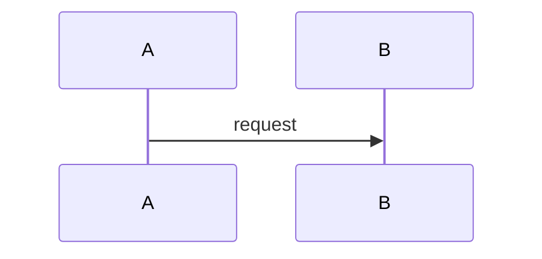

# Comando: Technical Specification Generator

Modo multi-agente: Colaboração entre **NEXUS** (SA), **GOPHER** (TS), **MERCURY** (API) e **ATLAS** (DA).

## Parâmetros
O usuário deve especificar o que deseja especificar:
- Componente (ex: "Core DICT", "Bridge DICT", "Connect DICT")
- Funcionalidade (ex: "Criação de Chave", "Reivindicação")
- API/Interface (ex: "gRPC CreateKey", "REST /entries")

## Fluxo de Trabalho

### Fase 1: ORACLE - Contexto de Negócio
1. Identificar requisitos funcionais relacionados (RF-XXX)
2. Listar user stories aplicáveis (UST-XXX)
3. Extrair regras de negócio (RN-XXX)
4. Definir critérios de aceitação (CA-XXX)

### Fase 2: NEXUS - Design Arquitetural
1. Posicionamento na arquitetura geral
2. Integrações necessárias
3. Padrões arquiteturais aplicáveis
4. Diagrama de componentes (C4 Level 3)

### Fase 3: ATLAS - Modelo de Dados
1. Entidades envolvidas
2. Agregados e value objects
3. Eventos de domínio
4. Schema de banco de dados

### Fase 4: MERCURY - Contratos de API
1. Especificação gRPC (proto files)
2. Especificação REST (OpenAPI)
3. Message schemas (eventos)
4. Request/Response examples

### Fase 5: GOPHER - Detalhamento Técnico
1. Estrutura de pacotes/módulos
2. Interfaces Go necessárias
3. Dependências e bibliotecas
4. Patterns e best practices
5. Error handling
6. Logging e observabilidade

### Fase 6: SENTINEL - Requisitos de Segurança
1. Autenticação/Autorização
2. Validações de segurança
3. Rate limiting
4. Auditoria
5. Dados sensíveis (PII)

### Fase 7: VALIDATOR - Estratégia de Testes
1. Testes unitários necessários
2. Testes de integração
3. Testes de contrato
4. Testes de aceitação
5. Casos de teste específicos

## Template de Saída

```markdown
# Especificação Técnica: [Nome do Componente/Funcionalidade]
**ID**: ETS-XXX
**Data**: [data]
**Versão**: 1.0
**Status**: Draft

## 1. Visão Geral
### 1.1 Propósito
[Descrição do propósito]

### 1.2 Escopo
[O que está incluído e excluído]

### 1.3 Requisitos Relacionados
- RF-XXX: [requisito]
- UST-XXX: [user story]

## 2. Contexto Arquitetural
### 2.1 Posição na Arquitetura
[Diagrama C4 Level 3]

### 2.2 Dependências
- [Componente 1]
- [Componente 2]

### 2.3 Integrações
- **Upstream**: [componentes que chamam este]
- **Downstream**: [componentes chamados por este]

## 3. Modelo de Dados
### 3.1 Entidades
```go
type Entity struct {
    // fields
}
```

### 3.2 Agregados
[Diagramas de agregados]

### 3.3 Eventos
- EventXxx
- EventYyy

### 3.4 Schema de BD
```sql
CREATE TABLE ...
```

## 4. Interfaces
### 4.1 gRPC Service
```protobuf
service XxxService {
    rpc MethodName(Request) returns (Response);
}
```

### 4.2 REST API
```yaml
openapi: 3.0.0
paths:
  /xxx:
    post:
      ...
```

### 4.3 Events Published
```json
{
  "eventType": "XxxCreated",
  "payload": { }
}
```

### 4.4 Events Consumed
- [Lista de eventos consumidos]

## 5. Lógica de Negócio
### 5.1 Regras de Negócio
- RN-XXX-1: [regra]
- RN-XXX-2: [regra]

### 5.2 Validações
```go
func Validate() error {
    // validation logic
}
```

### 5.3 Fluxos de Processamento


## 6. Implementação
### 6.1 Estrutura de Pacotes
```
/internal/
  /domain/
  /application/
  /infrastructure/
```

### 6.2 Interfaces Principais
```go
type Repository interface {
    // methods
}
```

### 6.3 Dependências
- github.com/xxx/yyy v1.2.3
- [outras]

### 6.4 Configurações
```yaml
config:
  xxx: value
```

## 7. Segurança
### 7.1 Autenticação
[Mecanismos de autenticação]

### 7.2 Autorização
[Regras de autorização]

### 7.3 Validações
- [Validação 1]
- [Validação 2]

### 7.4 Dados Sensíveis
[Como tratar PII, dados sensíveis]

### 7.5 Auditoria
[Eventos a auditar]

## 8. Resiliência
### 8.1 Error Handling
[Estratégias de tratamento de erros]

### 8.2 Retry Policy
```yaml
retry:
  maxAttempts: 3
  backoff: exponential
```

### 8.3 Circuit Breaker
[Configurações de circuit breaker]

### 8.4 Timeouts
[Timeouts configurados]

## 9. Observabilidade
### 9.1 Logs
[Pontos de log e níveis]

### 9.2 Métricas
- metric.xxx.count
- metric.xxx.duration

### 9.3 Traces
[Distributed tracing]

### 9.4 Health Checks
```go
func HealthCheck() Status {
    // health check logic
}
```

## 10. Testes
### 10.1 Testes Unitários
- TestXxx
- TestYyy

### 10.2 Testes de Integração
- TestIntegrationXxx

### 10.3 Testes de Contrato
- ContractTestWithXxx

### 10.4 Casos de Teste
| Caso | Input | Expected Output |
|------|-------|-----------------|

## 11. Performance
### 11.1 Requisitos de Performance
- Latência: < Xms
- Throughput: Y req/s

### 11.2 Otimizações
[Otimizações implementadas]

### 11.3 Benchmarks
[Resultados de benchmarks]

## 12. Deployment
### 12.1 Ambientes
- Dev, Staging, Prod

### 12.2 Configurações por Ambiente
[Configurações específicas]

### 12.3 Migrations
[Scripts de migração]

### 12.4 Rollback
[Estratégia de rollback]

## 13. Critérios de Aceitação
- [ ] CA-XXX-1: [critério]
- [ ] CA-XXX-2: [critério]

## 14. Riscos e Mitigações
| Risco | Impacto | Mitigação |
|-------|---------|-----------|

## 15. Referências
- [Documento 1]
- [Documento 2]

## 16. Glossário
- **Termo 1**: Definição
- **Termo 2**: Definição

## 17. Anexos
[Diagramas, exemplos, etc.]
```

## Outputs
- `/Artefatos/02_Arquitetura/TechSpecs/ETS-XXX_[nome].md`
- Código de exemplo se aplicável
- Diagramas em Mermaid/PlantUML

## Validações
- [ ] Todos os requisitos funcionais cobertos
- [ ] Contratos de API especificados
- [ ] Modelo de dados completo
- [ ] Segurança endereçada
- [ ] Testes especificados
- [ ] Critérios de aceitação claros
