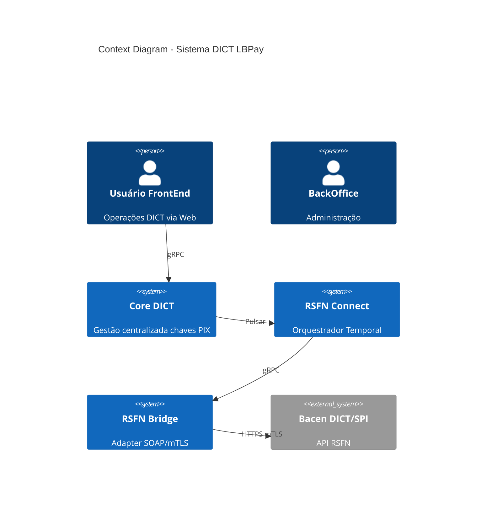

# Plano de Preenchimento de Artefatos - Projeto DICT

**Data**: 2025-10-25
**Versão**: 1.0
**Status**: 🟡 Em Planejamento

---

## Sumário Executivo

Este documento define o plano para preencher os artefatos vazios identificados na estrutura do projeto DICT, priorizando documentos críticos baseados nas análises já realizadas (ANA-001, ANA-002, ANA-003, ANA-004) e especificações técnicas (TEC-001, TEC-002 v3.1, TEC-003 v2.1).

**Meta**: Completar 80% dos artefatos críticos até Q1 2026

---

## Status Atual dos Artefatos

### ✅ Completos (35-40%)

| Pasta | Documentos | Status |
|-------|------------|--------|
| **00_Analises** | ANA-001, ANA-002, ANA-003, ANA-004 | ✅ Completo |
| **01_Requisitos** | MTR-001, UST-001 | ✅ Completo |
| **02_Arquitetura** | 12 documentos (ADRs, AREs, DAS-001) | ✅ Completo |
| **05_Requisitos** | CRF-001, INDEX | ✅ Completo |
| **03_Regulatorio** | REG-001, CCM-001 | ✅ Completo |
| **04_APIs** | API-001 | ✅ Completo |
| **11_Especificacoes_Tecnicas** | TEC-001, TEC-002 v3.1, TEC-003 v2.1 | ✅ Completo |
| **11_Gestao** | PMP-001 v2, STATUS_PROJETO | ✅ Completo |

### 🟡 Parcialmente Completos (10-15%)

| Pasta | Status | Documentos Faltantes |
|-------|--------|---------------------|
| **02_Arquitetura/ADRs** | 🟡 ADRs criados mas não organizados | Mover ADRs para subpasta |
| **02_Arquitetura/Diagramas** | 🟡 Vazios | Diagramas C4, Sequência, Fluxo |
| **02_Arquitetura/TechSpecs** | 🟡 Vazios | Specs detalhadas por componente |
| **12_Integracao** | 🟡 Tem subpastas mas vazias | Fluxos e Sequências |

### 🔴 Vazios (45-50%)

| Pasta | Prioridade | Razão |
|-------|-----------|-------|
| **03_Dados** | 🔴 ALTA | Essencial para schemas DB, migrations |
| **04_APIs/gRPC** | 🔴 ALTA | Specs dos contratos gRPC |
| **05_Implementacao** | 🟡 MÉDIA | Manuais de implementação |
| **13_Seguranca** | 🔴 ALTA | Políticas, certificados ICP-Brasil, mTLS |
| **08_Testes/Casos** | 🟡 MÉDIA | Test cases para QA |
| **09_DevOps** | 🟡 MÉDIA | CI/CD, Kubernetes, monitoring |
| **10_Compliance** | 🔴 ALTA | Auditoria, LGPD, Bacen |

---

## Problema: Numeração Duplicada

### ⚠️ Conflito Identificado

Temos **dois** diretórios com prefixo `03_`:
- `03_Dados/`
- `03_Regulatorio/`

### ✅ Solução Proposta

**Renumeração**:
```
03_Dados/          → Mantém 03_Dados/
03_Regulatorio/    → Move para 06_Regulatorio/
05_Requisitos/     → Move para 05_Requisitos/
04_APIs/           → Move para 06_APIs/
04_Processos/      → Move para 07_Processos/
05_Frontend/       → Move para 08_Frontend/
05_Implementacao/  → Move para 09_Implementacao/
05_Requisitos/     → Move para 10_Requisitos/
12_Integracao/     → Move para 11_Integracao/
13_Seguranca/      → Move para 12_Seguranca/
08_Testes/         → Move para 13_Testes/
09_DevOps/         → Move para 14_DevOps/
10_Compliance/     → Move para 15_Compliance/
11_Gestao/         → Move para 16_Gestao/
```

**OU** (opção mais simples - recomendada):
```
03_Regulatorio/    → Renomear para 06_Regulatorio/
(ajustar numeração subsequente)
```

---

## Plano de Preenchimento (Priorizado)

### 🎯 Fase 1: Artefatos Críticos (Sprint 1-2)

#### 1.1. Reorganização Estrutural

**Prioridade**: 🔴 CRÍTICA
**Esforço**: 1 dia
**Responsável**: Architect

**Ações**:
- [ ] Renumerar `03_Regulatorio/` → `06_Regulatorio/`
- [ ] Mover ADRs de `02_Arquitetura/` para `02_Arquitetura/ADRs/`
- [ ] Criar README.md em cada pasta vazia explicando propósito

**Entregável**: Estrutura limpa e sem conflitos

---

#### 1.2. 03_Dados (Schemas e Migrações)

**Prioridade**: 🔴 CRÍTICA
**Esforço**: 3-5 dias
**Dependências**: TEC-001, TEC-002, TEC-003

**Documentos a Criar**:

| Doc ID | Nome | Descrição | Fonte |
|--------|------|-----------|-------|
| **DAT-001** | `Schema_Database_Core_DICT.md` | Schemas PostgreSQL para Core DICT | TEC-001 |
| **DAT-002** | `Schema_Database_Connect.md` | Schemas para Temporal workflows | TEC-003, ANA-003 |
| **DAT-003** | `Migrations_Strategy.md` | Estratégia de migrations (Flyway/Goose) | ANA-003 |
| **DAT-004** | `Data_Dictionary.md` | Dicionário de dados completo | Todos TEC |
| **DAT-005** | `Redis_Cache_Strategy.md` | Schema de cache Redis | TEC-003 |

**Conteúdo Base** (DAT-001):
```markdown
# DAT-001: Schema Database Core DICT

## Tabelas Principais

### entries (Chaves DICT)
- id UUID PRIMARY KEY
- key_type VARCHAR(20) (CPF, CNPJ, EMAIL, PHONE, EVP)
- key_value VARCHAR(255) UNIQUE
- account_id UUID
- status VARCHAR(20)
- created_at TIMESTAMP
- updated_at TIMESTAMP

### claims (Reivindicações - 30 dias)
- id UUID PRIMARY KEY
- entry_id UUID REFERENCES entries(id)
- claimer_ispb VARCHAR(8)
- owner_ispb VARCHAR(8)
- status VARCHAR(20)
- completion_period_days INT DEFAULT 30
- expires_at TIMESTAMP
- created_at TIMESTAMP

### accounts (Contas CID)
- id UUID PRIMARY KEY
- account_number VARCHAR(20)
- branch VARCHAR(10)
- account_type VARCHAR(20)
- holder_document VARCHAR(14)
- holder_name VARCHAR(255)
```

---

#### 1.3. 04_APIs/gRPC (Contratos de Comunicação)

**Prioridade**: 🔴 CRÍTICA
**Esforço**: 2-3 dias
**Dependências**: TEC-002, TEC-003

**Documentos a Criar**:

| Doc ID | Nome | Descrição |
|--------|------|-----------|
| **GRPC-001** | `Bridge_gRPC_Service.md` | Contrato Connect → Bridge |
| **GRPC-002** | `Core_DICT_gRPC_Service.md` | Contrato FrontEnd → Core |
| **GRPC-003** | `Proto_Files_Specification.md` | Specs dos .proto files |
| **GRPC-004** | `Error_Handling_gRPC.md` | Tratamento de erros gRPC |

**Conteúdo Base** (GRPC-001):
```protobuf
// bridge.proto
syntax = "proto3";

package rsfn.bridge.v1;

service BridgeService {
  // Operações síncronas
  rpc GetEntry(GetEntryRequest) returns (GetEntryResponse);
  rpc CheckKeys(CheckKeysRequest) returns (CheckKeysResponse);

  // Operações assíncronas (Claims)
  rpc CreateClaim(CreateClaimRequest) returns (CreateClaimResponse);
  rpc CompleteClaim(CompleteClaimRequest) returns (CompleteClaimResponse);
  rpc CancelClaim(CancelClaimRequest) returns (CancelClaimResponse);
}

message GetEntryRequest {
  string key = 1;
  string key_type = 2;
}

message GetEntryResponse {
  string entry_id = 1;
  string account_number = 2;
  string ispb = 3;
  string status = 4;
}
```

---

#### 1.4. 13_Seguranca (Políticas de Segurança)

**Prioridade**: 🔴 CRÍTICA
**Esforço**: 4-5 dias
**Dependências**: TEC-002 (mTLS, ICP-Brasil), REG-001

**Documentos a Criar**:

| Doc ID | Nome | Descrição |
|--------|------|-----------|
| **SEC-001** | `mTLS_Configuration.md` | Config mTLS para Bacen |
| **SEC-002** | `ICP_Brasil_Certificates.md` | Gestão certificados digitais |
| **SEC-003** | `Secret_Management.md` | Vault, env vars, rotação |
| **SEC-004** | `API_Authentication.md` | JWT, OAuth2, API Keys |
| **SEC-005** | `Network_Security.md` | Firewalls, VPCs, DMZ |
| **SEC-006** | `XML_Signature_Security.md` | Assinatura digital XML |
| **SEC-007** | `LGPD_Data_Protection.md` | Proteção dados pessoais |

**Conteúdo Base** (SEC-001):
```markdown
# SEC-001: Configuração mTLS para Bacen

## Certificados ICP-Brasil

### Requisitos
- Certificado A3 (hardware token)
- Cadeia completa: Root CA → Intermediate CA → Certificate
- Validade mínima: 1 ano
- Key size: 2048 bits RSA

### Configuração Bridge

**Localização Certificados**:
```bash
/etc/ssl/certs/bacen/
├── client-cert.pem       # Certificado ICP-Brasil
├── client-key.pem        # Chave privada
├── ca-chain.pem          # Cadeia CA
└── bacen-root-ca.pem     # Root CA Bacen
```

**Validação mTLS**:
- ✅ Verificar CN (Common Name)
- ✅ Validar cadeia de certificados
- ✅ Verificar expiração (alertas 30 dias antes)
- ✅ CRL (Certificate Revocation List)
```

---

### 🎯 Fase 2: Arquitetura Detalhada (Sprint 3-4)

#### 2.1. 02_Arquitetura/Diagramas

**Documentos a Criar**:

| Doc ID | Nome | Tipo | Ferramenta |
|--------|------|------|-----------|
| **DIA-001** | `C4_Context_Diagram.md` | C4 Level 1 | Mermaid/PlantUML |
| **DIA-002** | `C4_Container_Diagram.md` | C4 Level 2 | Mermaid/PlantUML |
| **DIA-003** | `C4_Component_Diagram_Core.md` | C4 Level 3 | Mermaid/PlantUML |
| **DIA-004** | `C4_Component_Diagram_Connect.md` | C4 Level 3 | Mermaid/PlantUML |
| **DIA-005** | `C4_Component_Diagram_Bridge.md` | C4 Level 3 | Mermaid/PlantUML |
| **DIA-006** | `Sequence_Claim_Workflow.md` | Sequência | Mermaid |
| **DIA-007** | `Sequence_CreateEntry.md` | Sequência | Mermaid |
| **DIA-008** | `Flow_VSYNC_Daily.md` | Fluxo | Mermaid |
| **DIA-009** | `Deployment_Kubernetes.md` | Deployment | Mermaid |

**Base C4 Context**:


---

#### 2.2. 02_Arquitetura/TechSpecs

**Documentos a Criar**:

| Doc ID | Nome | Componente |
|--------|------|------------|
| **TSP-001** | `Temporal_Workflow_Engine.md` | Temporal |
| **TSP-002** | `Apache_Pulsar_Messaging.md` | Pulsar |
| **TSP-003** | `Redis_Cache_Layer.md` | Redis |
| **TSP-004** | `PostgreSQL_Database.md` | PostgreSQL |
| **TSP-005** | `Fiber_HTTP_Framework.md` | Fiber |
| **TSP-006** | `XML_Signer_JRE.md` | XML Signer |

---

### 🎯 Fase 3: Implementação e DevOps (Sprint 5-6)

#### 3.1. 05_Implementacao (Manuais)

**Documentos a Criar**:

| Doc ID | Nome | Descrição |
|--------|------|-----------|
| **IMP-001** | `Manual_Implementacao_Core_DICT.md` | Setup Core DICT |
| **IMP-002** | `Manual_Implementacao_Connect.md` | Setup Connect + Temporal |
| **IMP-003** | `Manual_Implementacao_Bridge.md` | Setup Bridge + mTLS |
| **IMP-004** | `Developer_Guidelines.md` | Padrões de código |
| **IMP-005** | `Database_Migration_Guide.md` | Como rodar migrations |

---

#### 3.2. 09_DevOps (CI/CD e Infra)

**Documentos a Criar**:

| Doc ID | Nome | Descrição |
|--------|------|-----------|
| **DEV-001** | `CI_CD_Pipeline_Core.md` | Pipeline Core DICT |
| **DEV-002** | `CI_CD_Pipeline_Connect.md` | Pipeline Connect |
| **DEV-003** | `CI_CD_Pipeline_Bridge.md` | Pipeline Bridge |
| **DEV-004** | `Kubernetes_Manifests.md` | K8s deployments, services |
| **DEV-005** | `Monitoring_Observability.md` | Prometheus, Grafana, OTel |
| **DEV-006** | `Docker_Images.md` | Dockerfile specs |
| **DEV-007** | `Environment_Config.md` | Dev, Staging, Prod |

**Base CI/CD**:
```yaml
# .github/workflows/connect-ci.yml
name: Connect CI/CD

on:
  push:
    branches: [main, develop]
    paths: ['connector-dict/**']

jobs:
  test:
    runs-on: ubuntu-latest
    steps:
      - uses: actions/checkout@v3
      - uses: actions/setup-go@v4
        with:
          go-version: '1.24.5'
      - run: go test ./...

  build:
    needs: test
    runs-on: ubuntu-latest
    steps:
      - run: docker build -f apps/dict/Dockerfile .
      - run: docker build -f apps/orchestration-worker/Dockerfile .
```

---

### 🎯 Fase 4: Testes e Qualidade (Sprint 7-8)

#### 4.1. 08_Testes/Casos

**Documentos a Criar**:

| Doc ID | Nome | Tipo | Componente |
|--------|------|------|------------|
| **TST-001** | `Test_Cases_CreateEntry.md` | Funcional | Core DICT |
| **TST-002** | `Test_Cases_ClaimWorkflow.md` | Funcional | Connect |
| **TST-003** | `Test_Cases_Bridge_mTLS.md` | Integração | Bridge |
| **TST-004** | `Performance_Tests.md` | Performance | 1000 TPS |
| **TST-005** | `Security_Tests.md` | Segurança | Pen test |
| **TST-006** | `Regression_Test_Suite.md` | Regressão | Todos |

**Base Test Case**:
```markdown
# TST-002: Test Cases - ClaimWorkflow (30 dias)

## TC-CLAIM-001: Criar Reivindicação com Sucesso

**Pré-condições**:
- Chave PIX existe no DICT Bacen
- Usuário autenticado
- ISPB diferente do owner

**Steps**:
1. POST /claims com payload válido
2. Verificar status 201 Created
3. Verificar workflow iniciado no Temporal
4. Verificar timer 30 dias configurado

**Expected Result**:
- Claim criado com status OPEN
- Workflow ID retornado
- Timer expire_at = created_at + 30 dias

**Prioridade**: P0 (Crítico)
```

---

### 🎯 Fase 5: Compliance e Gestão (Sprint 9-10)

#### 5.1. 10_Compliance

**Documentos a Criar**:

| Doc ID | Nome | Descrição |
|--------|------|-----------|
| **CMP-001** | `Audit_Logs_Specification.md` | Logs de auditoria |
| **CMP-002** | `LGPD_Compliance_Checklist.md` | Checklist LGPD |
| **CMP-003** | `Bacen_Regulatory_Compliance.md` | Compliance regulatório |
| **CMP-004** | `Data_Retention_Policy.md` | Política de retenção |
| **CMP-005** | `Privacy_Impact_Assessment.md` | DPIA/RIPD |

---

#### 5.2. 12_Integracao (Fluxos End-to-End)

**Documentos a Criar**:

| Doc ID | Nome | Descrição |
|--------|------|-----------|
| **INT-001** | `Flow_CreateEntry_E2E.md` | Fluxo completo create entry |
| **INT-002** | `Flow_ClaimWorkflow_E2E.md` | Fluxo completo claim (30 dias) |
| **INT-003** | `Flow_VSYNC_E2E.md` | Fluxo VSYNC diário |
| **INT-004** | `Sequence_ErrorHandling.md` | Tratamento de erros |

---

## Cronograma de Execução

| Fase | Documentos | Esforço | Prazo | Responsável |
|------|------------|---------|-------|-------------|
| **Fase 1** | 16 docs críticos | 10-12 dias | Sprint 1-2 | Architect + Tech Lead |
| **Fase 2** | 15 docs arquitetura | 8-10 dias | Sprint 3-4 | Architect |
| **Fase 3** | 12 docs implementação | 6-8 dias | Sprint 5-6 | Tech Lead + Devs |
| **Fase 4** | 6 docs testes | 4-5 dias | Sprint 7-8 | QA Lead |
| **Fase 5** | 9 docs compliance | 5-6 dias | Sprint 9-10 | Compliance + Architect |

**Total**: ~58 documentos novos | 33-41 dias | 10 sprints

---

## Métricas de Sucesso

| Métrica | Meta | Baseline | Target |
|---------|------|----------|--------|
| **Cobertura Artefatos** | 90% | 40% | 90% |
| **Documentos Críticos** | 100% | 60% | 100% |
| **Rastreabilidade** | 95% | 70% | 95% |
| **Atualização** | < 30 dias | N/A | < 30 dias |

---

## Riscos e Mitigação

| Risco | Probabilidade | Impacto | Mitigação |
|-------|---------------|---------|-----------|
| Falta de informação técnica | Média | Alto | Análise de repos (ANA-002, ANA-003) |
| Mudanças regulatórias Bacen | Baixa | Alto | Monitorar Circular Bacen |
| Recursos insuficientes | Alta | Médio | Priorizar Fase 1 (crítico) |
| Duplicação de esforço | Média | Médio | Revisar documentos existentes |

---

## Próximos Passos Imediatos

1. ✅ **Aprovar este plano** com Head de Arquitetura e CTO
2. ⏳ **Renumerar pastas** para resolver conflito 03_
3. ⏳ **Criar DAT-001** (Schema Database Core DICT)
4. ⏳ **Criar GRPC-001** (Bridge gRPC Service)
5. ⏳ **Criar SEC-001** (mTLS Configuration)

---

**Aprovações**:

| Stakeholder | Cargo | Status | Data |
|-------------|-------|--------|------|
| Thiago Lima | Head de Arquitetura | ⏳ Pendente | - |
| José Luís Silva | CTO | ⏳ Pendente | - |

---

**Referências**:
- [ANA-001: Análise IcePanel](../00_Analises/ANA-001_Analise_Arquitetura_IcePanel.md)
- [ANA-002: Análise Bridge](../00_Analises/ANA-002_Analise_Repo_Bridge.md)
- [ANA-003: Análise Connect](../00_Analises/ANA-003_Analise_Repo_Connect.md)
- [TEC-002 v3.1: Bridge Spec](../11_Especificacoes_Tecnicas/TEC-002_Bridge_Specification.md)
- [TEC-003 v2.1: Connect Spec](../11_Especificacoes_Tecnicas/TEC-003_RSFN_Connect_Specification.md)
