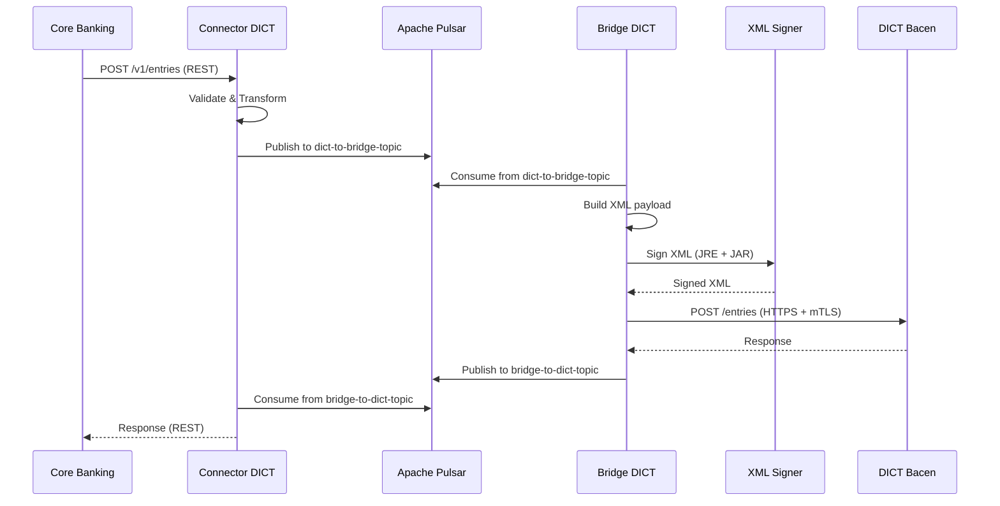

# Análise de Repositórios Existentes - Projeto DICT

**ID**: ARE-001
**Data**: 2025-10-24
**Agente**: GOPHER (AGT-TS-001) + NEXUS (AGT-SA-001)
**Status**: Em Progresso
**Versão**: 1.0

---

## 1. Visão Geral

Este documento analisa os repositórios existentes do LBPay relacionados ao DICT para:
- Entender padrões arquiteturais já implementados
- Identificar stack tecnológica utilizada
- Mapear estrutura de código e organização
- Identificar padrões de integração com Bacen
- Servir como base para especificações do projeto DICT completo

---

## 2. Repositórios Analisados

### 2.1 rsfn-connect-bacen-bridge
**URL**: https://github.com/lb-conn/rsfn-connect-bacen-bridge/
**Branch**: main
**Último commit**: 1887c058

#### Descrição
Bridge que realiza integração com Bacen, assinando XMLs com signer externo e usando mTLS.

#### Estrutura de Diretórios
```
rsfn-connect-bacen-bridge/
├── .docker/                    # Configurações Docker
├── .env.development            # Env vars para dev
├── .env.qa                     # Env vars para QA
├── .env.staging                # Env vars para staging
├── .env.example                # Template de variáveis
├── .github/                    # CI/CD workflows
├── apps/
│   └── dict/                   # Aplicação DICT Bridge
│       ├── application/        # Camada de aplicação
│       ├── domain/             # Regras de negócio
│       ├── handlers/           # Handlers (gRPC, HTTP)
│       ├── infrastructure/     # Implementações externas
│       ├── setup/              # Setup e configuração
│       ├── tests/              # Testes
│       ├── utils/              # Utilitários
│       └── main.go             # Entry point
├── shared/                     # Código compartilhado
│   ├── signer/                 # Assinatura de XMLs (JRE + JAR)
│   └── http/                   # Cliente HTTP com mTLS
├── docker-compose.yml
├── go.work                     # Go workspace
└── README.md
```

#### Arquitetura Identificada

**Padrão**: Clean Architecture
- **Domain**: Entidades e regras de negócio puras
- **Application**: Casos de uso e orquestração
- **Handlers**: Controladores (gRPC, HTTP)
- **Infrastructure**: Implementações externas (HTTP client, Pulsar, etc.)

#### Stack Tecnológica

**Linguagem**: Golang (versão a confirmar no go.mod)

**Comunicação**:
- **Inbound**: Apache Pulsar (mensageria)
  - Topic receiver: `persistent://lb-conn/dict/dict-to-bridge-topic`
  - Topic sender: `persistent://lb-conn/dict/bridge-to-dict-topic`
  - Consumer subscription: `rsfn-connect-dict-v1-bridge-subscription`
- **Outbound**: HTTP/REST com mTLS para Bacen
- **gRPC**: Porta 50051 (exposta)

**Assinatura de Mensagens**:
- **Signer externo**: JRE + JAR (Java)
- Localizado em: `shared/signer`
- Assina payloads XML antes de enviar ao Bacen

**Observabilidade**:
- OpenTelemetry para tracing
- Variáveis: `APP_DICT_ENABLE_TRACING`, `APP_DICT_TRACING_ENDPOINT`

#### Variáveis de Ambiente Importantes

```bash
# mTLS
MTLS_FILE_CER=                          # Certificado cliente
MTLS_FILE_UNENCRYPTED_KEY=              # Chave privada
MTLS_FILE_PEM_COMPLETE=                 # PEM completo

# Signer (assinatura XML)
SIGNER_P12_PATH=                        # Certificado P12
SIGNER_PASSWORD=                        # Senha do P12
SIGNER_CERTS_PATH=                      # Path de certificados

# Pulsar
PULSAR_URL=pulsar://localhost:6650
PULSAR_API_KEY=

# App DICT
APP_DICT_ENV=development
APP_DICT_ENABLE_TRACING=false
APP_DICT_TRACING_ENDPOINT=
APP_DICT_SERVICE_NAME=dict-bridge-service
APP_DICT_SERVICE_VERSION=1.0.0
APP_DICT_TOPIC_RECEIVER=persistent://lb-conn/dict/dict-to-bridge-topic
APP_DICT_TOPIC_SENDER=persistent://lb-conn/dict/bridge-to-dict-topic
APP_DICT_PULSAR_CONSUMER_SUBSCRIPTION=rsfn-connect-dict-v1-bridge-subscription
APP_DICT_GRPC_PORT=50051

# URLs Bacen (Homologação e Produção)
BACEN_SERVER_PRODUCTION=http://localhost:8085
BACEN_SERVER_HOMOLOGATION=http://localhost:8085
BACEN_CHECK_KEYS_PRODUCTION=http://localhost:8085
BACEN_CHECK_KEYS_HOMOLOGATION=http://localhost:8085
BACEN_BUCKET_STATES_PRODUCTION=http://localhost:8085
BACEN_BUCKET_STATES_HOMOLOGATION=http://localhost:8085
BACEN_GET_POLICY_PRODUCTION=http://localhost:8085
BACEN_GET_POLICY_HOMOLOGATION=http://localhost:8085
```

#### Padrões Identificados

**1. Clean Architecture**
- Separação clara de responsabilidades
- Domain independente de frameworks
- Inversão de dependências

**2. Assinatura de XMLs**
- Payloads XML assinados antes de enviar ao Bacen
- Utiliza signer Java externo (JRE + JAR)
- Certificados P12 para assinatura

**3. mTLS (Mutual TLS)**
- Comunicação com Bacen usa mTLS
- Certificados: `.cer`, `.key`, `.pem`
- Configuração via variáveis de ambiente

**4. Mensageria Assíncrona**
- Apache Pulsar como message broker
- Topics separados para request/response
- Consumer subscription para controle

**5. Multi-ambiente**
- Arquivos `.env` separados: development, qa, staging
- URLs Bacen diferentes para homologação e produção

**6. Observabilidade**
- OpenTelemetry para distributed tracing
- Service name e version configuráveis
- Tracing endpoint configurável

#### Insights Arquiteturais

1. **Bridge é isolado**: Não conhece lógica de negócio, apenas transforma e envia
2. **Comunicação async**: Usa Pulsar para desacoplar
3. **Segurança em camadas**:
   - mTLS para comunicação
   - Assinatura digital de XMLs
   - Certificados gerenciados externamente
4. **Multi-tenancy**: Preparado para múltiplos ambientes
5. **Go workspaces**: Usa go.work para monorepo

---

### 2.2 connector-dict
**URL**: https://github.com/lb-conn/connector-dict
**Branch**: main (f9f4250c)

#### Descrição
Conector para gerenciamento de entradas do DICT, seguindo Clean Architecture. Camada intermediária entre Core Banking e Bridge.

#### Estrutura de Diretórios
```
connector-dict/
├── .docker/
├── .env.development
├── .env.qa
├── .env.staging
├── .env.example
├── .github/
├── apps/
│   └── dict/
│       ├── domain/              # Entidades: Entry, Account, Owner, Key
│       │   ├── entry.go
│       │   ├── account.go
│       │   ├── owner.go
│       │   ├── key.go
│       │   └── types.go         # AccountType, KeyType, etc.
│       ├── application/         # Use Cases
│       │   ├── entry/
│       │   │   ├── application.go  # CreateEntry, GetEntry, etc.
│       │   │   ├── schema.go       # DTOs com metadados
│       │   │   └── interface.go    # Contratos
│       │   └── reconciliation/
│       ├── handlers/            # Controllers HTTP
│       │   ├── controller.go
│       │   ├── get_entry.go
│       │   ├── create_entry.go
│       │   ├── update_entry.go
│       │   ├── delete_entry.go
│       │   ├── check_key.go
│       │   └── adapters/        # RFC 9457 error handling
│       ├── infrastructure/      # Outbound adapters
│       │   └── dict/
│       │       ├── client.go
│       │       ├── entry.go
│       │       └── schemas/     # XML structures
│       ├── setup/
│       ├── tests/
│       ├── shared/
│       └── main.go
├── docker-compose.yml
├── go.work
└── README.md
```

#### Arquitetura Identificada

**Padrão**: Clean Architecture (bem documentada)

**Camadas**:
1. **Domain Layer**: Regras de negócio puras
   - Entidades: `Entry`, `Account`, `Owner`, `Key`
   - Tipos: `AccountType`, `KeyType`
   - Sem dependências externas

2. **Application Layer**: Orquestração
   - Use Cases: `CreateEntry`, `GetEntry`, `UpdateEntry`, `DeleteEntry`
   - Interfaces para infraestrutura
   - Enriquecimento com metadados (CorrelationID, ResponseTime)

3. **Handlers Layer**: Interface HTTP
   - Controllers REST
   - Validação de entrada/saída
   - Transformação de dados web → domain
   - RFC 9457 error handling

4. **Infrastructure Layer**: Adaptadores externos
   - Cliente HTTP para DICT System
   - Conversão domain → XML payload
   - Comunicação com Bridge

#### Stack Tecnológica

**Linguagem**: Golang 1.24.5

**Framework Web**: Fiber v2
**API Documentation**: Huma v2 (OpenAPI automático)
**Config Management**: Viper
**Observabilidade**: OpenTelemetry

#### Variáveis de Ambiente

```bash
# Servidor
SERVER_PORT=8082
SERVER_HOST=localhost

# DICT API (provavelmente o Bridge)
APP_DICT_URL=http://localhost:8084

# Ambiente
ENVIRONMENT=development

# Nome do serviço
SERVICE_NAME=conector-dict

# Observabilidade
ENABLE_TRACING=true
TRACING_ENDPOINT=http://localhost:4318/v1/traces
SERVICE_VERSION=1.0.0
```

#### Funcionalidades Implementadas

**Gerenciamento de Vínculo (Entry)**:
- ✅ `POST /v1/entries` - Criar entrada
- ✅ `GET /v1/entries/{key}` - Consultar entrada
- ✅ `PUT /v1/entries/{key}` - Atualizar entrada
- ✅ `DELETE /v1/entries/{key}` - Remover entrada

**Chaves**:
- ✅ `POST /v1/keys/check` - Verificar existência de chave

#### Padrões Identificados

**1. Clean Architecture Rigorosa**
- Separação clara Domain → Application → Handlers → Infrastructure
- Fluxo unidirecional de dependências
- Domain completamente isolado

**2. RFC 9457 - Problem Details**
- Tratamento de erros padronizado
- Estrutura consistente de erro:
  ```json
  {
    "type": "REQUEST_ID_ALREADY_USED",
    "title": "RequestId Already Used",
    "detail": "Descrição detalhada",
    "status": 400
  }
  ```
- Adapter para conversão automática

**3. Observabilidade Completa**
- OpenTelemetry para logs estruturados
- Distributed tracing
- Logs correlacionados (trace_id, span_id)
- Habilitável via env var

**4. API Documentation Automática**
- Swagger UI: `http://localhost:8082/docs`
- OpenAPI Spec: `http://localhost:8082/openapi.json`
- Health check: `http://localhost:8082/health`

**5. Enrichment de Metadados**
- Application layer adiciona:
  - `CorrelationID`
  - `ResponseTime`
  - Timestamps
  - Request metadata

**6. Transformação de Dados em Camadas**
- HTTP Request → Domain Entity (Handlers)
- Domain Entity → Application DTO (Application)
- Application DTO → XML Payload (Infrastructure)

#### Insights Arquiteturais

1. **Conector é intermediário**: Recebe do Core Banking, encaminha para Bridge
2. **REST API exposta**: Core Banking chama via REST
3. **Porta 8082**: Serviço exposto nesta porta
4. **Documentação viva**: OpenAPI gerado automaticamente
5. **Error handling robusto**: RFC 9457 em todas as respostas
6. **Pronto para QA**: Documentação de critérios de aceite (QA_TEST_CRITERIA.md)
7. **Observabilidade first**: OpenTelemetry desde o início

---

### 2.3 sdk-rsfn-validator
**URL**: https://github.com/lb-conn/sdk-rsfn-validator/tree/main/libs/dict
**Status**: ⚠️ Repositório não acessível via MCP GitHub

#### Descrição (baseada nas informações do CTO)
SDK que contém todos os contratos que definem o XML que constitui cada mensagem que o Bridge tem que enviar ao DICT.

#### Informações Conhecidas
- Localização: `libs/dict/` dentro do repo
- Conteúdo: Contratos XML para mensagens DICT
- Propósito: Definir estrutura de mensagens para integração com Bacen

#### Ação Necessária
- ✅ Criar dúvida no documento DUVIDAS.md sobre acesso ao repo
- ⏳ Aguardar acesso ou informações alternativas
- ⏳ Analisar quando disponível

---

## 3. Padrões Arquiteturais Identificados

### 3.1 Clean Architecture (Consistente em Ambos Repos)

**Estrutura Padrão**:
```
domain/              # Entidades e regras puras
application/         # Casos de uso e orquestração
handlers/            # Controllers (HTTP, gRPC)
infrastructure/      # Adaptadores externos
setup/               # Configuração
tests/               # Testes
utils/shared/        # Utilitários
```

**Princípios Observados**:
- ✅ Inversão de dependências
- ✅ Domain isolado de frameworks
- ✅ Interfaces em application, implementação em infrastructure
- ✅ Fluxo unidirecional: Handlers → Application → Domain

### 3.2 Comunicação Assíncrona (Bridge)

**Apache Pulsar** como message broker:
- Topics persistentes
- Consumer subscriptions
- Request/Response pattern via topics separados

**Padrão identificado**:
```
Core/Connector → Topic Request → Bridge → Processa → Topic Response → Core/Connector
```

### 3.3 Segurança

**mTLS (Mutual TLS)**:
- Certificados cliente (.cer, .key, .pem)
- Comunicação criptografada bidirecional
- Validação de certificados em ambos os lados

**Assinatura Digital de XMLs**:
- Certificados P12 para assinatura
- Signer Java externo (JRE + JAR)
- Assinatura antes de enviar ao Bacen

**Gestão de Certificados**:
- Variáveis de ambiente para paths
- Separação entre certificados de comunicação (mTLS) e assinatura (P12)

### 3.4 Observabilidade

**OpenTelemetry** (padrão em ambos):
- Distributed tracing
- Logs estruturados
- Correlação de requests (trace_id, span_id)
- Configurável via env vars

### 3.5 Multi-ambiente

**Arquivos .env separados**:
- `.env.development`
- `.env.qa`
- `.env.staging`
- `.env.example` (template)

**URLs diferentes por ambiente**:
- Homologação: `BACEN_*_HOMOLOGATION`
- Produção: `BACEN_*_PRODUCTION`

### 3.6 Error Handling

**RFC 9457 - Problem Details** (Connector):
- Estrutura padronizada de erros
- Campos: type, title, detail, status
- Conversão automática via adapters

### 3.7 API Documentation

**OpenAPI/Swagger** (Connector):
- Geração automática de documentação
- Swagger UI acessível
- Endpoints de health check

---

## 4. Stack Tecnológica Consolidada

### 4.1 Linguagem e Ferramentas

| Item | Tecnologia | Versão |
|------|------------|--------|
| **Linguagem** | Golang | 1.24.5+ |
| **Workspace** | Go workspaces | - |
| **Package Manager** | Go modules | - |

### 4.2 Frameworks e Bibliotecas

| Categoria | Tecnologia | Uso |
|-----------|------------|-----|
| **Web Framework** | Fiber v2 | HTTP server (Connector) |
| **API Docs** | Huma v2 | OpenAPI automático |
| **Config** | Viper | Gerenciamento de configurações |
| **Observability** | OpenTelemetry | Tracing e logs |
| **Message Broker** | Apache Pulsar | Mensageria assíncrona (Bridge) |

### 4.3 Comunicação

| Tipo | Protocolo | Uso |
|------|-----------|-----|
| **Interna (Core → Connector)** | REST/HTTP | Porta 8082 |
| **Interna (Connector → Bridge)** | Pulsar | Topics persistentes |
| **Externa (Bridge → Bacen)** | REST/HTTPS + mTLS | URLs configuráveis |
| **Exposição (Bridge)** | gRPC | Porta 50051 |

### 4.4 Segurança

| Item | Implementação |
|------|---------------|
| **mTLS** | Certificados .cer, .key, .pem |
| **Assinatura XML** | P12 via JRE + JAR externo |
| **Error Handling** | RFC 9457 Problem Details |

### 4.5 Infraestrutura

| Item | Tecnologia |
|------|------------|
| **Containerização** | Docker |
| **Orquestração** | Docker Compose (dev) |
| **CI/CD** | GitHub Actions |
| **Deploy** | Argo CD (mencionado pelo CTO) |

---

## 5. Fluxo de Integração Atual

### 5.1 Fluxo End-to-End (Simplificado)



### 5.2 Fluxo Detalhado - Criar Chave

```mermaid
graph TB
    A[Core Banking] -->|REST POST /v1/entries| B[Connector DICT]

    B --> B1[Handlers Layer]
    B1 --> B2[Validate HTTP Request]
    B2 --> B3[Transform to Domain]

    B3 --> C[Application Layer]
    C --> C1[CreateEntry Use Case]
    C1 --> C2[Validate Business Rules]
    C2 --> C3[Enrich with Metadata]

    C3 --> D[Infrastructure Layer]
    D --> D1[Transform to XML Schema]
    D1 --> D2[Publish to Pulsar]

    D2 --> E[Apache Pulsar]
    E -->|dict-to-bridge-topic| F[Bridge DICT]

    F --> F1[Consume Message]
    F1 --> F2[Build XML Payload]
    F2 --> G[XML Signer]

    G --> G1[Load P12 Certificate]
    G1 --> G2[Sign XML with Java]
    G2 --> F3[Signed XML]

    F3 --> H[HTTP Client mTLS]
    H --> H1[Load Client Certificates]
    H1 --> H2[Establish mTLS Connection]
    H2 --> I[DICT Bacen API]

    I --> I1[Validate Signature]
    I1 --> I2[Process Request]
    I2 --> I3[Create Entry]
    I3 --> J[Response]

    J --> F4[Bridge Receives]
    F4 --> F5[Transform Response]
    F5 --> K[Pulsar]
    K -->|bridge-to-dict-topic| L[Connector]
    L --> M[Application Layer]
    M --> N[Handlers]
    N -->|REST Response| O[Core Banking]
```



---

## 6. Gaps e Oportunidades de Evolução

### 6.1 Connector DICT

**Funcionalidades Parciais**:
- ✅ CRUD básico de entries implementado
- ❌ Reivindicação não implementada
- ❌ Portabilidade não implementada
- ❌ Validações avançadas não implementadas
- ❌ Devolução e infração não implementadas
- ❌ Recuperação de valores não implementada

**Observações**:
- Estrutura sólida, fácil de estender
- Clean Architecture facilita adicionar novos use cases
- RFC 9457 já implementado

### 6.2 Bridge DICT

**Funcionalidades Identificadas**:
- ✅ Assinatura de XML funcionando
- ✅ mTLS configurado
- ✅ Pulsar integration
- ❓ Quantos endpoints Bacen estão implementados? (necessita análise mais profunda)

**Oportunidades**:
- Tornar 100% abstrato (conforme objetivo do projeto)
- Possível refatoração para ser reutilizável por outros sistemas Bacen

### 6.3 Core DICT

**Status**: Não analisado ainda
- Repositório: https://github.com/london-bridge/money-moving (mencionado no Backlog)
- Contém CRUD de chaves (conforme Backlog CSV)
- Necessita análise detalhada

---

## 7. Recomendações para Especificação

### 7.1 Manter Padrões Existentes

✅ **Recomendado manter**:
1. **Clean Architecture**: Estrutura clara e testável
2. **OpenTelemetry**: Observabilidade completa
3. **RFC 9457**: Error handling padronizado
4. **Multi-ambiente**: Arquivos .env separados
5. **Go workspaces**: Monorepo bem estruturado

### 7.2 Evoluir Arquitetura

🔧 **Evoluções necessárias**:

1. **Bridge 100% Abstrato**:
   - Configurável via metadata
   - Reutilizável para outros sistemas Bacen (SPI, etc.)
   - Endpoints parametrizáveis

2. **Connect 100% Abstrato**:
   - Generic message routing
   - Configuração via metadata
   - Topic mapping dinâmico

3. **Core DICT Completo**:
   - Implementar todos os 6 blocos funcionais
   - Lógica de negócio completa conforme Manual Bacen
   - Validações de domínio robustas

### 7.3 Stack Adicional Necessária

📦 **Adicionar**:

1. **Temporal Workflow** (mencionado pelo CTO):
   - Para orquestração de processos complexos
   - Fluxos de longa duração (reivindicação, recuperação de valores)

2. **Banco de Dados**:
   - PostgreSQL para persistência
   - Schema dedicado ou compartilhado (decisão pendente - DUV-005)

3. **Cache**:
   - Redis para cache de chaves consultadas
   - Cache de validações

4. **Frontend**:
   - Framework a definir (DUV-007)
   - Gerenciamento de chaves PIX para usuários

---

## 8. Próximos Passos

### 8.1 Análises Adicionais Necessárias

- [ ] **Core DICT** (money-moving repo)
  - Entender CRUD existente
  - Identificar gaps funcionais
  - Avaliar integração com Connector

- [ ] **SDK Validator** (quando acessível)
  - Mapear contratos XML
  - Entender estrutura de mensagens
  - Validar contra OpenAPI Bacen

- [ ] **Orchestration** (orchestration-go repo)
  - Entender orquestração atual
  - Avaliar integração com Temporal

- [ ] **Operations** (operation repo)
  - Entender operações existentes
  - Identificar padrões operacionais

### 8.2 Artefatos a Criar

Com base nesta análise, criar:

1. **ADR-001**: Manter Clean Architecture
2. **ADR-002**: Evolução para Bridge/Connect abstratos
3. **ADR-003**: Adoção de Temporal Workflow
4. **ETS-001**: Especificação técnica Core DICT
5. **ETS-002**: Especificação técnica Bridge evoluído
6. **ETS-003**: Especificação técnica Connect evoluído

### 8.3 Dúvidas a Resolver

- [ ] **DUV-011**: Acesso ao sdk-rsfn-validator
- [ ] **DUV-005**: Banco de dados (compartilhado vs dedicado)
- [x] **DUV-006**: ~~Pulsar vs Kafka (ou ambos?)~~ → **RESOLVIDO: Apache Pulsar** (confirmado em docs_iniciais/ArquiteturaDict_LBPAY.md)
- [ ] **DUV-007**: Stack de frontend

---

## 9. Conclusões

### 9.1 Pontos Fortes Identificados

✅ **Arquitetura sólida**:
- Clean Architecture bem implementada
- Padrões consistentes entre repos
- Separação clara de responsabilidades

✅ **Segurança robusta**:
- mTLS implementado
- Assinatura digital de XMLs
- Certificados bem gerenciados

✅ **Observabilidade**:
- OpenTelemetry desde o início
- Distributed tracing
- Logs estruturados

✅ **Pronto para múltiplos ambientes**:
- Dev, QA, Staging, Prod
- Configuração flexível

### 9.2 Oportunidades de Melhoria

🔧 **Completude funcional**:
- Implementar blocos 2-6 do DICT (reivindicação, validação, etc.)
- Adicionar Temporal para processos complexos
- Implementar frontend

🔧 **Abstração**:
- Tornar Bridge e Connect 100% abstratos
- Reutilizáveis para outros sistemas Bacen

🔧 **Documentação**:
- Diagramas de arquitetura atualizados
- ADRs para decisões importantes
- Specs técnicas completas

### 9.3 Prontidão para Especificação

**Status**: ✅ Pronto para iniciar especificação detalhada

**Confiança**: Alta
- Padrões bem definidos
- Stack tecnológica clara
- Arquitetura comprovada

**Próximo passo**: Iniciar Sprint 1 com análise detalhada de:
1. Manual Operacional DICT Bacen
2. OpenAPI DICT Bacen
3. Core DICT (money-moving repo)

---

## 10. Referências

### Repositórios Analisados
- [rsfn-connect-bacen-bridge](https://github.com/lb-conn/rsfn-connect-bacen-bridge/)
- [connector-dict](https://github.com/lb-conn/connector-dict)
- [sdk-rsfn-validator](https://github.com/lb-conn/sdk-rsfn-validator/tree/main/libs/dict) (pendente acesso)

### Documentos do Projeto
- [Backlog(Plano DICT).csv](../../Docs_iniciais/Backlog(Plano%20DICT).csv)
- [ArquiteturaDict_LBPAY.md](../../Docs_iniciais/ArquiteturaDict_LBPAY.md)
- [DUVIDAS.md](../00_Master/DUVIDAS.md)

### Padrões e Boas Práticas
- Clean Architecture (Robert C. Martin)
- RFC 9457 - Problem Details for HTTP APIs
- OpenTelemetry Best Practices

---

**Histórico de Versões**:
| Data | Versão | Autor | Mudanças |
|------|--------|-------|----------|
| 2025-10-24 | 1.0 | GOPHER + NEXUS | Análise inicial de 2 repositórios |

---

**Próxima Atualização**: Após análise do Core DICT e acesso ao SDK Validator
