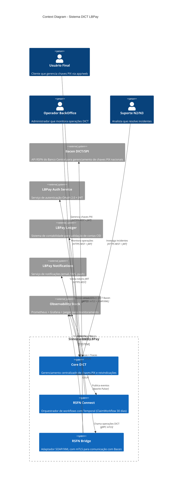

# DIA-001: C4 Context Diagram - Sistema DICT LBPay

**Versão**: 1.0
**Data**: 2025-10-25
**Autor**: Equipe Arquitetura
**Status**: ✅ Completo

---

## Sumário Executivo

Este documento apresenta o **C4 Context Diagram** (nível 1) do Sistema DICT LBPay, mostrando a visão de alto nível de como o sistema interage com usuários e sistemas externos, especialmente o DICT/SPI do Banco Central.

**Objetivo**: Fornecer uma visão macro do sistema para stakeholders técnicos e não-técnicos, facilitando o entendimento do escopo e fronteiras do sistema.

---

## 1. Visão Geral - C4 Model

### O que é C4 Model?

O **C4 Model** (Context, Containers, Components, Code) é uma técnica de diagramação hierárquica para documentação de arquitetura de software, criada por Simon Brown.

**Níveis**:
1. **Context** (este documento): Sistema + Usuários + Sistemas Externos
2. **Container**: Aplicações e data stores do sistema
3. **Component**: Componentes internos de cada aplicação
4. **Code**: Classes e detalhes de implementação (opcional)

**Por que C4?**:
- ✅ Hierarquia clara (zoom in/out)
- ✅ Notação simples e intuitiva
- ✅ Ferramenta-agnóstico (Mermaid, PlantUML, Structurizr)
- ✅ Adequado para documentação viva

---

## 2. C4 Context Diagram - Sistema DICT LBPay

### 2.1. Diagrama



---

### 2.2. Descrição Textual (Alternativa PlantUML)

Para ambientes que preferem PlantUML ao invés de Mermaid:

```plantuml
@startuml
!include https://raw.githubusercontent.com/plantuml-stdlib/C4-PlantUML/master/C4_Context.puml

LAYOUT_WITH_LEGEND()

title Context Diagram - Sistema DICT LBPay

Person(frontend_user, "Usuário Final", "Cliente que gerencia chaves PIX")
Person(backoffice_user, "Operador BackOffice", "Administrador")
Person(support_user, "Suporte N2/N3", "Analista de incidentes")

System_Boundary(lb_dict, "Sistema DICT LBPay") {
  System(core_dict, "Core DICT", "Gerenciamento de chaves PIX")
  System(connect, "RSFN Connect", "Orquestrador Temporal")
  System(bridge, "RSFN Bridge", "Adaptador SOAP/mTLS")
}

System_Ext(bacen, "Bacen DICT/SPI", "API RSFN Banco Central")
System_Ext(auth, "LBPay Auth", "OAuth 2.0 + JWT")
System_Ext(ledger, "LBPay Ledger", "Validação contas CID")
System_Ext(notif, "LBPay Notifications", "Email/SMS/Push")
System_Ext(obs, "Observability Stack", "Prometheus/Grafana/Jaeger")

Rel(frontend_user, core_dict, "Gerencia chaves", "HTTPS REST")
Rel(backoffice_user, core_dict, "Monitora", "HTTPS REST")
Rel(support_user, core_dict, "Investiga", "HTTPS REST")

Rel(core_dict, auth, "Valida JWT", "HTTPS")
Rel(core_dict, ledger, "Valida contas", "gRPC")
Rel(core_dict, connect, "Eventos", "Pulsar")

Rel(connect, bridge, "Operações DICT", "gRPC mTLS")
Rel(connect, notif, "Notifica usuários", "HTTPS")

Rel(bridge, bacen, "SOAP/XML", "HTTPS mTLS")

Rel(core_dict, obs, "Métricas", "OTLP")
Rel(connect, obs, "Métricas", "OTLP")
Rel(bridge, obs, "Métricas", "OTLP")

@enduml
```

---

## 3. Elementos do Diagrama

### 3.1. Atores (Pessoas)

| Ator | Descrição | Responsabilidades |
|------|-----------|-------------------|
| **Usuário Final** | Cliente pessoa física ou jurídica | Criar, consultar, deletar chaves PIX; iniciar reivindicações |
| **Operador BackOffice** | Funcionário LBPay com perfil admin | Monitorar operações, resolver disputas, auditar logs |
| **Suporte N2/N3** | Analista técnico | Investigar incidentes, troubleshooting, análise de logs |

---

### 3.2. Sistema DICT LBPay (Boundary)

#### Core DICT
- **Responsabilidade**: Gerenciamento centralizado de chaves PIX, reivindicações e portabilidades
- **Tecnologia**: Go 1.24.5 + Fiber v3 + PostgreSQL 16
- **Protocolo de Comunicação**: HTTPS REST (frontend) + gRPC (serviços internos)
- **Principais Operações**:
  - Criar/Consultar/Deletar chaves PIX
  - Iniciar reivindicação (claim)
  - Confirmar/Cancelar reivindicação
  - Consultar status de workflows

#### RSFN Connect
- **Responsabilidade**: Orquestração de workflows duráveis (ClaimWorkflow de 30 dias) e comunicação assíncrona
- **Tecnologia**: Go 1.24.5 + Temporal v1.36.0 + Apache Pulsar v0.16.0 + Redis v9.14.1
- **Protocolo de Comunicação**: gRPC (Bridge), Pulsar (eventos), Redis (cache)
- **Principais Workflows**:
  - **ClaimWorkflow**: Gerencia reivindicação com timer de 30 dias
  - **PortabilityWorkflow**: Gerencia portabilidade de conta
  - **VSYNC**: Sincronização diária com Bacen

#### RSFN Bridge
- **Responsabilidade**: Adaptador para comunicação SOAP/XML com DICT Bacen usando mTLS e certificados ICP-Brasil
- **Tecnologia**: Go 1.24.5 + Java 17 (XML Signer) + Certificates ICP-Brasil A3
- **Protocolo de Comunicação**: HTTPS mTLS + SOAP/XML (Bacen) | gRPC (Connect)
- **Principais Operações**:
  - Traduzir gRPC → SOAP/XML
  - Assinar digitalmente mensagens XML (ICP-Brasil)
  - Validar respostas do Bacen
  - Retry com circuit breaker

---

### 3.3. Sistemas Externos

#### Bacen DICT/SPI
- **Descrição**: API oficial do Banco Central para gerenciamento de chaves PIX na base nacional
- **Protocolo**: HTTPS com mTLS + SOAP/XML
- **Certificação**: ICP-Brasil A3 obrigatório
- **Operações Principais**: CreateEntry, GetEntry, DeleteEntry, CreateClaim, CompleteClaim, VSYNC
- **SLA**: 99.9% (Bacen)
- **Referência**: [TEC-002 v3.1](../../11_Especificacoes_Tecnicas/TEC-002_Bridge_Specification.md)

#### LBPay Auth Service
- **Descrição**: Serviço centralizado de autenticação e autorização
- **Protocolo**: HTTPS REST
- **Padrões**: OAuth 2.0 (Authorization Code Flow + PKCE) + OpenID Connect + JWT
- **Responsabilidades**:
  - Emissão de tokens JWT (Access Token + Refresh Token)
  - Validação de tokens
  - RBAC (user, admin, support, auditor)
- **Referência**: [SEC-004](../../13_Seguranca/SEC-004_API_Authentication.md)

#### LBPay Ledger
- **Descrição**: Sistema de contabilidade que valida existência de contas CID
- **Protocolo**: gRPC
- **Responsabilidades**:
  - Validar que conta CID existe no ledger
  - Verificar status da conta (ativa, bloqueada, encerrada)
  - Obter informações do titular (nome, documento)
- **Por que Necessário**: Antes de criar chave PIX, é obrigatório validar que a conta CID é válida

#### LBPay Notifications
- **Descrição**: Serviço de notificações multicanal
- **Protocolo**: HTTPS REST
- **Canais**: Email, SMS, Push Notification
- **Eventos Notificados**:
  - Chave PIX criada com sucesso
  - Reivindicação recebida (aviso ao owner)
  - Reivindicação confirmada/cancelada
  - Reivindicação expirada (30 dias)
- **Template Engine**: Handlebars

#### Observability Stack
- **Descrição**: Stack completo de observabilidade
- **Componentes**:
  - **Prometheus**: Coleta de métricas (TPS, latência, erros)
  - **Grafana**: Dashboards de visualização
  - **Jaeger**: Distributed tracing (OpenTelemetry)
  - **Loki**: Agregação de logs
- **Protocolo**: OTLP (OpenTelemetry Protocol)
- **Referência**: [DEV-005](../../15_DevOps/README.md) (a criar)

---

## 4. Fluxos de Comunicação

### 4.1. Fluxo Principal - Criar Chave PIX

```
1. Usuário Final → Core DICT (HTTPS REST + JWT)
   POST /api/v1/keys
   Body: { key_type: "CPF", key_value: "12345678900", account: {...} }

2. Core DICT → LBPay Auth (HTTPS REST)
   GET /auth/validate
   Header: Authorization: Bearer <jwt_token>

3. Core DICT → LBPay Ledger (gRPC)
   ValidateAccount(account_id)

4. Core DICT → RSFN Connect (Apache Pulsar)
   Topic: dict.entries.created
   Event: { entry_id, key, account, timestamp }

5. RSFN Connect → RSFN Bridge (gRPC mTLS)
   CreateEntry(key, account)

6. RSFN Bridge → Bacen DICT (HTTPS mTLS + SOAP/XML)
   <CreateEntryRequest> ... </CreateEntryRequest>
   (Assinatura digital ICP-Brasil)

7. Bacen DICT → RSFN Bridge (SOAP/XML Response)
   <CreateEntryResponse> ... </CreateEntryResponse>

8. RSFN Bridge → RSFN Connect (gRPC Response)
   { entry_id, status: "ACTIVE", external_id }

9. RSFN Connect → Core DICT (Pulsar Event)
   Topic: dict.entries.confirmed
   Event: { entry_id, external_id, status }

10. Core DICT → LBPay Notifications (HTTPS REST)
    POST /notifications/send
    Body: { user_id, template: "key_created", ... }

11. Core DICT → Observability (OTLP)
    Span: create_entry (duration: 850ms, status: success)
```

**Tempo Total Típico**: 800ms - 1.5s (incluindo Bacen)

---

### 4.2. Fluxo Principal - Reivindicação (ClaimWorkflow 30 dias)

```
1. Usuário Final → Core DICT
   POST /api/v1/claims
   Body: { entry_id, claimer_account, completion_period_days: 30 }

2. Core DICT → RSFN Connect (Pulsar)
   Topic: dict.claims.created
   Event: { claim_id, entry_id, claimer, owner, period: 30 }

3. RSFN Connect inicia Temporal Workflow:
   ClaimWorkflow.Run(claim_id, period: 30 dias)

4. RSFN Connect → RSFN Bridge (gRPC)
   CreateClaim(claim_id, entry_id, claimer)

5. RSFN Bridge → Bacen DICT (SOAP/XML + mTLS)
   <CreateClaimRequest> ... </CreateClaimRequest>

6. Temporal Timer: 30 dias
   (Workflow dorme por 30 dias, mas permanece durável)

7a. Se Owner confirmar antes de 30 dias:
    RSFN Connect → RSFN Bridge → Bacen DICT
    CompleteClaim(claim_id, confirmed: true)

7b. Se Owner cancelar:
    RSFN Connect → RSFN Bridge → Bacen DICT
    CancelClaim(claim_id)

7c. Se 30 dias expirarem sem resposta:
    Temporal Timer dispara → Auto-confirm
    RSFN Connect → RSFN Bridge → Bacen DICT
    CompleteClaim(claim_id, confirmed: true)

8. RSFN Connect → Core DICT (Pulsar)
   Topic: dict.claims.completed
   Event: { claim_id, status: "COMPLETED", resolution }

9. Core DICT → LBPay Notifications
   Notificar owner e claimer sobre resolução
```

**Duração Máxima**: 30 dias (TEC-003 v2.1)

**Referência**: [TEC-003 v2.1](../../11_Especificacoes_Tecnicas/TEC-003_RSFN_Connect_Specification.md)

---

## 5. Fronteiras do Sistema

### 5.1. O que ESTÁ dentro do Sistema DICT LBPay

✅ Gerenciamento de chaves PIX (CRUD)
✅ Reivindicações (ClaimWorkflow 30 dias)
✅ Portabilidade de conta
✅ Orquestração de workflows duráveis (Temporal)
✅ Adaptador SOAP/XML para Bacen
✅ Assinatura digital XML (ICP-Brasil)
✅ Cache de operações (Redis)
✅ Auditoria de operações (PostgreSQL)

---

### 5.2. O que ESTÁ FORA do Sistema DICT LBPay

❌ Autenticação de usuários (delegado para LBPay Auth)
❌ Gestão de contas CID (delegado para LBPay Ledger)
❌ Notificações (delegado para LBPay Notifications)
❌ Transações PIX (responsabilidade do SPI, não DICT)
❌ Emissão de certificados ICP-Brasil (processo manual/AC)
❌ Monitoramento/Alertas (delegado para Observability Stack)

---

## 6. Decisões Arquiteturais (ADRs Relacionadas)

| ADR | Decisão | Justificativa |
|-----|---------|---------------|
| **ADR-001** | Clean Architecture (4 camadas) | Separação de responsabilidades, testabilidade |
| **ADR-002** | CQRS + Event Sourcing | Escalabilidade, auditoria completa |
| **ADR-003** | Temporal para workflows | Workflows duráveis (30 dias), retry automático |
| **ADR-004** | Apache Pulsar para eventos | Garantia de entrega, replayability |
| **ADR-005** | Bridge separado do Connect | Isolamento de complexidade SOAP/mTLS |
| **ADR-006** | mTLS com ICP-Brasil | Requisito Bacen (segurança) |
| **ADR-007** | PostgreSQL 16 com particionamento | Compliance (LGPD, auditoria 5 anos) |
| **ADR-008** | Redis para cache e idempotência | Performance (cache) + idempotência (24h) |

**Referências**: [02_Arquitetura/ADRs](../ADRs/)

---

## 7. Requisitos Não-Funcionais

| Requisito | Meta | Justificativa |
|-----------|------|---------------|
| **Disponibilidade** | 99.9% (43 min downtime/mês) | SLA Bacen, operações críticas PIX |
| **Throughput** | 1000 TPS (pico) | Estimativa baseada em volume LBPay |
| **Latência (p95)** | < 2s (incluindo Bacen) | Experiência do usuário |
| **Latência (p50)** | < 800ms | Performance típica |
| **Segurança** | mTLS + ICP-Brasil + LGPD | Compliance regulatório Bacen |
| **Auditabilidade** | 100% operações auditadas | Rastreabilidade completa (Bacen + LGPD) |
| **Recuperação** | RPO < 1h, RTO < 2h | Continuidade de negócio |
| **Escalabilidade** | Horizontal (Kubernetes) | Suportar crescimento de usuários |

**Referências**:
- [CRF-001](../../05_Requisitos/CRF-001_Criterios_de_Aceite_Funcionais.md)
- [REG-001](../../06_Regulatorio/REG-001_Requisitos_Regulatorios_Bacen.md)

---

## 8. Tecnologias Principais

| Componente | Tecnologia | Versão | Justificativa |
|------------|-----------|--------|---------------|
| **Core DICT** | Go + Fiber | Go 1.24.5, Fiber v3 | Performance, type safety |
| **RSFN Connect** | Go + Temporal | Temporal v1.36.0 | Workflows duráveis (30 dias) |
| **RSFN Bridge** | Go + Java (signer) | Go 1.24.5, Java 17 | XML signature (JRE), SOAP |
| **Database** | PostgreSQL | 16 | ACID, RLS, particionamento |
| **Cache** | Redis | v9.14.1 | Performance, idempotência |
| **Messaging** | Apache Pulsar | v0.16.0 | Event sourcing, garantia entrega |
| **Observability** | Prometheus + Grafana + Jaeger | Latest | Monitoramento completo |
| **Container Orchestration** | Kubernetes | 1.28+ | Escalabilidade, HA |

---

## 9. Segurança no Contexto

### 9.1. Autenticação

- **Usuários Finais**: OAuth 2.0 + JWT via LBPay Auth
- **Serviços Internos**: mTLS com certificados internos
- **Bacen DICT**: mTLS com certificados ICP-Brasil A3

### 9.2. Autorização

- **RBAC**: 4 perfis (user, admin, support, auditor)
- **Scopes OAuth**: `dict:read`, `dict:write`, `dict:admin`

### 9.3. Comunicação

- **Frontend ↔ Core DICT**: HTTPS + JWT
- **Core ↔ Connect**: Pulsar (TLS) + gRPC (mTLS interno)
- **Connect ↔ Bridge**: gRPC mTLS
- **Bridge ↔ Bacen**: HTTPS mTLS + XML Signature (ICP-Brasil)

### 9.4. Compliance

- **LGPD**: Proteção de dados pessoais (CPF, nome, email)
- **Bacen**: Auditoria de 100% das operações, retenção 5 anos
- **ICP-Brasil**: Certificados A3 para assinatura digital

**Referências**: [13_Seguranca](../../13_Seguranca/)

---

## 10. Próximos Passos

Após entender o Context Diagram, consultar:

1. **[DIA-002: C4 Container Diagram](./DIA-002_C4_Container_Diagram.md)** (a criar)
   - Detalha aplicações internas de cada sistema (Core, Connect, Bridge)
   - Mostra data stores (PostgreSQL, Redis, Temporal)

2. **[DIA-003: C4 Component Diagram - Core DICT](./DIA-003_C4_Component_Diagram_Core.md)** (a criar)
   - Componentes internos do Core DICT (API, Domain, Application, Infrastructure)

3. **[DIA-006: Sequence Diagram - ClaimWorkflow](./DIA-006_Sequence_Claim_Workflow.md)** (a criar)
   - Fluxo detalhado do ClaimWorkflow de 30 dias

4. **[INT-001: Flow CreateEntry E2E](../../12_Integracao/Fluxos/INT-001_Flow_CreateEntry_E2E.md)** (a criar)
   - Fluxo completo de criação de chave PIX (E2E)

---

## 11. Checklist de Validação

Ao revisar este diagrama, verificar:

- [ ] Todos os atores (pessoas) estão representados?
- [ ] Fronteira do sistema está clara (boundary)?
- [ ] Sistemas externos estão identificados como `System_Ext`?
- [ ] Protocolos de comunicação estão documentados?
- [ ] Tecnologias principais estão mencionadas?
- [ ] Requisitos de segurança (mTLS, ICP-Brasil) estão visíveis?
- [ ] Há rastreabilidade para documentos detalhados (ADRs, TEC, etc.)?
- [ ] Diagrama é compreensível para stakeholders não-técnicos?

---

## 12. Referências

### Documentos Internos
- [TEC-001: IcePanel Architecture](../../11_Especificacoes_Tecnicas/TEC-001_IcePanel_Architecture_and_Decisions.md)
- [TEC-002 v3.1: Bridge Specification](../../11_Especificacoes_Tecnicas/TEC-002_Bridge_Specification.md)
- [TEC-003 v2.1: Connect Specification](../../11_Especificacoes_Tecnicas/TEC-003_RSFN_Connect_Specification.md)
- [ANA-001: Análise IcePanel](../../00_Analises/ANA-001_Analise_Arquitetura_IcePanel.md)
- [ADRs](../ADRs/)
- [Documentos de Segurança](../../13_Seguranca/)

### Documentos Externos
- [C4 Model](https://c4model.com/) - Simon Brown
- [Mermaid C4 Syntax](https://mermaid.js.org/syntax/c4.html)
- [PlantUML C4](https://github.com/plantuml-stdlib/C4-PlantUML)
- [Bacen - Manual DICT](https://www.bcb.gov.br/estabilidadefinanceira/pix)

---

**Última Revisão**: 2025-10-25
**Aprovado por**: Arquitetura LBPay
**Próxima Revisão**: 2026-01-25 (trimestral)
