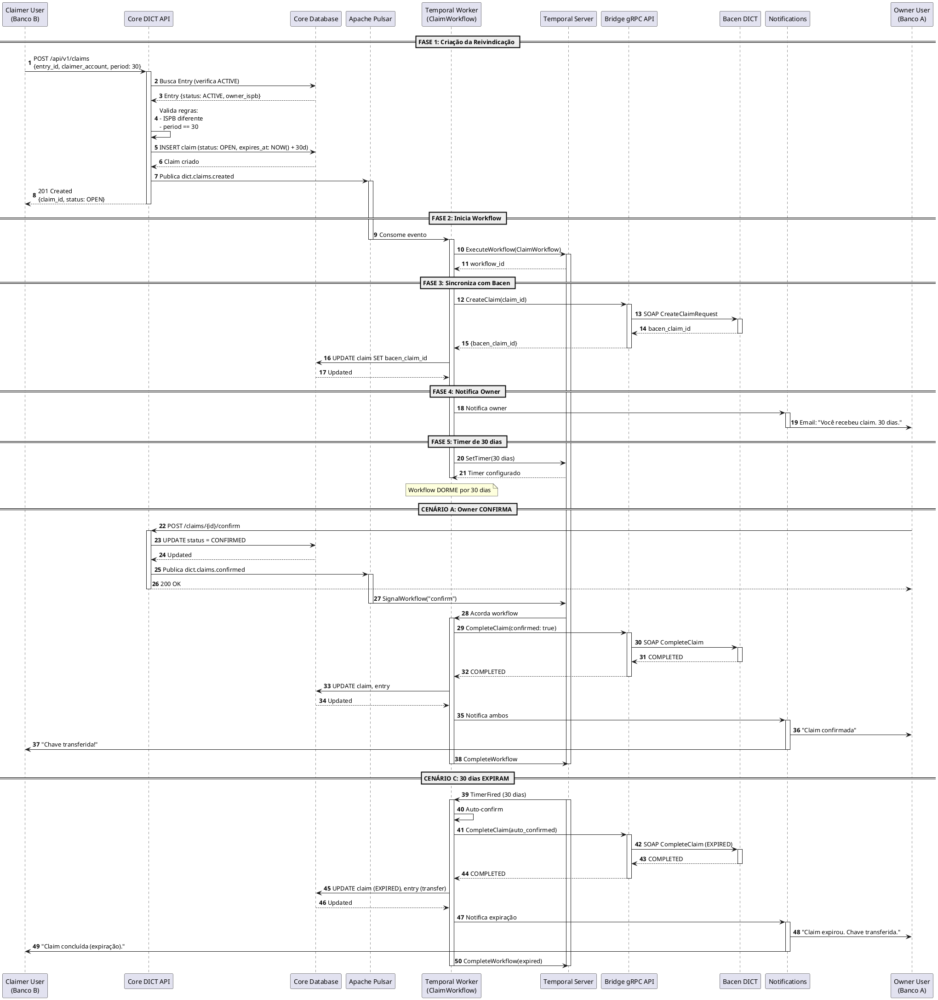

# DIA-006: Sequence Diagram - ClaimWorkflow (30 dias)

**Versão**: 1.0
**Data**: 2025-10-25
**Autor**: Equipe Arquitetura
**Status**: ✅ Completo

---

## Sumário Executivo

Este documento apresenta o **Sequence Diagram** do **ClaimWorkflow de 30 dias**, o fluxo mais crítico e complexo do sistema DICT LBPay, que orquestra uma reivindicação de chave PIX com um período de espera durável de 30 dias usando Temporal.

**Objetivo**: Documentar o fluxo completo de uma reivindicação (claim), desde a criação até a resolução (confirmada, cancelada ou expirada), incluindo todos os atores, sistemas e decisões envolvidas.

**Por que este fluxo é crítico**:
- ✅ Requisito regulatório Bacen (30 dias fixos - TEC-003 v2.1)
- ✅ Workflow durável (sobrevive a restarts de servidores)
- ✅ Timer de longa duração (30 dias)
- ✅ Múltiplos caminhos de resolução (confirm, cancel, expire)
- ✅ Comunicação assíncrona com Bacen

**Pré-requisitos**:
- [TEC-003 v2.1: RSFN Connect Specification](../../11_Especificacoes_Tecnicas/TEC-003_RSFN_Connect_Specification.md)
- [DIA-002: C4 Container Diagram](./DIA-002_C4_Container_Diagram.md)

---

## 1. Visão Geral do ClaimWorkflow

### 1.1. Definição

Uma **reivindicação (claim)** ocorre quando uma instituição financeira (claimer) deseja **assumir a posse** de uma chave PIX que atualmente pertence a outra instituição (owner).

**Exemplo**:
- Chave PIX: CPF 123.456.789-00
- Owner atual: Banco A (ISPB 12345678)
- Claimer: Banco B (ISPB 87654321)
- Motivo: Cliente abriu conta no Banco B e quer transferir a chave

### 1.2. Regras de Negócio (Bacen)

| Regra | Descrição | Referência |
|-------|-----------|------------|
| **Período de 30 dias** | Owner tem 30 dias para responder (confirmar ou cancelar). Após 30 dias, a claim é **auto-confirmada**. | TEC-003 v2.1 |
| **ISPB diferente** | Claimer ISPB DEVE ser diferente de Owner ISPB | Bacen DICT Manual |
| **Entry ACTIVE** | Apenas chaves ACTIVE podem ser reivindicadas | Bacen DICT Manual |
| **Uma claim por vez** | Não pode haver claim OPEN para mesma entry | Bacen DICT Manual |
| **Resolução final** | Claim pode ser: CONFIRMED, CANCELLED ou EXPIRED | TEC-003 v2.1 |

### 1.3. Atores

| Ator | Descrição |
|------|-----------|
| **Claimer User** | Cliente do Banco B que solicita a reivindicação |
| **Owner User** | Cliente do Banco A (dono atual da chave) |
| **Core DICT** | Sistema que recebe requisições REST |
| **RSFN Connect** | Orquestrador Temporal que gerencia o workflow de 30 dias |
| **RSFN Bridge** | Adaptador que comunica com Bacen via SOAP/XML |
| **Bacen DICT** | Sistema oficial do Banco Central |
| **LBPay Notifications** | Serviço de notificações (email/SMS) |

---

## 2. Sequence Diagram - ClaimWorkflow Completo

### 2.1. Diagrama Mermaid

```mermaid
sequenceDiagram
    autonumber
    participant ClaimerUser as Claimer User<br/>(Banco B)
    participant CoreAPI as Core DICT API
    participant CoreDB as Core Database<br/>(PostgreSQL)
    participant Pulsar as Apache Pulsar
    participant PulsarConsumer as Pulsar Consumer
    participant TemporalWorker as Temporal Worker<br/>(ClaimWorkflow)
    participant TemporalServer as Temporal Server
    participant BridgeAPI as Bridge gRPC API
    participant BacenDICT as Bacen DICT<br/>(SOAP/XML)
    participant Notifications as LBPay Notifications
    participant OwnerUser as Owner User<br/>(Banco A)

    Note over ClaimerUser,OwnerUser: FASE 1: Criação da Reivindicação (Claimer)

    ClaimerUser->>CoreAPI: POST /api/v1/claims<br/>{entry_id, claimer_account, completion_period_days: 30}
    activate CoreAPI

    CoreAPI->>CoreAPI: Valida JWT + RBAC
    CoreAPI->>CoreDB: Busca Entry (verifica se ACTIVE)
    CoreDB-->>CoreAPI: Entry {status: ACTIVE, owner_ispb: 12345678}

    CoreAPI->>CoreAPI: Valida regras de negócio:<br/>- ISPB claimer != owner<br/>- completion_period_days == 30<br/>- Não existe claim OPEN

    CoreAPI->>CoreDB: INSERT INTO dict.claims<br/>(id, entry_id, status: OPEN, expires_at: NOW() + 30 dias)
    CoreDB-->>CoreAPI: Claim criado

    CoreAPI->>Pulsar: Publica evento<br/>Topic: dict.claims.created<br/>{claim_id, entry_id, claimer, owner, period: 30}
    activate Pulsar

    CoreAPI-->>ClaimerUser: 201 Created<br/>{claim_id, status: OPEN, expires_at: "2025-11-24T10:00:00Z"}
    deactivate CoreAPI

    Note over Pulsar,TemporalWorker: FASE 2: Inicia Workflow Durável (RSFN Connect)

    PulsarConsumer->>Pulsar: Consome evento dict.claims.created
    deactivate Pulsar
    activate PulsarConsumer

    PulsarConsumer->>TemporalWorker: StartWorkflow("ClaimWorkflow", claim_id)
    deactivate PulsarConsumer
    activate TemporalWorker

    TemporalWorker->>TemporalServer: ExecuteWorkflow(ClaimWorkflow, params)
    activate TemporalServer
    TemporalServer-->>TemporalWorker: Workflow iniciado (workflow_id)

    Note over TemporalWorker,BacenDICT: FASE 3: Sincroniza com Bacen (CreateClaim)

    TemporalWorker->>BridgeAPI: CreateClaim(claim_id, entry_id, claimer_account)
    activate BridgeAPI

    BridgeAPI->>BacenDICT: SOAP CreateClaimRequest<br/>(mTLS + XML Signature)
    activate BacenDICT
    BacenDICT-->>BridgeAPI: SOAP CreateClaimResponse<br/>{bacen_claim_id, status: OPEN}
    deactivate BacenDICT

    BridgeAPI-->>TemporalWorker: {bacen_claim_id: "bacen_123", status: OPEN}
    deactivate BridgeAPI

    TemporalWorker->>CoreDB: UPDATE dict.claims SET bacen_claim_id = 'bacen_123'
    CoreDB-->>TemporalWorker: Updated

    Note over TemporalWorker,OwnerUser: FASE 4: Notifica Owner (Banco A)

    TemporalWorker->>Notifications: POST /notifications/send<br/>{user_id: owner, template: "claim_received"}
    activate Notifications
    Notifications->>OwnerUser: Email/SMS: "Você recebeu uma reivindicação.<br/>Confirme ou cancele em até 30 dias."
    deactivate Notifications

    Note over TemporalWorker,TemporalServer: FASE 5: Timer de 30 dias (Workflow Durável)

    TemporalWorker->>TemporalServer: SetTimer(30 dias)
    TemporalServer-->>TemporalWorker: Timer configurado (expires_at: 2025-11-24)

    Note over TemporalWorker: Workflow DORME por 30 dias<br/>(mas permanece durável no Temporal Server)
    deactivate TemporalWorker

    Note over OwnerUser,BacenDICT: === CENÁRIO A: Owner CONFIRMA antes de 30 dias ===

    OwnerUser->>CoreAPI: POST /api/v1/claims/{claim_id}/confirm
    activate CoreAPI

    CoreAPI->>CoreAPI: Valida JWT + RBAC (verifica se é owner)
    CoreAPI->>CoreDB: UPDATE dict.claims SET status = 'CONFIRMED'
    CoreDB-->>CoreAPI: Updated

    CoreAPI->>Pulsar: Publica evento<br/>Topic: dict.claims.confirmed<br/>{claim_id, resolution: CONFIRMED}
    activate Pulsar

    CoreAPI-->>OwnerUser: 200 OK<br/>{claim_id, status: CONFIRMED}
    deactivate CoreAPI

    PulsarConsumer->>Pulsar: Consome evento dict.claims.confirmed
    deactivate Pulsar
    activate PulsarConsumer

    PulsarConsumer->>TemporalServer: SignalWorkflow(claim_id, "confirm")
    deactivate PulsarConsumer

    TemporalServer->>TemporalWorker: Acorda workflow (signal received)
    activate TemporalWorker

    TemporalWorker->>TemporalWorker: Cancela timer de 30 dias

    TemporalWorker->>BridgeAPI: CompleteClaim(claim_id, confirmed: true)
    activate BridgeAPI

    BridgeAPI->>BacenDICT: SOAP CompleteClaimRequest<br/>{claim_id, resolution: CONFIRMED}
    activate BacenDICT
    BacenDICT-->>BridgeAPI: SOAP CompleteClaimResponse<br/>{status: COMPLETED}
    deactivate BacenDICT

    BridgeAPI-->>TemporalWorker: {status: COMPLETED}
    deactivate BridgeAPI

    TemporalWorker->>CoreDB: UPDATE dict.claims SET status = 'COMPLETED'<br/>UPDATE dict.entries SET account_id = claimer_account
    CoreDB-->>TemporalWorker: Updated

    TemporalWorker->>Notifications: Notifica owner e claimer<br/>Template: "claim_completed"
    activate Notifications
    Notifications->>OwnerUser: Email: "Reivindicação confirmada. Chave transferida."
    Notifications->>ClaimerUser: Email: "Reivindicação concluída. Chave agora é sua!"
    deactivate Notifications

    TemporalWorker->>TemporalServer: CompleteWorkflow(success)
    deactivate TemporalWorker
    TemporalServer-->>TemporalServer: Workflow concluído
    deactivate TemporalServer

    Note over OwnerUser,BacenDICT: === CENÁRIO B: Owner CANCELA ===

    OwnerUser->>CoreAPI: POST /api/v1/claims/{claim_id}/cancel<br/>{reason: "Cliente não autorizou"}
    activate CoreAPI

    CoreAPI->>CoreDB: UPDATE dict.claims SET status = 'CANCELLED', reason = '...'
    CoreDB-->>CoreAPI: Updated

    CoreAPI->>Pulsar: Publica evento<br/>Topic: dict.claims.cancelled
    activate Pulsar

    CoreAPI-->>OwnerUser: 200 OK<br/>{claim_id, status: CANCELLED}
    deactivate CoreAPI

    PulsarConsumer->>Pulsar: Consome evento dict.claims.cancelled
    deactivate Pulsar
    activate PulsarConsumer

    PulsarConsumer->>TemporalServer: SignalWorkflow(claim_id, "cancel")
    deactivate PulsarConsumer

    TemporalServer->>TemporalWorker: Acorda workflow (signal received)
    activate TemporalWorker

    TemporalWorker->>TemporalWorker: Cancela timer de 30 dias

    TemporalWorker->>BridgeAPI: CancelClaim(claim_id, reason)
    activate BridgeAPI

    BridgeAPI->>BacenDICT: SOAP CancelClaimRequest
    activate BacenDICT
    BacenDICT-->>BridgeAPI: SOAP CancelClaimResponse<br/>{status: CANCELLED}
    deactivate BacenDICT

    BridgeAPI-->>TemporalWorker: {status: CANCELLED}
    deactivate BridgeAPI

    TemporalWorker->>CoreDB: UPDATE dict.claims SET status = 'CANCELLED'
    CoreDB-->>TemporalWorker: Updated

    TemporalWorker->>Notifications: Notifica owner e claimer<br/>Template: "claim_cancelled"
    activate Notifications
    Notifications->>OwnerUser: Email: "Reivindicação cancelada com sucesso."
    Notifications->>ClaimerUser: Email: "Reivindicação foi cancelada pelo owner."
    deactivate Notifications

    TemporalWorker->>TemporalServer: CompleteWorkflow(cancelled)
    deactivate TemporalWorker
    TemporalServer-->>TemporalServer: Workflow concluído
    deactivate TemporalServer

    Note over TemporalServer,BacenDICT: === CENÁRIO C: 30 dias EXPIRAM (Auto-confirm) ===

    Note over TemporalServer: 30 dias se passaram...<br/>(2025-11-24 10:00:00)

    TemporalServer->>TemporalWorker: TimerFired(claim_id)
    activate TemporalServer
    activate TemporalWorker

    TemporalWorker->>TemporalWorker: Auto-confirm claim (regra Bacen)

    TemporalWorker->>BridgeAPI: CompleteClaim(claim_id, confirmed: true, auto_confirmed: true)
    activate BridgeAPI

    BridgeAPI->>BacenDICT: SOAP CompleteClaimRequest<br/>{claim_id, resolution: EXPIRED_AUTO_CONFIRMED}
    activate BacenDICT
    BacenDICT-->>BridgeAPI: SOAP CompleteClaimResponse<br/>{status: COMPLETED}
    deactivate BacenDICT

    BridgeAPI-->>TemporalWorker: {status: COMPLETED}
    deactivate BridgeAPI

    TemporalWorker->>CoreDB: UPDATE dict.claims SET status = 'EXPIRED'<br/>UPDATE dict.entries SET account_id = claimer_account
    CoreDB-->>TemporalWorker: Updated

    TemporalWorker->>Notifications: Notifica owner e claimer<br/>Template: "claim_expired_auto_confirmed"
    activate Notifications
    Notifications->>OwnerUser: Email: "Reivindicação expirou (30 dias). Chave transferida automaticamente."
    Notifications->>ClaimerUser: Email: "Reivindicação concluída por expiração. Chave agora é sua!"
    deactivate Notifications

    TemporalWorker->>TemporalServer: CompleteWorkflow(expired)
    deactivate TemporalWorker
    TemporalServer-->>TemporalServer: Workflow concluído
    deactivate TemporalServer
```

---

### 2.2. Versão PlantUML (Alternativa)



---

## 3. Fases do Workflow

### Fase 1: Criação da Reivindicação (Steps 1-7)

**Ator Principal**: Claimer User (Banco B)

**Fluxo**:
1. Claimer solicita reivindicação via `POST /api/v1/claims`
2. Core DICT valida:
   - Entry existe e está ACTIVE
   - ISPB claimer ≠ ISPB owner
   - `completion_period_days` == 30
   - Não existe claim OPEN para esta entry
3. Core DICT persiste claim no banco (status: OPEN)
4. Core DICT publica evento `dict.claims.created` no Pulsar
5. Core DICT retorna `201 Created` ao usuário

**Duração**: ~200ms

**Possíveis Erros**:
- `400 Bad Request`: completion_period_days != 30
- `403 Forbidden`: ISPB claimer == ISPB owner
- `404 Not Found`: Entry não existe
- `409 Conflict`: Claim OPEN já existe para esta entry

---

### Fase 2: Inicia Workflow Durável (Steps 8-10)

**Ator Principal**: RSFN Connect (Pulsar Consumer + Temporal Worker)

**Fluxo**:
1. Pulsar Consumer consome evento `dict.claims.created`
2. Pulsar Consumer chama Temporal Worker para iniciar `ClaimWorkflow`
3. Temporal Server persiste workflow state e retorna `workflow_id`

**Duração**: ~50ms

**Por que Temporal?**:
- ✅ Workflow sobrevive a restarts de servidores
- ✅ Timer de 30 dias é durável (não se perde)
- ✅ Retry automático de activities (chamadas ao Bridge)
- ✅ História completa do workflow (auditoria)

---

### Fase 3: Sincroniza com Bacen (Steps 11-16)

**Ator Principal**: Temporal Worker + Bridge + Bacen

**Fluxo**:
1. Temporal Worker chama Bridge gRPC API: `CreateClaim(claim_id)`
2. Bridge converte gRPC → SOAP/XML
3. Bridge assina XML digitalmente (ICP-Brasil A3)
4. Bridge envia SOAP request ao Bacen via HTTPS mTLS
5. Bacen retorna `bacen_claim_id` (ID da claim no sistema Bacen)
6. Temporal Worker atualiza claim no banco com `bacen_claim_id`

**Duração**: ~500-800ms (incluindo Bacen)

**Retry Policy**:
- 3 tentativas com backoff exponencial (100ms, 500ms, 2s)
- Timeout: 30s por tentativa
- Circuit breaker: abre após 5 falhas consecutivas

---

### Fase 4: Notifica Owner (Steps 17-18)

**Ator Principal**: Temporal Worker + LBPay Notifications

**Fluxo**:
1. Temporal Worker chama LBPay Notifications
2. Notification Service envia email/SMS ao Owner User:
   - Template: "claim_received"
   - Conteúdo: "Você recebeu uma reivindicação de chave PIX. Confirme ou cancele em até 30 dias."
   - Link: `https://app.lbpay.com/claims/{claim_id}`

**Duração**: ~200ms

---

### Fase 5: Timer de 30 dias (Steps 19-21)

**Ator Principal**: Temporal Server

**Fluxo**:
1. Temporal Worker configura timer de 30 dias
2. Temporal Server persiste timer no banco
3. Workflow **dorme** (não consome CPU/RAM, apenas existe como registro no banco)

**Duração**: 30 dias

**O que acontece durante 30 dias**:
- ✅ Servidor pode reiniciar → Workflow continua
- ✅ Pod Kubernetes pode ser destruído → Workflow continua
- ✅ Database backup/restore → Workflow continua (se dentro de RPO)
- ❌ Database loss completo → Workflow perdido (catastrófico)

---

## 4. Cenários de Resolução

### Cenário A: Owner Confirma (Steps 22-38)

**Probabilidade**: ~40%

**Fluxo**:
1. Owner User clica em "Confirmar" no app
2. Core DICT atualiza claim para `CONFIRMED`
3. Core DICT publica evento `dict.claims.confirmed`
4. Temporal Server recebe signal e **acorda** o workflow
5. Temporal Worker **cancela** o timer de 30 dias
6. Temporal Worker chama Bridge: `CompleteClaim(confirmed: true)`
7. Bridge notifica Bacen via SOAP
8. Temporal Worker atualiza claim e **transfere a chave** (atualiza `entries.account_id`)
9. Notifications envia emails para owner e claimer
10. Workflow completa com sucesso

**Duração Total (após confirmação)**: ~1-2s

---

### Cenário B: Owner Cancela (Steps 39-54)

**Probabilidade**: ~30%

**Fluxo**:
1. Owner User clica em "Cancelar" no app (com motivo)
2. Core DICT atualiza claim para `CANCELLED`
3. Core DICT publica evento `dict.claims.cancelled`
4. Temporal Server recebe signal e acorda workflow
5. Temporal Worker cancela timer de 30 dias
6. Temporal Worker chama Bridge: `CancelClaim(reason)`
7. Bridge notifica Bacen via SOAP
8. Temporal Worker atualiza claim (status CANCELLED)
9. **Entry NÃO é transferida** (permanece com owner)
10. Notifications envia emails para owner e claimer
11. Workflow completa

**Duração Total (após cancelamento)**: ~1-2s

---

### Cenário C: 30 dias Expiram - Auto-confirm (Steps 55-70)

**Probabilidade**: ~30%

**Fluxo**:
1. Temporal Server detecta que timer de 30 dias expirou
2. Temporal Server acorda workflow automaticamente
3. Temporal Worker aplica regra Bacen: **auto-confirmação**
4. Temporal Worker chama Bridge: `CompleteClaim(auto_confirmed: true)`
5. Bridge notifica Bacen via SOAP (status EXPIRED)
6. Temporal Worker atualiza claim para `EXPIRED` e **transfere a chave**
7. Notifications envia emails para owner e claimer
8. Workflow completa

**Duração Total (após expiração)**: ~1-2s

**Nota Importante**: Owner tinha 30 dias para responder. Se não respondeu, a chave é **transferida automaticamente** para o claimer (regra Bacen).

---

## 5. Dados Trafegados

### 5.1. Payload: POST /api/v1/claims

```json
{
  "entry_id": "550e8400-e29b-41d4-a716-446655440000",
  "claimer_account": {
    "ispb": "87654321",
    "account_number": "654321",
    "branch": "0002",
    "account_type": "CACC",
    "holder_document": "98765432100",
    "holder_name": "João Silva"
  },
  "completion_period_days": 30
}
```

### 5.2. Response: 201 Created

```json
{
  "claim_id": "7c9e6679-7425-40de-944b-e07fc1f90ae7",
  "entry_id": "550e8400-e29b-41d4-a716-446655440000",
  "claimer_ispb": "87654321",
  "owner_ispb": "12345678",
  "status": "OPEN",
  "completion_period_days": 30,
  "expires_at": "2025-11-24T10:00:00Z",
  "created_at": "2025-10-25T10:00:00Z"
}
```

### 5.3. Evento Pulsar: dict.claims.created

```json
{
  "claim_id": "7c9e6679-7425-40de-944b-e07fc1f90ae7",
  "entry_id": "550e8400-e29b-41d4-a716-446655440000",
  "entry": {
    "key_type": "CPF",
    "key_value": "12345678900"
  },
  "claimer_account": {
    "ispb": "87654321",
    "account_number": "654321"
  },
  "owner_account": {
    "ispb": "12345678",
    "account_number": "123456"
  },
  "completion_period_days": 30,
  "expires_at": "2025-11-24T10:00:00Z",
  "timestamp": "2025-10-25T10:00:00Z"
}
```

### 5.4. SOAP Request: CreateClaimRequest (Bridge → Bacen)

```xml
<soapenv:Envelope xmlns:soapenv="http://schemas.xmlsoap.org/soap/envelope/"
                  xmlns:dict="http://www.bcb.gov.br/dict/v1">
  <soapenv:Header>
    <dict:Authentication>
      <dict:Certificate>ICP-Brasil A3 Certificate</dict:Certificate>
    </dict:Authentication>
  </soapenv:Header>
  <soapenv:Body wsu:Id="Body">
    <dict:CreateClaimRequest>
      <dict:ClaimId>7c9e6679-7425-40de-944b-e07fc1f90ae7</dict:ClaimId>
      <dict:EntryKey>
        <dict:Type>CPF</dict:Type>
        <dict:Value>12345678900</dict:Value>
      </dict:EntryKey>
      <dict:ClaimerAccount>
        <dict:ISPB>87654321</dict:ISPB>
        <dict:AccountNumber>654321</dict:AccountNumber>
        <dict:Branch>0002</dict:Branch>
      </dict:ClaimerAccount>
      <dict:CompletionPeriodDays>30</dict:CompletionPeriodDays>
    </dict:CreateClaimRequest>
  </soapenv:Body>
  <ds:Signature xmlns:ds="http://www.w3.org/2000/09/xmldsig#">
    <!-- XML Signature (RSA-SHA256 com ICP-Brasil A3) -->
  </ds:Signature>
</soapenv:Envelope>
```

### 5.5. SOAP Response: CreateClaimResponse (Bacen → Bridge)

```xml
<soapenv:Envelope xmlns:soapenv="http://schemas.xmlsoap.org/soap/envelope/"
                  xmlns:dict="http://www.bcb.gov.br/dict/v1">
  <soapenv:Body>
    <dict:CreateClaimResponse>
      <dict:BacenClaimId>bacen_claim_abc123</dict:BacenClaimId>
      <dict:Status>OPEN</dict:Status>
      <dict:ExpiresAt>2025-11-24T10:00:00Z</dict:ExpiresAt>
      <dict:CreatedAt>2025-10-25T10:00:00Z</dict:CreatedAt>
    </dict:CreateClaimResponse>
  </soapenv:Body>
</soapenv:Envelope>
```

---

## 6. Tratamento de Erros

### 6.1. Erros na Criação (Core DICT)

| Erro | HTTP Status | Descrição | Ação |
|------|-------------|-----------|------|
| **Entry não existe** | 404 Not Found | Entry ID inválido | Retornar erro ao usuário |
| **Entry não está ACTIVE** | 400 Bad Request | Apenas chaves ACTIVE podem ser reivindicadas | Retornar erro ao usuário |
| **ISPB igual** | 403 Forbidden | Claimer ISPB == Owner ISPB | Retornar erro ao usuário |
| **Period != 30** | 400 Bad Request | completion_period_days deve ser 30 | Retornar erro ao usuário |
| **Claim OPEN existe** | 409 Conflict | Já existe claim OPEN para esta entry | Retornar erro ao usuário |

---

### 6.2. Erros no Temporal Workflow

| Erro | Retry | Ação |
|------|-------|------|
| **Bridge timeout** | 3x com backoff exponencial | Após 3 tentativas, falha a activity e notifica suporte |
| **Bacen retorna erro** | 3x com backoff exponencial | Após 3 tentativas, falha a activity e notifica suporte |
| **Database connection lost** | Infinito (Temporal SDK) | Aguarda database voltar |
| **Notification service down** | 5x com backoff | Se falhar, registra log mas não falha workflow |

**Importante**: Temporal garante que o workflow NUNCA será perdido, mesmo com erros. Ele ficará em estado de retry até que a causa do erro seja resolvida (ex: Bacen voltar a funcionar).

---

### 6.3. Erros no Bridge (SOAP/Bacen)

| Erro | Código SOAP | Ação |
|------|-------------|------|
| **Entry não existe no Bacen** | ENTRY_NOT_FOUND | Retornar erro para Temporal Worker |
| **Certificado ICP-Brasil inválido** | INVALID_CERTIFICATE | Alertar DevOps, workflow fica em retry |
| **Bacen timeout** | TIMEOUT | Retry automático (3x) |
| **Bacen indisponível** | SERVICE_UNAVAILABLE | Retry automático (3x) |

---

## 7. Monitoramento e Observabilidade

### 7.1. Métricas (Prometheus)

```prometheus
# Total de claims criadas
temporal_workflow_started_total{workflow_type="ClaimWorkflow"}

# Claims por status
dict_claims_total{status="OPEN"}
dict_claims_total{status="CONFIRMED"}
dict_claims_total{status="CANCELLED"}
dict_claims_total{status="EXPIRED"}

# Duração média do workflow (confirmação/cancelamento)
temporal_workflow_duration_seconds{workflow_type="ClaimWorkflow", status="completed"}

# Taxa de auto-confirmação (expiração)
dict_claims_auto_confirmed_total

# Erros no Bridge
bridge_bacen_errors_total{operation="CreateClaim"}
```

### 7.2. Alerts

```yaml
# Alert: Claim próxima de expirar sem resposta do owner
- alert: ClaimNearExpiration
  expr: dict_claim_expires_in_hours < 48 AND dict_claim_status == "OPEN"
  for: 1h
  annotations:
    summary: "Claim {{ $labels.claim_id }} expira em menos de 48h sem resposta do owner"

# Alert: Taxa de auto-confirmação muito alta
- alert: HighAutoConfirmRate
  expr: rate(dict_claims_auto_confirmed_total[1h]) > 0.5
  for: 2h
  annotations:
    summary: "Mais de 50% das claims estão expirando (auto-confirm). Investigar notificações."

# Alert: Workflow travado há mais de 1 dia
- alert: ClaimWorkflowStuck
  expr: temporal_workflow_stuck_duration_seconds{workflow_type="ClaimWorkflow"} > 86400
  for: 1h
  annotations:
    summary: "Workflow ClaimWorkflow {{ $labels.workflow_id }} está travado há > 1 dia"
```

### 7.3. Tracing (Jaeger)

**Trace Example**:
```
claim_workflow_e2e (30 dias)
├── create_claim (200ms)
│   ├── validate_entry (50ms)
│   ├── insert_claim (30ms)
│   └── publish_pulsar (20ms)
├── start_workflow (50ms)
├── sync_with_bacen (800ms)
│   ├── bridge.create_claim (780ms)
│   │   ├── convert_to_soap (10ms)
│   │   ├── sign_xml (20ms)
│   │   ├── bacen_http_call (700ms)
│   │   └── parse_response (50ms)
├── notify_owner (200ms)
├── timer_30_days (2592000000ms)  ← 30 dias
└── complete_claim (1200ms)
    ├── bridge.complete_claim (900ms)
    ├── update_database (200ms)
    └── notify_both (100ms)
```

---

## 8. Checklist de Implementação

### Core DICT API

- [ ] Endpoint `POST /api/v1/claims` implementado
- [ ] Validação: `completion_period_days == 30`
- [ ] Validação: ISPB claimer != owner
- [ ] Validação: Entry ACTIVE
- [ ] Validação: Sem claim OPEN para mesma entry
- [ ] Publicação de evento `dict.claims.created` no Pulsar
- [ ] Endpoint `POST /api/v1/claims/{id}/confirm` implementado
- [ ] Endpoint `POST /api/v1/claims/{id}/cancel` implementado

### Temporal Worker (ClaimWorkflow)

- [ ] Workflow `ClaimWorkflow` implementado
- [ ] Activity `CreateClaimInBacen` implementada
- [ ] Activity `CompleteClaimInBacen` implementada
- [ ] Activity `CancelClaimInBacen` implementada
- [ ] Activity `NotifyOwner` implementada
- [ ] Activity `NotifyBoth` implementada
- [ ] Timer de 30 dias configurado
- [ ] Signal `confirm` implementado
- [ ] Signal `cancel` implementado
- [ ] Lógica de auto-confirm (timer expiration) implementada
- [ ] Retry policy configurado (3x, backoff exponencial)
- [ ] Circuit breaker integrado

### Bridge gRPC API

- [ ] RPC `CreateClaim` implementado
- [ ] RPC `CompleteClaim` implementado
- [ ] RPC `CancelClaim` implementado
- [ ] Conversão gRPC → SOAP/XML implementada
- [ ] Assinatura digital XML (ICP-Brasil) integrada
- [ ] Validação de respostas SOAP do Bacen implementada
- [ ] Timeout de 30s configurado
- [ ] mTLS com Bacen configurado

### Notifications

- [ ] Template `claim_received` criado
- [ ] Template `claim_confirmed` criado
- [ ] Template `claim_cancelled` criado
- [ ] Template `claim_expired_auto_confirmed` criado
- [ ] Envio de email implementado
- [ ] Envio de SMS implementado (opcional)

### Observabilidade

- [ ] Métricas Prometheus expostas
- [ ] Alerts configurados (near expiration, high auto-confirm, stuck workflow)
- [ ] Tracing OpenTelemetry integrado
- [ ] Dashboard Grafana criado

---

## 9. Próximos Passos

1. **[INT-002: Flow ClaimWorkflow E2E](../../12_Integracao/Fluxos/INT-002_Flow_ClaimWorkflow_E2E.md)** (a criar)
   - Fluxo E2E completo com todos os sistemas integrados

2. **[TST-002: Test Cases ClaimWorkflow](../../14_Testes/Casos/TST-002_Test_Cases_ClaimWorkflow.md)** (a criar)
   - Test cases para todos os cenários (confirm, cancel, expire)

3. **[IMP-002: Manual Implementação Connect](../../09_Implementacao/IMP-002_Manual_Implementacao_Connect.md)** (a criar)
   - Guia de implementação do Temporal Worker

---

## 10. Referências

### Documentos Internos
- [TEC-003 v2.1: RSFN Connect Specification](../../11_Especificacoes_Tecnicas/TEC-003_RSFN_Connect_Specification.md)
- [TEC-002 v3.1: Bridge Specification](../../11_Especificacoes_Tecnicas/TEC-002_Bridge_Specification.md)
- [DIA-002: C4 Container Diagram](./DIA-002_C4_Container_Diagram.md)
- [GRPC-001: Bridge gRPC Service](../../04_APIs/gRPC/GRPC-001_Bridge_gRPC_Service.md)
- [SEC-006: XML Signature Security](../../13_Seguranca/SEC-006_XML_Signature_Security.md)

### Documentos Externos
- [Bacen - Manual DICT](https://www.bcb.gov.br/estabilidadefinanceira/pix)
- [Temporal Workflows](https://docs.temporal.io/workflows)
- [Temporal Timers](https://docs.temporal.io/activities#timers)

---

**Última Revisão**: 2025-10-25
**Aprovado por**: Arquitetura LBPay
**Próxima Revisão**: 2026-01-25 (trimestral)
