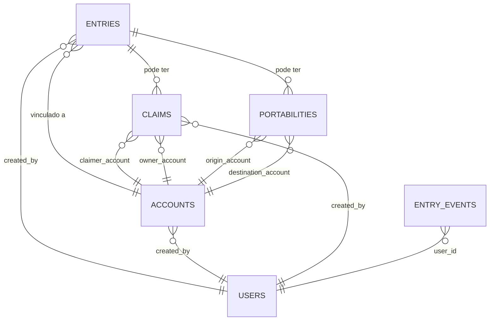

# DAT-001: Schema Database Core DICT

**Projeto**: DICT - Diretório de Identificadores de Contas Transacionais (LBPay)
**Componente**: Core DICT Database (PostgreSQL)
**Versão**: 1.0
**Data**: 2025-10-25
**Autor**: ARCHITECT (AI Agent - Technical Architect)
**Revisor**: [Aguardando]
**Aprovador**: Tech Lead, DBA

---

## Sumário Executivo

Este documento especifica o schema de banco de dados PostgreSQL para o **Core DICT**, o módulo central que gerencia chaves PIX, contas CID, e integrações com o RSFN Connect.

**Baseado em**:
- [TEC-001: Core DICT Specification](../11_Especificacoes_Tecnicas/TEC-001_Core_DICT_Specification.md)
- [ANA-001: IcePanel Architecture](../00_Analises/ANA-001_Analise_Arquitetura_IcePanel.md)

---

## Controle de Versão

| Versão | Data | Autor | Descrição |
|--------|------|-------|-----------|
| 1.0 | 2025-10-25 | ARCHITECT | Versão inicial - Schema Core DICT |

---

## Índice

1. [Visão Geral](#1-visão-geral)
2. [Tabelas Principais](#2-tabelas-principais)
3. [Relacionamentos](#3-relacionamentos)
4. [Índices e Performance](#4-índices-e-performance)
5. [Constraints e Validações](#5-constraints-e-validações)
6. [Triggers e Procedures](#6-triggers-e-procedures)
7. [Migrations](#7-migrations)
8. [Segurança e Acesso](#8-segurança-e-acesso)

---

## 1. Visão Geral

### 1.1. Database

**Nome**: `lbpay_core_dict`
**Engine**: PostgreSQL 15+
**Charset**: UTF-8
**Timezone**: America/Sao_Paulo (BRT)

### 1.2. Schemas

```sql
CREATE SCHEMA IF NOT EXISTS dict;     -- Dados de negócio DICT
CREATE SCHEMA IF NOT EXISTS audit;    -- Logs de auditoria
CREATE SCHEMA IF NOT EXISTS config;   -- Configurações do sistema
```

### 1.3. Extensions

```sql
CREATE EXTENSION IF NOT EXISTS "uuid-ossp";          -- UUID generation
CREATE EXTENSION IF NOT EXISTS "pg_trgm";            -- Full-text search
CREATE EXTENSION IF NOT EXISTS "pgcrypto";           -- Encryption
CREATE EXTENSION IF NOT EXISTS "pg_stat_statements"; -- Query monitoring
```

---

## 2. Tabelas Principais

### 2.1. dict.entries (Chaves DICT/PIX)

**Descrição**: Armazena todas as chaves PIX gerenciadas pelo Core DICT.

```sql
CREATE TABLE dict.entries (
    -- Identificadores
    id                  UUID PRIMARY KEY DEFAULT uuid_generate_v4(),
    external_id         VARCHAR(100) UNIQUE,  -- ID do Bacen (externo)

    -- Dados da Chave
    key_type            VARCHAR(20) NOT NULL CHECK (
                            key_type IN ('CPF', 'CNPJ', 'EMAIL', 'PHONE', 'EVP')
                        ),
    key_value           VARCHAR(255) NOT NULL,
    key_hash            VARCHAR(64) NOT NULL,  -- SHA-256 do key_value (LGPD)

    -- Relacionamento com Conta
    account_id          UUID NOT NULL REFERENCES dict.accounts(id) ON DELETE RESTRICT,

    -- Dados do Participante
    participant_ispb    VARCHAR(8) NOT NULL,   -- ISPB do banco (LBPay)
    participant_branch  VARCHAR(10),

    -- Status e Ownership
    status              VARCHAR(20) NOT NULL DEFAULT 'PENDING' CHECK (
                            status IN ('PENDING', 'ACTIVE', 'PORTABILITY_REQUESTED',
                                     'OWNERSHIP_CONFIRMED', 'DELETED', 'CLAIM_PENDING')
                        ),
    ownership_type      VARCHAR(20) NOT NULL CHECK (
                            ownership_type IN ('NATURAL_PERSON', 'LEGAL_ENTITY')
                        ),

    -- Controle de Portabilidade/Reivindicação
    claim_id            UUID REFERENCES dict.claims(id) ON DELETE SET NULL,
    portability_id      UUID REFERENCES dict.portabilities(id) ON DELETE SET NULL,

    -- Metadados
    created_at          TIMESTAMP WITH TIME ZONE NOT NULL DEFAULT NOW(),
    updated_at          TIMESTAMP WITH TIME ZONE NOT NULL DEFAULT NOW(),
    deleted_at          TIMESTAMP WITH TIME ZONE,  -- Soft delete

    -- Sync com Bacen
    last_sync_at        TIMESTAMP WITH TIME ZONE,
    sync_status         VARCHAR(20) CHECK (
                            sync_status IN ('SYNCED', 'PENDING_SYNC', 'SYNC_ERROR', 'NOT_SYNCED')
                        ),
    sync_error_message  TEXT,

    -- Auditoria
    created_by          UUID REFERENCES dict.users(id),
    updated_by          UUID REFERENCES dict.users(id),

    -- Constraints
    CONSTRAINT unique_active_key UNIQUE (key_type, key_value, deleted_at)
        WHERE deleted_at IS NULL,  -- Apenas chaves ativas são únicas

    CONSTRAINT unique_key_hash UNIQUE (key_hash)
);

-- Comentários
COMMENT ON TABLE dict.entries IS 'Chaves PIX gerenciadas pelo Core DICT';
COMMENT ON COLUMN dict.entries.key_hash IS 'SHA-256 do key_value para buscas LGPD-compliant';
COMMENT ON COLUMN dict.entries.external_id IS 'ID retornado pelo Bacen DICT após criação';
```

---

### 2.2. dict.accounts (Contas CID - Conta de Identificação de Depósito)

**Descrição**: Contas bancárias vinculadas às chaves PIX.

```sql
CREATE TABLE dict.accounts (
    -- Identificadores
    id                  UUID PRIMARY KEY DEFAULT uuid_generate_v4(),
    external_id         VARCHAR(100) UNIQUE,  -- ID externo (Bacen ou Core Bancário)

    -- Dados da Conta
    account_number      VARCHAR(20) NOT NULL,
    branch_code         VARCHAR(10) NOT NULL,
    account_type        VARCHAR(20) NOT NULL CHECK (
                            account_type IN ('CACC', 'SVGS', 'SLRY', 'TRAN')
                        ),  -- CACC=Corrente, SVGS=Poupança, SLRY=Salário, TRAN=Transacional
    account_status      VARCHAR(20) NOT NULL DEFAULT 'ACTIVE' CHECK (
                            account_status IN ('ACTIVE', 'BLOCKED', 'CLOSED', 'PENDING_CLOSURE')
                        ),

    -- Dados do Titular
    holder_document     VARCHAR(14) NOT NULL,  -- CPF (11) ou CNPJ (14)
    holder_document_type VARCHAR(10) NOT NULL CHECK (
                            holder_document_type IN ('CPF', 'CNPJ')
                        ),
    holder_name         VARCHAR(255) NOT NULL,
    holder_name_encrypted BYTEA,  -- Nome encriptado (LGPD)

    -- Participante
    participant_ispb    VARCHAR(8) NOT NULL,  -- ISPB do banco (LBPay)

    -- Opening/Closing
    opened_at           TIMESTAMP WITH TIME ZONE NOT NULL,
    closed_at           TIMESTAMP WITH TIME ZONE,

    -- Metadados
    created_at          TIMESTAMP WITH TIME ZONE NOT NULL DEFAULT NOW(),
    updated_at          TIMESTAMP WITH TIME ZONE NOT NULL DEFAULT NOW(),
    deleted_at          TIMESTAMP WITH TIME ZONE,  -- Soft delete

    -- Sync com Core Bancário
    last_sync_at        TIMESTAMP WITH TIME ZONE,
    sync_source         VARCHAR(50),  -- 'CORE_BANKING', 'MANUAL', 'BACEN'

    -- Auditoria
    created_by          UUID REFERENCES dict.users(id),
    updated_by          UUID REFERENCES dict.users(id),

    -- Constraints
    CONSTRAINT unique_account UNIQUE (participant_ispb, branch_code, account_number, deleted_at)
        WHERE deleted_at IS NULL
);

COMMENT ON TABLE dict.accounts IS 'Contas CID vinculadas a chaves PIX';
COMMENT ON COLUMN dict.accounts.account_type IS 'CACC=Conta Corrente, SVGS=Poupança, SLRY=Salário, TRAN=Transacional';
```

---

### 2.3. dict.claims (Reivindicações de Chave PIX)

**Descrição**: Processos de reivindicação de chaves PIX (período de 30 dias conforme TEC-003 v2.1).

```sql
CREATE TABLE dict.claims (
    -- Identificadores
    id                      UUID PRIMARY KEY DEFAULT uuid_generate_v4(),
    external_id             VARCHAR(100) UNIQUE,  -- ID do Bacen
    workflow_id             VARCHAR(255),  -- Temporal Workflow ID (TEC-003)

    -- Dados da Reivindicação
    entry_id                UUID NOT NULL REFERENCES dict.entries(id) ON DELETE RESTRICT,
    claim_type              VARCHAR(50) NOT NULL CHECK (
                                claim_type IN ('OWNERSHIP', 'PORTABILITY')
                            ),

    -- Participantes
    claimer_ispb            VARCHAR(8) NOT NULL,   -- ISPB do reivindicante
    claimer_account_id      UUID REFERENCES dict.accounts(id),

    owner_ispb              VARCHAR(8) NOT NULL,   -- ISPB do dono atual
    owner_account_id        UUID NOT NULL REFERENCES dict.accounts(id),

    -- Status e Período
    status                  VARCHAR(50) NOT NULL DEFAULT 'OPEN' CHECK (
                                status IN ('OPEN', 'WAITING_RESOLUTION', 'CONFIRMED',
                                         'CANCELLED', 'COMPLETED', 'EXPIRED')
                            ),

    completion_period_days  INT NOT NULL DEFAULT 30,  -- 30 dias (TEC-003 v2.1)
    expires_at              TIMESTAMP WITH TIME ZONE NOT NULL,

    -- Resolution
    resolution_type         VARCHAR(50) CHECK (
                                resolution_type IN ('APPROVED', 'REJECTED', 'TIMEOUT', 'CANCELLED')
                            ),
    resolution_reason       TEXT,
    resolution_date         TIMESTAMP WITH TIME ZONE,

    -- Metadados
    created_at              TIMESTAMP WITH TIME ZONE NOT NULL DEFAULT NOW(),
    updated_at              TIMESTAMP WITH TIME ZONE NOT NULL DEFAULT NOW(),
    deleted_at              TIMESTAMP WITH TIME ZONE,

    -- Sync com Bacen
    last_sync_at            TIMESTAMP WITH TIME ZONE,
    sync_status             VARCHAR(20),

    -- Auditoria
    created_by              UUID REFERENCES dict.users(id),
    updated_by              UUID REFERENCES dict.users(id),

    -- Constraints
    CHECK (expires_at > created_at),
    CHECK (completion_period_days > 0)
);

COMMENT ON TABLE dict.claims IS 'Reivindicações de chaves PIX (30 dias de período de resolução)';
COMMENT ON COLUMN dict.claims.completion_period_days IS 'Período de resolução em dias (padrão: 30 dias conforme TEC-003 v2.1)';
COMMENT ON COLUMN dict.claims.workflow_id IS 'ID do Temporal Workflow (ClaimWorkflow no RSFN Connect)';
```

---

### 2.4. dict.portabilities (Portabilidades de Chave PIX)

**Descrição**: Processos de portabilidade de chave entre bancos.

```sql
CREATE TABLE dict.portabilities (
    -- Identificadores
    id                      UUID PRIMARY KEY DEFAULT uuid_generate_v4(),
    external_id             VARCHAR(100) UNIQUE,
    workflow_id             VARCHAR(255),  -- Temporal Workflow ID

    -- Dados da Portabilidade
    entry_id                UUID NOT NULL REFERENCES dict.entries(id) ON DELETE RESTRICT,

    -- Origem e Destino
    origin_ispb             VARCHAR(8) NOT NULL,   -- ISPB origem
    origin_account_id       UUID NOT NULL REFERENCES dict.accounts(id),

    destination_ispb        VARCHAR(8) NOT NULL,   -- ISPB destino
    destination_account_id  UUID NOT NULL REFERENCES dict.accounts(id),

    -- Status
    status                  VARCHAR(50) NOT NULL DEFAULT 'INITIATED' CHECK (
                                status IN ('INITIATED', 'PENDING_APPROVAL', 'APPROVED',
                                         'REJECTED', 'COMPLETED', 'CANCELLED', 'FAILED')
                            ),

    -- Período
    initiated_at            TIMESTAMP WITH TIME ZONE NOT NULL,
    completed_at            TIMESTAMP WITH TIME ZONE,

    -- Approval
    requires_otp            BOOLEAN NOT NULL DEFAULT TRUE,
    otp_validated_at        TIMESTAMP WITH TIME ZONE,

    -- Metadados
    created_at              TIMESTAMP WITH TIME ZONE NOT NULL DEFAULT NOW(),
    updated_at              TIMESTAMP WITH TIME ZONE NOT NULL DEFAULT NOW(),

    -- Auditoria
    created_by              UUID REFERENCES dict.users(id)
);

COMMENT ON TABLE dict.portabilities IS 'Portabilidades de chaves PIX entre instituições';
```

---

### 2.5. dict.users (Usuários do Sistema)

**Descrição**: Usuários que operam o Core DICT (FrontEnd, BackOffice).

```sql
CREATE TABLE dict.users (
    -- Identificadores
    id                  UUID PRIMARY KEY DEFAULT uuid_generate_v4(),
    username            VARCHAR(100) UNIQUE NOT NULL,
    email               VARCHAR(255) UNIQUE NOT NULL,

    -- Authentication
    password_hash       VARCHAR(255),  -- Bcrypt hash
    is_active           BOOLEAN NOT NULL DEFAULT TRUE,
    is_admin            BOOLEAN NOT NULL DEFAULT FALSE,

    -- Profile
    first_name          VARCHAR(100),
    last_name           VARCHAR(100),
    role                VARCHAR(50) CHECK (
                            role IN ('ADMIN', 'OPERATOR', 'VIEWER', 'AUDITOR')
                        ),

    -- Metadados
    created_at          TIMESTAMP WITH TIME ZONE NOT NULL DEFAULT NOW(),
    updated_at          TIMESTAMP WITH TIME ZONE NOT NULL DEFAULT NOW(),
    last_login_at       TIMESTAMP WITH TIME ZONE,

    -- SSO Integration
    sso_provider        VARCHAR(50),  -- 'GOOGLE', 'AZURE_AD', 'OKTA'
    sso_external_id     VARCHAR(255)
);

COMMENT ON TABLE dict.users IS 'Usuários autorizados a operar o Core DICT';
```

---

### 2.6. audit.entry_events (Auditoria de Eventos)

**Descrição**: Registro de todos os eventos relevantes para auditoria.

```sql
CREATE TABLE audit.entry_events (
    -- Identificadores
    id                  BIGSERIAL PRIMARY KEY,
    event_id            UUID NOT NULL DEFAULT uuid_generate_v4() UNIQUE,

    -- Entidade Afetada
    entity_type         VARCHAR(50) NOT NULL,  -- 'ENTRY', 'CLAIM', 'PORTABILITY'
    entity_id           UUID NOT NULL,

    -- Evento
    event_type          VARCHAR(100) NOT NULL,  -- 'CREATED', 'UPDATED', 'DELETED', 'SYNCED'
    event_subtype       VARCHAR(100),  -- Detalhamento

    -- Payload
    old_values          JSONB,  -- Estado anterior
    new_values          JSONB,  -- Estado novo
    diff                JSONB,  -- Diferença (computed)

    -- Contexto
    user_id             UUID REFERENCES dict.users(id),
    ip_address          INET,
    user_agent          TEXT,

    -- Timestamp
    occurred_at         TIMESTAMP WITH TIME ZONE NOT NULL DEFAULT NOW(),

    -- Metadata
    metadata            JSONB,  -- Informações adicionais

    -- Indexação
    CONSTRAINT pk_entry_events PRIMARY KEY (id)
);

-- Partition por mês (performance)
CREATE INDEX idx_entry_events_occurred_at ON audit.entry_events (occurred_at DESC);
CREATE INDEX idx_entry_events_entity ON audit.entry_events (entity_type, entity_id);
CREATE INDEX idx_entry_events_user ON audit.entry_events (user_id, occurred_at DESC);

COMMENT ON TABLE audit.entry_events IS 'Auditoria completa de eventos no Core DICT (LGPD/Bacen compliance)';
```

---

## 3. Relacionamentos



---

## 4. Índices e Performance

### 4.1. Índices de Busca

```sql
-- Entries: Busca por chave
CREATE INDEX idx_entries_key_type_value ON dict.entries (key_type, key_value) WHERE deleted_at IS NULL;
CREATE INDEX idx_entries_key_hash ON dict.entries (key_hash);
CREATE INDEX idx_entries_account_id ON dict.entries (account_id);
CREATE INDEX idx_entries_status ON dict.entries (status) WHERE deleted_at IS NULL;
CREATE INDEX idx_entries_sync_status ON dict.entries (sync_status) WHERE sync_status != 'SYNCED';

-- Accounts: Busca por titular
CREATE INDEX idx_accounts_holder_document ON dict.accounts (holder_document) WHERE deleted_at IS NULL;
CREATE INDEX idx_accounts_participant ON dict.accounts (participant_ispb, account_status);

-- Claims: Busca por status e expiração
CREATE INDEX idx_claims_status ON dict.claims (status) WHERE status IN ('OPEN', 'WAITING_RESOLUTION');
CREATE INDEX idx_claims_expires_at ON dict.claims (expires_at) WHERE status = 'OPEN';
CREATE INDEX idx_claims_workflow_id ON dict.claims (workflow_id);

-- Portabilities
CREATE INDEX idx_portabilities_status ON dict.portabilities (status);
CREATE INDEX idx_portabilities_workflow_id ON dict.portabilities (workflow_id);
```

### 4.2. Full-Text Search

```sql
-- Busca por nome do titular (pg_trgm)
CREATE INDEX idx_accounts_holder_name_trgm ON dict.accounts USING gin (holder_name gin_trgm_ops);
```

---

## 5. Constraints e Validações

### 5.1. Check Constraints

```sql
-- Validação de CPF/CNPJ (formato)
ALTER TABLE dict.accounts
ADD CONSTRAINT chk_holder_document_format CHECK (
    (holder_document_type = 'CPF' AND LENGTH(holder_document) = 11) OR
    (holder_document_type = 'CNPJ' AND LENGTH(holder_document) = 14)
);

-- Validação de ISPB (8 dígitos)
ALTER TABLE dict.entries
ADD CONSTRAINT chk_participant_ispb_format CHECK (
    LENGTH(participant_ispb) = 8 AND participant_ispb ~ '^[0-9]+$'
);

-- Validação de Chave PIX
ALTER TABLE dict.entries
ADD CONSTRAINT chk_key_value_format CHECK (
    (key_type = 'CPF' AND LENGTH(key_value) = 11) OR
    (key_type = 'CNPJ' AND LENGTH(key_value) = 14) OR
    (key_type = 'EMAIL' AND key_value ~ '^[A-Za-z0-9._%+-]+@[A-Za-z0-9.-]+\.[A-Z|a-z]{2,}$') OR
    (key_type = 'PHONE' AND key_value ~ '^\+55[1-9]{2}9?[0-9]{8}$') OR
    (key_type = 'EVP' AND LENGTH(key_value) = 36)  -- UUID format
);
```

---

## 6. Triggers e Procedures

### 6.1. Trigger: updated_at automático

```sql
CREATE OR REPLACE FUNCTION update_updated_at_column()
RETURNS TRIGGER AS $$
BEGIN
    NEW.updated_at = NOW();
    RETURN NEW;
END;
$$ LANGUAGE plpgsql;

-- Aplicar a todas as tabelas principais
CREATE TRIGGER update_entries_updated_at BEFORE UPDATE ON dict.entries
    FOR EACH ROW EXECUTE FUNCTION update_updated_at_column();

CREATE TRIGGER update_accounts_updated_at BEFORE UPDATE ON dict.accounts
    FOR EACH ROW EXECUTE FUNCTION update_updated_at_column();

CREATE TRIGGER update_claims_updated_at BEFORE UPDATE ON dict.claims
    FOR EACH ROW EXECUTE FUNCTION update_updated_at_column();
```

### 6.2. Trigger: Auditoria Automática

```sql
CREATE OR REPLACE FUNCTION audit_entry_changes()
RETURNS TRIGGER AS $$
BEGIN
    INSERT INTO audit.entry_events (
        entity_type,
        entity_id,
        event_type,
        old_values,
        new_values,
        user_id
    ) VALUES (
        TG_TABLE_NAME,
        COALESCE(NEW.id, OLD.id),
        TG_OP,  -- 'INSERT', 'UPDATE', 'DELETE'
        CASE WHEN TG_OP != 'INSERT' THEN row_to_json(OLD) ELSE NULL END,
        CASE WHEN TG_OP != 'DELETE' THEN row_to_json(NEW) ELSE NULL END,
        COALESCE(NEW.updated_by, NEW.created_by, OLD.updated_by)
    );

    RETURN COALESCE(NEW, OLD);
END;
$$ LANGUAGE plpgsql;

-- Aplicar auditoria
CREATE TRIGGER audit_entries AFTER INSERT OR UPDATE OR DELETE ON dict.entries
    FOR EACH ROW EXECUTE FUNCTION audit_entry_changes();

CREATE TRIGGER audit_claims AFTER INSERT OR UPDATE OR DELETE ON dict.claims
    FOR EACH ROW EXECUTE FUNCTION audit_entry_changes();
```

### 6.3. Procedure: Expirar Claims

```sql
CREATE OR REPLACE FUNCTION expire_old_claims()
RETURNS TABLE (expired_count INT) AS $$
DECLARE
    count INT;
BEGIN
    UPDATE dict.claims
    SET
        status = 'EXPIRED',
        resolution_type = 'TIMEOUT',
        resolution_date = NOW(),
        updated_at = NOW()
    WHERE
        status = 'OPEN'
        AND expires_at < NOW();

    GET DIAGNOSTICS count = ROW_COUNT;
    RETURN QUERY SELECT count;
END;
$$ LANGUAGE plpgsql;

COMMENT ON FUNCTION expire_old_claims IS 'Expira claims com expires_at < NOW() (cron diário)';
```

---

## 7. Migrations

### 7.1. Estratégia

**Ferramenta**: Flyway ou Goose (conforme DAT-003)

**Convenção de Nomenclatura**:
```
V{versão}_{timestamp}_{descrição}.sql

Exemplos:
V001_20251025_create_schema_dict.sql
V002_20251025_create_table_entries.sql
V003_20251025_create_table_accounts.sql
V004_20251025_create_indexes.sql
V005_20251025_create_triggers.sql
```

### 7.2. Rollback Strategy

```sql
-- Migrations reversíveis
-- Up: V001_*.sql
-- Down: V001_*_rollback.sql
```

---

## 8. Segurança e Acesso

### 8.1. Roles

```sql
-- Role: Aplicação (Core DICT)
CREATE ROLE dict_app WITH LOGIN PASSWORD 'secure_password_here';
GRANT CONNECT ON DATABASE lbpay_core_dict TO dict_app;
GRANT USAGE ON SCHEMA dict TO dict_app;
GRANT SELECT, INSERT, UPDATE, DELETE ON ALL TABLES IN SCHEMA dict TO dict_app;
GRANT USAGE, SELECT ON ALL SEQUENCES IN SCHEMA dict TO dict_app;

-- Role: Read-Only (Analytics, BI)
CREATE ROLE dict_readonly WITH LOGIN PASSWORD 'readonly_password';
GRANT CONNECT ON DATABASE lbpay_core_dict TO dict_readonly;
GRANT USAGE ON SCHEMA dict TO dict_readonly;
GRANT SELECT ON ALL TABLES IN SCHEMA dict TO dict_readonly;

-- Role: Auditor (Acesso a auditoria)
CREATE ROLE dict_auditor WITH LOGIN PASSWORD 'auditor_password';
GRANT CONNECT ON DATABASE lbpay_core_dict TO dict_auditor;
GRANT USAGE ON SCHEMA audit TO dict_auditor;
GRANT SELECT ON ALL TABLES IN SCHEMA audit TO dict_auditor;
```

### 8.2. Row-Level Security (RLS)

```sql
-- Habilitar RLS em tabelas sensíveis
ALTER TABLE dict.entries ENABLE ROW LEVEL SECURITY;

-- Policy: Usuário vê apenas entries do seu ISPB
CREATE POLICY entries_tenant_isolation ON dict.entries
    FOR ALL
    TO dict_app
    USING (participant_ispb = current_setting('app.current_ispb'));

-- Configurar ISPB no session
SET app.current_ispb = '12345678';  -- LBPay ISPB
```

---

## Próximas Revisões

**Pendências**:
- [ ] Definir política de particionamento para `audit.entry_events` (mensal/anual)
- [ ] Especificar estratégia de backup e recovery (RPO/RTO)
- [ ] Definir política de retenção de dados (LGPD - 5 anos?)
- [ ] Implementar encryption at rest para campos sensíveis

---

**Referências**:
- [TEC-001: Core DICT Specification](../11_Especificacoes_Tecnicas/TEC-001_Core_DICT_Specification.md)
- [ANA-001: IcePanel Architecture](../00_Analises/ANA-001_Analise_Arquitetura_IcePanel.md)
- [REG-001: Requisitos Regulatórios Bacen](../06_Regulatorio/REG-001_Requisitos_Regulatorios_Bacen.md)
- [DAT-003: Migrations Strategy](DAT-003_Migrations_Strategy.md) (pendente)
