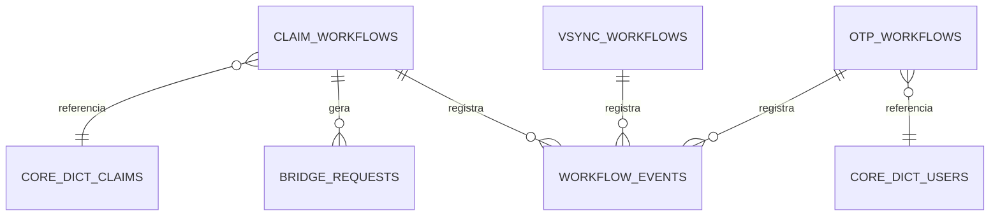

# DAT-002: Schema Database Connect (Temporal Workflows)

**Projeto**: DICT - Diretório de Identificadores de Contas Transacionais (LBPay)
**Componente**: RSFN Connect - Temporal Workflows Database
**Versão**: 1.0
**Data**: 2025-10-25
**Autor**: ARCHITECT (AI Agent - Technical Architect)
**Revisor**: [Aguardando]
**Aprovador**: Tech Lead, DBA

---

## Sumário Executivo

Este documento especifica o schema de banco de dados PostgreSQL para o **RSFN Connect**, focado no armazenamento de estado dos **Temporal Workflows** (ClaimWorkflow 30 dias, VSYNC, OTP).

**Importante**: Temporal já possui suas próprias tabelas internas. Este documento especifica apenas as **tabelas de negócio** complementares que o Connect precisa para operações DICT.

**Baseado em**:
- [TEC-003 v2.1: Connect Specification](../11_Especificacoes_Tecnicas/TEC-003_RSFN_Connect_Specification.md)
- [ANA-003: Análise Repositório Connect](../00_Analises/ANA-003_Analise_Repo_Connect.md)

---

## Controle de Versão

| Versão | Data | Autor | Descrição |
|--------|------|-------|-----------|
| 1.0 | 2025-10-25 | ARCHITECT | Versão inicial - Schema Connect/Temporal |

---

## Índice

1. [Visão Geral](#1-visão-geral)
2. [Temporal Internal Tables](#2-temporal-internal-tables)
3. [Tabelas de Negócio Connect](#3-tabelas-de-negócio-connect)
4. [Cache Redis](#4-cache-redis)
5. [Relacionamentos](#5-relacionamentos)
6. [Índices e Performance](#6-índices-e-performance)
7. [Migrations](#7-migrations)

---

## 1. Visão Geral

### 1.1. Databases

**Database 1**: `temporal` (Temporal interno - NÃO MODIFICAR)
- Gerenciado pelo Temporal Server
- Armazena workflow_executions, activities, timers, signals
- **Não criamos tabelas aqui**

**Database 2**: `lbpay_connect` (Negócio DICT)
- Tabelas de negócio do Connect
- Estado complementar aos workflows
- Cache de respostas do Bridge

### 1.2. Schemas

```sql
CREATE SCHEMA IF NOT EXISTS connect;      -- Dados de negócio Connect
CREATE SCHEMA IF NOT EXISTS workflows;    -- Metadados de workflows
CREATE SCHEMA IF NOT EXISTS cache;        -- Cache de respostas
CREATE SCHEMA IF NOT EXISTS audit;        -- Auditoria
```

---

## 2. Temporal Internal Tables

**⚠️ IMPORTANTE**: Estas tabelas são criadas e gerenciadas pelo **Temporal Server**. Apenas documentamos para referência.

### 2.1. Tabelas Principais do Temporal (Database `temporal`)

```sql
-- NÃO CRIAR - Apenas referência
-- Database: temporal

-- Workflow Executions
temporal.executions (
    shard_id INT,
    namespace_id BYTEA,
    workflow_id VARCHAR(255),
    run_id UUID,
    execution BYTEA,  -- Serialized state
    execution_state BYTEA,
    -- ... outras colunas internas
);

-- Activities
temporal.activities (
    shard_id INT,
    namespace_id BYTEA,
    workflow_id VARCHAR(255),
    run_id UUID,
    activity_id VARCHAR(255),
    -- ... outras colunas internas
);

-- Timers (onde ficam os 30 dias do ClaimWorkflow)
temporal.timers (
    shard_id INT,
    namespace_id BYTEA,
    workflow_id VARCHAR(255),
    run_id UUID,
    timer_id VARCHAR(255),
    visibility_ts TIMESTAMP,  -- Quando o timer dispara
    task_id BIGINT,
    -- ... outras colunas internas
);
```

**Como acessamos?** Via Temporal SDK em Go, não via SQL direto.

---

## 3. Tabelas de Negócio Connect

### 3.1. workflows.claim_workflows (Metadados de Claims)

**Descrição**: Armazena metadados de negócio dos ClaimWorkflows para queries e dashboards.

```sql
CREATE TABLE workflows.claim_workflows (
    -- Identificadores
    id                      UUID PRIMARY KEY DEFAULT uuid_generate_v4(),
    workflow_id             VARCHAR(255) UNIQUE NOT NULL,  -- Temporal Workflow ID
    workflow_run_id         UUID NOT NULL,                 -- Temporal Run ID

    -- Relacionamento com Core DICT
    claim_id                UUID NOT NULL,  -- FK para Core DICT (dict.claims.id)
    entry_id                UUID NOT NULL,  -- FK para Core DICT (dict.entries.id)

    -- Dados do Claim
    key_type                VARCHAR(20) NOT NULL,
    key_value_hash          VARCHAR(64) NOT NULL,  -- Hash da chave (LGPD)
    claimer_ispb            VARCHAR(8) NOT NULL,
    owner_ispb              VARCHAR(8) NOT NULL,

    -- Status do Workflow
    status                  VARCHAR(50) NOT NULL DEFAULT 'RUNNING' CHECK (
                                status IN ('RUNNING', 'COMPLETED', 'FAILED',
                                         'CANCELLED', 'TIMEOUT', 'CONTINUED_AS_NEW')
                            ),

    -- Período de Resolução (30 dias)
    completion_period_days  INT NOT NULL DEFAULT 30,
    started_at              TIMESTAMP WITH TIME ZONE NOT NULL DEFAULT NOW(),
    expires_at              TIMESTAMP WITH TIME ZONE NOT NULL,
    completed_at            TIMESTAMP WITH TIME ZONE,

    -- Resultado
    resolution_type         VARCHAR(50) CHECK (
                                resolution_type IN ('APPROVED', 'REJECTED',
                                                  'TIMEOUT', 'CANCELLED', 'ERROR')
                            ),
    resolution_reason       TEXT,

    -- Child Workflows (conforme ANA-003)
    monitor_status_workflow_id          VARCHAR(255),  -- MonitorStatusWorkflow
    expire_completion_period_workflow_id VARCHAR(255), -- ExpireCompletionPeriodWorkflow

    -- Retry e Error Handling
    attempt_count           INT NOT NULL DEFAULT 1,
    last_error              TEXT,
    last_error_at           TIMESTAMP WITH TIME ZONE,

    -- Metadados
    created_at              TIMESTAMP WITH TIME ZONE NOT NULL DEFAULT NOW(),
    updated_at              TIMESTAMP WITH TIME ZONE NOT NULL DEFAULT NOW(),

    -- Constraints
    CHECK (expires_at > started_at),
    CHECK (completion_period_days = 30)  -- Enforce 30 dias (TEC-003 v2.1)
);

-- Índices
CREATE INDEX idx_claim_workflows_workflow_id ON workflows.claim_workflows (workflow_id);
CREATE INDEX idx_claim_workflows_claim_id ON workflows.claim_workflows (claim_id);
CREATE INDEX idx_claim_workflows_status ON workflows.claim_workflows (status)
    WHERE status = 'RUNNING';
CREATE INDEX idx_claim_workflows_expires_at ON workflows.claim_workflows (expires_at)
    WHERE status = 'RUNNING';

COMMENT ON TABLE workflows.claim_workflows IS 'Metadados de ClaimWorkflows (30 dias de período de resolução)';
COMMENT ON COLUMN workflows.claim_workflows.completion_period_days IS 'Sempre 30 dias conforme TEC-003 v2.1';
```

---

### 3.2. workflows.vsync_workflows (VSYNC - Planejado)

**Descrição**: Metadados de VSYNCWorkflows (sincronização diária com Bacen).

**Status**: ⏳ **Tabela Planejada** - VSYNC Workflow não implementado ainda (ANA-003)

```sql
-- PLANEJADO - Criar quando VSYNC for implementado
CREATE TABLE workflows.vsync_workflows (
    id                      UUID PRIMARY KEY DEFAULT uuid_generate_v4(),
    workflow_id             VARCHAR(255) UNIQUE NOT NULL,
    workflow_run_id         UUID NOT NULL,

    -- Execução
    execution_date          DATE NOT NULL UNIQUE,  -- Data da sincronização (YYYY-MM-DD)
    scheduled_at            TIMESTAMP WITH TIME ZONE NOT NULL,
    started_at              TIMESTAMP WITH TIME ZONE,
    completed_at            TIMESTAMP WITH TIME ZONE,

    -- Status
    status                  VARCHAR(50) NOT NULL DEFAULT 'SCHEDULED' CHECK (
                                status IN ('SCHEDULED', 'RUNNING', 'COMPLETED',
                                         'FAILED', 'PARTIAL_SUCCESS')
                            ),

    -- Resultados
    total_accounts_synced   INT,
    total_operations        INT,
    operations_success      INT,
    operations_failed       INT,
    error_summary           JSONB,  -- Resumo de erros

    -- Metadados
    created_at              TIMESTAMP WITH TIME ZONE NOT NULL DEFAULT NOW(),
    updated_at              TIMESTAMP WITH TIME ZONE NOT NULL DEFAULT NOW()
);

CREATE INDEX idx_vsync_workflows_execution_date ON workflows.vsync_workflows (execution_date DESC);
CREATE INDEX idx_vsync_workflows_status ON workflows.vsync_workflows (status);

COMMENT ON TABLE workflows.vsync_workflows IS 'PLANEJADO - Metadados de VSYNC workflows (sincronização diária com Bacen)';
```

---

### 3.3. workflows.otp_workflows (OTP - Planejado)

**Descrição**: Metadados de OTPWorkflows (validação one-time password).

**Status**: ⏳ **Tabela Planejada** - OTP Workflow não implementado ainda (ANA-003)

```sql
-- PLANEJADO - Criar quando OTP for implementado
CREATE TABLE workflows.otp_workflows (
    id                      UUID PRIMARY KEY DEFAULT uuid_generate_v4(),
    workflow_id             VARCHAR(255) UNIQUE NOT NULL,
    workflow_run_id         UUID NOT NULL,

    -- Usuário
    user_id                 UUID NOT NULL,  -- FK para Core DICT (dict.users.id)
    phone_number_hash       VARCHAR(64) NOT NULL,  -- Hash do telefone (LGPD)

    -- Operação Associada
    operation_type          VARCHAR(50) NOT NULL CHECK (
                                operation_type IN ('CLAIM', 'PORTABILITY',
                                                 'DELETE_ENTRY', 'ACCOUNT_CHANGE')
                            ),
    operation_id            UUID,  -- FK para claim_id, portability_id, etc.

    -- OTP
    otp_code_hash           VARCHAR(64) NOT NULL,  -- Hash do OTP (nunca plaintext)
    otp_generated_at        TIMESTAMP WITH TIME ZONE NOT NULL,
    otp_expires_at          TIMESTAMP WITH TIME ZONE NOT NULL,  -- 5 minutos
    otp_validated_at        TIMESTAMP WITH TIME ZONE,

    -- Tentativas
    validation_attempts     INT NOT NULL DEFAULT 0,
    max_attempts            INT NOT NULL DEFAULT 3,

    -- Status
    status                  VARCHAR(50) NOT NULL DEFAULT 'PENDING' CHECK (
                                status IN ('PENDING', 'VALIDATED', 'FAILED',
                                         'EXPIRED', 'MAX_ATTEMPTS_EXCEEDED')
                            ),

    -- Metadados
    created_at              TIMESTAMP WITH TIME ZONE NOT NULL DEFAULT NOW(),
    updated_at              TIMESTAMP WITH TIME ZONE NOT NULL DEFAULT NOW(),

    CHECK (otp_expires_at > otp_generated_at),
    CHECK (validation_attempts <= max_attempts)
);

CREATE INDEX idx_otp_workflows_user_id ON workflows.otp_workflows (user_id);
CREATE INDEX idx_otp_workflows_status ON workflows.otp_workflows (status);
CREATE INDEX idx_otp_workflows_expires_at ON workflows.otp_workflows (otp_expires_at);

COMMENT ON TABLE workflows.otp_workflows IS 'PLANEJADO - Metadados de OTP workflows (validação one-time password)';
```

---

### 3.4. connect.bridge_requests (Cache de Requests/Responses)

**Descrição**: Cache de requisições e respostas do Bridge para retry, idempotência e auditoria.

```sql
CREATE TABLE connect.bridge_requests (
    -- Identificadores
    id                      UUID PRIMARY KEY DEFAULT uuid_generate_v4(),
    request_id              VARCHAR(100) UNIQUE NOT NULL,  -- Idempotency key
    correlation_id          VARCHAR(100),  -- Para rastreamento E2E

    -- Workflow Associado (opcional)
    workflow_id             VARCHAR(255),
    workflow_run_id         UUID,

    -- Request
    operation_type          VARCHAR(100) NOT NULL,  -- 'CreateEntry', 'CreateClaim', etc.
    request_payload         JSONB NOT NULL,
    request_hash            VARCHAR(64) NOT NULL,  -- SHA-256 do payload

    -- Response
    response_payload        JSONB,
    response_status_code    INT,
    response_received_at    TIMESTAMP WITH TIME ZONE,

    -- Status
    status                  VARCHAR(50) NOT NULL DEFAULT 'PENDING' CHECK (
                                status IN ('PENDING', 'IN_PROGRESS', 'SUCCESS',
                                         'FAILED', 'TIMEOUT', 'RETRYING')
                            ),

    -- Retry Control
    attempt_count           INT NOT NULL DEFAULT 1,
    max_attempts            INT NOT NULL DEFAULT 3,
    last_attempt_at         TIMESTAMP WITH TIME ZONE,
    next_retry_at           TIMESTAMP WITH TIME ZONE,

    -- Error Handling
    error_code              VARCHAR(50),
    error_message           TEXT,
    error_details           JSONB,

    -- TTL (para cleanup)
    expires_at              TIMESTAMP WITH TIME ZONE,  -- Delete após X dias

    -- Metadados
    created_at              TIMESTAMP WITH TIME ZONE NOT NULL DEFAULT NOW(),
    updated_at              TIMESTAMP WITH TIME ZONE NOT NULL DEFAULT NOW()
);

-- Índices
CREATE INDEX idx_bridge_requests_request_id ON connect.bridge_requests (request_id);
CREATE INDEX idx_bridge_requests_workflow_id ON connect.bridge_requests (workflow_id);
CREATE INDEX idx_bridge_requests_status ON connect.bridge_requests (status);
CREATE INDEX idx_bridge_requests_expires_at ON connect.bridge_requests (expires_at)
    WHERE expires_at IS NOT NULL;

COMMENT ON TABLE connect.bridge_requests IS 'Cache de requests/responses do Bridge para idempotência e retry';
```

---

### 3.5. audit.workflow_events (Auditoria de Workflows)

**Descrição**: Auditoria completa de eventos dos workflows.

```sql
CREATE TABLE audit.workflow_events (
    id                      BIGSERIAL PRIMARY KEY,
    event_id                UUID NOT NULL DEFAULT uuid_generate_v4() UNIQUE,

    -- Workflow
    workflow_type           VARCHAR(100) NOT NULL,  -- 'ClaimWorkflow', 'VSYNCWorkflow'
    workflow_id             VARCHAR(255) NOT NULL,
    workflow_run_id         UUID,

    -- Event
    event_type              VARCHAR(100) NOT NULL,  -- 'STARTED', 'ACTIVITY_EXECUTED', 'SIGNAL_RECEIVED', 'COMPLETED'
    event_subtype           VARCHAR(100),

    -- Payload
    event_payload           JSONB,  -- Detalhes do evento

    -- Context
    user_id                 UUID,  -- Quem disparou (se aplicável)
    correlation_id          VARCHAR(100),

    -- Timestamp
    occurred_at             TIMESTAMP WITH TIME ZONE NOT NULL DEFAULT NOW(),

    -- Metadata
    metadata                JSONB
);

CREATE INDEX idx_workflow_events_workflow_id ON audit.workflow_events (workflow_id, occurred_at DESC);
CREATE INDEX idx_workflow_events_type ON audit.workflow_events (workflow_type, event_type);
CREATE INDEX idx_workflow_events_occurred_at ON audit.workflow_events (occurred_at DESC);

COMMENT ON TABLE audit.workflow_events IS 'Auditoria de eventos dos Temporal Workflows';
```

---

## 4. Cache Redis

**Descrição**: Schema de cache Redis para otimizar consultas frequentes.

### 4.1. Estrutura de Chaves (conforme ANA-003)

```
# Formato geral
{namespace}:{entity}:{id}:{field}

# Exemplos reais

# Cache de Entry do Bacen (GetEntry)
dict:entry:{key_type}:{key_value} → JSON do Entry
TTL: 5 minutos

# Cache de Claim Status
dict:claim:{claim_id}:status → JSON do Claim Status
TTL: 1 minuto (status muda rápido)

# Cache de Account Info
dict:account:{account_id} → JSON do Account
TTL: 10 minutos

# Cache de Workflow Status (dashboard)
workflow:claim:{workflow_id}:status → "RUNNING" | "COMPLETED" | "FAILED"
TTL: 30 segundos

# Cache de VSYNC Result (último resultado)
workflow:vsync:latest → JSON do último VSYNC
TTL: 24 horas
```

### 4.2. Especificação Redis

```yaml
# Redis Configuration (conforme TEC-003 v2.1)
redis:
  host: redis
  port: 6379
  db: 0  # Database 0 para Connect
  password: ${REDIS_PASSWORD}
  max_retries: 3
  pool_size: 10

  # TTL defaults
  default_ttl: 300  # 5 minutos

  # Eviction policy
  maxmemory_policy: allkeys-lru

  # Prefixes por namespace
  namespaces:
    dict: "dict:"
    workflow: "workflow:"
    bridge: "bridge:"
```

### 4.3. Serialização

```go
// Exemplo de código (apenas especificação, não implementar ainda)

// Serialização: JSON
type CachedEntry struct {
    EntryID      string    `json:"entry_id"`
    KeyType      string    `json:"key_type"`
    KeyValue     string    `json:"key_value"`
    AccountID    string    `json:"account_id"`
    Status       string    `json:"status"`
    CachedAt     time.Time `json:"cached_at"`
}

// Cache Key
func entryCacheKey(keyType, keyValue string) string {
    return fmt.Sprintf("dict:entry:%s:%s", keyType, keyValue)
}

// TTL
const EntryTTL = 5 * time.Minute
```

---

## 5. Relacionamentos



**Nota**: Relacionamentos com Core DICT são por UUID (não FK físicas, pois são databases separadas).

---

## 6. Índices e Performance

### 6.1. Índices Compostos

```sql
-- Busca de workflows ativos por expiração
CREATE INDEX idx_claim_workflows_status_expires
    ON workflows.claim_workflows (status, expires_at)
    WHERE status = 'RUNNING';

-- Busca de requests para retry
CREATE INDEX idx_bridge_requests_retry
    ON connect.bridge_requests (status, next_retry_at)
    WHERE status = 'RETRYING' AND next_retry_at IS NOT NULL;
```

### 6.2. Particionamento (Futuro)

```sql
-- Particionamento de audit.workflow_events por mês (performance)
-- Implementar quando volume > 10M eventos

CREATE TABLE audit.workflow_events_2025_10 PARTITION OF audit.workflow_events
    FOR VALUES FROM ('2025-10-01') TO ('2025-11-01');

CREATE TABLE audit.workflow_events_2025_11 PARTITION OF audit.workflow_events
    FOR VALUES FROM ('2025-11-01') TO ('2025-12-01');
```

---

## 7. Migrations

### 7.1. Ordem de Criação

```
1. V010_20251025_create_schema_connect.sql
2. V011_20251025_create_schema_workflows.sql
3. V012_20251025_create_schema_cache.sql
4. V013_20251025_create_schema_audit.sql
5. V014_20251025_create_table_claim_workflows.sql
6. V015_20251025_create_table_bridge_requests.sql
7. V016_20251025_create_table_workflow_events.sql
8. V017_20251025_create_indexes_workflows.sql
9. V018_20251025_create_triggers_workflows.sql

# Futuras (quando VSYNC/OTP forem implementados)
V019_20251XXX_create_table_vsync_workflows.sql
V020_20251XXX_create_table_otp_workflows.sql
```

### 7.2. Triggers

```sql
-- Trigger: updated_at automático
CREATE TRIGGER update_claim_workflows_updated_at
    BEFORE UPDATE ON workflows.claim_workflows
    FOR EACH ROW EXECUTE FUNCTION update_updated_at_column();

CREATE TRIGGER update_bridge_requests_updated_at
    BEFORE UPDATE ON connect.bridge_requests
    FOR EACH ROW EXECUTE FUNCTION update_updated_at_column();
```

---

## Próximas Revisões

**Pendências**:
- [ ] Implementar VSYNC Workflow → ativar tabela `workflows.vsync_workflows`
- [ ] Implementar OTP Workflow → ativar tabela `workflows.otp_workflows`
- [ ] Definir política de cleanup para `connect.bridge_requests` (TTL)
- [ ] Definir estratégia de particionamento para `audit.workflow_events`

---

**Referências**:
- [TEC-003 v2.1: Connect Specification](../11_Especificacoes_Tecnicas/TEC-003_RSFN_Connect_Specification.md)
- [ANA-003: Análise Repositório Connect](../00_Analises/ANA-003_Analise_Repo_Connect.md)
- [DAT-001: Schema Core DICT](DAT-001_Schema_Database_Core_DICT.md)
- [DAT-005: Redis Cache Strategy](DAT-005_Redis_Cache_Strategy.md) (pendente)
