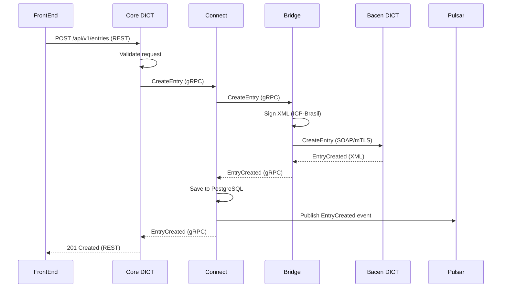

# Fluxos de Integração

**Propósito**: Diagramas de fluxo de integração entre componentes do sistema DICT

## 📋 Conteúdo

Esta pasta armazenará:

- **Fluxos End-to-End**: Diagramas de fluxo completos (FrontEnd → Core → Connect → Bridge → Bacen)
- **Fluxos de Eventos**: Diagramas de eventos Pulsar entre componentes
- **Fluxos de Dados**: Como dados fluem entre camadas (API → Domain → Infrastructure)
- **Fluxos de Erro**: Como erros são propagados e tratados

## 📁 Estrutura Esperada

```
Fluxos/
├── E2E/
│   ├── Fluxo_CreateEntry_E2E.md
│   ├── Fluxo_CreateClaim_E2E.md
│   └── Fluxo_Portability_E2E.md
├── Eventos/
│   ├── Fluxo_Eventos_Pulsar.md
│   └── Fluxo_Temporal_Activities.md
├── Dados/
│   ├── Fluxo_Clean_Architecture.md
│   └── Fluxo_Cache_Redis.md
└── Erros/
    ├── Fluxo_Error_Handling_gRPC.md
    └── Fluxo_Rollback_Temporal.md
```

## 🎯 Exemplo de Fluxo E2E: CreateEntry



## 🔗 Tipos de Diagramas

### 1. Sequence Diagrams (Mermaid)
Mostrar interações temporais entre componentes

### 2. Flowcharts
Mostrar decisões e caminhos alternativos

### 3. Data Flow Diagrams (DFD)
Mostrar fluxo de dados entre processos

## 📚 Referências

- [Sequências](../Sequencias/)
- [Arquitetura](../../02_Arquitetura/Diagramas/)
- [APIs gRPC](../../04_APIs/gRPC/)
- [TEC-003: Connect Specification](../../11_Especificacoes_Tecnicas/TEC-003_RSFN_Connect_Specification.md)

---

**Status**: 🔴 Pasta vazia (será preenchida na Fase 2)
**Fase de Preenchimento**: Fase 2 (após especificações técnicas)
**Ferramenta**: Mermaid, Draw.io, IcePanel
