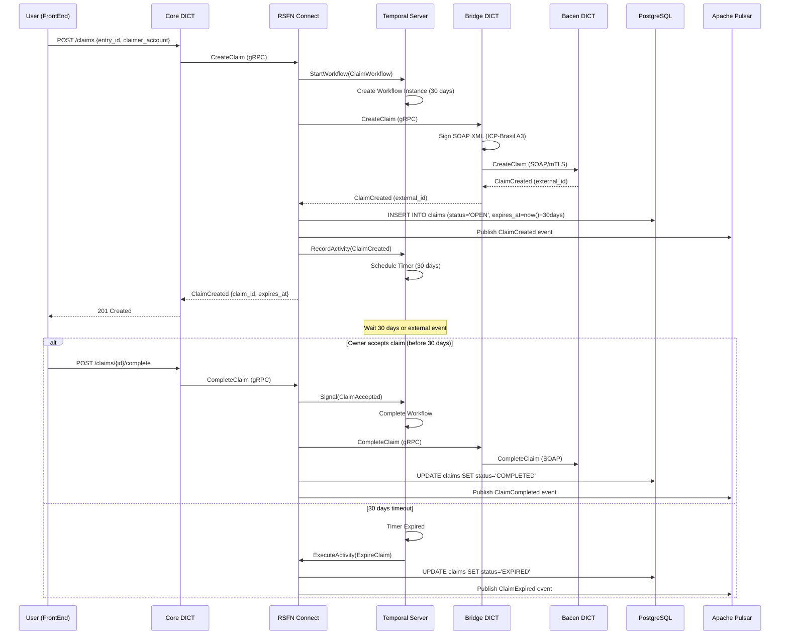

# Diagramas de Sequência

**Propósito**: Diagramas de sequência detalhados para operações críticas do sistema DICT

## 📋 Conteúdo

Esta pasta armazenará:

- **Sequence Diagrams**: Diagramas UML de sequência para operações DICT
- **Activity Diagrams**: Fluxos de atividades em workflows Temporal
- **Interaction Diagrams**: Interações complexas entre múltiplos componentes

## 📁 Estrutura Esperada

```
Sequencias/
├── Entry_Operations/
│   ├── SEQ_CreateEntry.md
│   ├── SEQ_GetEntry.md
│   ├── SEQ_DeleteEntry.md
│   └── SEQ_UpdateEntry.md
├── Claim_Operations/
│   ├── SEQ_CreateClaim.md
│   ├── SEQ_ClaimWorkflow_30_Days.md
│   ├── SEQ_CompleteClaim.md
│   └── SEQ_CancelClaim.md
├── Portability/
│   ├── SEQ_ConfirmPortability.md
│   └── SEQ_CancelPortability.md
└── Error_Handling/
    ├── SEQ_Retry_Logic.md
    └── SEQ_Rollback_Transaction.md
```

## 🎯 Exemplo: SEQ_CreateClaim (ClaimWorkflow 30 dias)



## 🔗 Padrões de Diagramas de Sequência

### 1. Operações Síncronas (gRPC)
```
Client->>Server: Request
Server-->>Client: Response
```

### 2. Operações Assíncronas (Pulsar)
```
Producer->>Pulsar: Publish Event
Pulsar->>Consumer: Consume Event
```

### 3. Workflows de Longa Duração (Temporal)
```
Client->>Temporal: StartWorkflow
Temporal->>Temporal: Schedule Timer (30 days)
Note over Temporal: Workflow Running
Temporal->>Worker: ExecuteActivity
```

## 📚 Referências

- [Fluxos](../Fluxos/)
- [TEC-003: ClaimWorkflow 30 dias](../../11_Especificacoes_Tecnicas/TEC-003_RSFN_Connect_Specification.md)
- [GRPC-001: Bridge gRPC Service](../../04_APIs/gRPC/GRPC-001_Bridge_gRPC_Service.md)
- [ArquiteturaDict_LBPAY.md](../../02_Arquitetura/ArquiteturaDict_LBPAY.md)

---

**Status**: 🔴 Pasta vazia (será preenchida na Fase 2)
**Fase de Preenchimento**: Fase 2 (durante design detalhado)
**Ferramenta**: Mermaid, PlantUML, IcePanel
