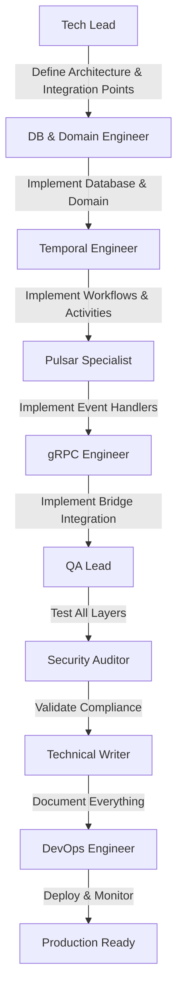

# Projeto: DICT CID/VSync Synchronization System

## 🎯 Visão Geral

Implementação profissional do sistema de **Sincronização CID (Content Identifier) e VSync (Verificador de Sincronismo)** conforme Manual Operacional BACEN Capítulo 9, seguindo os **padrões arquiteturais do Connector-Dict** (Clean Architecture, Event-Driven com Pulsar, Temporal Workflows).

**Objetivo**: Desenvolver feature production-ready de sincronização automática entre o PSP LBPay e o DICT BACEN através de:
1. Geração e armazenamento de CIDs para todas as chaves PIX
2. Cálculo incremental de VSyncs por tipo de chave
3. Verificação periódica de sincronismo via DICT API (através do Bridge)
4. Reconciliação automática em caso de dessincronização
5. Notificação ao Core-Dict via Pulsar Events

## 📋 Escopo do Projeto

### ✅ In Scope
- **CID Generation**: Hash SHA-256 de chaves PIX (evento-driven)
- **PostgreSQL Storage**: Tabelas `dict_cids` + `dict_vsyncs` + `dict_sync_verifications` + `dict_reconciliations`
- **Pulsar Event Consumer**: Consumir eventos `key.created` e `key.updated` do Dict API
- **VSync Calculation**: Cálculo incremental via operação XOR cumulativa
- **Temporal Cron Workflow**: Verificação diária de sincronismo (03:00 AM)
- **Bridge gRPC Integration**: Chamar APIs de VSync/CIDList via Bridge existente
- **Reconciliation Workflow**: Detecção e correção automática de divergências
- **Core-Dict Notification**: Publicar eventos Pulsar para `core-events` topic
- **Database Repository Layer**: Pattern repository para acesso a dados
- **Observability**: OpenTelemetry (logs + traces + metrics)
- **Test Coverage**: >85% (unit + integration)

### ❌ Out of Scope
- Modificações no Dict API REST endpoints (não precisa de novos endpoints HTTP)
- Modificações no Core-Dict (apenas consumir eventos Pulsar)
- Modificações no Bridge gRPC (verificar se endpoints VSync já existem)
- Setup de infraestrutura (PostgreSQL, Pulsar, Temporal já existem)
- Normalização de chaves (reutilizar do connector-dict existente)

## 🏗️ Arquitetura (VALIDADA com Stakeholder)

### 🔴 MUDANÇA CRÍTICA: Container Separado `dict.vsync`

**Decisão do Stakeholder**: Implementar em **container separado** `dict.vsync`, NÃO no `orchestration-worker`.

**Razão**: Isolamento de responsabilidades - CID/VSync é funcionalidade específica que merece container dedicado.

### Stack Tecnológica
- **Language**: Go 1.24.5
- **HTTP Framework**: Fiber v2 (para health checks e métricas)
- **Database**: PostgreSQL (compartilhado com connector-dict)
- **Message Broker**: Apache Pulsar (tópico EXISTENTE: `dict-events`)
- **Workflow Engine**: Temporal (workflows exclusivos do dict.vsync)
- **RPC Protocol**: gRPC (Bridge já existe)
- **Cache**: Redis (compartilhado)
- **Observability**: OpenTelemetry (logs + traces + metrics)
- **Testing**: Testify, MockGen, Testcontainers

### Arquitetura de Integração (CORRIGIDA)

```
┌────────────────────────────────────────────────────────────────────────┐
│                      CONNECTOR-DICT (Existente)                         │
│                                                                         │
│  ┌──────────────────┐                                                  │
│  │   Dict API       │  POST /entries (criar chave)                     │
│  │   (apps/dict)    │  PUT /entries/{key} (atualizar chave)            │
│  └──────────────────┘                                                  │
│           │                                                             │
│           │ Publish Event (APÓS SUCESSO NO BACEN)                      │
│           │ ✅ Dados JÁ normalizados                                   │
│           ▼                                                             │
│  ┌──────────────────┐                                                  │
│  │  Apache Pulsar   │                                                  │
│  │                  │                                                  │
│  │  Topic:          │                                                  │
│  │  dict-events     │ ◄─── TOPIC EXISTENTE (VALIDADO)                 │
│  └──────────────────┘                                                  │
└────────────────────────────────────────────────────────────────────────┘

                              │
                              │ Subscribe & Consume
                              ▼

┌────────────────────────────────────────────────────────────────────────┐
│           🆕 DICT.VSYNC (NOVO CONTAINER SEPARADO)                       │
│                    Location: apps/dict.vsync/                           │
│                                                                         │
│  ┌──────────────────────────────────────────────────────────────────┐  │
│  │  Pulsar Consumer: DictEventHandler                              │  │
│  │  Location: internal/handlers/pulsar/                            │  │
│  │                                                                  │  │
│  │  OnMessage(dict-events):                                        │  │
│  │    - Filtrar eventos de Entry (key.created, key.updated)       │  │
│  │    - Extrair dados necessários para CID                        │  │
│  │    - Trigger Temporal Activity                                 │  │
│  └──────────────────────────────────────────────────────────────────┘  │
│                              │                                          │
│                              ▼                                          │
│  ┌──────────────────────────────────────────────────────────────────┐  │
│  │  Temporal Activities                                             │  │
│  │  Location: internal/temporal/activities/                         │  │
│  │                                                                  │  │
│  │  - GenerateCIDActivity(entry) → CID (SHA-256)                  │  │
│  │  - StoreCIDActivity(cid, entry) → PostgreSQL                   │  │
│  │  - UpdateVSyncActivity(keyType, cid, op) → XOR incremental     │  │
│  └──────────────────────────────────────────────────────────────────┘  │
│                              │                                          │
│                              ▼                                          │
│  ┌──────────────────────────────────────────────────────────────────┐  │
│  │  PostgreSQL (Compartilhado)                                      │  │
│  │                                                                  │  │
│  │  Tables (NOVAS):                                                 │  │
│  │  - dict_cids               (32M rows, 11GB, indexed)           │  │
│  │  - dict_vsyncs             (5 rows, one per key type)          │  │
│  │  - dict_sync_verifications (audit log)                         │  │
│  │  - dict_reconciliations    (reconciliation history)            │  │
│  └──────────────────────────────────────────────────────────────────┘  │
│                                                                         │
│  ┌──────────────────────────────────────────────────────────────────┐  │
│  │  Temporal Cron Workflow: VSyncVerificationWorkflow              │  │
│  │  Schedule: "0 3 * * *" (daily 03:00 AM)                         │  │
│  │  Location: infrastructure/temporal/workflows/sync/               │  │
│  │                                                                  │  │
│  │  1. ReadVSyncsActivity() → {CPF: vsync1, CNPJ: vsync2, ...}    │  │
│  │  2. BridgeVerifySyncActivity(vsyncs) → Call Bridge gRPC        │  │
│  │  3. Compare local vs DICT vsyncs                                │  │
│  │  4. LogVerificationActivity(results)                            │  │
│  │  5. If divergence → ExecuteChildWorkflow(Reconciliation)       │  │
│  └──────────────────────────────────────────────────────────────────┘  │
│                              │                                          │
│                              │ If divergence detected                   │
│                              ▼                                          │
│  ┌──────────────────────────────────────────────────────────────────┐  │
│  │  Child Workflow: ReconciliationWorkflow                         │  │
│  │  Trigger: On-demand (from verification or manual)               │  │
│  │                                                                  │  │
│  │  1. BridgeRequestCIDListActivity(keyType) → requestID          │  │
│  │  2. PollCIDListStatusActivity(requestID) → wait for DICT       │  │
│  │  3. BridgeDownloadCIDListActivity() → parse CSV/JSON           │  │
│  │  4. CompareCIDsActivity(local, dict) → divergences             │  │
│  │  5. NotifyCoreDictActivity(divergences) → Pulsar event         │  │
│  │  6. ApplyCorrectionsActivity(divergences) → update DB          │  │
│  │  7. RecalculateVSyncsActivity(keyType)                         │  │
│  │  8. SaveReconciliationLogActivity(results)                     │  │
│  └──────────────────────────────────────────────────────────────────┘  │
└────────────────────────────────────────────────────────────────────────┘

                              │
                              │ gRPC calls
                              ▼

┌────────────────────────────────────────────────────────────────────────┐
│                    BRIDGE (rsfn-connect-bacen-bridge)                   │
│                    Location: infrastructure/grpc/                       │
│                                                                         │
│  Existing clients reused:                                              │
│  - grpcGateway.SyncClient (ADD NEW if doesn't exist)                   │
│                                                                         │
│  Methods needed:                                                        │
│  - VerifySync(vsyncs) → Compare with DICT                             │
│  - RequestCIDList(keyType) → Async request to DICT                    │
│  - GetCIDListStatus(requestID) → Poll for completion                  │
│  - DownloadCIDList(url) → Download from DICT                          │
└────────────────────────────────────────────────────────────────────────┘

                              │
                              │ HTTPS REST API
                              ▼

┌────────────────────────────────────────────────────────────────────────┐
│                           DICT BACEN                                    │
│                    (OpenAPI spec available)                             │
│                                                                         │
│  Endpoints (Chapter 9):                                                │
│  - POST /api/v1/sync/verify   (VSync verification)                    │
│  - POST /api/v1/sync/cid-list (Request CID list)                      │
│  - GET  /api/v1/sync/cid-list/{id} (Check status)                     │
└────────────────────────────────────────────────────────────────────────┘

                              ▲
                              │ Pulsar Event
                              │

┌────────────────────────────────────────────────────────────────────────┐
│                            CORE-DICT                                    │
│                                                                         │
│  Consumes Pulsar topic: persistent://lb-conn/dict/core-events         │
│                                                                         │
│  Event: ActionSyncReconciliationRequired                               │
│  Payload:                                                               │
│    - keyType: "CPF"                                                    │
│    - divergenceCount: 123                                              │
│    - dictCIDFileURL: "s3://bucket/cids_cpf_20251028.csv"              │
│    - actionRequired: "REBUILD_TABLE"                                   │
└────────────────────────────────────────────────────────────────────────┘
```

### Fluxos Implementados

#### Fluxo 1: Geração de CID (Event-Driven)
```
Trigger: Dict API creates/updates key
1. Dict API → Publish Pulsar event (key.created or key.updated)
2. Orchestration Worker → Consume event (SyncKeyEventHandler)
3. Execute Temporal Activity: GenerateCIDActivity
   - Input: Entry data from event
   - Process: SHA-256 hash of normalized entry
   - Output: CID (64-char hex)
4. Execute Temporal Activity: SaveCIDActivity
   - Insert/Update dict_cids table
5. Execute Temporal Activity: UpdateVSyncActivity
   - Read current VSync for key_type
   - XOR operation: new_vsync = old_vsync XOR cid
   - Update dict_vsyncs table
6. Done (async, no response to Dict API)
```

#### Fluxo 2: Verificação Periódica (Cron-Based)
```
Trigger: Temporal Cron "0 3 * * *" (daily 03:00 AM)
Workflow: VSyncVerificationWorkflow

1. ReadVSyncsActivity
   - Query: SELECT key_type, vsync_value FROM dict_vsyncs
   - Output: {CPF: "abc123...", CNPJ: "def456...", ...}

2. BridgeVerifySyncActivity
   - gRPC call: bridge.VerifySync(vsyncs)
   - Bridge → DICT BACEN REST API
   - Output: {CPF: {status: "OK", vsync: "abc123..."}, CNPJ: {status: "DESYNC", vsync: "xyz789..."}}

3. Compare VSyncs (in workflow)
   - For each key_type:
     if local_vsync != dict_vsync → divergence detected

4. LogVerificationActivity
   - Insert into dict_sync_verifications
   - Fields: key_type, vsync_local, vsync_dict, synchronized, timestamp

5. If divergences > 0:
   - For each divergent key_type:
     - ExecuteChildWorkflow(ReconciliationWorkflow, keyType)
     - ParentClosePolicy: ABANDON
   - Send alert (PagerDuty/Slack via activity)

6. Done
```

#### Fluxo 3: Reconciliação (Child Workflow)
```
Trigger: Child workflow from VSyncVerificationWorkflow
Workflow: ReconciliationWorkflow
Input: keyType (e.g., "CPF")

1. BridgeRequestCIDListActivity
   - gRPC call: bridge.RequestCIDList(keyType)
   - DICT starts async generation
   - Output: {requestID: "req-123", status: "PROCESSING"}

2. PollCIDListStatusActivity (loop with sleep)
   - Every 5s: bridge.GetCIDListStatus(requestID)
   - Until status = "COMPLETED" or timeout (5min)
   - Output: {status: "COMPLETED", url: "https://dict.bacen.gov.br/files/cids_cpf.csv"}

3. BridgeDownloadCIDListActivity
   - Download file from URL
   - Parse CSV/JSON
   - Output: []CID (array of CIDs from DICT)

4. CompareCIDsActivity
   - Query local: SELECT cid FROM dict_cids WHERE key_type = ?
   - Compare sets:
     missing_local = dict_cids - local_cids
     missing_dict = local_cids - dict_cids
   - Output: Divergences{MissingLocal: 50, MissingDict: 10, Total: 60}

5. CheckDivergenceThreshold (in workflow)
   - If total_divergences > MAX_AUTO_RECONCILE (e.g., 100):
     - Return error: "Manual approval required"
     - Alert ops team
     - End workflow (manual intervention)

6. NotifyCoreDictActivity (if auto-reconcile)
   - Publish Pulsar event to core-events topic
   - Action: ActionSyncReconciliationRequired
   - Payload: {keyType, divergenceCount, dictCIDFileURL, actionRequired: "REBUILD_TABLE"}

7. ApplyCorrectionsActivity (optional, based on policy)
   - For missing_local: Query DICT for full entry data → insert into dict_cids
   - For missing_dict: Mark as orphaned (or delete based on policy)
   - Update dict_cids table

8. RecalculateVSyncsActivity
   - Query: SELECT cid FROM dict_cids WHERE key_type = ? ORDER BY cid
   - Calculate fresh VSync: vsync = XOR(all cids)
   - Update dict_vsyncs table

9. SaveReconciliationLogActivity
   - Insert into dict_reconciliations
   - Fields: key_type, status, divergences, dict_file_url, timestamps

10. Re-verify (call activity)
    - BridgeVerifySyncActivity again to confirm sync

11. Done
```

## 👥 Squad Especializada (Atualizada)

### 🎯 Core Implementation Team

#### 1. Tech Lead & Solution Architect (Opus) ⭐
**Modelo**: Claude Opus 4
**Responsabilidades**:
- Arquitetura de integração com connector-dict existente
- Design do schema PostgreSQL (CIDs + VSyncs + Reconciliations)
- Definição de Temporal Workflows (Cron + Child Workflows)
- Padrões de integração Pulsar (topics, handlers, schemas)
- Estratégia de integração com Bridge gRPC
- Code review de todas implementações
- Decisões técnicas (auto-reconcile thresholds, retry policies)

**Arquivos**: `.claude/agents/sync/tech-lead.md`

#### 2. Database & Domain Engineer (Sonnet)
**Modelo**: Claude Sonnet 4
**Responsabilidades**:
- Schema PostgreSQL (migrations + indexes + triggers)
- Repository layer (`infrastructure/database/repositories/sync/`)
- Domain entities (`domain/sync/`: CID, VSync, Divergence)
- CID Generation Algorithm (SHA-256 + normalização)
- VSync Calculation Algorithm (XOR incremental)
- Performance optimization (batch operations, pgx)

**Arquivos**: `.claude/agents/sync/db-domain-engineer.md`

#### 3. Temporal Workflow Engineer (Sonnet)
**Modelo**: Claude Sonnet 4
**Responsabilidades**:
- Cron Workflow: VSyncVerificationWorkflow
- Child Workflow: ReconciliationWorkflow
- Temporal Activities (todas as 10+ activities)
- Retry policies e error handling (retryable vs non-retryable)
- Continue-As-New para workflows de longa duração
- Workflow testing (replay, time skip, mocking)

**Arquivos**: `.claude/agents/sync/temporal-engineer.md`

#### 4. Pulsar & Event Integration Specialist (Sonnet)
**Modelo**: Claude Sonnet 4
**Responsabilidades**:
- Pulsar Handler: `SyncKeyEventHandler` (handlers/pulsar/sync/)
- Event schema validation (key.created, key.updated)
- Topic configuration (verificar se já existem ou criar novos)
- Integration com Application Use Case
- Idempotency handling (duplicate events)
- Dead-letter queue setup

**Arquivos**: `.claude/agents/sync/pulsar-specialist.md`

#### 5. gRPC & Bridge Integration Engineer (Sonnet)
**Modelo**: Claude Sonnet 4
**Responsabilidades**:
- gRPC client para Bridge (`infrastructure/grpc/sync/`)
- Proto definitions (VerifySync, RequestCIDList, GetCIDListStatus)
- Verificar se Bridge já tem endpoints ou coordenar implementação
- mTLS configuration (reutilizar do grpcGateway)
- Error handling (convert gRPC errors to bacen.Problem)
- Integration testing com mock Bridge

**Arquivos**: `.claude/agents/sync/grpc-engineer.md`

### 🧪 Quality Assurance Team

#### 6. QA Lead & Test Architect (Opus) ⭐
**Modelo**: Claude Opus 4
**Responsabilidades**:
- Estratégia de testes (unit, integration, workflow replay)
- Test coverage >85% enforcement
- Mock design (Bridge, DICT API, PostgreSQL, Pulsar)
- Temporal workflow testing (deterministic replay)
- Test data generation (synthetic CIDs, 10M scale)
- Performance benchmarks (10M CIDs query/insert)

**Arquivos**: `.claude/agents/sync/qa-lead.md`

#### 7. Security & BACEN Compliance Auditor (Opus) ⭐
**Modelo**: Claude Opus 4
**Responsabilidades**:
- BACEN Manual Cap. 9 compliance (100% validation)
- CID algorithm correctness (cryptographic validation)
- VSync mathematical properties verification
- Security audit (SQL injection, secrets management)
- LGPD compliance (PII in CIDs)
- Audit trail completeness (all reconciliations logged)

**Arquivos**: `.claude/agents/sync/security-auditor.md`

### 📚 Documentation & Operations Team

#### 8. Technical Writer (Sonnet)
**Modelo**: Claude Sonnet 4
**Responsabilidades**:
- Architecture diagrams (Mermaid)
- Database schema documentation
- Workflow documentation (VSyncVerification, Reconciliation)
- Operational runbooks (manual reconciliation, troubleshooting)
- Environment setup guide
- Migration guide (deploy to production)

**Arquivos**: `.claude/agents/sync/technical-writer.md`

#### 9. DevOps & SRE Engineer (Sonnet)
**Modelo**: Claude Sonnet 4
**Responsabilidades**:
- Database migrations (Goose/Flyway)
- Temporal cron configuration
- Pulsar topic creation/configuration
- Monitoring dashboards (Grafana: VSync lag, divergences, reconciliations)
- Alerts (Prometheus: VSync desync, reconciliation failures)
- Disaster recovery procedures

**Arquivos**: `.claude/agents/sync/devops-engineer.md`

## 📂 Estrutura de Arquivos (Baseada no Connector-Dict)

```
connector-dict/  (branch: Sync_CIDS_VSync)
├── apps/
│   ├── dict/  (NÃO MODIFICAR - apenas análise)
│   │   ├── domain/
│   │   │   └── (analisar Entry, Key para reutilizar normalização)
│   │   └── infrastructure/
│   │       └── (analisar conexões PostgreSQL, Pulsar existentes)
│   │
│   └── orchestration-worker/  (IMPLEMENTAR AQUI)
│       ├── handlers/
│       │   └── pulsar/
│       │       └── sync/                                    # NEW
│       │           ├── sync_handler.go
│       │           ├── key_created_handler.go
│       │           └── key_updated_handler.go
│       │
│       ├── application/
│       │   ├── usecases/
│       │   │   └── sync/                                    # NEW
│       │   │       ├── application.go
│       │   │       ├── process_key_event.go
│       │   │       └── interface.go
│       │   └── ports/
│       │       └── sync_service.go                          # NEW interface
│       │
│       ├── infrastructure/
│       │   ├── database/
│       │   │   ├── migrations/                              # NEW
│       │   │   │   ├── 001_create_dict_cids.sql
│       │   │   │   ├── 002_create_dict_vsyncs.sql
│       │   │   │   ├── 003_create_dict_sync_verifications.sql
│       │   │   │   └── 004_create_dict_reconciliations.sql
│       │   │   └── repositories/
│       │   │       └── sync/                                # NEW
│       │   │           ├── cid_repository.go
│       │   │           ├── vsync_repository.go
│       │   │           ├── verification_repository.go
│       │   │           └── reconciliation_repository.go
│       │   │
│       │   ├── grpc/
│       │   │   └── sync/                                    # NEW
│       │   │       └── bridge_sync_client.go
│       │   │
│       │   └── temporal/
│       │       ├── workflows/
│       │       │   └── sync/                                # NEW
│       │       │       ├── vsync_verification_workflow.go
│       │       │       ├── reconciliation_workflow.go
│       │       │       └── shared.go
│       │       │
│       │       ├── activities/
│       │       │   └── sync/                                # NEW
│       │       │       ├── sync_activity.go                 # struct with grpcGateway
│       │       │       ├── generate_cid_activity.go
│       │       │       ├── save_cid_activity.go
│       │       │       ├── update_vsync_activity.go
│       │       │       ├── read_vsyncs_activity.go
│       │       │       ├── bridge_verify_sync_activity.go
│       │       │       ├── bridge_request_cidlist_activity.go
│       │       │       ├── bridge_download_cidlist_activity.go
│       │       │       ├── compare_cids_activity.go
│       │       │       ├── notify_coredict_activity.go
│       │       │       └── reconcile_activity.go
│       │       │
│       │       └── services/
│       │           └── sync_service.go                      # NEW (implements ports.SyncService)
│       │
│       └── setup/
│           ├── config.go         # ADD: Pulsar topics sync, cron schedule
│           ├── temporal.go       # ADD: Register workflows/activities + START CRON
│           ├── pulsar.go         # ADD: Subscribe to key.created/updated topics
│           └── setup.go          # ADD: Wire sync dependencies
│
└── shared/
    └── proto/
        └── sync/                                            # NEW
            └── dict_sync_service.proto                      # gRPC definitions
```

## 📖 Metodologia de Trabalho

### Workflow de Desenvolvimento



### Princípios (Seguindo Connector-Dict)
1. **Clean Architecture**: Domain → Application → Infrastructure → Handlers
2. **Event-Driven**: Pulsar events para comunicação assíncrona
3. **Temporal Workflows**: Para processos de longa duração e crons
4. **Repository Pattern**: Acesso a dados via interfaces
5. **gRPC via Bridge**: Toda comunicação com DICT via Bridge
6. **Observability First**: OpenTelemetry em todas as camadas
7. **Test-Driven**: Tests antes de implementação
8. **BACEN Compliance**: 100% conformidade com Manual Cap. 9

### Padrões de Qualidade
- **Test Coverage**: >85%
- **Go Idiomaticity**: golangci-lint score A
- **Security**: Cryptographic correctness (SHA-256)
- **Performance**: 10M+ CIDs, VSync calc <1s
- **Observability**: Full OpenTelemetry instrumentation

## 🚀 Fases de Execução (Atualizadas)

### Fase 0: Análise Técnica (3 dias)
**Objetivo**: Analisar código existente do connector-dict

**Deliverables**:
- [ ] Analisar eventos Pulsar existentes para Entry (key.created, key.updated)
- [ ] Analisar estrutura de Entry/Key/Account/Owner (domain layer)
- [ ] Verificar conexão PostgreSQL existente (apps/dict/infrastructure)
- [ ] Analisar gRPC Gateway existente (apps/orchestration-worker/infrastructure/grpc)
- [ ] Verificar Temporal setup atual (workflows, activities, cron)
- [ ] Coordenar com time Bridge: endpoints VSync/CIDList disponíveis?
- [ ] Coordenar com time Core-Dict: consumer de core-events existe?
- [ ] Documentar descobertas em `ANALISE_CODIGO_EXISTENTE.md`

### Fase 1: Database Layer (Semana 1)
**Objetivo**: Schema e repositories

**Deliverables**:
- [ ] Migrations SQL (4 tabelas)
- [ ] Repository interfaces (domain/sync/)
- [ ] Repository implementations (infrastructure/database/repositories/sync/)
- [ ] Unit tests (>90% coverage)
- [ ] Performance test (10M inserts, queries)

### Fase 2: Domain & Algorithms (Semana 1)
**Objetivo**: CID generator e VSync calculator

**Deliverables**:
- [ ] CID Generator (domain/sync/cid_generator.go)
- [ ] VSync Calculator (domain/sync/vsync_calculator.go)
- [ ] Normalização (reutilizar de Entry se possível)
- [ ] Unit tests com casos de teste BACEN
- [ ] Validation contra spec BACEN

### Fase 3: Pulsar Integration (Semana 2)
**Objetivo**: Event consumers

**Deliverables**:
- [ ] Pulsar Handler (handlers/pulsar/sync/)
- [ ] Application Use Case (application/usecases/sync/)
- [ ] Integration com Temporal Activities
- [ ] Setup em pulsar.go e setup.go
- [ ] Integration tests com Testcontainers

### Fase 4: Temporal Workflows (Semana 2-3)
**Objetivo**: Orchestration logic

**Deliverables**:
- [ ] VSyncVerificationWorkflow (cron-based)
- [ ] ReconciliationWorkflow (child workflow)
- [ ] Todas as activities (10+ activities)
- [ ] Temporal Service implementation
- [ ] Setup cron em temporal.go
- [ ] Workflow replay tests

### Fase 5: Bridge Integration (Semana 3)
**Objetivo**: gRPC communication

**Deliverables**:
- [ ] Proto definitions (shared/proto/sync/)
- [ ] gRPC client (infrastructure/grpc/sync/)
- [ ] Integration com Bridge activities
- [ ] Error handling (retryable vs non-retryable)
- [ ] Integration tests com mock Bridge

### Fase 6: Quality & Compliance (Semana 4)
**Objetivo**: Testing e validation

**Deliverables**:
- [ ] E2E tests (full flow)
- [ ] Performance tests (10M CIDs)
- [ ] Security audit
- [ ] BACEN compliance checklist (100%)
- [ ] Code review completo

### Fase 7: Documentation & Deployment (Semana 4)
**Objetivo**: Production readiness

**Deliverables**:
- [ ] Architecture docs + diagrams
- [ ] Operational runbooks
- [ ] Monitoring dashboards
- [ ] Alerts configuration
- [ ] Migration scripts
- [ ] Rollback procedures

## 📊 Métricas de Sucesso

| Métrica | Target | Medição |
|---------|--------|---------|
| Test Coverage | >85% | go test -cover |
| CID Generation | <50ms p99 | Prometheus histogram |
| VSync Calculation (10M) | <1s | Benchmark test |
| Event Processing Latency | <500ms p99 | Temporal metrics |
| Verification Workflow | >99% success | Temporal dashboard |
| Reconciliation Accuracy | 100% | Audit logs |
| BACEN Compliance | 100% | Security audit |
| Database Performance | <100ms p99 query | pgx metrics |

## 🔗 Referências

- **BACEN Manual**: Capítulo 9 (RF_Dict_Bacen.md)
- **Connector-Dict**: [github.com/lb-conn/connector-dict](https://github.com/lb-conn/connector-dict)
- **Bridge**: [github.com/lb-conn/rsfn-connect-bacen-bridge](https://github.com/lb-conn/rsfn-connect-bacen-bridge)
- **Instruções Dict API**: `.claude/Specs_do_Stackholder/instrucoes-app-dict.md`
- **Instruções Orchestration Worker**: `.claude/Specs_do_Stackholder/instrucoes-orchestration-worker.md`
- **Instruções Gerais**: `.claude/Specs_do_Stackholder/instrucoes-gerais.md`
- **OpenAPI DICT**: `.claude/Specs_do_Stackholder/OpenAPI_Dict_Bacen.json`

---

**Última Atualização**: 2025-10-28
**Responsável**: Tech Lead
**Status**: ✅ ARQUITETURA DEFINIDA - PRONTO PARA FASE 0 (Análise Técnica)

**Próximo Passo**: Iniciar Fase 0 - Analisar código existente do connector-dict
