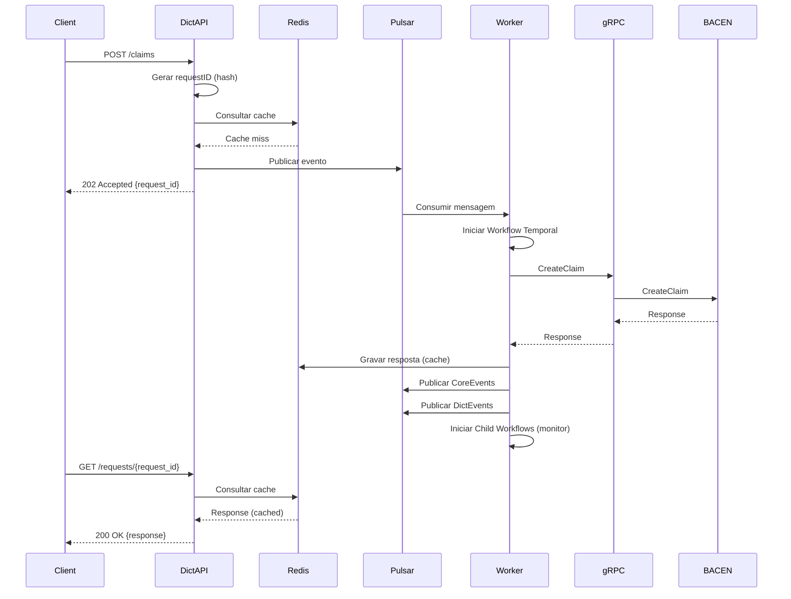
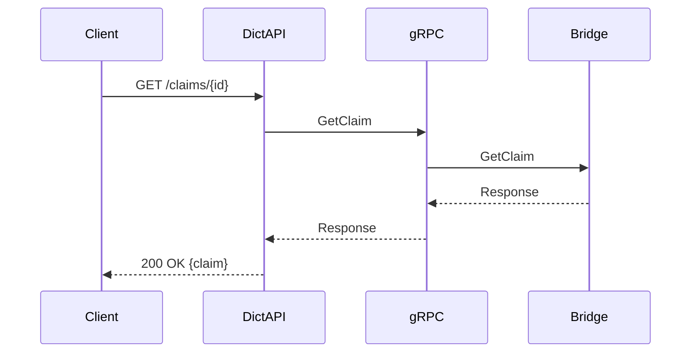

# Guia de Implementação de Novas Funcionalidades

## Visão Geral

Este diretório contém instruções detalhadas para criação de novas funcionalidades no projeto **connector-dict**. O projeto é composto por duas aplicações principais que trabalham em conjunto:

1. **Dict API** (`apps/dict`) — API REST que recebe requisições dos clientes
2. **Orchestration Worker** (`apps/orchestration-worker`) — Worker Temporal que processa workflows assíncronos

---

## 🎯 Quando Implementar uma Nova Funcionalidade

Quando uma **nova funcionalidade/endpoint** for necessária, você **DEVE** implementar em **AMBAS** as aplicações seguindo a ordem abaixo:

### **Passo 1: Dict API** (Camada de Entrada)

📄 **Documento:** [`instrucoes-app-dict.md`](./instrucoes-app-dict.md)

**Responsabilidades:**

- Receber requisições REST via Huma
- Validar schemas de entrada
- Operações **síncronas (GET)**: Consultar diretamente via gRPC (Bridge)
- Operações **assíncronas (POST/PUT/DELETE)**:
  - Gerar hash determinístico (requestID)
  - Consultar cache Redis
  - Publicar mensagem no Pulsar
  - Retornar 202 Accepted

**Tecnologias:**

- Framework HTTP: Huma
- Cache: Redis
- Messaging: Pulsar (Producer)
- Comunicação síncrona: gRPC Client

---

### **Passo 2: Orchestration Worker** (Camada de Processamento)

📄 **Documento:** [`instrucoes-orchestration-worker.md`](./instrucoes-orchestration-worker.md)

**Responsabilidades:**

- Consumir mensagens do Pulsar
- Orquestrar workflows Temporal para operações assíncronas
- Executar chamadas gRPC para Bridge/BACEN
- Gravar respostas no cache Redis
- Publicar eventos de sucesso/falha (CoreEvents, DictEvents)
- Gerenciar workflows de monitoramento e expiração

**Tecnologias:**

- Orquestração: Temporal
- Messaging: Pulsar (Consumer)
- Cache: Redis
- Comunicação: gRPC Client

---

## 🔄 Fluxo Completo de uma Operação

### **Operações Assíncronas (POST/PUT/DELETE)**



### **Operações Síncronas (GET)**



---

## 📋 Checklist de Implementação

Ao criar uma nova funcionalidade, siga esta ordem:

### ✅ **1. Dict API** (consulte [`instrucoes-app-dict.md`](./instrucoes-app-dict.md))

- [ ] **Schemas** (`handlers/http/schemas/<resource>/`)

  - [ ] Request schema com validações
  - [ ] Response schema com requestID (async) ou dados diretos (sync)
  - [ ] Mapper functions

- [ ] **Controller** (`handlers/http/<resource>/`)

  - [ ] controller.go com RegisterRoutes
  - [ ] Handlers individuais (create, get, update, delete, etc.)
  - [ ] Validação de schemas
  - [ ] Conversão de erros

- [ ] **Application** (`application/<resource>/`)

  - [ ] application.go com injeção de dependências
  - [ ] interface.go com contratos
  - [ ] Use cases para cada operação
  - [ ] Lógica: async (cache + pulsar) ou sync (gRPC)

- [ ] **Infrastructure** (se necessário)

  - [ ] gRPC client (`infrastructure/grpc/<resource>/`)

- [ ] **Setup** (`setup/`)

  - [ ] Adicionar tópicos Pulsar ao config.go
  - [ ] Criar publishers no setup.go
  - [ ] Injetar dependências no setup.go
  - [ ] Registrar rotas no RegisterRoutes()

- [ ] **Variáveis de Ambiente**
  - [ ] Adicionar tópicos Pulsar ao .env

---

### ✅ **2. Orchestration Worker** (consulte [`instrucoes-orchestration-worker.md`](./instrucoes-orchestration-worker.md))

- [ ] **Handlers Pulsar** (`handlers/pulsar/<resource>/`)

  - [ ] <resource>\_handler.go com struct Handler
  - [ ] Handlers para cada ação (create, update, delete)
  - [ ] Parse de MessageProperties
  - [ ] Decode de payload
  - [ ] Delegação para use case

- [ ] **Application Use Cases** (`application/usecases/<resource>/`)

  - [ ] application.go com injeção de dependências
  - [ ] Use case para cada operação (delega para service)

- [ ] **Application Ports** (`application/ports/`)

  - [ ] Interface do service (<Resource>Service)

- [ ] **Temporal Workflows** (`infrastructure/temporal/workflows/<resource>s/`)

  - [ ] **Workflows de Ação:**
    - [ ] create_workflow.go (gRPC → Cache → Events)
    - [ ] update_workflow.go
    - [ ] delete_workflow.go
  - [ ] **Workflows de Monitoramento** (se aplicável):
    - [ ] monitor\_<resource>\_workflow.go (polling periódico)
    - [ ] expire\_<resource>\_workflow.go (deadline tracking)
  - [ ] shared.go (helpers compartilhados)

- [ ] **Temporal Activities** (`infrastructure/temporal/activities/<resource>s/`)

  - [ ] <resource>\_activity.go (struct Activity)
  - [ ] create_activity.go (gRPC call + error classification)
  - [ ] get_activity.go (para polling)
  - [ ] update_activity.go
  - [ ] delete_activity.go

- [ ] **Temporal Service** (`infrastructure/temporal/services/`)

  - [ ] <resource>\_service.go (ExecuteWorkflow)
  - [ ] Implementar interface de ports
  - [ ] Configurar WorkflowOptions (ID, TaskQueue, ReusePolicy)

- [ ] **Setup** (`setup/`)

  - [ ] Adicionar tópicos ao config.go
  - [ ] Registrar workflows no temporal.go
  - [ ] Registrar activities no temporal.go
  - [ ] Adicionar consumer Pulsar no pulsar.go
  - [ ] Injetar dependências no setup.go

- [ ] **Variáveis de Ambiente**
  - [ ] Adicionar tópicos Pulsar ao .env

---

## 🎓 Exemplos de Referência

### **Recurso Completo: Claim**

Use `Claim` como exemplo de referência **em ambas as aplicações**:

#### **Dict API:**

- Schemas: `apps/dict/handlers/http/schemas/claim/`
- Controller: `apps/dict/handlers/http/claim/`
- Application: `apps/dict/application/claim/`
- Setup: `apps/dict/setup/setup.go`

**Operações:**

- ✅ Async: CreateClaim, ConfirmClaim, CancelClaim, CompleteClaim
- ✅ Sync: GetClaim, ListClaims

#### **Orchestration Worker:**

- Handlers: `apps/orchestration-worker/handlers/pulsar/claim/`
- Use Cases: `apps/orchestration-worker/application/usecases/claim/`
- Workflows: `apps/orchestration-worker/infrastructure/temporal/workflows/claims/`
- Activities: `apps/orchestration-worker/infrastructure/temporal/activities/claims/`
- Service: `apps/orchestration-worker/infrastructure/temporal/services/claim_service.go`

**Workflows:**

- ✅ Ação: CreateClaimWorkflow, CancelClaimWorkflow, CompleteClaimWorkflow
- ✅ Monitor: MonitorClaimStatusWorkflow, ExpireCompletionPeriodEndWorkflow

---

## 🔑 Conceitos-Chave

### **Idempotência**

- **Dict API:** Hash determinístico (requestID) via `domain.Fingerprint()`
- **Orchestration Worker:** Workflow ID = requestID
- **Resultado:** Múltiplas requisições idênticas retornam mesma resposta do cache

### **Comunicação Assíncrona**

- **Dict API → Pulsar:** Publicar evento com correlationID
- **Pulsar → Orchestration Worker:** Consumir e iniciar workflow
- **Orchestration Worker → Redis:** Gravar resposta
- **Client → Dict API:** Consultar resposta via `/requests/{request_id}`

### **Comunicação Síncrona**

- **Dict API → gRPC Bridge:** Chamada direta (GET operations)
- **Orchestration Worker → gRPC Bridge:** Dentro de activities

### **Cache Redis**

- **Formato:** Envelope type-safe (`SetWithError`)
- **TTL:** Configurável por operação
- **Uso:** Armazenar respostas (sucesso ou erro)

### **Continue-As-New (Temporal)**

- **Quando:** Workflows de longa duração (monitoramento)
- **Por quê:** Evitar histórico gigante
- **Como:** `workflow.NewContinueAsNewError(ctx, WorkflowFunc, input)`

---

## 📦 Dependências entre Aplicações

### **Dict API depende de:**

- ✅ Schemas do SDK compartilhado (`github.com/lb-conn/sdk-rsfn-validator`)
- ✅ Pulsar (publisher)
- ✅ Redis (cache)
- ✅ gRPC Bridge (operações GET)

### **Orchestration Worker depende de:**

- ✅ Schemas do SDK compartilhado (`github.com/lb-conn/sdk-rsfn-validator`)
- ✅ Pulsar (consumer + publishers)
- ✅ Redis (cache)
- ✅ Temporal (workflows + activities)
- ✅ gRPC Bridge (todas as operações BACEN)

### **Comunicação:**

```
Dict API → Pulsar → Orchestration Worker
Dict API → Redis ← Orchestration Worker
Dict API → gRPC Bridge ← Orchestration Worker
```

---

## ⚠️ Regras Importantes

### **Dict API:**

1. ✅ POST/PUT/DELETE → **sempre assíncrono** (cache + pulsar + 202)
2. ✅ GET → **sempre síncrono** (gRPC + 200)
3. ✅ Sempre validar schemas com `.Validate()`
4. ✅ Sempre converter erros com `adapters.ConvertDomainError()`
5. ✅ Sempre logar operações importantes

### **Orchestration Worker:**

1. ✅ Workflows de ação: gRPC → Cache → CoreEvents → DictEvents
2. ✅ Workflows de monitoramento: Polling + Continue-As-New
3. ✅ Activities: Classificar erros (retryable vs non-retryable)
4. ✅ Sempre usar helpers compartilhados (`ExecuteCacheActivity`, etc.)
5. ✅ Child workflows: `ParentClosePolicy: ABANDON`
6. ✅ Workflow ID = requestID (idempotência)

---

## 🚀 Próximos Passos

1. **Leia os documentos específicos:**

   - [`instrucoes-app-dict.md`](./instrucoes-app-dict.md) — Dict API
   - [`instrucoes-orchestration-worker.md`](./instrucoes-orchestration-worker.md) — Orchestration Worker

2. **Analise o exemplo de referência (Claim)** em ambas as aplicações

3. **Implemente seguindo a ordem:**

   - Passo 1: Dict API (endpoint REST)
   - Passo 2: Orchestration Worker (workflow Temporal)

4. **Teste a integração completa:**
   - Enviar requisição para Dict API
   - Verificar processamento no Orchestration Worker
   - Consultar resposta via `/requests/{request_id}`

---

## 💡 Dicas

- ✅ Use os templates dos documentos como ponto de partida
- ✅ Copie e adapte o código de `Claim` (exemplo completo)
- ✅ Sempre adicione logs estruturados com contexto
- ✅ Sempre teste com diferentes cenários (sucesso, erro, timeout, etc.)
- ✅ Sempre implemente testes unitários
- ✅ Sempre documente variáveis de ambiente no README
