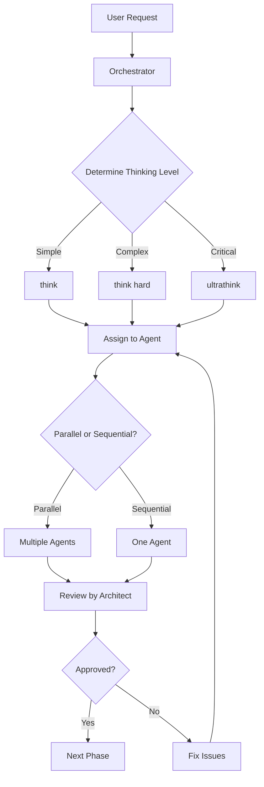

# 🎯 Squad Setup Complete - CID/VSync Implementation

## ✅ Setup Status: PRODUCTION-READY

**Date**: 2024-10-28
**Project**: DICT CID/VSync Synchronization System
**Status**: 🟢 Squad Configured and Ready for Implementation

---

## 📋 Squad Composition

### Planning Squad (Opus Model)
| Agent | Thinking Level | Responsibilities |
|-------|---------------|------------------|
| **ultra-architect-planner** | `ultrathink` | Architecture design, BACEN compliance, pattern validation |

### Development Squad (Sonnet Model)
| Agent | Thinking Level | Responsibilities |
|-------|---------------|------------------|
| **go-backend-specialist** | `think` | Domain/Application layer implementation |
| **temporal-workflow-engineer** | `think hard` | Temporal workflows & activities |
| **integration-specialist** | `think` | Pulsar, gRPC, Redis integration |

### Quality Squad (Opus Model)
| Agent | Thinking Level | Responsibilities |
|-------|---------------|------------------|
| **qa-lead-test-architect** | `think harder` | Test strategy, >80% coverage |
| **security-compliance-auditor** | `ultrathink` | BACEN/LGPD compliance, security |

### Operations Squad (Sonnet Model)
| Agent | Thinking Level | Responsibilities |
|-------|---------------|------------------|
| **devops-engineer** | adaptive | CI/CD, Docker, Kubernetes |
| **technical-writer** | `think` | Documentation, diagrams, guides |

**Total**: 8 specialized agents (2 Opus, 6 Sonnet)

---

## 📁 Directory Structure

```
IA_SyncKeys/
├── .claude/
│   ├── agents/
│   │   └── implementacao/
│   │       ├── planning/
│   │       │   └── ultra-architect-planner.md ✅
│   │       ├── development/
│   │       │   ├── go-backend-specialist.md ✅
│   │       │   ├── temporal-workflow-engineer.md ✅
│   │       │   └── integration-specialist.md ✅
│   │       ├── quality/
│   │       │   ├── qa-lead-test-architect.md ✅
│   │       │   └── security-compliance-auditor.md ✅
│   │       └── operations/
│   │           ├── devops-engineer.md ✅
│   │           └── technical-writer.md ✅
│   ├── commands/
│   │   ├── orchestrate-implementation.md ✅
│   │   ├── run-tests.md ✅
│   │   └── review-code.md ✅
│   ├── plugins/ (empty - using built-in plugins)
│   ├── Claude.md ✅
│   └── Specs.md ✅
├── docs/
│   ├── architecture/
│   │   └── thinking-logs/
│   ├── requirements/
│   ├── reviews/
│   └── security/
│       └── thinking-logs/
├── connector-dict/ (cloned repository)
└── SQUAD_SETUP_COMPLETE.md (this file) ✅
```

---

## 🔧 Available Plugins

The squad has access to all plugins in `.claude/agents/plugins/`:

**Relevant Plugins for CID/VSync**:
- ✅ `backend-development` - Go Clean Architecture patterns
- ✅ `cicd-automation` - GitHub Actions, GitOps
- ✅ `code-documentation` - Technical writing
- ✅ `comprehensive-review` - Multi-layer code review
- ✅ `database-design` - PostgreSQL schema design
- ✅ `observability-monitoring` - Prometheus, Grafana, OpenTelemetry
- ✅ `security-scanning` - SAST, vulnerability scanning
- ✅ `tdd-workflows` - Test-Driven Development
- ✅ `kubernetes-operations` - K8s deployment, GitOps

---

## 🚀 Quick Start Commands

### 1. Start Implementation
```bash
/orchestrate-implementation
```

This command will:
- Analyze complexity of current task
- Determine appropriate thinking levels
- Coordinate agents in parallel/sequence
- Track progress through 7 phases

### 2. Run Tests
```bash
/run-tests
```

Executes:
- Unit tests (>90% domain coverage)
- Integration tests (testcontainers)
- Temporal workflow tests
- Coverage analysis (>80% required)

### 3. Code Review
```bash
/review-code
```

Invokes:
- Architect review (patterns, architecture)
- Security audit (BACEN, LGPD, vulnerabilities)
- QA review (test coverage, code quality)

---

## 📊 Implementation Phases

### Phase 0: Technical Analysis (Current)
**Duration**: 2-3 days | **Status**: 🟡 READY TO START

**Agents**: ultra-architect-planner, integration-specialist, technical-writer

**Deliverables**:
- [ ] Analyze connector-dict patterns (claim module)
- [ ] Verify Pulsar events (key.created, key.updated)
- [ ] Check Bridge gRPC endpoints
- [ ] Document Entry fields for CID

### Phase 1: Domain & Application Layer
**Duration**: 3-4 days | **Status**: ⏸️ PENDING

**Agents**: go-backend-specialist (x2), qa-lead-test-architect

**Deliverables**:
- [ ] Domain entities (CID, VSync, EntryData)
- [ ] Repository interfaces
- [ ] Use cases (CreateCID, CalculateVSync)
- [ ] Unit tests (>90% coverage)

### Phase 2: PostgreSQL Layer
**Duration**: 2-3 days | **Status**: ⏸️ PENDING

**Agents**: go-backend-specialist, devops-engineer, qa-lead-test-architect

**Deliverables**:
- [ ] Repository implementations
- [ ] Database migrations (4 tables)
- [ ] Integration tests (testcontainers)

### Phase 3: Temporal Workflows
**Duration**: 4-5 days | **Status**: ⏸️ PENDING

**Agents**: temporal-workflow-engineer (x4)

**Deliverables**:
- [ ] VSyncVerificationWorkflow (cron)
- [ ] ReconciliationWorkflow (child)
- [ ] 5 Activities
- [ ] Workflow tests

### Phase 4: Integration Layer
**Duration**: 3-4 days | **Status**: ⏸️ PENDING

**Agents**: integration-specialist (x5)

**Deliverables**:
- [ ] Pulsar event handlers
- [ ] Bridge gRPC client
- [ ] Redis caching
- [ ] Core-Dict notifications

### Phase 5: Quality Assurance
**Duration**: 2-3 days | **Status**: ⏸️ PENDING

**Agents**: qa-lead-test-architect (x3), security-compliance-auditor

**Deliverables**:
- [ ] E2E tests
- [ ] Security audit report
- [ ] Coverage >80% verified

### Phase 6: DevOps & Documentation
**Duration**: 2-3 days | **Status**: ⏸️ PENDING

**Agents**: devops-engineer (x2), technical-writer (x3)

**Deliverables**:
- [ ] Dockerfile + K8s manifests
- [ ] CI/CD pipeline
- [ ] Architecture docs
- [ ] Deployment guides

### Phase 7: Production Readiness
**Duration**: 2-3 days | **Status**: ⏸️ PENDING

**Agents**: All (sequential reviews)

**Deliverables**:
- [ ] Architecture sign-off
- [ ] Security sign-off
- [ ] QA sign-off
- [ ] Deployment sign-off

**Total Duration**: 20-28 days (~4-6 weeks)

---

## 🧠 Thinking Level Guidelines

### Automatic Triggers

| Trigger | Thinking Level | Rationale |
|---------|---------------|-----------|
| BACEN compliance | `ultrathink` | Critical regulatory requirement |
| Security/LGPD | `ultrathink` | Financial data protection |
| Temporal workflows | `think harder` | Complex orchestration |
| Database schema | `think hard` | Data integrity critical |
| Integration patterns | `think hard` | Multiple moving parts |
| Simple implementation | `think` | Straightforward code |

### Escalation Protocol

```
IF uncertain about complexity:
    thinking_level++

IF error occurred AND thinking_level < think_hard:
    retry with thinking_level++

IF CRITICAL in prompt:
    thinking_level = ultrathink
```

---

## 📋 Quality Gates

Each phase must achieve:
- ✅ Code review approval (ultra-architect-planner)
- ✅ Security approval (security-compliance-auditor)
- ✅ Test coverage >80%
- ✅ golangci-lint score A
- ✅ Documentation updated

**No phase can proceed without all gates passed.**

---

## 🔄 Workflow Integration

### Agent Communication Pattern



### Parallel Execution Example

```
Phase 1: Domain & Application Layer

Agent 1 (parallel): go-backend-specialist
  Task: Implement domain/cid/

Agent 2 (parallel): go-backend-specialist
  Task: Implement application/usecases/cid/

Agent 3 (parallel): qa-lead-test-architect
  Task: Create test suite

All complete → Architect Review → Approve → Phase 2
```

---

## 🛡️ Security & Compliance

### BACEN Chapter 9 Requirements
- ✅ CID generation (SHA-256)
- ✅ VSync calculation (XOR cumulative)
- ✅ Daily verification (3 AM cron)
- ✅ Reconciliation on mismatch
- ✅ Audit trail (5 years retention)

### LGPD Compliance
- ✅ No PII in logs
- ✅ Data encryption at rest
- ✅ Access control
- ✅ Retention policies

---

## 📊 Success Metrics

| Metric | Target | How to Measure |
|--------|--------|----------------|
| Test Coverage | >80% | `make coverage-check` |
| Code Quality | Score A | `golangci-lint run` |
| BACEN Compliance | 100% | Security audit report |
| Performance | <100ms p99 | Load testing |
| Documentation | 100% | All phases documented |

---

## 🚦 Current Status

**Phase**: 0 - Technical Analysis
**Status**: 🟢 READY TO START
**Next Action**: Execute Phase 0 with ultra-architect-planner

### To Start Phase 0

```bash
"ultra-architect-planner, think hard about Phase 0 - Technical Analysis:

Analyze connector-dict repository and answer:
1. What Pulsar events exist for Entry operations?
2. What Entry fields are needed for CID generation per BACEN?
3. What PostgreSQL connection patterns are used?
4. Coordinate with Bridge team: Are VSync gRPC endpoints ready?
5. Coordinate with Core-Dict team: Does core-events consumer exist?

Study these files:
- apps/dict/handlers/entry/ (Pulsar event publishing)
- apps/orchestration-worker/internal/domain/entry/ (Entry structure)
- apps/orchestration-worker/internal/domain/claim/ (reference patterns)
- apps/orchestration-worker/internal/infrastructure/postgres/ (DB patterns)

Output findings in /docs/architecture/analysis/phase0-findings.md with:
- Entry field mapping for CID
- Pulsar event schema validation
- PostgreSQL migration strategy
- Bridge coordination status
- Core-Dict coordination status

This is CRITICAL for Phase 1 success."
```

---

## 📞 Support & Resources

### Documentation
- **BACEN Manual**: `.claude/Specs_do_Stackholder/RF_Dict_Bacen.md`
- **Connector Patterns**: `.claude/Specs_do_Stackholder/instrucoes-orchestration-worker.md`
- **Squad Guide**: `.claude/agents/claude-code-agent-squad-guide.md`

### Key References
- Claude.md: Project configuration
- Specs.md: Technical specifications
- BACEN Chapter 9: CID/VSync requirements

---

**✅ Squad is ready for implementation!**

Execute `/orchestrate-implementation` to begin Phase 0.
